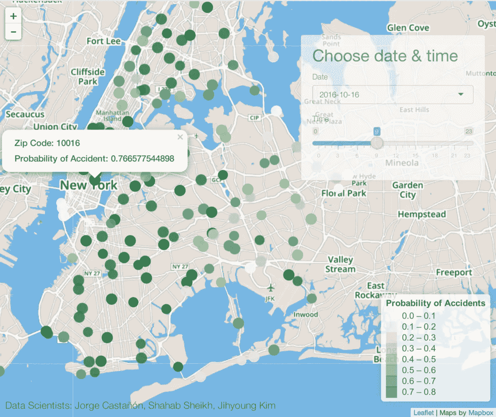
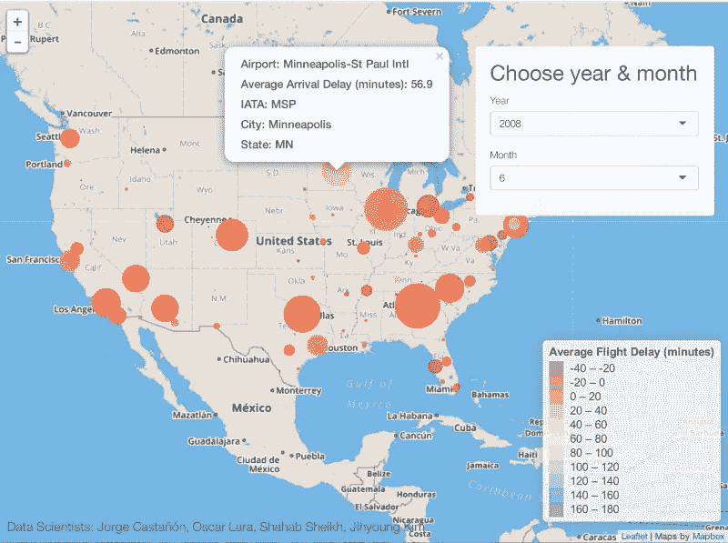

# 展示人工智能解决方案

> 原文：<https://towardsdatascience.com/shiny-a-data-scientists-best-friend-1db2e459710?source=collection_archive---------25----------------------->

## 以酷而直观的方式交付数据科学解决方案

Photo by [Filip Varga](https://unsplash.com/@vargafilip123?utm_source=medium&utm_medium=referral) on [Unsplash](https://unsplash.com?utm_source=medium&utm_medium=referral)

对于任何数据科学家来说，最重要的技能之一就是能够清晰地向普通受众传达和部署结果。这些人需要理解这些见解，以便采取进一步的行动。不幸的是，太多的数据科学项目陷入了普通读者难以理解的数学和计算中。这就是为什么像 [Shiny](http://shiny.rstudio.com/) 这样的工具正迅速成为每个数据科学家最好的朋友。

# 发光的

Shiny 是一个用于开发交互式 web 应用程序的 R 包。它的一些好处:

1.  **多样性**。您可以通过交互式图表、可视化、文本或表格来交流结果。
2.  **易用型**。如果你已经知道 R，你可以快速开发一个很酷的闪亮的应用程序。查看[这篇](http://shiny.rstudio.com/tutorial/)优秀教程，快速学习核心概念。
3.  **分享能力**。内置功能让您可以轻松地与同事和朋友分享您的工作。
4.  **设计**。甚至闪亮应用的默认显示也是优雅而直观的。

为了说服你，让我给你看两个例子。要自己运行这些示例，请查看[这些](https://github.com/IBMDataScience/dsx-shiny-apps)说明。

# 基于天气的车祸预测

为了预测纽约市的汽车事故，我和我的团队建立了一个模型，我们根据汽车事故的历史数据以及 IBM 的天气数据进行训练。我们使用每个邮政编码的天气条件作为特征来训练具有 Spark 的逻辑回归，输出特定区域、日期和时间的车祸概率。这是一个闪亮的应用程序的屏幕截图，它在一个交互式地图中显示结果:

Probability of Accident by Zip Code Given Date and Time

# 计划你的下一个假期

我决定继续用旅行数据做实验，但是从汽车跳到了飞机。具体来说，我决定开发一个闪亮的应用程序，让用户探索美国每个机场的平均航班到达延误时间(以分钟计)。互动功能让用户探索预测的月份和年份，并让用户查看额外的数据，如机场名称，代码，州，城市和平均延误。在下面的截图中，气泡的大小与每个机场的航班量相关。负的平均延迟表示航班通常会提前到达。

Flight Arrival Delays

## 你想建立自己的闪亮的应用程序吗？

这只是 Shiny 帮助我们实施的两个项目。我们还将推出更多产品，我将很快与大家分享。同时，我鼓励你加入进来。同样，按照[这些](https://github.com/IBMDataScience/watson-studio-shiny-apps)指令运行闪亮的例子。

***推特:***[@ castan](https://twitter.com/castanan) ***LinkedIn:***@[jorgecasta](https://www.linkedin.com/in/jorgecasta/)