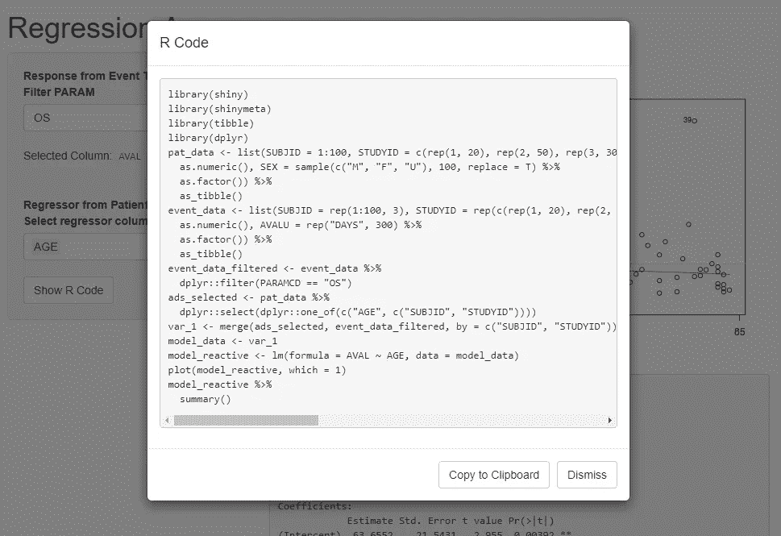
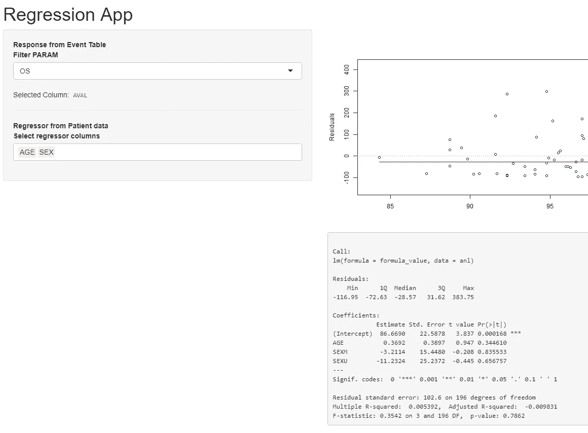
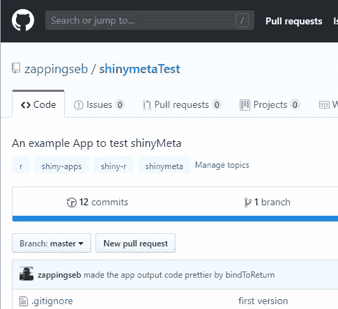
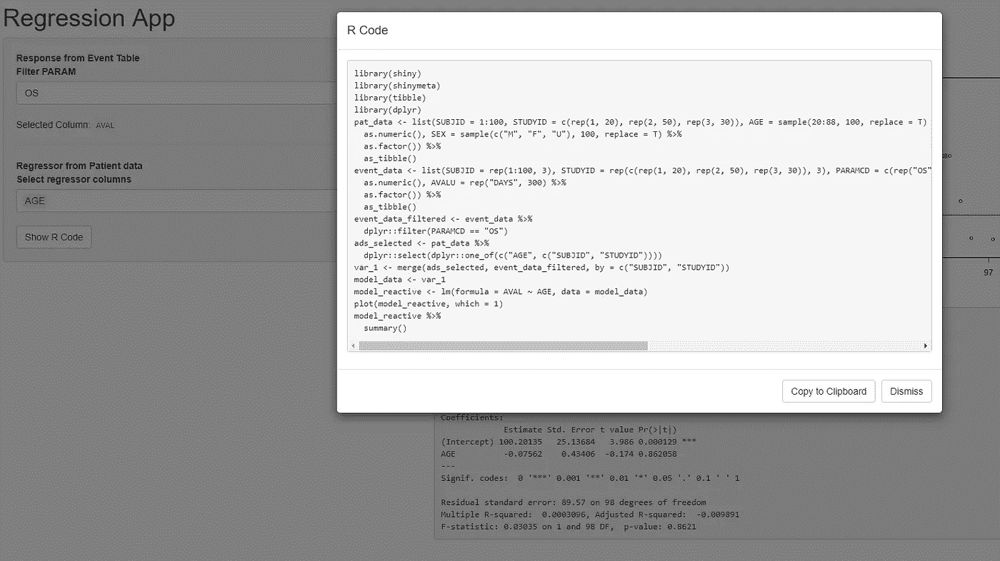

# shinymeta——再现性的革命

> 原文：<https://towardsdatascience.com/shinymeta-a-revolution-for-reproducibility-bfda6b329f68?source=collection_archive---------18----------------------->

## 郑中在 2019 年 7 月向用户展示了 shinymeta，实现了 shiny 的可再现性。这是一个使用 shinymeta 的简单应用程序。你会看到反应性和再现性是如何不互相排斥的。我真的很感谢郑中实现了木卫三项目。



Reproducible R Code created from reactive shiny outputs

# 介绍

在 2018 年的 [R/Pharma 大会](https://github.com/jcheng5/rpharma-demo)上，我第一次听说了使用报价的概念。引用让你闪亮的应用程序代码可复制。这意味着您可以在 shiny 中进行试验，然后获取代码，生成与 R 代码完全相同的输出。制药行业需要这一特性。为什么会这样呢？制药行业需要向监管机构报告数据和分析。我已经在[的几篇文章](https://medium.com/datadriveninvestor/why-do-we-need-human-readable-tests-for-a-programming-language-1786d552f450)中谈到了这一点。给监管部门提供一个闪亮的应用有多好？太好了。如果能提供一个闪亮的应用程序，让他们能够重现每一个图形或表格，那该有多好？甚至更好。

[阿德里安·沃德尔](https://github.com/waddella)和[道格·凯尔科夫](https://github.com/dgkf)是我的两个大学，他们为这项任务提出了解决方案。Doug 构建了 scriptgloss 包，它从闪亮的应用程序中重建静态代码。Adrian 在 R/Pharma 2018 上展示了一个模块化的基于 shiny 的探索性框架。该框架提供动态编码、基于变量的过滤和 R 代码生成。在这种背景下，我在当前的开发项目中开始构思一些概念。如何让闪亮 app 内部的代码具有可复制性？与此同时，道格、[郑中](https://github.com/jcheng5)和[卡森·西沃特](https://github.com/cpsievert)开发了一款名为 [shinymeta](https://github.com/rstudio/shinymeta) 的迷人工具，并于 7 月 11 日在 userR 大会上发布。

这个工具非常迷人，因为它为我谈到的任务创建了处理程序。它允许将一个简单的闪亮的应用程序变成一个可复制的闪亮的应用程序，只需要一些调整。由于制药行业的闪亮应用对这一功能有着强烈的需求，我是制药行业的闪亮开发者，我想知道:它是如何工作的？有多好？

# 让我们创建一个与制药相关的闪亮应用程序

作为制药行业中一个闪亮应用的简单例子，我将使用一个线性回归应用。该应用程序将检测有用的线性模型是否可以显示患者属性和存活率之间的相关性。患者的属性是年龄或性别。存活率包括患者将存活多长时间(OS =总生存期)、无进展生存期(PFS =无进展生存期)或无任何事件发生生存期(EFS)。每个病人都可能经历了全部三个生存阶段。让我们用随机数据为这个用例创建数据集:

```
library(tibble)
library(dplyr)# Patient listingpat_data <- list(
  SUBJID = 1:200,
  STUDYID = c(rep(1, 40), rep(2, 100), rep(3, 60)),
  AGE = sample(20:88, 200, replace = T) %>% as.numeric(),
  SEX = c(sample(c("M", "F"), 180, replace = T), rep("U", 20)) %>% as.factor()
) %>% as_tibble()# Days where Overall Survival (OS), Event free survival (EFS) and Progression Free Survival (PFS) happenedevent_data <- list(
  SUBJID = rep(1:200, 3),
  STUDYID = rep(c(rep(1, 40), rep(2, 100), rep(3, 60)), 3),
  PARAMCD = c(rep("OS", 200), rep("EFS", 200), rep("PFS", 200)),
  AVAL = c(rexp(200, 1 / 100), rexp(200, 1 / 80), rexp(200, 1 / 60)) %>% as.numeric(),
  AVALU = rep("DAYS", 600) %>% as.factor()
) %>% as_tibble()
```

可以看到患者年龄和性别(性别)是随机分布的。存活天数将呈指数下降。通过这些分布，我们不期望在数据中看到任何东西，但是对于这个例子来说这很好。



Simple app showing a linear regression of patient data

在截图中，您可以看到应用于这些数据的应用程序。该应用程序包含回归图和用`lm`创建的线性模型的摘要。它基本上有一个输入通过`PARAMCD.`过滤`event_data`，第二个输入从`pat_data`中选择列。这个应用程序有趣的部分是服务器功能。在服务器函数内部，只有两个输出和一个反应值。反应执行多个步骤。它生成线性模型的公式，过滤`event_data`，选择`pat_data`，合并数据集，并通过`lm`计算线性模型。这两个输出从线性模型生成一个图和一个摘要文本。

server function to create a plot and a summary output from a linear model

当然，你以为这个 app 可以被一个聪明的程序员轻松复制。现在想象你只看到用户界面和输出。少了什么？缺少两样东西:

1.  如何创建数据？
2.  用于创建线性模型的公式是什么？

# 让我们把 app 做的可复制！

通过 [shinymeta](https://github.com/rstudio/shinymeta) 和元编程的方法，我们将使整个应用程序可复制。即使 shinymeta 仍然是实验性的，你会看到，现在它工作得很好。

但是我们需要一步一步来。元编程背后最重要的想法来自艾德里安·沃德尔。你不用在你的应用程序中添加代码，而是用引号将代码括起来。(第一步，也是最重要的一步)。

**创建数据**

我们可以将此用于添加到应用程序的数据:

我们不运行代码，而是将它包装到`quote`中。这将返回一个`call`，我们可以通过`eval`对其进行评估。它实现了再现性。我们用来生成数据集的代码存储在`data_code`中。我们可以在以后重用这个变量。这个变量将允许我们显示数据集是如何构建的。

**过滤和选择数据**

为了实现可重复的过滤和选择，我们将使用 shinymeta 函数。因此，我们将创建一个返回合并数据集的`metaReactive`。metaReactive 的行为类似于`reactive`,不同之处在于，您可以在之后获取内部使用的代码。这类似于引用的原理。但是对于`metaReactive`你不需要使用`eval`函数，你基本上可以像以前一样坚持使用`()`评估。

`metaReactive`内部一个重要的新操作符是`!!` (bang，bang)操作符。它允许插入标准电抗值。它的行为有点像在`rlang`包中。您可以使用它来内联标准无功值的值。或者您可以使用它将`metaReactive`对象作为代码内联。总之，操作器`!!`有两个功能:

1.  取消对反应对象的引用—获取它们的值
2.  通过将对象作为代码内联到彼此来链接`metaReactive`对象

为了更好地了解`!!`操作者，请查看 shinymeta 简介:[https://github.com/rstudio/shinymeta/tree/master/vignettes](https://github.com/rstudio/shinymeta/tree/master/vignettes)

此代码将用于过滤、选择和合并数据:

在代码内部，您可以看到`!!`操作符与作为值的反应值`input$select_regressor`和`input$filter_param`进行交互。这意味着我们取消了对无功值的引用，用它的静态值替换它。这种反应的结果是合并的数据集。当然，这段代码不会运行，直到我们在服务器函数中的任何地方调用`data_set_reactive()`。

**创建模型公式**

线性模型的公式将像以前一样创建:

有必要检查选择回归变量值，因为没有选择就不能导出模型

**创建线性模型**

无需元编程即可生成线性模型的代码如下:

```
lm(formula = formula_value, data = anl)
```

我们需要替换`formula_value`和`anl`。另外用一个`metaReactive`代替无功。因此，我们使用函数`metaReactive2`，它允许在元编程代码之前运行标准的闪亮代码。在这个`metaReactive2`里面，有必要检查数据和公式:

```
validate(need(is.data.frame(data_set_reactive()), "Data Set could not be created"))validate(need(is.language(formula_reactive()), "Formula could not be created from column selections"))
```

`metaReactive` `data_set_reactive`可以像任何反应对象一样被调用。产生模型的代码应该是元编程的，因为用户想看到它。函数`metaExpr`允许这样做。为了获得良好的可复制代码，调用需要如下所示:

```
metaExpr(bindToReturn = TRUE, {
  model_data <- !!data_set_reactive()
  lm(formula = !!formula_reactive(), data = model_data)
})
```

如果你不想在`lm`调用中看到整个数据集，我们需要将它存储在一个变量中。

为了使代码可跟踪，您需要将`!!`放在被动调用的前面。在`data_set_reactive`之前，这允许回溯`data_set_reactive`的代码，而不仅仅是输出值。

其次，我们可以通过`!!`操作符取消对`formula_reactive`的引用。这将直接将创建的公式插入到`lm`调用中。

第三，`bindToReturn`会强迫 shinymeta 写:

```
var1 <- merge(...)
model_data <- var_1
model_reactive <- lm(formula = AVAL ~ AGE, data = model_data)
```

代替

```
data_set_reactive <- merge(...)
{
  model_data <- data_set_reactive
  lm(AVAL ~ AGE, data = model_data
}
```

如果你想了解更多关于`bindToReturn`特性的信息，github 上有一个关于 `[bindToReturn](https://github.com/rstudio/shinymeta/issues/53)` [参数](https://github.com/rstudio/shinymeta/issues/53)的[问题。最终的`model_reactive`是这样的:](https://github.com/rstudio/shinymeta/issues/53)

**渲染输出**

最后但同样重要的是，我们需要以可复制的方式输出图形和文本。代替标准的`renderPlot`和`renderPrint`函数，有必要将它们包装在`metaRender`中。`metaRender`支持输出元编程反应对象，代码可重复。为了获得模型的值和代码，再次使用了`!!`操作符。

使用`metaRender`也将使输出成为元编程对象。这允许以后检索代码，并使其可重复。

**检索用户界面内的代码**

> 重要！
> 
> 很抱歉在这里使用大写字母，但这部分是真正的部分，这使得应用程序可复制。通过插入一个“ *Show R Code* ”按钮，该应用程序的每个用户都可以看到产生输出的代码。因此 shinymeta 提供了函数`expandChain`。下一节将展示如何使用它。

如果用户点击一个按钮，就像这个例子中的`input$show_r_code`代码的模态应该弹出。在这个模态中，`expandChain`函数可以处理(1)引用代码和(2) `metaRender`对象。这种类型的每个对象都可以用在`expandChain`的`…`参数中。它将返回一个元表达式。从这个元表达式中，可以提取出 app 中使用的 R 代码。简单地使用`formatCode()`和`paste()`会让漂亮的代码出现在模态中。

请不要忘记`metaRender`对象后的`()`。

**最终服务器功能和 app**



All code can be found at [https://github.com/zappingseb/shinymetaTest](https://github.com/zappingseb/shinymetaTest)

在完成所有步骤后，您可以看到使用 shinymeta 的代码与标准的 shiny 代码没有太大的不同。主要是`metaReactive`、`metaReactive2`、`metaExpr`、`metaRender`、`!!`、`expandChain`是新学的函数。即使这个包仍然是实验性的，它在使一些反应性的东西也是可复制的方面做得非常好。我最喜欢的功能是混合使用`reactive`和`metaReactive`。通过在元代码中使用反应对象，开发人员可以决定哪些代码进入“ *Show R Code* ”窗口，哪些代码在幕后运行。您可以通过查看本教程的代码来检查自己。当然，这个特性是危险的，因为您可能会忘记将代码放在“显示 R 代码”窗口中，并且不是所有的代码都可以重新运行，或者您的可复制代码变得难看。

教程的全部代码发布在 *github* 上:[https://github.com/zappingseb/shinymetaTest](https://github.com/zappingseb/shinymetaTest)。

该应用程序在[https://sebastianwolf.shinyapps.io/shinymetaTest](https://sebastianwolf.shinyapps.io/shinymetaTest/)运行。



App running at: [https://sebastianwolf.shinyapps.io/shinymetaTest/](https://sebastianwolf.shinyapps.io/shinymetaTest/)

## 结束语

这是我第一次尝试将自己的作品打包成一个全新的包。这个例子中创建的应用程序是在我以前的日常工作中创建的。新的实验包 shinymeta 允许在大约 1 小时内从我的代码切换到元编程。我不仅切换了我的实现，而且由于这个包，我的实现也变得更好了。

Shinymeta 将在制药发光应用中发挥巨大作用。在郑中演讲一周后，我仍然对元编程的概念印象深刻。以及元编程是如何变得闪亮的。包装使闪亮真正可复制。它将为如何在监管领域使用 shiny 提供指导。此外，它将允许更多的用户用 R 编写代码，因为他们可以看到特定输出所需的代码。点击会让他们学习。

## 相关文章:

*   为什么我们需要对编程语言进行人类可读的测试？
*   [让自定义输入变得简单的 7 个步骤](https://medium.com/.../7-steps-that-make-custom-inputs-in-shiny-easy-504b303a2973)
*   [教程:R shiny 可视化活检数据的应用程序——在一家制药公司](https://medium.com/datadriveninvestor/tutorial-an-app-in-r-shiny-visualizing-biopsy-data-in-a-pharmaceutical-company-f15f06395f3e?source=your_stories_page---------------------------)