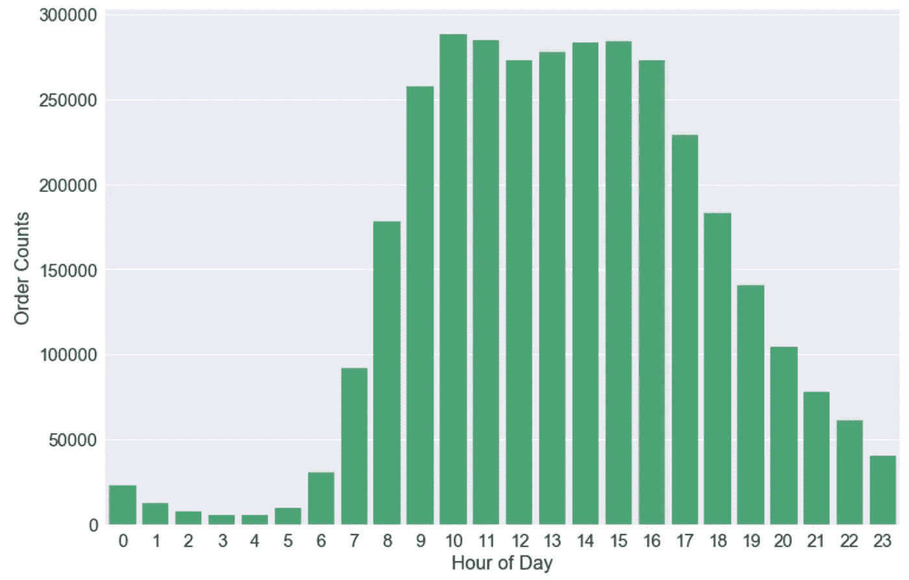
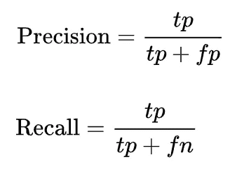

# 购物者行为与购物车推荐系统探究

> 原文：<https://towardsdatascience.com/shopper-behavior-analysis-de3ff6b696b8?source=collection_archive---------11----------------------->


Photo by [NeONBRAND](https://unsplash.com/@neonbrand?utm_source=medium&utm_medium=referral) on [Unsplash](https://unsplash.com?utm_source=medium&utm_medium=referral)

到更好地了解顾客并创造独特的购物体验是每一个商家为了给顾客创造价值而必须做的事情。我认为你可以通过使用机器学习分析你的客户购物体验/习惯来实现这一点。在这个项目中，我想通过分析客户以前的购买来探索他们的购物行为，并建立一个购物车推荐器，为他们提供量身定制的购物体验，以提高参与度。

我认为这对于企业来说是有价值的，原因有很多，例如:

1.  有针对性的营销:分析你的客户在你的网站/应用程序上的虚拟足迹可以将你的有针对性的营销带到另一个层次！例如，您可以根据他们的购买历史，在个人层面推出他们最喜欢的商品的特价。
2.  在一天中的特定时间，有策略地向每位客户推送不同的营销材料，因为这段时间是您的客户最喜欢购物或最喜欢登录您的应用程序的时间。
3.  计算何时重新进货，提高库存周期的效率。
4.  推荐他们可能想要添加到购物车中的商品，并通过个性化建议吸引您的客户。

以上只是你可以从顾客的购买历史中获得定量洞察的几件事。

## **我想解决的问题**

对于这个项目，我想探讨以下几个问题:

1.  通过分析购物者的购买历史，执行[购物者行为分析](https://en.wikipedia.org/wiki/Consumer_behaviour)，看看我是否能找到一些模式，比如顾客在一天/一周的不同时间喜欢购买什么样的商品，人们多长时间再订购一次他们以前购买过的相同产品等等。
2.  [购物车推荐器](https://en.wikipedia.org/wiki/Recommender_system):利用顾客重新订购的商品和[余弦相似度](https://en.wikipedia.org/wiki/Cosine_similarity)建立一个推荐系统。

**项目设计**

1.  执行数据清理，将不同的表合并在一起，并进行探索性数据分析(EDA)。
2.  分析客户行为，产生见解，并为讲述故事构建数据可视化。
3.  定义模型评估的指标。
4.  最后，创建一个购物车推荐系统，根据顾客的购买历史向他们推荐商品。

## **我使用的数据和技术**

出于这个项目的目的，我能够在 [Instacart](https://www.instacart.com/) 上找到一个[客户购买历史数据集](https://www.instacart.com/datasets/grocery-shopping-2017)，这是 Instacart 在 2017 年发布的一个 [Kaggle 挑战赛](https://www.kaggle.com/c/instacart-market-basket-analysis)。


数据集有六种不同的。csv 文件，您需要使用主键和外键来连接它们，以获得完整的图片并执行分析。数据字典可以在[这里](https://gist.github.com/jeremystan/c3b39d947d9b88b3ccff3147dbcf6c6b)找到。

我在这个项目中使用的工具是 numpy，pandas，matplotlib，seaborn，以及 sklearn 的 StandardScaler，OneHotEncoder 和 cosine_similarity。

## **清理&探索性数据分析(EDA)**


该数据集拥有 20 多万客户的 300 多万份订单。它具有诸如星期几购买，一天中的时间购买，之前或之前重新排序等功能。

总共有 6 个不同的表:通道、部门、订单 _ 产品 _ 先验、订单 _ 产品 _ 系列、产品和订单。

经过一些检查，我发现数据集非常干净，只需要一些小的清理和争论，因为我在进一步分析之前将表合并在一起。

# **购物者行为分析**

当我们分析数据集时，有些问题需要您回答。例如:

1.  数据集有多少个订单？
2.  我们有多少独特客户？
3.  顾客多久购买一次？
4.  他们喜欢什么时候购买？
5.  他们每份订单购买多少件商品？
6.  还有更多问题。

在本节中，我将探索数据集，以提取见解来回答不同的问题。

## 数据集有多少个订单？

在浏览 orders 表时，您可以使用下面的代码来找出数据集中有多少订单以及每个标签的订单数。


snapshot of orders table

```
print(orders.shape)
print('there are', len(orders[orders.eval_set == 'prior']), 'entries for prior')
print('there are', len(orders[orders.eval_set == 'train']), 'entries for train')
print('there are', len(orders[orders.eval_set == 'test']), 'entries for test')
```

*   一共 3421083 单。
*   有 3214874 个订单是优先订单。
*   训练集中有 131209 个订单。
*   测试集中有 75000 个订单。

## 数据集有多少不同的用户？

您可以使用下面的代码来找出有多少不同的用户。

```
print('there are', len(orders[orders.eval_set == 'prior'].user_id.unique()), 'unique customers in total')
print('there are', len(orders[orders.eval_set == 'train'].user_id.unique()), 'unique customers in train set')
print('there are', len(orders[orders.eval_set == 'test'].user_id.unique()), 'unique customers in test set')
```

*   共有 206209 个独立客户。
*   列车组中有 131209 个客户。
*   测试集中有 75000 个客户。

## 订单量如何分配？

你可以使用下面的代码来生成一个订单量分布图。

```
orders_amount_for_customer = orders.groupby('user_id')['order_number'].count().value_counts()

plt.figure(figsize=(20,8))
sns.barplot(x=orders_amount_for_customer.index, y=orders_amount_for_customer.values, color='mediumseagreen')
plt.title('Amount of Orders Distribution', fontsize=16)
plt.ylabel('Number of Customers', fontsize=16)
plt.xlabel('Amount of Orders', fontsize=16)
plt.xticks(rotation='vertical');
```


amount of orders distribution

*   每个客户的订单数量在 4 到 100 之间。大多数人购买了 4 到 10 次。

## 他们最喜欢在一周的哪一天购物？

您可以使用下面的代码将订单按一周中的不同日期分组。

```
plt.figure(figsize=(12,8))
sns.countplot(x=orders.order_dow, color='mediumseagreen')

*#plt.title("Order Amounts by Days", fontsize=16)*
plt.xlabel('', fontsize=16)
plt.xticks(fontsize=15)
plt.ylabel('Order Counts', fontsize=16)
plt.yticks(fontsize=15)
;
```


order amounts by day

*   0(周日)和 1(周一)一周订单最多，4(周四)订单最少。

## 人们在一天中的什么时候购物？

您可以使用下面的代码按一天中的小时将订单分组。

```
plt.figure(figsize=(12,8))
sns.countplot(x=orders.order_hour_of_day, color='mediumseagreen')

*#plt.title("Order Amounts by Hours", fontsize=16)*
plt.xlabel('Hour of Day', fontsize=16)
plt.xticks(fontsize=15)
plt.ylabel('Order Counts', fontsize=16)
plt.yticks(fontsize=15)
;
```



order amounts by hour

*   看起来人们喜欢在早上 8 点到下午 6 点之间点菜。

## 人们多久购买一次？

您可以使用下面的代码将订单按照最后一次购买的日期进行分组。

```
plt.figure(figsize=(12,8))
sns.countplot(x=orders.days_since_prior_order, color= 'mediumseagreen')

*#plt.title("Number of Orders per Days Since Last Purchase", fontsize=16)*
plt.xlabel('Days Since Last Purchase', fontsize=16)
plt.xticks(np.arange(31), [0, 1, 2, 3, 4, 5, 6, 7, 8, 9, 10, 11, 12, 13, 14, 15, 16, 17, 18, 19, 20, 21, 22, 23,
                          24, 25, 26, 27, 28, 29, 30],  fontsize=15)
plt.xticks(rotation='vertical')
plt.ylabel('Order Counts', fontsize=16)
plt.yticks(fontsize=15)
;
```


days since last purchase

*   看起来大多数人一周点一次，在 0 点到 7 点之间。
*   而且还有 30 多天订一次的。

## 人们在一份订单中会购买多少件商品？

为了回答这个问题，我们将镜头转向另一组表:order_product_prior 和 order_product_train。


snapshot of order_product_prior and order_product_train

为了这个项目的目的，它不是为了 Kaggle 挑战提交，所以我把两个表连接在一起，以获得更好的图片。

```
# Concatenation of both tables.
order_products_total = pd.concat([order_products_prior, order_products_train]) # Create amounts of item per order.
frequency_per_number_of_order = order_products_total.groupby('order_id')['product_id'].count().value_counts()

plt.figure(figsize=(20,8))
sns.barplot(x=frequency_per_number_of_order.index, y=frequency_per_number_of_order.values, color='mediumseagreen')
plt.title('Amount of Items Per Order', fontsize=16)
plt.ylabel('Order Counts', fontsize=16)
plt.xlabel('Number of Items', fontsize=16)
plt.xticks(rotation='vertical');
```


amount of items per order

*   人们通常每份订单购买 4 件商品。
*   大多数人喜欢每份订单购买 3 到 8 件商品。

## 这个数据集中有多少交易和独特的产品？

我们可以用下面的代码来回答这个问题。

```
print('there are', order_products_total.shape[0], 'grocery products ordered')
print('there are', len(order_products_total.order_id.unique()), 'order transactions')
print('there are', len(order_products_total.product_id.unique()), 'unique products')
```

*   订购了 33819106 种杂货产品。
*   订单交易有 3346083 笔。
*   有 49685 个独特的产品。

## 在所有订单中，有多少是之前重新订购的，有多少是没有重新订购的？比例是多少？

下面的代码将回答这个问题。

```
# Find out how many products have been reordered before.
print(len(order_products_total[order_products_total.reordered == 1]), 'products have reordered before')
print(len(order_products_total[order_products_total.reordered == 0]), 'products haven**\'**t reordered before')# Find out the ratio.
print(len(order_products_total[order_products_total.reordered == 1])/order_products_total.shape[0], 'have reordered before')
print(len(order_products_total[order_products_total.reordered == 0])/order_products_total.shape[0], 'haven**\'**t reordered before')
```

*   19955360 产品之前有过再订购。
*   13863746 产品之前没有再订购过。
*   0.59 之前有重新排序。
*   0.41 之前没有重新排序。

## 每个产品类别中有多少个产品，拥有最多产品的前十个产品类别是什么？

为了回答这个问题，我们将研究过道、部门和产品表。


snapshot of aisle, department and products tables

```
# Merging tables together.
products_departments = products.merge(departments, left_on='department_id', right_on='department_id', how='left')
products_departments_aisles = products_departments.merge(aisles, left_on='aisle_id', right_on='aisle_id', how='left')
products_departments_aisles.head()# Counting how many items is in each product category. 
products_departments_aisles.groupby('department')['product_id'].count().reset_index().sort_values(by='product_id', ascending=**False**).head(10)
```


top 10 product categories that have most items.

## 人们购买最多的物品是什么？

为了探究这个问题，我们需要将 products_departments_aisles 和 order_products_total 表合并在一起。

```
# Merging products_departments_aisles and order_products_total.
df = order_products_total.merge(products_departments_aisles, left_on='product_id', right_on='product_id', how='left')
df.head()# Find out the top 15 items people purchased the most.
top_15_products = df.product_name.value_counts(ascending=**False**).reset_index().head(15)
top_15_products.columns = ['product_name', 'count']
top_15_products
```


top 15 items people purchased the most.

*   人们购买最多的前 15 种商品在上面。
*   其中大部分是有机水果/蔬菜。所有的都是水果/蔬菜。

使用相同的逻辑，我们可以找出人们购买最多的前 15 个通道和前 15 个部门。

```
# Finding top 15 aisles. 
top_15_aisles = df.aisle.value_counts(ascending=**False**).reset_index().head(15)
top_15_aisles.columns = ['aisle_name', 'count']
top_15_aisles# Finding top 15 departments.
top_15_department = df.department.value_counts(ascending=**False**).reset_index().head(15)
top_15_department.columns = ['department_name', 'count']
top_15_department
```


top 15 aisles and top 15 departments that has the most purchases in.

## 每个部门和通道的再订购率是多少？

```
# Find out reorder ratio per department.
reorder_ratio_per_dep = df.groupby('department')['reordered'].mean().reset_index()
reorder_ratio_per_dep.columns = ['department', 'reorder_ratio']
reorder_ratio_per_dep.sort_values(by='reorder_ratio', ascending=**False**)# Find out reorder ration per aisle.
reorder_ratio_per_aisle = df.groupby('aisle')['reordered'].mean().reset_index()
reorder_ratio_per_aisle.columns = ['aisle', 'reorder_ratio']
reorder_ratio_per_aisle.sort_values(by='reorder_ratio', ascending=**False**)
```

*   每个部门的乳制品鸡蛋的再订购率最高。
*   个人护理部门的再订购率最低。
*   牛奶通道的再订购率最高。
*   香料调味料的每条通道的再订购率最低。

## 定义指标

我想为我的购物车推荐者定义一个指标。人们喜欢使用不同的通用指标进行评估。例如:

*   [精度](https://en.wikipedia.org/wiki/Precision_and_recall)
*   [回忆](https://en.wikipedia.org/wiki/Precision_and_recall)



precision vs. recall

对于我的项目，我决定使用回忆作为我的评估标准。也就是说，顾客购买的商品中有多少是来自推荐者的？

例如，如果我向顾客推荐 5 件商品，他/她买了 4 件，这意味着召回率= 0.80。换句话说，我推荐的商品有 80%在顾客的购物车里，20%是我推荐给顾客的新商品。

## 购物车推荐器

构建推荐系统有不同的方式，例如，[基于内容的过滤](https://en.wikipedia.org/wiki/Recommender_system#Content-based_filtering)，[协同(基于项目或基于用户)过滤](https://en.wikipedia.org/wiki/Recommender_system#Collaborative_filtering)，以及两者的混合。在这个项目中，我将探索如何使用[余弦相似度](https://en.wikipedia.org/wiki/Cosine_similarity)构建购物车推荐器，这是协同过滤下的一种方法。


推荐器的设计是先找出之前重新订购过的客户，以及之前重新订购过的商品。然后计算所有这些用户和产品之间的余弦相似度。然后生成一个包含 5 条建议的列表。

下面是如何找到以前重新排序的客户并计算余弦相似度的代码。

```
*# get the list of orders that have been reordered before*
reorders = order_products_total[order_products_total['reordered'] == 1]orders2 = orders[['order_id', 'user_id']]*# merge to get user_id and product_id*
user_orders = reorders.merge(orders2, on='order_id')*# filtering out the high volumn products that user reordered more than once*
user_orders['high_volume'] = (user_orders['product_id'].value_counts().sort_values(ascending=**False**)>1)
high_volume = user_orders[user_orders['high_volume'] == **True**]*# get a matrix of different high volume items that particular user purchased*
high_volume_users = high_volume.groupby(['user_id', 'product_name']).size().sort_values(ascending=**False**).unstack().fillna(0)*# calculate similarity between each user*
cosine_dists = pd.DataFrame(cosine_similarity(high_volume_users),index=high_volume_users.index, columns=high_volume_users.index)cosine_dists.head()
```


snapshot of how the matrix looks like.

这是为推荐系统定义一个功能。并尝试根据与我们的目标客户有相似购买历史的相似资料推荐 5 件商品。

```
**def** Recommender_System(user_id):

    *'''*
 *enter user_id and return a list of 5 recommendations.*
 *'''*

    u = high_volume.groupby(['user_id','product_name']).size().sort_values(ascending=**False**).unstack().fillna(0)
    u_sim = pd.DataFrame(cosine_similarity(u), index=u.index, columns=u.index)

    p = high_volume.groupby(['product_name','user_id']).size().sort_values(ascending=**False**).unstack().fillna(0)

    recommendations = pd.Series(np.dot(p.values,cosine_dists[user_id]), index=p.index)
    **return** recommendations.sort_values(ascending=**False**).head()# recommendation for customer id 175965.
Recommender_System(175965)
```


5 recommendations generated for customer id 175965

## 估价

为了更好地说明，我以自己为例:


purchase history and recommendation for user Ka.

在左边，是用户 Ka 之前购买的前 20 个项目的列表。右边是我的推荐者生成的 5 个推荐列表。如你所见，我推荐的 5 件商品中有 4 件与 Ka 的前 20 件购买记录相符。这意味着我推荐的商品有 80%的机会出现在用户的前 20 个商品列表中。

使用与评估标准相同的逻辑。为了计算推荐器的召回分数，我定义了一个函数来完成这项工作，下面是代码。数据帧太大，无法处理，所以我将数据帧分成 7 份进行度量计算。

```
# filter 1000 users for calculation
#  because the dataframe is too large 
users = high_volume.user_id.unique().tolist()# calculate recall for the :1000 users
**def** how_match():
    res = []
    **for** user **in** sorted(users)[:1000]:
        recommendations = Recommender_System(user)
        top_20_itmes = _[_.user_id == user].product_name.value_counts().head(20)

        recommendations_list = recommendations.index.tolist()
        top_20_items_list = top_20_itmes.index.tolist()

        res.append((len(set(recommendations_list) & set(top_20_items_list)))/5)
    **return** np.mean(res)*# get metric for the :1000 users*
how_match()*# calculate the mean of all the metric from all the Recommender notebooks.*
print('The Final Score for Metric is', (0.531 + 0.522 + 0.519 + 0.530 + 0.523 + 0.519 + 0.526)/7)
```

最终的召回分数是 0.524，这意味着我推荐的商品有大约 52%的机会出现在用户的前 20 个商品列表中，这比仅仅从 50k 多个产品中随机猜测要好得多。大约一半的商品是我向顾客推荐的新产品。

为了更好地了解我的推荐器有多有效/强大，我认为最好的方法是运行 [A/B 测试实验](https://en.wikipedia.org/wiki/A/B_testing)。

## 经验教训

*   关于如何建立一个推荐器，有许多研究、类型和不同的方法。你真的需要花很多时间去做你的调查研究。没有捷径可走，你需要尝试不同的方法，使用你的数据来建立比较推荐。
*   预计你的数据框架将是巨大的后，你为每个客户和项目创建虚拟。所以需要探索方法，例如:矩阵，使你的输入更可读或更省时，让你的机器来做计算。

## 在将来

*   创建一个 Flask 应用程序，并将其部署到网上，让人们体验推荐者。
*   使用这个推荐者做一个可以练习/探索 A/B 测试的项目。
*   尝试使用数据集来构建不同类型的推荐器。
*   探索 [Turi Create](https://github.com/apple/turicreate) ，苹果现在拥有的开源 ML 工具，用于构建推荐器并与不同类型的推荐器进行比较。

非常感谢您的阅读，如果您有兴趣探索我使用的代码和资源，这个项目在我的 [github repo](https://github.com/khsio/project_kojak) 上。