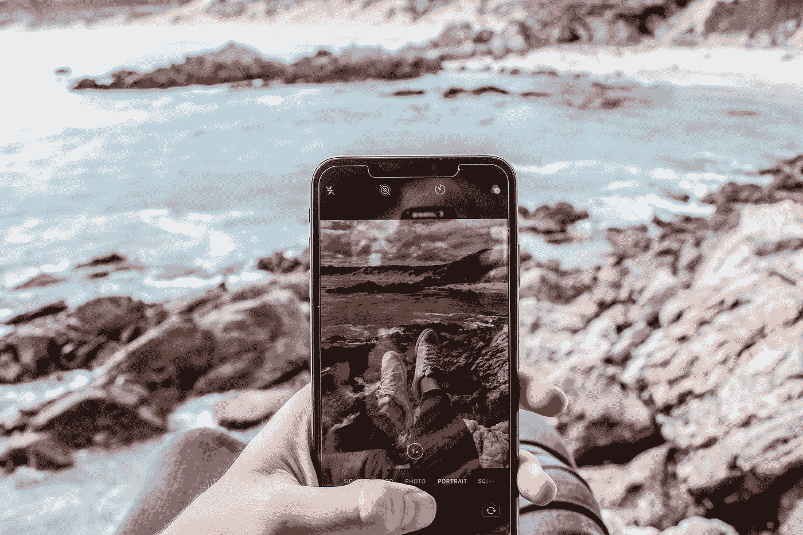

# 用你的相机购物:视觉搜索如何改变电子商务

> 原文：<https://towardsdatascience.com/shopping-with-your-camera-how-visual-search-is-transforming-ecommerce-1bee5877994e?source=collection_archive---------13----------------------->

[Source](https://unsplash.com/photos/_3Q3tsJ01nc)

视觉搜索正在席卷零售业。

当客户进行视觉搜索时，他们使用图像而不是关键字来寻找产品。购物者可以给他们想买的东西拍照(比如路人穿的一双运动鞋)，然后上传到他们选择的视觉搜索引擎——比如谷歌图片或 Pinterest Lens。视觉搜索引擎将有助于在网上找到它，并建议接近的匹配。

在数字时代注意力持续时间迅速缩短的情况下，视觉搜索能力在抓住顾客想象力方面发挥着不可或缺的作用。现在，顾客比以往任何时候都更容易在网上找到他们想要购买的商品或发现他们想要购买的商品。

Pinterest 首席执行官[本·希伯尔曼](https://finance.yahoo.com/news/future-search-pictures-not-keywords-203934442.html)说:“搜索的未来很大程度上将取决于图片，而不是关键词。

到 2021 年，重新设计网站以支持视觉和语音搜索的早期采用者品牌将使数字商务收入增加 [30%](https://www.gartner.com/smarterwithgartner/gartner-top-strategic-predictions-for-2018-and-beyond/) 。

# **交付真正无缝的客户体验**

[Source](https://unsplash.com/photos/ZErZT7hJ9dA)

人们每月在 Pinterest 上进行超过 6 亿次视觉搜索，而且这个数字还在增长。62%的千禧一代渴望视觉搜索超过任何其他新的数字购物技术。

有了视觉搜索工具，人们可以拍一张照片来发现多个网站和零售商的类似产品。例如，Google Lens 从 Google Shopping 中提取类似的产品示例。

其他零售商在他们自己的品牌中使用视觉搜索来缩小看到和购买之间的差距。例如，ASOS 的移动应用程序有一个名为 Style Match 的搜索工具，让购物者拍摄或上传照片，然后从他们的目录中发现与之匹配的产品。通过提供可以匹配 850 多个品牌和 85，000 多种产品的工具，ASOS 鼓励用户向他们购买。他们通过向用户展示他们不会像去其他地方那样花费太多来吸引用户。用户可以上传一张设计师产品的图片，找到更实惠的款式与之搭配。

> 在提供真正无缝的体验方面，人工智能支持的视觉搜索消除了观看和购买之间的摩擦。

当用户返回网站时，无摩擦的体验继续。下一次访问提供了更个性化、更强大的目标搜索，用户可以从上次离开的地方重新开始，更快地找到相关产品。

# **把“缺货”变成机会**

一个访问者访问一个网站，想要购买一件特定的衣服。一旦她进入产品页面，她会看到一个模特穿着那条裙子，戴着项链、手表、帽子和一双高跟鞋——所有这些都可以在网站上找到。

视觉搜索人工智能将让游客知道他们可以轻松地购买整个外观，而不是一个项目，并将向他们展示类似的选项。这增加了顾客在完成购买前将额外物品放入购物车的可能性。

> 各大品牌也在利用视觉搜索，在顾客被诱惑离开电子商务网站时，给他们一个温和的提示，让他们继续购物。

当客户访问网站并发现他们想要购买的产品缺货时，他们会感到失望。通常，他们会关闭标签页，或者转到另一个有类似功能的网站。

视觉搜索技术有助于让购物者留在网站上，即使他们最初想要的商品已经售完，也可以通过向他们展示库存中的类似产品来实现。

领先的在线零售商 Boohoo 的电子商务网站在实施视觉搜索后出现了巨大的增长。在最近的一项案例研究中，Boohoo [报告称](https://www.syte.ai/blog/case-study/boohoo/)当访问者在产品展示页面上使用“查看相似”时，转化率会高出 100%以上。每个会话的页面增加了 135%以上。

# **模糊线下和线上的界限**

[Source](https://unsplash.com/photos/Vbt1zTCsSNA)

Lonely Planet 最近收购了 TRILL Travel，这是一个人工智能驱动的视觉搜索平台，可以将社交媒体图像转化为即时可预订的体验。TRILL 利用人工智能技术分析图片，并自动创建预订网站的链接。

> 通过强大的视觉搜索机制简化预订流程有助于缩小旅游癖和现实之间的差距。

用户可以很容易地从浏览 Instagram 上的旅行照片到获得参观这些确切目的地的门票。只需触摸图片，他们就可以预订酒店、体验或在餐厅用餐。

线上和线下世界前所未有地融合在一起。有了视觉搜索，公司可以更接近许多消费者渴望的即时满足感。

视觉搜索的美妙之处在于，它可以点燃想象力，然后激发并捕捉由此产生的购买意图。视觉搜索将不可避免地在未来几年严重扰乱电子商务行业。