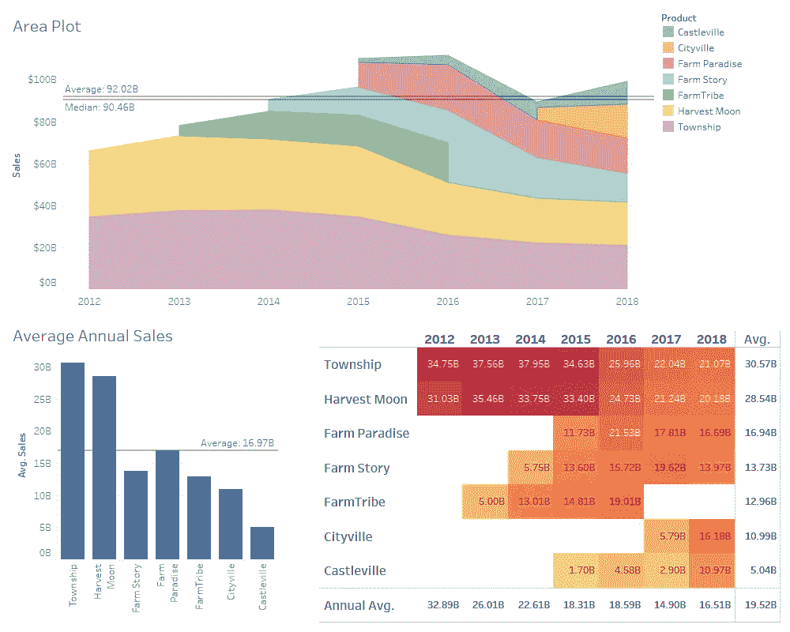
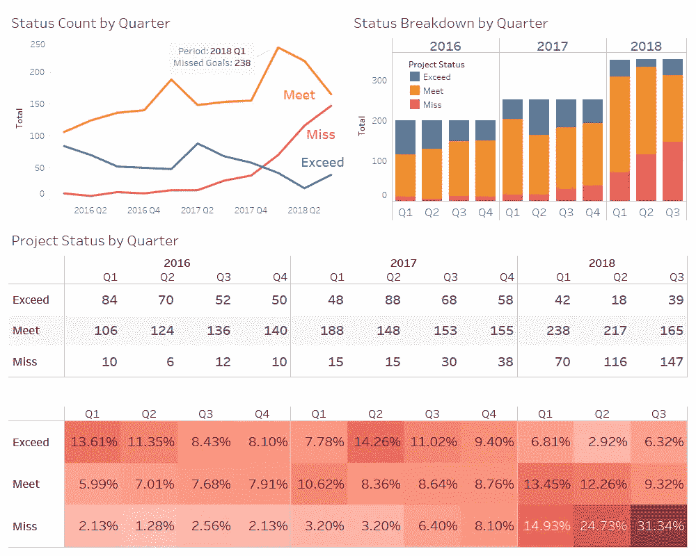
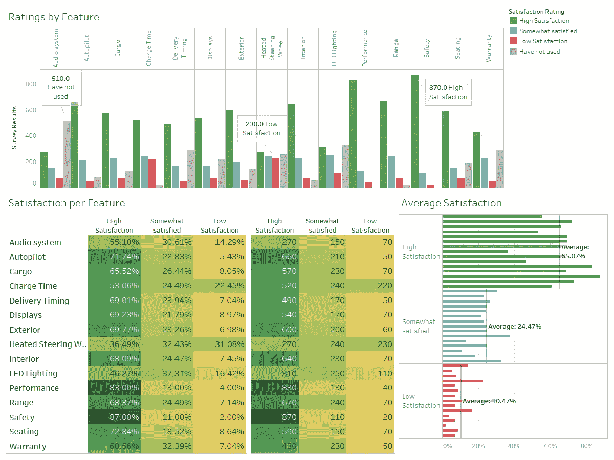
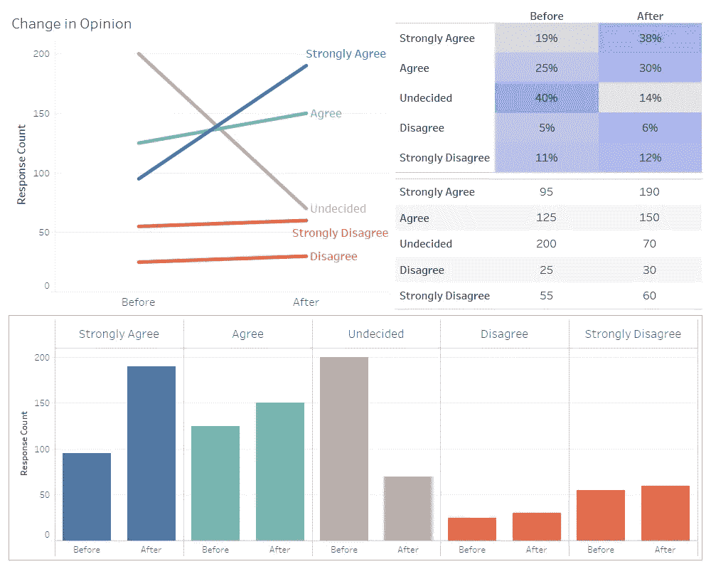
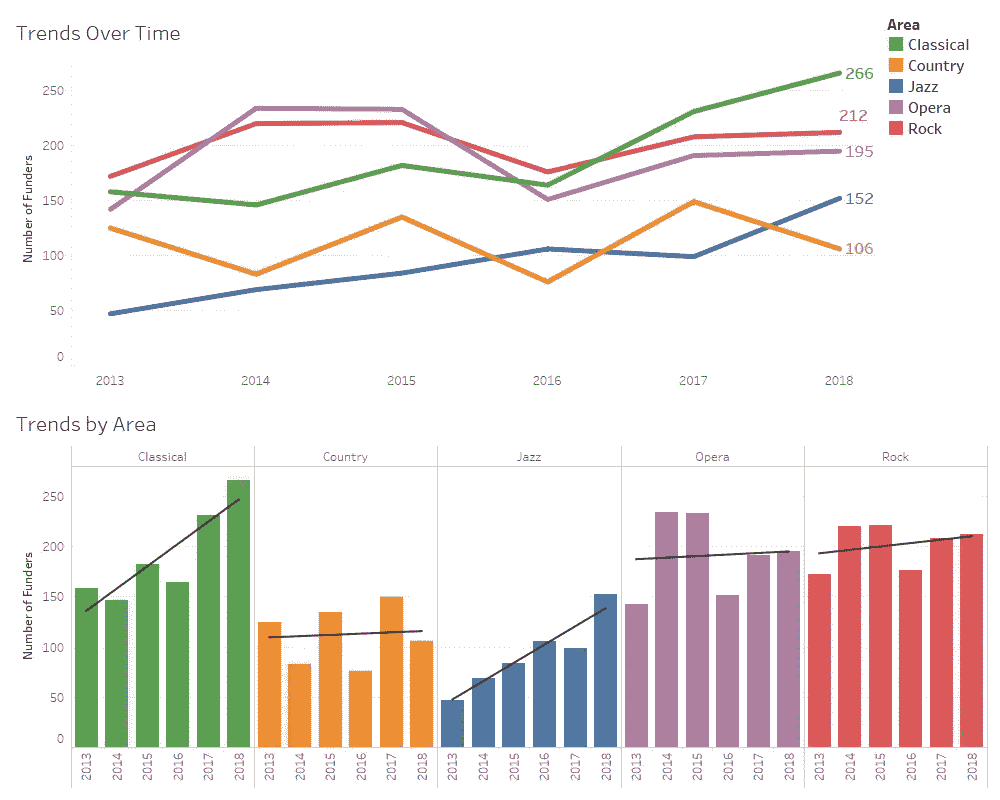

# 短篇小说:快速分析集

> 原文：<https://towardsdatascience.com/short-stories-a-collection-of-quick-analytics-7c5386918013?source=collection_archive---------30----------------------->

以下六个场景涉及到各种需要回答问题的情况。每个数据集只涉及几个变量，以帮助缩小分析的重点。当我们在每个小故事中寻找答案时，请跟着读。

下面介绍的练习册都可以在我的 [Tableau 公共档案](https://public.tableau.com/profile/damon.roberts3151#!/)和 [GitHub](https://public.tableau.com/profile/damon.roberts3151#!/) 上找到。

# 客户满意度

场景:一家公司收集一段时间内的客户满意度，记录有多少客户得到了服务，以及客户是否满意。2018 年 3 月，该公司失去了三名员工，然后在 2018 年 11 月，他们增加了两名新员工。**客户满意度是如何受到影响的？**

Customer satisfaction over time

在第一张图表中，我们可以看到客户满意度是如何随时间变化的。该公司平均每月约 90%，直到 2018 年 6 月，届时该百分比将下降。这可能是因为 3 月份损失了 3 名员工；该公司股价立即下跌，随后在 5 月份小幅回升，随后大幅下跌。满意度连续几个月保持低位，8 月份低至 68.4%。2018 年 11 月，该公司雇用了 2 名新员工，以帮助取代 3 月份失去的 3 名员工。这似乎对客户满意度有很大的影响，因为百分比立即增加到几乎 95%。

我们还可以研究客户满意度的变化是否与接受服务的客户数量有任何关系。在本研究的时间段内，总访问量从 2018 年 5 月的 13，000 次到 2018 年 1 月的 24，000 次不等。2018 年 3 月 3 名员工离职后，客户量似乎确实有所下降。虽然没有同期客户满意度下降那么显著，但似乎有更持久的影响。虽然在 11 月雇佣 2 名员工后客户满意度有所恢复，但随着时间的推移，客户数量似乎稳定在较低的水平。我们可以在客户数量的负斜率趋势线中看到这一点。

# 进入市场

场景:一家公司有兴趣进入城市市场。他们已经对市场进行了一段时间的监测，并试图预测他们自己的潜在销售额。数据库中的所有产品都是竞争对手(都是‘ville’产品)。他们相信他们能够在市场上实现中等或平均的销售额。他们实现目标的可能性有多大？

Market analysis for the ‘ville genre

这家公司有一个雄心勃勃的目标，即在“城市游戏”市场上达到平均或中等销售额。正如我们在面积图上看到的，市场平均每年的销售额约为 920 亿美元，而中位数略低，为 905 亿美元。将这些价值与每家公司的平均年销售额相比，前景并不乐观。最畅销的产品 Township 和 Harvest Moon 的平均总销售额不到 600 亿美元，这只是该公司设定的目标的一小部分。总体而言，公司每年的销售额约为 170 亿美元。更糟糕的是，2017 年市场总销售额下降。它在 2018 年开始复苏，但在市场本身勉强价值 1000 亿美元的情况下，将很难达到 900 亿美元的崇高目标。

对一家新公司来说，一个积极的方面是最近城市市场的多样化。尽管 Harvest Moon 和 Township 占据了几年的主导地位，但几个竞争对手的引入降低了它们的市场份额。热图显示了从 2012 年到 2015 年对市场的强大控制，但在 2016 年，像农场天堂这样的产品几乎与他们的销售持平。接下来的几年里，Farm Paradise 的销售额下降，但其他进入市场的产品帮助更多的公司扩大了市场价值。虽然新公司可能需要重新调整他们的目标，但很大一部分市场可能会按照他们的方式发展。

# 项目状态

场景:一个公司一直在收集它的项目状态(错过、满足、超过)。它关心的是它的项目状态如何随着时间的推移而变化。它想知道它的项目状态的百分比和绝对分数。随着时间的推移，我们可以看到项目状态的哪些模式？

Project status tracking over time

查看数据，我们可以看到该公司遇到了一个问题，即错过项目状态的频率越来越高。从 2016 年到 2018 年，项目总数有所增加，但目标也有明显差异。从 2016 年到 2017 年中期，该公司稳步达到或超过了项目目标。然而，2017 年 Q2 奥运会后，超额完成目标的数量从 88 个开始下降。在 2018 年 Q2 奥运会上，该公司的超额目标数量最低，同期只有 18 个。积极的一面是，met 目标在 2017 年保持相对稳定，然后在 2018 年初增加。

更令人担忧的是，未达到目标的比率开始上升，同时超过目标的比率开始下降。2018 年的失球率异常高，第三季度达到约 31.3%。2016 年为 2.6%，仅两年时间就发生了显著变化。虽然每个季度实现的目标保持在 9-13%左右，但从超额目标到未实现目标的变化值得关注。

# 功能满意度

场景:一家公司一直在收集客户对其功能的满意度信息，排名从*完全不满意*到*完全满意*。它想知道哪些功能是流行的，哪些是无用的。虽然调查使用了李克特量表的 5 个选项，但它认为*完全满意*和*非常满意*彼此非常相似。它还认为*完全不满意*和*不太满意*彼此非常相似。**哪些功能提供最高和最低的满意度？哪些功能用得最少？**

Feature ratings from high to low

平均而言，65%的客户对他们使用的功能评价很高。大约 24%的人认为功能仅有些满意，超过 10%的人认为他们使用的功能满意度较低。评分最高的功能包括安全性、性能和范围，而一些评分最低的功能包括加热方向盘和 LED 照明。性能和安全对于车辆的正常运行至关重要，这可以解释为什么很少有客户表示他们不使用这些功能。

一些功能也很少被用户使用。音频系统是最少使用的功能，超过一半的客户表示他们没有使用过。在使用过音响系统的人中，只有 55.1%的人表示非常满意，远低于所有功能 65%的平均水平。其他一些不太受欢迎的功能是交付时间和保修，可能是因为被客户视为车辆不太必要的功能。

# 信息视频

场景:一家公司对市场进行了初步调查，以确定潜在客户是否认为他们的产品会让他们满意。然后向顾客展示了一段详细介绍产品特性的短片。公司再次调查了潜在客户，以确定他们的产品是否会令他们满意。**视频播出后，态度有变化吗？**

Pre- and post-video survey results

我们可以看到，观看视频后，犹豫不决的客户数量明显下降，而意见则相应增加。总的来说，数据表明，视频有助于以一种大多数顾客感到满意的方式描述产品。在更广泛的层面上，视频似乎有助于解释或解决客户可能有的问题，并帮助引导他们做出明智的决定。

40%的顾客在观看视频前犹豫不决，但这一数字下降到 14%，因为他们能够做出决定。虽然这四种观点都有所增加，但增加最多的是那些强烈认为产品会让他们满意的人。在观看视频之前，只有 19%的顾客强烈认为产品令人满意，但之后这一比例翻了一番，达到了 38%。25%的人在看到视频前表示同意。这一比例略微上升至 30%，在视频放映后，这一比例位居第二。甚至负面意见也增加了，尽管不同意或强烈不同意的人各只增加了 1%。

# 音乐欣赏

场景:每年，一个非盈利机构要求潜在的捐赠者帮助推进它的音乐事业。它要求捐赠者支持不同的音乐流派(古典、乡村、爵士、歌剧和摇滚)。每年它都瞄准一批潜在的捐助者来帮助支持它的事业。**筹款有多成功？什么是进步，什么不是？**

Music donation trends over time

在这 5 个领域中，古典音乐和爵士乐似乎每年都有最大的增长。这两个领域都比其他三个领域有明显更陡的斜率，尽管值得注意的是，直到最近，爵士乐每年的资助人数都是最低的。2018 年，它超过了 Country，其趋势线可用于预测未来几年的持续增长。摇滚和乡村音乐似乎每年都略有增长，而歌剧几乎没有增长。2016 年，除了爵士乐，几乎所有领域都出现了下滑。

有理由假设爵士乐是 2016 年的重点，因为它是唯一一个正增长的领域。歌剧和摇滚每年分享相似的资金数字，表明它们经常同时被推向市场。国家明确定义了每年交替的“好”和“坏”年份，暗示该地区何时成为目标。Classical 每年的稳定增长可以表明两种理论:要么该区域几乎每年都有目标，要么不管该区域是哪一年的焦点，它都继续增长。该机构可能会受益最大，继续增长爵士乐，同时也培养国家，试图促进其年度增长。