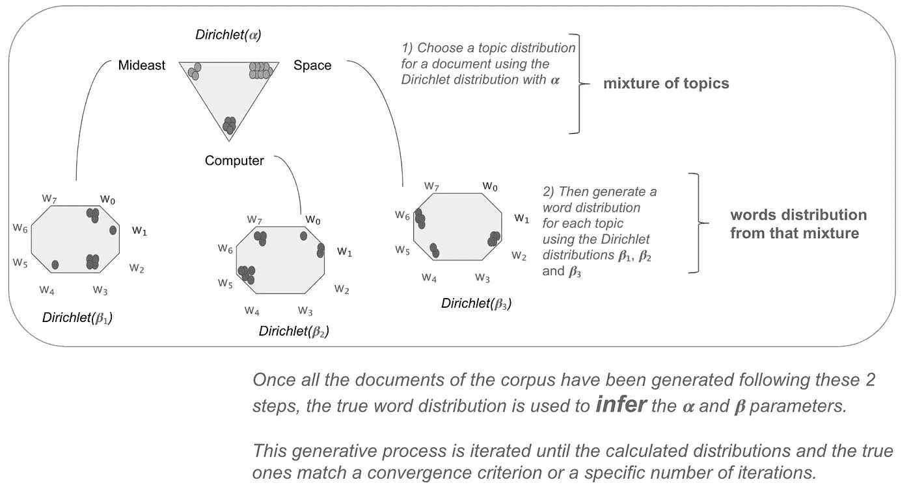
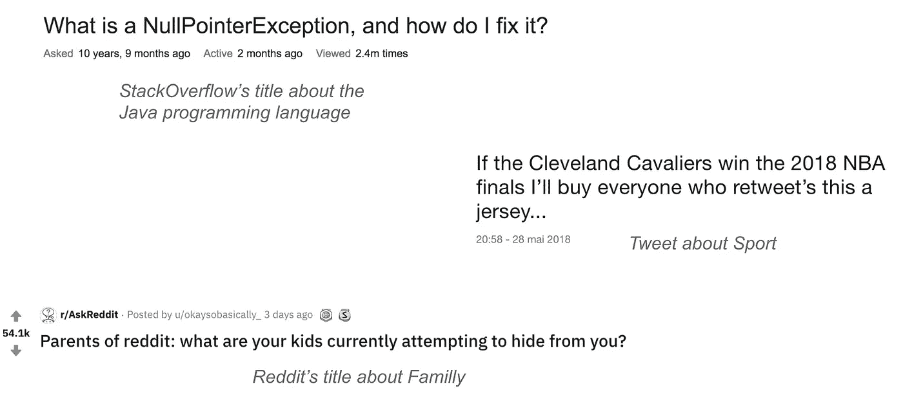
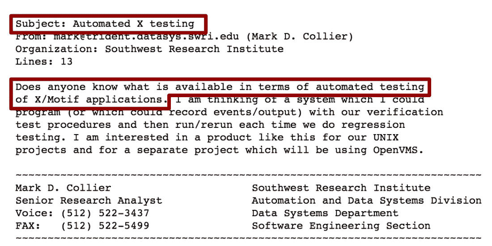
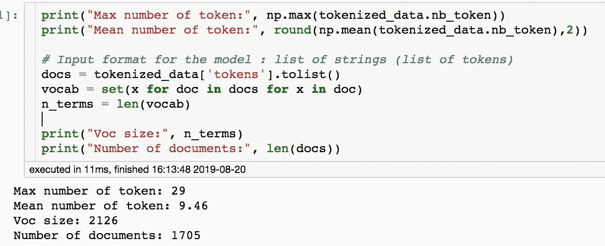
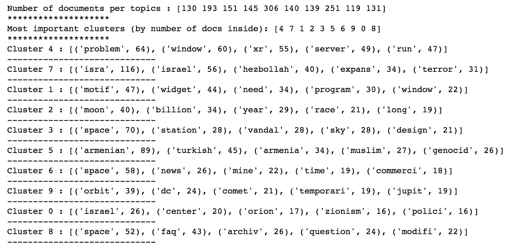
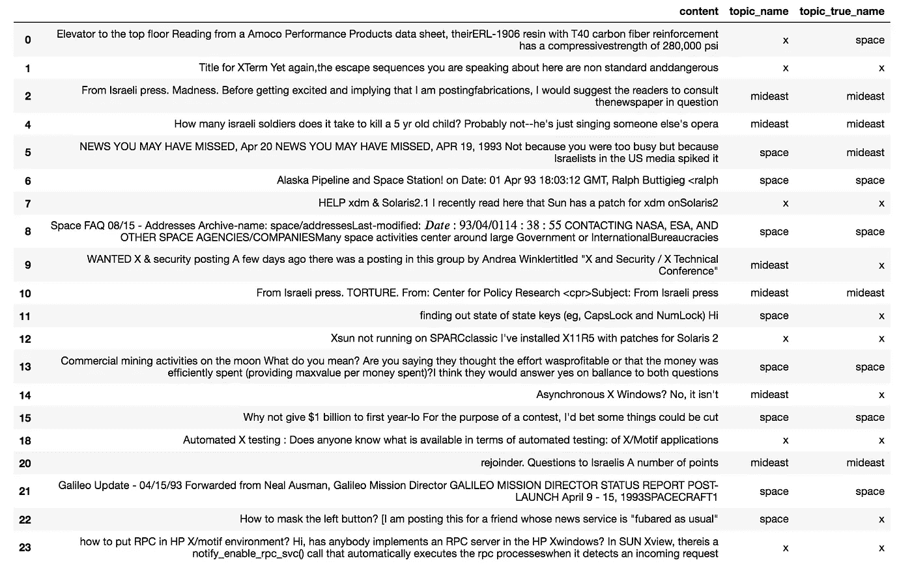
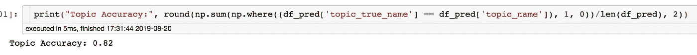
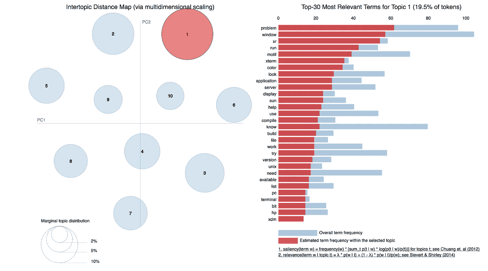

# 短文本主题建模

> 原文：<https://towardsdatascience.com/short-text-topic-modeling-70e50a57c883?source=collection_archive---------0----------------------->

## 直觉和代码来理解和实现短文本的主题建模，比如社交媒体(Tweets，Reddit 的帖子…)


Photo by [Hello I’m Nik 🇬🇧](https://unsplash.com/@helloimnik?utm_source=unsplash&utm_medium=referral&utm_content=creditCopyText) on [Unsplash](https://unsplash.com/search/photos/candies?utm_source=unsplash&utm_medium=referral&utm_content=creditCopyText)

**主题建模**的目的是在一个文本语料库(如邮件或新闻文章)中找到主题(或聚类),而不需要先知道那些主题。这就是主题建模的真正力量所在，你不需要任何带标签或带注释的数据，只需要**原始文本**，从这种混乱的主题建模算法中会找到你的文本所涉及的主题！

在这篇文章中，我们将描述最流行的主题建模方法 **LDA** 背后的直觉和逻辑，并了解它对短文本的**限制。鉴于这篇文章是关于**短文本主题建模** ( **STTM** )我们将不深究 LDA 的细节。想要加深对 LDA 的了解的读者可以在这里和这里找到关于 LDA [的优秀文章和有用资源。
然后，在第二部分中，我们将介绍一种新的 STTM 方法，最后在第三部分中了解如何在玩具数据集上轻松应用它(拟合/预测✌️)并评估其性能。](/light-on-math-machine-learning-intuitive-guide-to-latent-dirichlet-allocation-437c81220158)**

已经熟悉 LDA 和主题建模的读者可能想跳过第一部分，直接进入第二和第三部分，这两部分介绍了一种新的**短文本主题建模**及其 **Python 编码的方法🐍**。

## 一.潜在的狄利克雷分配

最流行的话题建模算法是 **LDA，潜在狄利克雷分配**。让我们首先解开这个令人印象深刻的名字，对它的作用有一个直觉。

*   **潜伏**因为题目很“隐蔽”。我们有一堆文本，我们希望算法将它们分成对我们有意义的簇。例如，如果我们的文本数据来自新闻内容，通常发现的聚类可能是关于中东政治、计算机、空间…但我们还不知道它。
*   **狄利克雷**代表[狄利克雷](https://stats.stackexchange.com/questions/244917/what-exactly-is-the-alpha-in-the-dirichlet-distribution)分布，该模型将其用作生成文档-主题和词-主题分布的先验。
*   因为我们想给我们的文章分配主题。

下面的图 1 描述了 LDA 步骤如何在文档语料库中清晰地找到主题。

> *“通过对这些主题的混合物进行采样，然后从该混合物中对单词进行采样，生成一个文档”(吴恩达、大卫·布莱和迈克尔·乔丹，来自 LDA 最初的* [*论文*](https://ai.stanford.edu/~ang/papers/nips01-lda.pdf) *)。*



Figure 1: LDA documents generation process using Dirichlet distribution.

[*NB*](http://u) :在上面的图 1 中，为了便于说明，我们在词汇表中设置了 K=3 个主题和 N=8 个单词。为了便于说明，我们还将这些主题命名为计算机、空间和中东政治(而不是称它们为主题 1、主题 2 和主题 3)。事实上，我们的任务是理解 3 个发现的主题是关于计算机、空间和中东政治的内容(我们将在第三部分 STTM 管道的主题归属中更深入地了解这一部分)。

简而言之，LDA 通过使用狄利克雷分布作为先验知识来生成由主题组成的文档，然后更新它们，直到它们匹配基本事实。

## 二。短文本主题建模(STTM)

尽管 LDA 在中型或大型文本(> 50 个单词)上取得了很好的效果，但通常邮件和新闻文章都在这个大小范围内， **LDA 在短文本**上表现不佳，如 Tweets、Reddit 帖子或 StackOverflow titles 的问题。



Figure 2: Example of short texts and the topic they discuss.

查看上面图 2 中的短文本示例，很明显，假设文本是主题的混合物(记住图 1 中的第一步)不再正确。我们现在假设一篇短文仅由**的一个主题**组成。

**Gibbs 抽样 Dirichlet 混合模型** ( **GSDMM** )是一种“改变的”LDA 算法，在 STTM 任务上表现出很好的结果，这使得最初的假设: **1 主题↔️1 文档**。文档中的单词是使用相同的唯一主题生成的，而不是像在原始 LDA 中那样来自主题的混合。

在深入代码和实践方面之前，让我们先了解一下 **GSDMM** 和一个称为**电影组过程**的等效过程，它将帮助我们了解 STTM 的不同步骤和过程，以及如何**有效地调优其超参数**(我们记得 LDA 部分的 alpha 和 beta)。

想象一下，一群学生在餐馆里，随机坐在 K 张桌子旁。他们都被要求在纸上写下他们最喜欢的电影(但必须是一个简短的名单)。目标是以这样一种方式将他们聚集在一起，使得同一组中的学生分享相同的电影兴趣。为此，学生必须根据以下两条规则逐一选择新的桌子:

*   规则一:选择学生多的桌子。这条规则提高了完整性，所有对同一部电影感兴趣的学生都被分配到同一个桌子上。
*   规则 2:选择一张桌子，让学生分享相似电影的兴趣。这个规则旨在增加**的同质性**，我们只希望成员们在一张桌子上分享同一部电影的兴趣。

重复这个过程后，我们预计一些表格会消失，另一些会变得更大，最终会有一群学生符合他们对电影的兴趣。这就是 GSDMM 算法所做的事情！

## 三。STTM 实施

在这一部分中，我们将使用 Scikit-learn 中用于文本主题建模的 20 个新闻组[数据集](https://scikit-learn.org/0.19/datasets/twenty_newsgroups.html),从一个具体示例中构建**完整的 STTM 管道**。

首先，我们需要从 Github 下载 STTM 脚本到我们的项目文件夹中。

```
cd sttm_project
git clone [https://github.com/rwalk/gsdmm.git](https://github.com/rwalk/gsdmm.git)
```

现在，我们可以开始实现 STTM 管道(这是我使用的[笔记本](https://github.com/Matyyas/short_text_topic_modeling/blob/master/notebook_sttm_example.ipynb)的静态版本)。

```
# Useful libs
from sklearn.datasets import fetch_20newsgroups
import pickle
import pandas as pd
import numpy as np# STTM lib from Github
from gsdmm import MovieGroupProcess# Custom python scripts for preprocessing, prediction and
# visualization that I will define more in depth later
from preprocessing import tokenize
from topic_allocation import top_words, topic_attribution
from visualisation import plot_topic_notebook# Load the 20NewsGroups dataset from sklearn
cats = ['talk.politics.mideast', 'comp.windows.x', 'sci.space']
newsgroups_train = fetch_20newsgroups(subset=’train’, categories=cats)
```

但是在这个练习中，我们不会用新闻的全部内容来从中推断一个话题，而是**只考虑新闻**的主题和第一句话(见下图 3)。事实上，我们需要短文本来进行短文本主题建模…很明显🙏

此外，为了便于说明，我们将只查看 3 个主题(均匀分布在数据集中)。这些主题如下:

*   中东政治🌍
*   空间👾
*   Windows X 🖥



Figure 3: Example of a news about the topic: **Windows X**. We concatenate these 2 highlighted sentences together to have a document.

```
# Preprocessing and tokenization
tokenized_data = tokenize(df, form_reduction='stemming', predict=False)
```

以下是我在这项任务中遵循的[预处理](https://medium.com/@datamonsters/text-preprocessing-in-python-steps-tools-and-examples-bf025f872908)配方:

*   使用 [spaCy](https://spacy.io/usage/spacy-101) 记号化器进行记号化。
*   删除停用词和 1 个字符的词。
*   使用 [nltk](https://www.nltk.org/) 库的词干分析器进行词干分析(根据我的经验，我观察到[词干分析](https://en.wikipedia.org/wiki/Stemming)比[词干分析](https://en.wikipedia.org/wiki/Lemmatisation)在短文本上给出了更好的聚类)。
*   删除空文档和超过 30 个令牌的文档。
*   移除唯一令牌(术语频率= 1)。



Figure 4: We do match the Short Text statistics regarding the number of token in our documents, referring to the [STTM survey paper p.10](https://arxiv.org/pdf/1904.07695.pdf).

然而，必须记住**预处理是数据相关的**，如果使用不同的数据集，应考虑采用其他预处理方法。

既然我们的数据已经被清理并处理成适当的输入格式，我们就可以训练模型了🚀

```
# Train STTM model# Init of the Gibbs Sampling Dirichlet Mixture Model algorithm
# K = number of potential topic (which we don't know a priori)
# alpha = 
# beta = 
# n_iters = number of iterations to 
mgp = MovieGroupProcess(K=10, alpha=0.1, beta=0.1, n_iters=30)vocab = set(x for doc in docs for x in doc)
n_terms = len(vocab)y = mgp.fit(docs, n_terms)# Save model
with open(‘dumps/trained_models/v1.model’, “wb”) as f:
 pickle.dump(mgp, f)
 f.close()
```

让我们深入了解 gsdmm:模型的超参数机制

*   **K** = 10。在实际情况下，我们不知道主题的确切数量，所以我们希望选择一个更高的值。理论上，GSDMM 应该清空无用的簇，并最终找到簇的确切数目。这里不会出现这种情况，但没什么可担心的，我们稍后会更深入地解释这种情况。
*   **阿尔法**= 0.1**贝塔** = 0.1。在这里，我们保留了默认参数(对于几个数据集来说，这些参数工作得很好)。然而，人们可能希望对它们进行调优，以改善关于集群的完整性和同质性的主题分配。不要犹豫参考[原文](https://dl.acm.org/doi/10.1145/2623330.2623715)📖为了理解这两个参数之间的平衡。
*   n_iters = 30。根据原始论文，GSDMM 在几个数据集上收敛得相当快(大约 5 次迭代)，并且保持非常稳定。因此，对于任何类型的数据集，30 次迭代都是一个很好的默认值。

一旦模型被训练，我们想要探索发现的主题，并检查它们在内容上是否一致🔎

假设我们的模型已经将文档收集到 10 个主题中，我们必须给它们一个对其内容有意义的名称。因此，让我们深入研究我们的模型所发现的主题。

```
doc_count = np.array(mgp.cluster_doc_count)
print('Number of documents per topic :', doc_count)
print('*'*20)# Topics sorted by the number of document they are allocated to
top_index = doc_count.argsort()[-10:][::-1]
print('Most important clusters (by number of docs inside):', top_index)
print('*'*20)# Show the top 5 words in term frequency for each cluster 
top_words(mgp.cluster_word_distribution, top_index, 5)
```

上面的代码显示了下面的统计数据，这些数据让我们了解我们的集群是由什么组成的。



Figure 5: 1) Number of documents by cluster (or topic) index. 2) The sorted list of clusters regarding the number of documents they contain. 3) The top 5 words regarding their frequency inside a cluster.

理想情况下，GSDMM 算法应该找到正确的主题数，这里是 3，而不是 10。我想到三种解释:

*   寻找其他超参数以清空较小的集群(参考[原始论文](https://dl.acm.org/doi/10.1145/2623330.2623715)以更深入地理解α和β参数)。
*   我们既有小数据集又有词汇表(大约 1700 个文档和 2100 个单词)，这对于模型来说可能难以推断和区分主题之间的显著差异。像往常一样，数据越多越好。
*   该算法可能会在主题中找到主题。让我解释一下。众所周知，其中一个话题是关于中东的新闻。然而，该算法将该主题分成 3 个子主题:以色列和真主党之间的紧张局势(聚类 7)、土耳其政府和亚美尼亚之间的紧张局势(聚类 5)或以色列的犹太复国主义(聚类 0)。

然而，即使找到了 3 个以上的集群，我们也很清楚如何将它们分配到各自的主题中。

```
# Must be hand made so the topic names match the above clusters 
# (Figure 5) regarding their contenttopic_dict = {}
topic_names = ['x',
               'mideast',
               'x',
               'space',
               'space',
               'mideast',
               'space',
               'space',
               'mideast',
               'space']for i, topic_num in enumerate(top_index):
    topic_dict[topic_num]=topic_names[i] df_pred = topic_attribution(tokenized_data, mgp, topic_dict, threshold=0.4) 
```

有人可能会问，*topic _ attribute*函数的*阈值*输入参数是什么。实际上，主题被分配给给定概率的文本，并且*topic _ attribute*是一个定制函数，它允许选择考虑哪个阈值(置信度)以便属于一个主题。例如，查看主题到文本的最高概率分配，如果该概率低于 0.4，则该文本将被分配到“其他”主题中。

[*NB*](http://u) *:* 这个定制的*topic _ attribute*函数建立在 GSDMM 包中的原始函数之上: *choose_best_label，*输出最有可能属于某个文档的主题。

现在是时候将找到的主题分配给文档，并将它们与地面真相进行比较(✅对❌)

```
df_pred[['content', 'topic_name', 'topic_true_name']].head(20)
```



天真地比较预测的主题和真实的主题，我们会有 82%的准确率！🎯
仅用一个 **9 字平均**的文档，一个 1705 个文档的小语料库和很少的超参数调优！



🙌

拥有一个高效的模型当然很好，但如果我们能够简单地展示其结果并与之互动，那就更好了。为此， [**pyLDAvis**](http://stat-graphics.org/movies/ldavis.html) 是一个非常强大的主题建模可视化工具，允许在二维空间维度中动态显示集群及其内容。



Screen-shot of pyLDAvis ability. Check out this [video](http://stat-graphics.org/movies/ldavis.html) to see its full power.

现在轮到你用自己的数据(社交媒体评论、在线聊天的回答……)来尝试了💪

瞧啊！👌

感谢拉贾·埃尔·海姆达尼对我的评价和反馈。

**参考资料和其他有用的资源** ——GSD mm
的[原文](https://dl.acm.org/doi/10.1145/2623330.2623715)——实现 STTM 的好看的 [python 包](https://github.com/rwalk/gsdmm)。pyLDAvis 库漂亮地可视化了一堆文本中的主题(或者任何单词包一样的数据)。
-最近对 STTM 的一项对比调查看其他策略。

[*PS*](http://n) :对于那些愿意深入 STTM 的人来说，有一种有趣的更进一步的方法(我现在还没有亲自探索过)叫做 [GPU-DMM](https://www.ntu.edu.sg/home/axSun/paper/sigir16text.pdf) ，它显示了 SOTA 在短文本主题建模任务上的结果。简而言之，GPU-DMM 正在使用[预先训练的单词嵌入](/word-embeddings-intuition-and-some-maths-to-understand-end-to-end-skip-gram-model-cab57760c745)作为外部知识来源来影响单词的采样，以生成主题和文档。