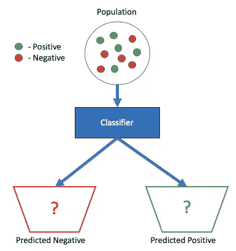
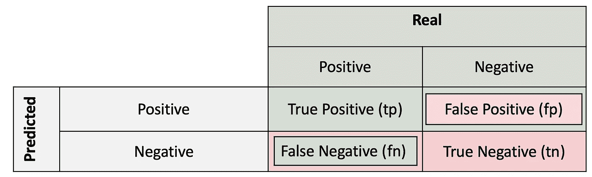
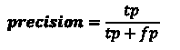
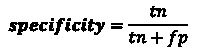
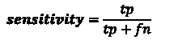
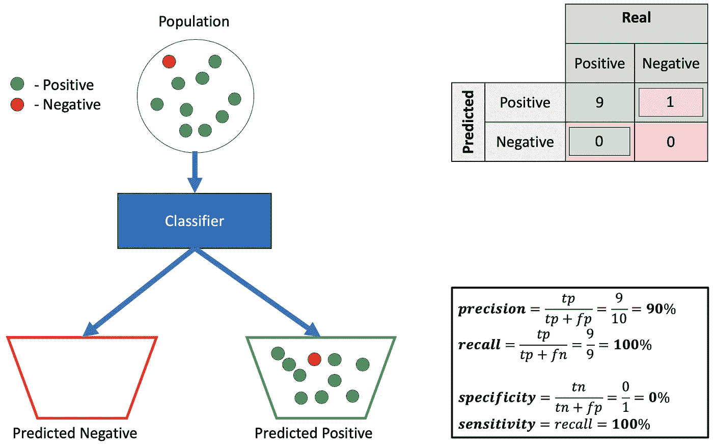
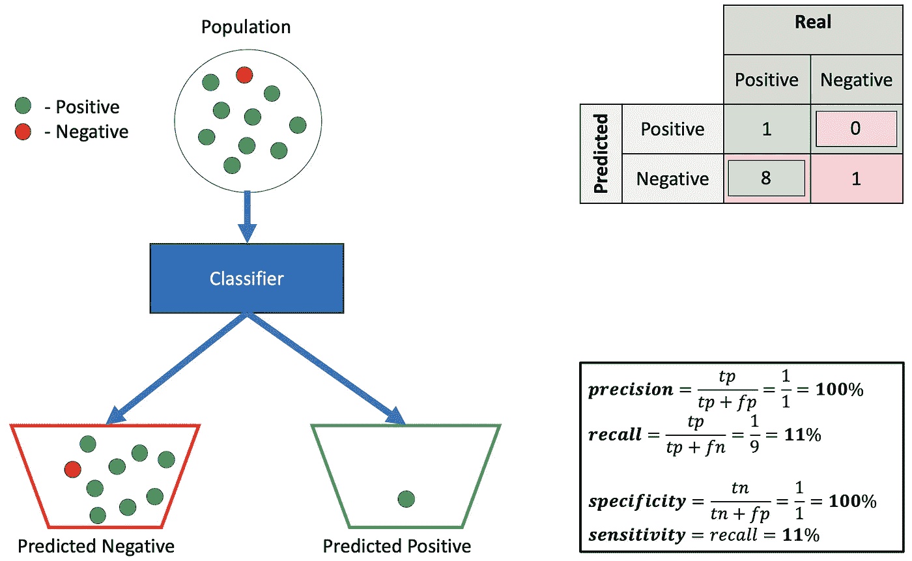
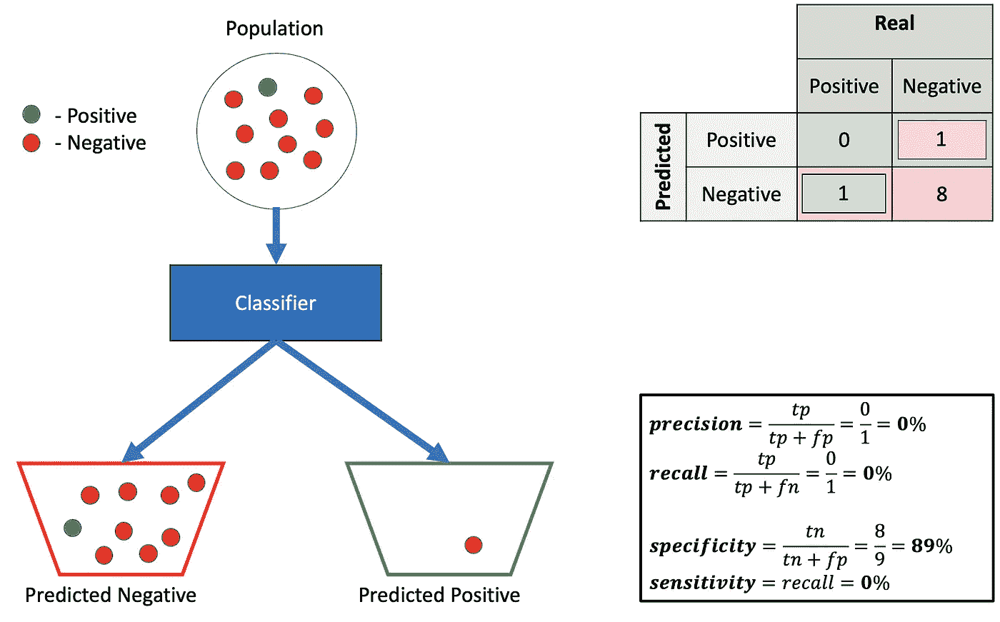
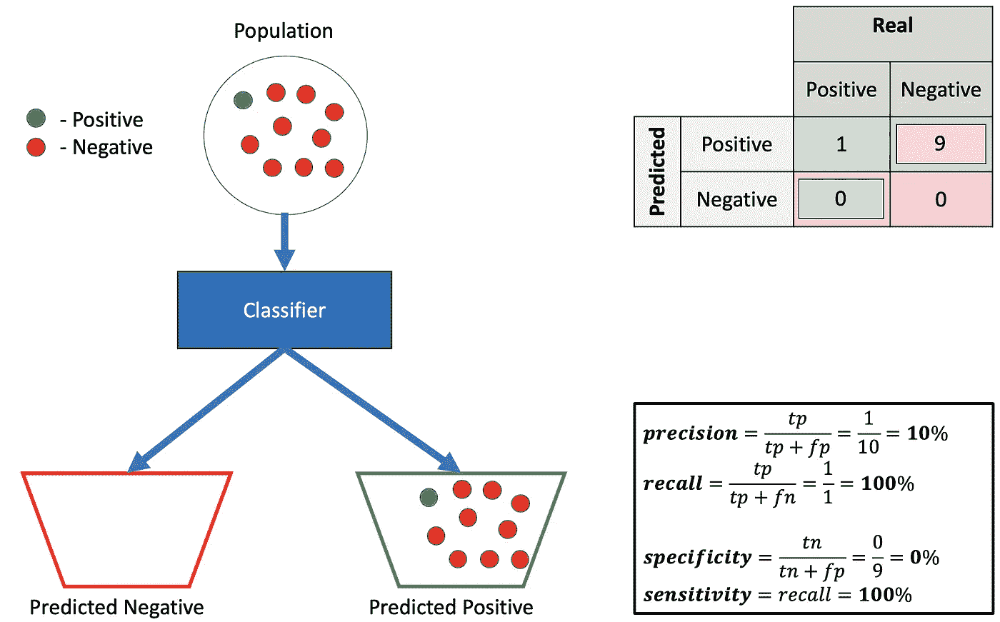
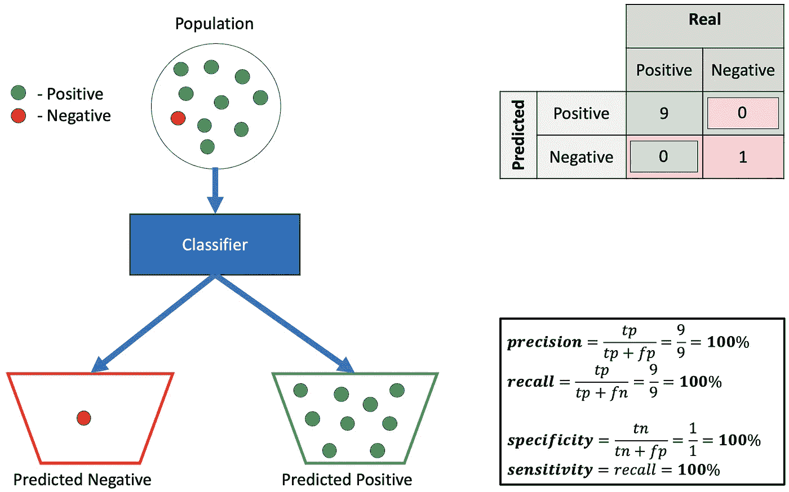

# 医学中的数据科学——精确与回忆还是特异性与敏感性？

> 原文：<https://towardsdatascience.com/should-i-look-at-precision-recall-or-specificity-sensitivity-3946158aace1?source=collection_archive---------5----------------------->

## 理解精确性、回忆性和特异性、敏感性之间的区别

在数据科学社区中，通常会通过精确度和召回率来评估您构建的模型。在医学领域，通常通过特异性和敏感性来评估医学测试。这些概念非常相似，但又不同。当这两个世界相遇时，当医学测试是机器学习模型时，这种差异可能会导致医学世界和数据科学人之间的许多误解。

那么，让我们来看看定义:

**Precision** — Out of all the examples that predicted as positive, how many are really positive?

**Recall** — Out of all the positive examples, how many are predicted as positive?

**Specificity** — Out of all the people that do **not** have the disease, how many got negative results?

**Sensitivity** — Out of all the people that have the disease, how many got positive test results?

如果我们将一个正面的例子定义为“患有疾病的人”,我们可以看到回忆和敏感性是相同的，但是精确性和特异性是不同的。精度也叫 PPV(阳性预测值)。从现在起，我们将把敏感性称为回忆。

这些定义非常简单，然而，当我试图理解它们的组合对我的算法意味着什么时，我发现自己很困惑。精确度、召回率和灵敏度的每一种组合都是可能的吗？在哪些情况下我做错了什么？

如果有帮助的话，你可以称特异性为当阳性标签被定义为阴性，而阴性标签被定义为阳性时对同一问题的回忆。

为了更好地理解它，我创建了 8 个不同的分类问题和分类器。每个分类器试图以最大化或最小化每个测量值的方式将 10 个样本分类到阳性和阴性“篮子”中。

## 示例 1 —低精度、高召回率和高特异性

如果分类器预测是否定的，你可以相信它，例子是否定的。但是，注意，如果例子是否定的，你不能确定它会预测为否定的(特异性= **78%** )。

如果分类器预测是肯定的，你不能相信它(精度= **33%** )。然而，如果这个例子是正面的，你可以信任这个分类器(回忆= **100%** )。

## 示例 2 —高精度、高召回率和低特异性

将一切都预测为积极显然不是一个好主意。但是，由于人口不平衡，精度相对较高，召回率为 **100%** ，因为所有的阳性样本都被预测为阳性。但是特异性是 **0%** 因为没有阴性的例子被预测为阴性。

## 示例 3 —高精度、低召回率和高特异性

这可能是一个有用的分类器——如果它预测一个例子是正面的，你可以相信它——它是正面的。然而，如果它预测它是负的，你不能相信它，很可能它仍然是正的。

## 示例 4 —低精度、低召回率和高特异性

这个分类器真的很糟糕——它几乎把所有预测为负面，当预测为正面时——它是错误的。实际上，使用与这个分类器预测相反的东西会更好。

## 示例 5 —高精度、低召回率和低特异性

在这里，与这个分类器预测的相反应该会工作得更好。

## 示例 6 —低精度、高召回率和低特异性

这个分类器可能没用——它预测一切都是肯定的。所以，它当然可以完美地检测出所有的正面例子(高召回率)，但是使用它你得不到任何信息。

## 示例 7 —高精度、高召回率和高特异性

这是“圣杯”——分类器将所有正面的例子检测为正面的，将负面的例子检测为负面的。所有措施都处于 **100%** 。

## 示例 8 —低精度、低召回率和低特异性

这看起来像一个糟糕的分类器，所有的正例被预测为负，所有的负例被预测为正。所有措施都是 0%。然而，你可以简单地做与它预测相反的事情，然后它就完美了👌。

总之，所有的度量(精确度、召回率和特异性)都给了我们关于分类模型好坏的重要信息。重要的是要把它们都看清楚。例如，在不考虑特异性的情况下，您可以创建一个非常精确的模型，并回忆简单地预测所有事情都是真实的，并且没有实际价值(如上面的示例 2)。

数据人员-不要忘记特殊性！尤其是当你在和医学界打交道的时候。