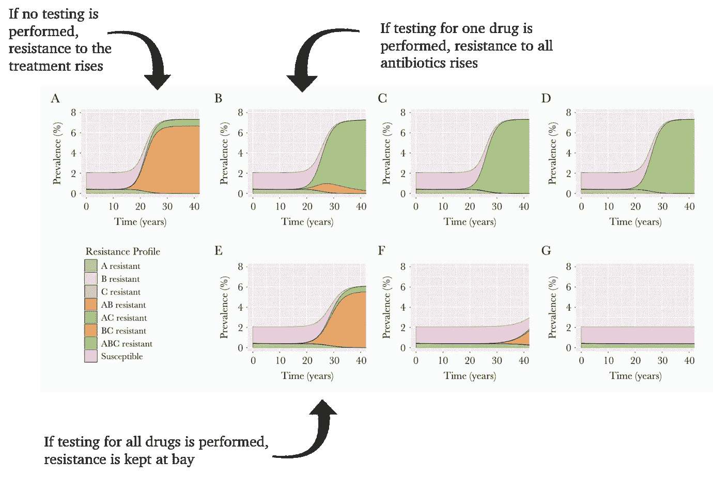
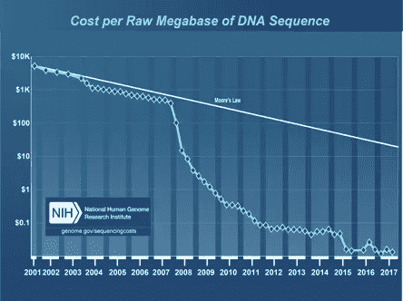
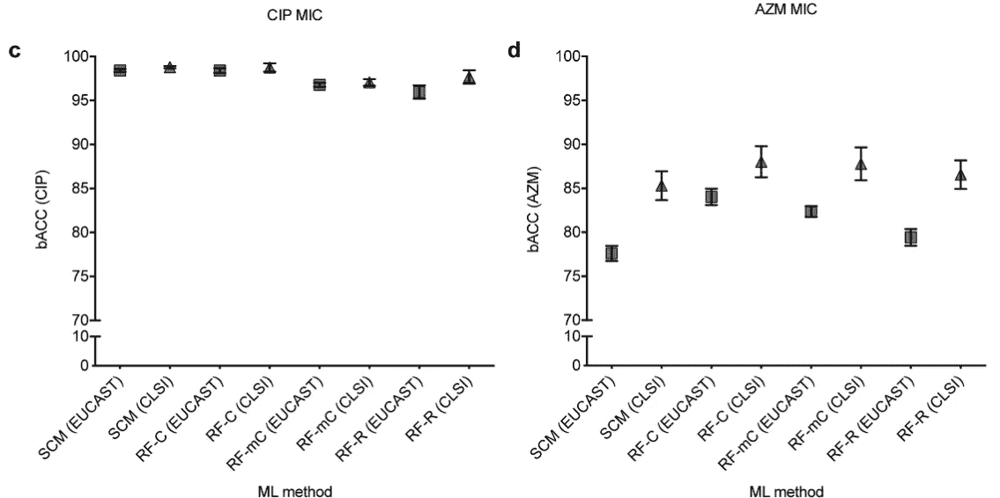
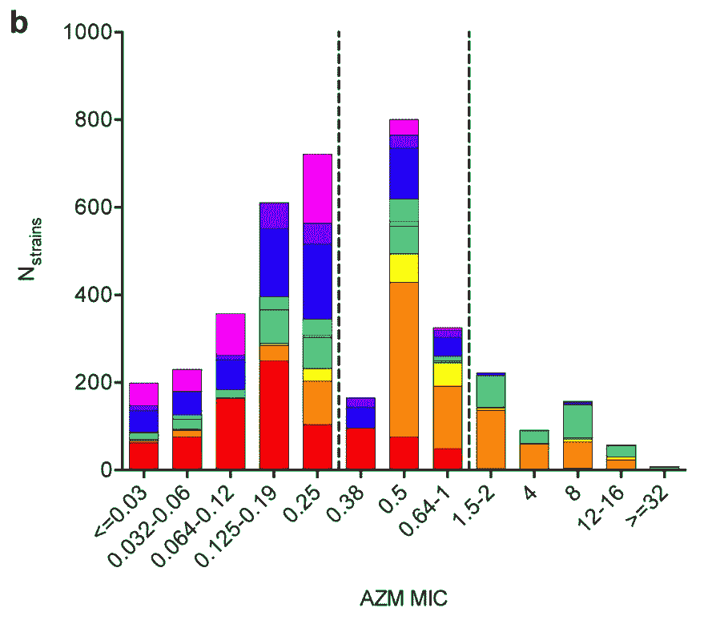

# 机器学习算法应该指导抗生素处方吗？

> 原文：<https://towardsdatascience.com/should-machine-learning-algorithms-guide-antibiotic-prescribing-f74753e28472?source=collection_archive---------21----------------------->

Photo by [freestocks.org](https://unsplash.com/@freestocks?utm_source=unsplash&utm_medium=referral&utm_content=creditCopyText) on [Unsplash](https://unsplash.com/search/photos/pills?utm_source=unsplash&utm_medium=referral&utm_content=creditCopyText)

## 机器学习可以解决抗生素耐药性危机。算法在现实世界中的表现会像在实验室中一样好吗？

答抗生素耐药性正成为一个严重的问题——目前，每年有超过 700，000 人死于抗生素耐药性感染。到 2050 年，预计将有 1000 万人死于耐药性感染。

## 帮助阻止抗生素耐药性传播的方法

许多感染是“凭经验”治疗的，这意味着如果医生知道你感染了什么细菌，他们会开出标准的抗生素来治疗。这意味着，如果你患有对标准抗生素有耐药性的感染，在你服用抗生素的过程中，细菌仍然在你体内存活和复制。随着时间的推移，这可能导致抗生素耐药性细菌的流行率上升。

人们对在病人开始治疗前测试抗生素耐药性越来越感兴趣。下图有点复杂，但它显示了首次开出正确抗生素的潜在长期影响。

Image: [Tuite et al. 2017](https://www.ncbi.nlm.nih.gov/pubmed/28968710)

**图 A** 显示了给每个人开两种抗生素组合处方的效果。在几十年的时间里，对这种疗法产生抗药性的感染数量会增加。

**B-D**展示了如果在开处方前将患者对其中一种药物的耐药性检测从 10%增加到 50%会发生什么。对三种可用抗生素的耐药性实际上上升了，这是一种更糟糕的情况。

但是**面板显示了所有三种可用抗生素在 10-50%人口中测试的影响。随着检测覆盖率的增加，对抗生素的耐药性停止增加，大多数感染对所有抗生素都敏感。**

## 将此付诸实践

在开处方前测试抗生素耐药性似乎是一个很好的方法。然而，有一些实际的限制妨碍了这种日常工作。一个主要的问题是，当人们去看医生或去医院接受治疗时，他们希望立刻得到抗生素来治疗他们的感染。实验室耐药性测试可能需要 24 小时(如耐甲氧西林金黄色葡萄球菌)到数月(如肺结核)的时间。

随着时间的推移，全基因组测序变得越来越便宜，使其成为检测抗生素耐药性的更实用的方法。理论上，测序可以在几个小时内给出结果，而不是几天。驱动这些细菌耐药性的机制被编码在它们的 DNA 中，这意味着一个简单的测试就可以告诉我们对一组抗生素的耐药性，还可以给我们其他有用的信息，比如你感染的菌株是否在上升，或者与当时在医院或社区传播的菌株有关。

我们知道我们需要找到的信息在这些细菌的 DNA 中，但我们并不总是知道如何找到它。这就是机器学习的用武之地。

在过去的几年中，有前途的机器学习研究不断涌现，都声称在预测耐药性方面具有很高的准确性。但是，在科学研究的受控条件下比在现实世界中更容易实现高准确性，因此这些算法在面对临床数据时的表现仍然存在不确定性。

## 检验 ML 模型的稳健性

这是我和我的同事们非常感兴趣的问题，在本月发表的一篇新论文中，我们开始探讨这个话题。这项研究着眼于三种机器学习方法:

*   集合覆盖机
*   随机森林分类
*   随机森林回归

我们正在调查来自*淋病奈瑟菌*的七组不同的基因组序列数据，这是一种引起淋病的细菌，每一组都是在不同的地点用不同的取样策略收集的。这项研究着眼于环丙沙星(其耐药机制相当简单)和阿奇霉素(其耐药机制更复杂且了解更少)的耐药性。为了将基因组序列数据处理成模型可以使用的东西，基因组序列被分解成 31 聚体，即 31 个字母长的 DNA 片段。使用 5 重交叉验证调整超参数。

虽然 ML 方法对导致环丙沙星耐药性的简单耐药机制表现良好，但它们对更复杂的阿奇霉素耐药性表现不佳。这是一个遗憾，因为我们可以通过寻找单个突变来非常准确地预测环丙沙星耐药性(> 98%的灵敏度和> 99%的特异性)。我们希望 ML 能揭示更多关于阿奇霉素耐药性的信息。我还在全基因组关联研究中发现了类似的事情，这是一种更为明确地设计用于找出基因组中驱动耐药性的因素的更古老的技术——这些方法在告诉我们已知的东西方面很好，但在揭示我们不知道的东西方面不太好。换句话说，如果历史上人类很难理解某个特征的遗传，那么这些算法也很难理解。

Performance of the different methods on predicting ciprofloxacin resistance (left) and azithromycin resistance (right) using two different clinical definitions of resistance (EUCAST and CLSI). Figure from [this paper.](https://journals.plos.org/ploscompbiol/article?id=10.1371/journal.pcbi.1007349)

就模型性能而言，我们看到抗生素、物种和方法之间存在许多可变性，从这个项目中得到的主要收获是，一种方法并不适合所有问题，即使是在这个狭窄的问题空间内。这意味着，要设计一个我们可以发送所有临床数据的管道并不容易——需要有一个流程来为每个问题选择正确的模型。

我们正在研究的一个主要因素是采样偏差。这可以以仅从特定患者群、特定时间段或特定地理区域取样的形式出现。采样偏差是任何预测建模中的一个主要挑战。在耐药性预测中，从特定患者人口统计数据或在有限的时间段内进行采样会影响耐药性样本的数量以及您捕获的耐药机制的多样性。

Distribution of MIC values (a measure of the concentration of antibiotic bacteria can tolerate before it impairs their growth) for the seven different collections — each collection is shown in a different colour. Figure from [this paper.](https://journals.plos.org/ploscompbiol/article?id=10.1371/journal.pcbi.1007349)

在不同的淋病数据集中，有些是在当地收集的，有些来自全球收集，有些来自一年，有些跨越 20 多年。我们发现，即使您有一个包含来自世界各地的样本的大型数据集，在此集合上训练的模型在来自新位置的数据上仍然比在本地训练的模型表现更差。有时，在全局集合上训练的模型在来自先前采样位置的新数据上甚至比仅使用来自该位置的数据训练的模型表现更差，这表明存在影响准确性的数据集特定信号(可能是偏差或技术假象)。

这项研究还观察了环丙沙星耐药性预测在肺炎克雷伯氏菌和鲍氏不动杆菌中的表现，这两种细菌比 T4 淋球菌携带的基因范围更广，因此产生更多的 k-mers。对于这些情况，SCM 比 RF 分类器更适合训练数据，但是 RF 分类器总体上不太准确。与淋病一样，寻找单一已知突变比 ML 模型给出了更好或相等的平衡准确性。

这项研究的一个重要收获是[不要相信在这个领域建立的只报告其准确性的模型](https://rss.onlinelibrary.wiley.com/doi/10.1111/1740-9713.01404)。我们真正关心的耐药谱是那些目前很少对抗生素产生耐药性的谱，所以我们仍然使用抗生素。一个模型可以通过预测所有事物都不具有抗性来实现对这些罕见抗性的高精度。明确了解模型遗漏的耐药分离株的比例和数量非常重要，因为这将导致临床治疗失败和耐药选择。

## 阅读全文

 [## 评估影响基于机器学习的抗生素的性能和可靠性的参数…

### 作者摘要基于机器学习的细菌基因组序列抗生素耐药性预测代表了一个新的研究方向

journals.plos.org](https://journals.plos.org/ploscompbiol/article?id=10.1371/journal.pcbi.1007349)