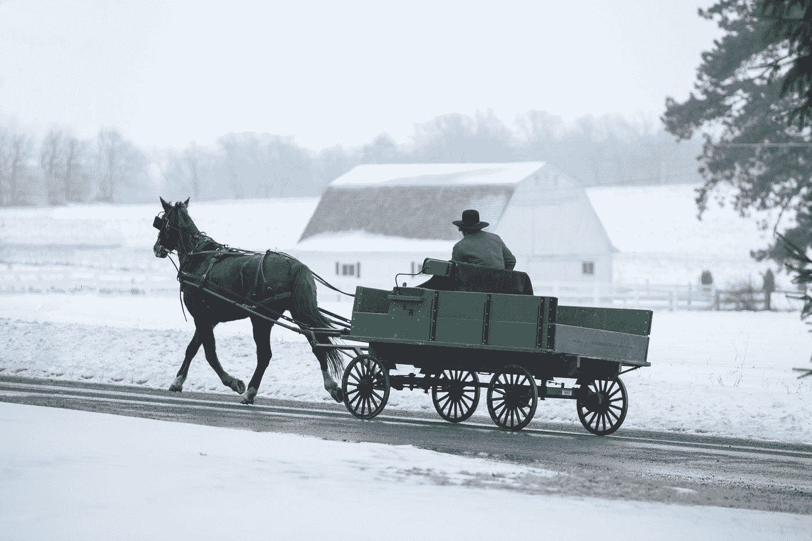

# 我们应该为未来技术改造基础设施吗？

> 原文：<https://towardsdatascience.com/should-we-adapt-infrastructure-for-future-technology-d8c69a55d4b8?source=collection_archive---------19----------------------->

Photo by [Randy Fath](https://unsplash.com/@randyfath?utm_source=medium&utm_medium=referral) on [Unsplash](https://unsplash.com?utm_source=medium&utm_medium=referral)

## 改变我们现在的世界来适应未来的机器人。

当新技术在公共领域变得流行时，基础设施被修改以更好地适应该技术。在早期殖民时期的美国，港口城市通常采用鹅卵石街道。虽然今天，这种路径被浪漫化了，但它们最初是为了改善马蹄与地面的牵引力而铺设的。作为当时的负重兽，马帮助搬运大量货物，鹅卵石街道给了蹄子更大的推进力。

最近，大城市已经适应了无处不在的智能手机技术。纽约市用充电站和 Wi-Fi 热点取代了电话亭。许多现代交通系统，如飞机和地铁，也可以接入 Wi-Fi。特拉维夫市最近实施了[楼层交通灯](https://www.timesofisrael.com/tel-aviv-trials-zombie-traffic-lights-to-save-smartphone-users-from-themselves/)，让手机粘行人知道十字路口的状态。

这两个例子都是反动的基础设施变化。一种技术(或马)被广泛使用，与之相适应的公共基础设施也随之建立起来。然而，一个几乎相反的问题存在于许多现代自动化技术中。随着各公司试图将无人驾驶汽车、[飞行出租车、](https://kittyhawk.aero/)货运无人机和[送货机器人](https://www.starship.xyz/)引入公共领域，它们不断努力适应我们已经创造的不一致的世界。所以问题来了，我们应该修改我们自己的世界以更好地适应未来的自主技术吗？

目前的自动驾驶汽车依赖于多种类型的传感器来检测它们的周围环境。除了 GPS，自动驾驶汽车还集成了激光雷达和雷达传感器，以帮助导航和解释他们的环境。特斯拉汽车使用[彩色视觉摄像头](https://www.emeraldinsight.com/doi/full/10.1108/IJIUS-08-2017-0008)进行导航。虽然所有这些传感器都有其物理限制，但它们的好坏取决于解释它们的算法。当出现弯道情况时，许多车辆依靠学习算法来更好地改善驾驶。这种方法表明，首先需要犯错误。像 [Waymo、](https://www.technologyreview.com/s/610680/alphabets-moonshot-chief-regulating-driverless-cars-demands-testing-the-smarts-of-the/)这样的公司让他们的车辆经历古怪的情况来提高性能。也许有尚未开发的技术可以提高这些机器人的鲁棒性。

特别是随着 5G 网络技术的发展，已经有了利用网络通信辅助导航的考虑。构成现代道路的许多特征——交通灯、停车标志、交通锥标、道路标线——都是为了方便司机而设计的，这些司机需要对如何在道路上行驶进行视觉排队。可以通过无线方式通信的机器不一定需要这样的队列。知道了自己在城市中的位置，汽车就有可能在附近利用无线技术监听交通灯和停车标志信号。

这种实现在十字路口或需要进行重要操作时肯定会很有用。微操作汽车也有可能应用。照亮现代道路的路灯已经是一种能源。给一排路灯配备射频通信系统可以用来定位路上的汽车并确定其速度(抱歉，超速行驶会更困难)。这将让汽车知道它是否偏离了车道中心或以不适当的速度行驶。更实际的是，如果前方有意想不到的路障，这些系统可以迅速通知汽车。

彩色视觉系统不应该被完全抛弃。随着家用机器人技术的出现，视觉系统可能是给机器人快速引导的便利方法。类似于人类阅读文字以确定指令的能力，给世界贴上二维码可能是告知自动驾驶汽车、制造机器人和无人机如何行动的一种简单方式。二维码有被标准化的好处。机器人不需要理解特定国家的书面语言，这已经是一项艰巨的任务。这种系统也是节能的。与其重新分配电力以适应更智能的道路，不如简单地改变交通标志的内容。

Boston Dynamics’ new ostriches use QR codes!

尽管这些对未来的乐观看法令人愉快，但暗示它们会很便宜是愚蠢的。这样的努力将和目前的自动驾驶汽车本身一样雄心勃勃。需要建立一个能够与现代道路规则相结合的电子标准。手动驾驶和自动驾驶世界之间的过渡必须平稳，并且向后兼容。

随着美国开始承认基础设施大修的必要性，对未来技术的考虑是一个值得讨论的问题。实施智能道路不一定要立竿见影。已经采用自主技术的城市，如旧金山、凤凰城和匹兹堡，可以优先考虑逐步过渡。也可以采取相反的方法。严重依赖汽车的美国被忽视的郊区可以成为这类项目的一个有用的试验台。无论如何，基础设施官员与主要技术公司和专家的互动可以对未来几十年社会和自主技术的继续发展产生迷人的影响。