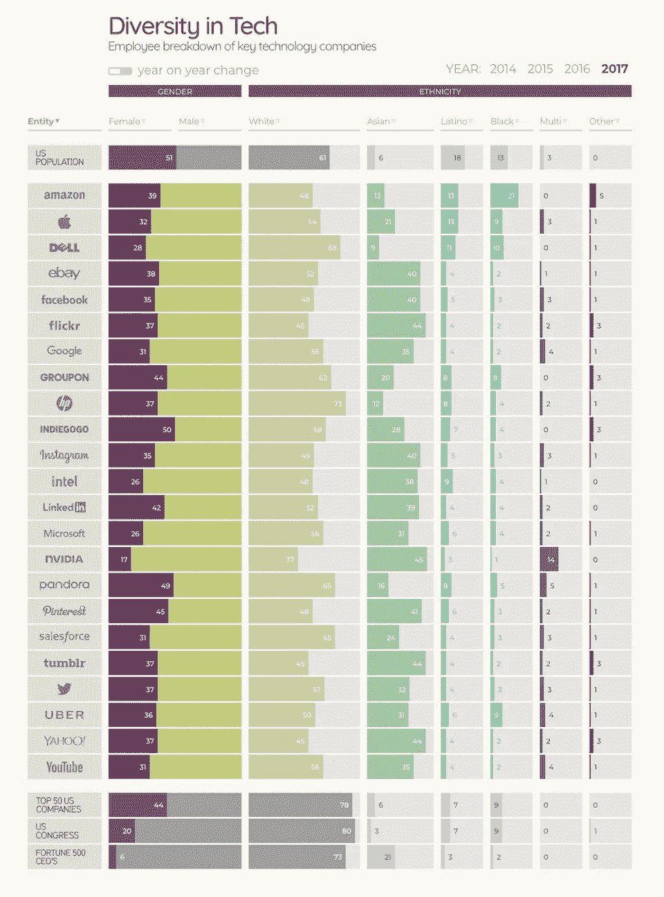

# 我们应该用英语编码吗

> 原文：<https://towardsdatascience.com/should-we-code-in-english-d59bd7ed87c9?source=collection_archive---------28----------------------->

## 使用语言来减少进入科技行业的障碍

在进入数据科学领域之前，我的背景是一名语言学家。我研究了从马来语到祖鲁语的一切，所以我知道人类语言中存在的丰富多样的语法和句法。

然而，尽管语言流利是我们与生俱来的能力，但对于有抱负的数据科学家来说，最大的障碍之一是获得与计算机对话所需的语言——代码语言。请考虑以下情况:

```
var languages = ["Amharic", "Catalan", "Finnish",
"German", "Swazi", "Uzbek"];
var text = "";
var i;
for (i = 0; i < languages.length; i++) {
  text += languages[i] + "<br>";
}
```

说英语但没有接受过计算机培训的人不会立即凭直觉知道这段代码在做什么。

语言学家感兴趣的是编程语言如何在一个范围内，从极度僵化和不透明到接近对话。JavaScript(见上图)是形式语言中明显非自然的一端；纯 Python 更偏向另一边:

```
languages = ["Amharic", "Catalan", "Finnish",
"German", "Swazi", "Uzbek"]
text = ""
for language in languages:
  text += language + "\n"
```

即使是没有什么编程经验的人，至少也可以对这里发生的事情进行有根据的猜测，而不会完全错误。

两个 for 循环产生相同的输出。两种语言都是图灵完备的。但是从纯语言学的角度来看，一个比另一个更容易被初学者理解。

# 降低计算机编程的门槛


在一个由数据和计算机主宰的世界里，操纵这两者的能力是一项日益重要的技能。有能力的人和没有能力的人之间的知识差距越来越大，因此收入差距也越来越大。

因此，允许非程序员使用计算机科学工具的编程语言很难被高估。以 R 为例。作为一种编程语言，它是个怪人。你可以使用[许多不同的策略](https://www.quora.com/Who-uses-the-R-programming-language-and-how-do-they-use-it-Why-is-it-different-and-what-kind-of-programmer-would-be-interested-in-learning-R-language)来达到相同的目的(违反了 Python 的[禅，即“应该有一种——最好只有一种——显而易见的方法来做这件事。”).](https://www.python.org/dev/peps/pep-0020/)

但这为统计学家、研究科学家和其他需要即时分析数据的人提供了一个巨大的优势:[“它允许统计学家在不了解计算系统的血液和内脏的情况下进行非常复杂的分析。”](https://www.nytimes.com/2009/01/07/technology/business-computing/07program.html)

它也是免费和开源的，这意味着任何有电脑和一些莫邪的人都可以下载它，学习它，并与其可观的用户群联系。对于传统上在技术领域代表性不足的人群来说，这是一个好消息，尤其是女性，对她们来说，R 社区已经证明是性别多样性的 T2 堡垒。这也意味着除了基本的计算机知识之外，你不需要花钱或接受任何专门的教育来开始学习它。



人类大脑可以做计算机做不到的事情——比如识别母羊、母羊、母狮、母鸡和母猪都是雌性动物。我们的认知意味着我们的语言可以少一些字面上的精确，多一些隐喻。(比如说，计算机需要显式的 XML 标签和属性来实现相同的分类。)那么，在某种程度上，每个严肃的程序员都需要学习像正则表达式和正式语法约定这样的东西。

但是为什么*以那些开始*？进入科技行业已经够难了，尤其是如果你不是富裕的白人男性。[谷歌 2019 年多元化报告](https://www.forbes.com/sites/janicegassam/2019/04/07/googles-2019-diversity-report-reveals-more-progress-must-be-made/#419ead3a3bef)显示，女性和少数族裔在领导岗位上的比例有所下降，女性从已经很低的 29.4%下降到 25.7%。2018 年新招聘的科技人员中，只有 25.7%不是男性。83%的科技高管是白人。获得计算机科学教育是一个严重的问题，即使对于相对特权的人来说也是如此——由于高需求，大学正在限制计算机科学专业[，进一步扩大了不平等差距。](https://www.nytimes.com/2019/01/24/technology/computer-science-courses-college.html)

# 构建抽象的基础


一旦有人掌握了作为计算机编程基础的算法思维模式，他们就能够将它们应用于任何编程语言。那么，为什么不从一门让学习这些概念变得简单自然而不是令人沮丧的语言开始呢？

熨斗学校的创始人强调了这一点，指出重要的不是你学习的第一语言，而是学习如何学习，获得普遍的想法，并学习将它们应用于各种不同的背景。语言几乎是不重要的；甚至可以用积木和[现实世界的物体](https://dynamicland.org/)来教[编码。](https://www.theinquirer.net/inquirer/news/2463065/google-introduces-project-bloks-to-teach-coding-through-physical-objects)

事实上，所有编程语言都是抽象的，通过提供一个或多或少类似于自然人类语言的接口，允许人们间接编写句法和语义上无法理解的机器代码。认为[机器学习](https://hackernoon.com/its-time-we-code-in-english-e02df6b62ecc)可能让我们直接用英文编码[并不牵强。对于一个初学编程的人来说，编程语言越接近母语越好。任何人最终都会学到难的东西，但为那些刚起步的人创造公平的竞争环境至关重要。通过混合语言提供一座从普通英语到计算机语言的桥梁，这种混合语言共享两者的特征，这似乎是编码作为一种必需的工作技能日益普遍的自然结果。](https://www.geeksforgeeks.org/natural-language-programming/)

*最初发布于*[https://www . espritdecorpus . com/posts/should-we-code-in-English/](https://www.espritdecorpus.com/posts/should-we-code-in-english/)