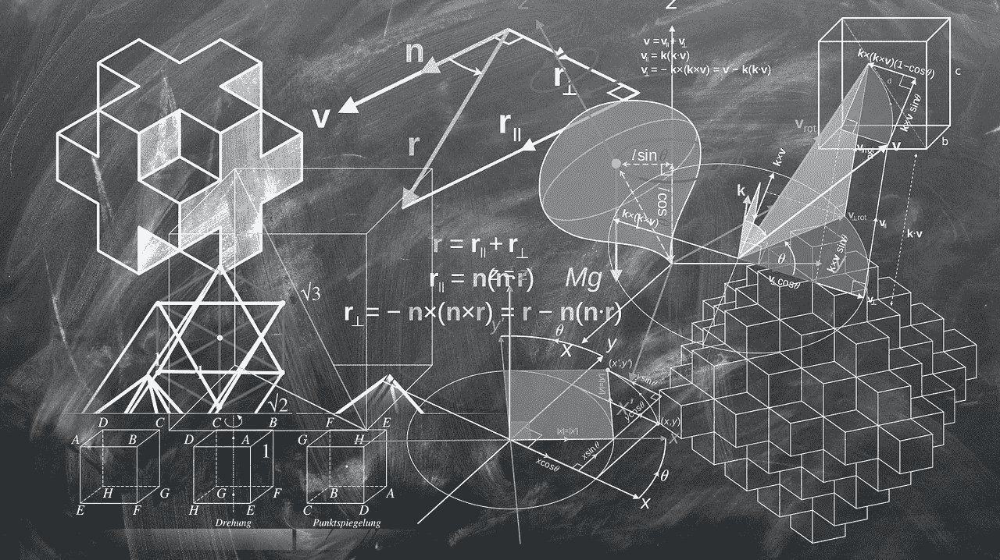

# 该不该读数据科学博士？

> 原文：<https://towardsdatascience.com/should-you-do-a-phd-in-data-science-3285f1086361?source=collection_archive---------14----------------------->

## 如何在学术界和商界之间做出选择

如果你正在考虑攻读数据科学的[博士学位，你将不得不决定是想利用你的博士学位获得一份数据科学家的工作，还是更深入地参与研究并试图解决真正复杂的理论问题。这可能是一个具有挑战性的选择。](/data-science-books-you-should-read-in-2020-358f70e1d9b2)

Should you do a PhD in Data Science

# PhD 适合你吗？

另一件事是，博士学位是否适合你。[我已经在我的另一篇文章](https://medium.com/p/should-you-do-a-phd-dfe5691fd8aa)中提到过，但是在这里总结一下:

*   确保数据科学是你的激情所在，并且你愿意在它上面花费大量的时间
*   确保你能够资助你的研究
*   保持好奇心，渴望学习新事物
*   坚持不懈，不要轻易放弃

如果你已经决定这是适合你的，但你仍然不知道到底要不要去做，这里有几个问题值得考虑:

*   你想以后留在学术界做研究吗？
*   你想去企业还是初创企业？
*   你想成为一名自由职业者、顾问还是自己创业？

取决于你选择哪一个，你将以不同的心态毕业。

在第一种情况下，你应该尽可能地专注于研究。在第二种情况下，除了研究之外，你应该考虑在学术界之外建立关系网，并开始以普通观众可以接受的形式传播你所做的事情。在第三种情况下，你需要提高你的软技能——沟通、策略、计划，以便有效地利用你的时间。

# 什么是数据科学博士？

现在谈谈博士——攻读数据科学博士学位可能意味着几件事:

1.  经济学院统计学博士
2.  应用数学系数学博士
3.  在计算机科学系获得计算机科学或机器学习博士学位

选择哪一个答案将取决于你最终想要投入多少编码时间，以及你想要得到多少实用性。

1.  选项是给那些想要实用但不怎么编码的人
2.  选项是为那些不想一定实用的人准备的
3.  option 是为那些想要实用并同时编写大量代码的人准备的

这里没有更好或更坏的选择，这完全取决于你博士毕业后想做什么。你是否想象自己每天编码 8-10 个小时？你想认识人并可视化数据吗？你想在商业决策中使用数据科学？回答这些问题让你决定。

这里的关键是选择那些与你最相关的。

# 读博后有生活

当你完成研究后，你可以期待一个全职和兼职工作的未来，或者为咨询公司做咨询，为客户做数据分析，或者在一家涉及数据分析的公司工作。

对你来说，最好的决定可能是找到一份适合你优势的工作，并用你的博士学位来帮助你实现目标，无论是获得行业内最好的数据科学工作，还是获得更多的研究经验。

祝你好运！

Should you do a PhD in Data Science — watch this video to know more.

如果你想了解更多，请阅读我关于成为数据科学家的其他文章:

*   [成为数据科学家的 5 种方法](/5-ways-to-become-a-data-scientist-8590811b0dc3?source=your_stories_page---------------------------)
*   [给数据科学家的最佳建议](https://medium.com/@pchojecki/best-tips-for-data-scientists-a52d7cace027?source=your_stories_page---------------------------)
*   [如何从数据科学开始](https://medium.com/@pchojecki/how-to-start-with-data-science-93d3ca32d7e5?source=your_stories_page---------------------------)
*   [数据科学家常犯的 3 个错误](https://medium.com/@pchojecki/3-common-mistakes-data-scientists-make-d3b3f5d1d4?source=your_stories_page---------------------------)
*   [成为数据科学家的实用指南](/practical-guide-to-become-a-data-scientist-2483a5f83770)

 [## 加入我的数据科学时事通讯

### 让我们保持联系，继续学习数据科学。](https://creative-producer-9423.ck.page/c3b56f080d) 

Data Science Job

最后，如果你想了解成为一名数据科学家意味着什么，那么看看我的书[数据科学工作:如何成为一名数据科学家](https://amzn.to/3aQVTjs)，它将指导你完成这个过程。