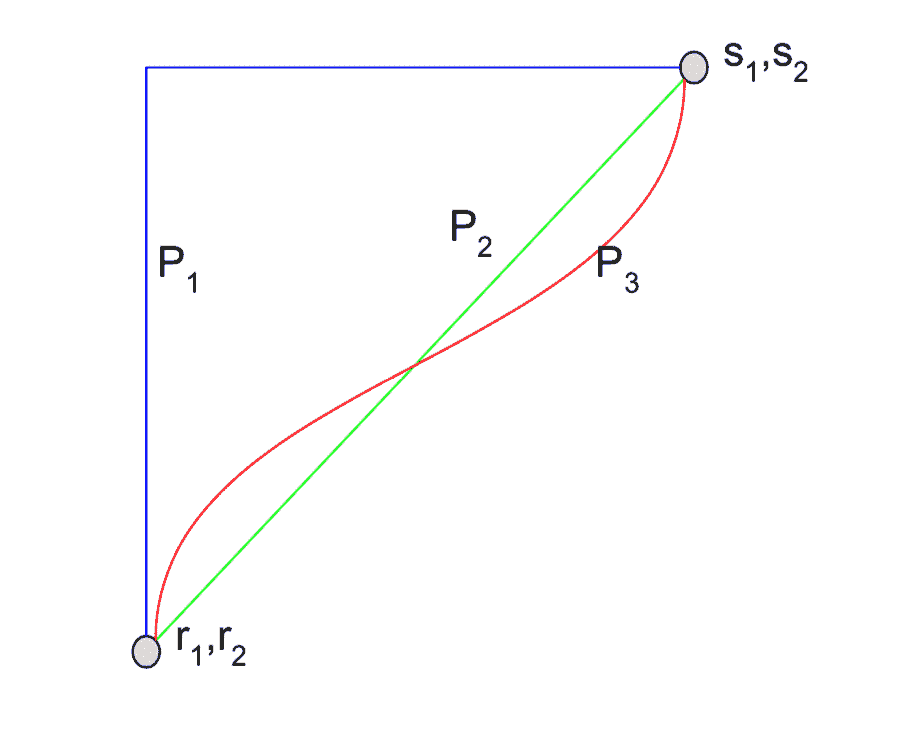

# 你应该用 SHAP 还是 IG 来解释你的预测？

> 原文：<https://towardsdatascience.com/should-you-explain-your-predictions-with-shap-or-ig-9cabe218b5cc?source=collection_archive---------15----------------------->

今天一些最准确的预测模型是黑盒模型，这意味着很难真正理解它们是如何工作的。为了解决这个问题，出现了理解**特征重要性**的技术:对于一个给定的预测，每个输入特征值对该预测有多重要？两个众所周知的技术是**沙普利加法解释(SHAP)** 和**积分梯度(IG)** 。事实上，它们各自代表了一种不同的*类型*的解释算法:基于 Shapley 值的算法(SHAP)和基于梯度的算法(IG)。

这两种算法类型之间有一个基本的区别。这篇文章描述了这种差异。首先，我们需要一些背景知识。下面，我们回顾 Shapley 值、基于 Shapley 值的方法(包括 SHAP)和基于梯度的方法(包括 IG)。最后，我们回到我们的中心问题:**什么时候应该使用基于 Shapley 值的算法(比如 SHAP)还是基于梯度的解释算法(比如 IG)？**

# 什么是沙普利价值观？

Shapley 值(Lloyd Shapley 于 1953 年提出)是一种经典的方法，将合作游戏的总收益分配给合作玩家联盟。可以证明，这是唯一一个具有某些理想属性的发行版(在维基百科上有完整的列表)。

在我们的例子中，我们为每个实例的预测制定了一个游戏。我们认为“总收益”是该实例的预测值，而“玩家”是该实例的模型特征。合作博弈是所有模型特征合作形成一个预测值。Shapley 值[效率属性](https://en.wikipedia.org/wiki/Shapley_value#Efficiency)表示特征属性的总和应该等于预测值。归因可以是负的或正的，因为特征可以降低或提高预测值。

有一种叫做 [Aumann-Shapley 值](https://en.wikipedia.org/wiki/Shapley_value#Aumann%E2%80%93Shapley_value)的变体，将 Shapley 值的定义扩展到有许多(或无限多)玩家的游戏，其中每个玩家只扮演一个次要角色，如果价值函数(包括玩家联盟的收益)是可微分的。

# 什么是基于 Shapley 值的解释方法？

基于 Shapley 值的解释方法试图通过检查在其他特征存在或不存在的所有可能组合下移除特征的影响来近似给定预测的 Shapley 值。换句话说，该方法查看像 F(x1， *<不存在>* ，x3，x4，…， *<不存在>，* …)这样的特征子集上的函数值。如何评价一个缺少一个或多个特征的函数 F 是很微妙的。

例如，(SHapely Additive exPlanations)通过对从训练集中提取的那些特征的样本进行平均，来估计模型在缺少某些特征的输入上的行为。换句话说，F(x1，<缺项>，x3，…，xn)是从数据集中对缺失特征 x2 进行采样时，通过期望预测来估计的。

具体如何选择样本是很重要的(例如背景数据的边际分布对条件分布对聚类中心)，但我将在这里跳过细节。

一旦我们为特征的所有子集定义了模型函数(F ),我们就可以应用 Shapley 值算法来计算特征属性。每个要素的 Shapley 值是该要素对其他要素的所有可能子集的贡献。

SHAP 论文中的“核 SHAP”方法通过定义加权最小二乘回归同时计算所有要素的 Shapley 值，该回归的解是所有要素的 Shapley 值。

**最重要的一点是，所有这些方法都依赖于特征子集。这使得理论版本在运行时呈指数增长:对于 n 个特征，存在存在和不存在的 2^N 组合。这对大多数 N 来说太昂贵了，所以这些方法是近似的。即使有近似值，内核 SHAP 也可能很慢。此外，我们不知道任何系统的研究有多好的近似。**

有专门针对不同模型架构的 SHAP 版本，以提高速度。例如，[树 SHAP](https://arxiv.org/abs/1802.03888) 通过巧妙地跟踪所有可能子集流入树的每一片叶子的比例来计算所有子集。但是，如果您的模型架构没有类似这样的专门算法，您就不得不依靠内核 SHAP，或者另一种简单的(未优化的)基于 Shapley 值的方法。

基于 Shapley 值的方法是有吸引力的，因为它只需要对模型的黑盒访问(即从输入计算输出)，并且模型架构的版本是不可知的。例如，模型函数是离散的还是连续的并不重要。缺点是精确计算子集在特征数量上是指数级的。

# 什么是基于梯度的解释方法？

基于梯度的解释方法试图通过使用输出相对于输入要素的[梯度](https://en.wikipedia.org/wiki/Gradient)(即变化)来解释给定的预测。一些方法，如集成梯度(IG)，GradCAM 和 SmoothGrad，实际上应用梯度算子。其他方法如深度提升和 LRP 应用“离散梯度”

*Figure 1 from* [*the IG paper*](https://arxiv.org/abs/1703.01365)*, showing three paths between a baseline (r*1 *, r*2*) and an input (s*1*, s*2*). Path P*2*, used by Integrated Gradients, simultaneously moves all features from off to on. Path P*1 *moves along the edges, turning features on in sequence. Other paths like P*1 *along different edges correspond to different sequences. SHAP computes the expected attribution over all such edge paths like P*1*.*

让我描述一下 [IG](https://arxiv.org/abs/1703.01365) ，它的优点是试图逼近 Aumann-Shapley 值，这是公理化的。IG 通过在特征空间中考虑从手边的输入(例如，来自训练集的图像)到某个基线输入(例如，黑色图像)的直线路径，并且沿着该路径对关于输入特征(例如，图像像素)的预测的梯度进行积分来操作。

[本文](https://www.aclweb.org/anthology/P18-1176)对 IG 算法的直觉解释如下。当输入沿着基线和当前输入之间的直线路径变化时，预测沿着从不确定性到确定性(最终预测概率)的轨迹移动。在该轨迹上的每个点，可以使用相对于输入要素的梯度将预测概率的变化归因于输入要素。IG 使用路径积分沿轨迹聚集这些梯度。

IG(粗略地)要求预测是输入特征的连续和分段可微函数。(更准确地说，它要求函数处处连续，并且沿每个输入维的偏导数满足勒贝格可积条件，即不连续点集的测度为零。)

请注意，为 IG 选择一个好的基线以进行合理的特征归因是很重要的。例如，如果选择一幅黑色图像作为基线，IG 不会将重要性赋予实际图像中的全黑像素。基线值应该既具有接近零的预测，又忠实地表示完全没有信号。

IG 具有吸引力，因为它广泛适用于所有可微分模型，易于在大多数机器学习框架(例如 TensorFlow、PyTorch、Caffe)中实现，并且在计算上可扩展到具有数百万神经元的大规模深度网络，如 Inception 和 ResNet。

# 什么时候应该使用基于 Shapley 值的解释方法，而不是基于梯度的解释方法？

最后，回报！我们的建议:**如果模型函数是分段可微的，并且你可以访问模型梯度，那么使用 IG。否则，使用基于 Shapley 值的方法。**

使用梯度下降训练的任何模型都是可微分的。例如:神经网络、逻辑回归、支持向量机。这些可以用 IG。不可微模型的主要类别是树:提升树、随机森林。它们在叶子上编码离散值。这需要一个基于沙普利值的方法，比如 SHAP 树。

IG 算法比基于原始 Shapley 值的方法(如核 SHAP)更快，因为它只需要计算几个不同输入(通常为 50)的模型输出梯度。相比之下，基于 Shapley 值的方法需要对从特征值的所有可能组合的指数巨子空间中采样的大量输入计算模型输出。计算可微分模型的梯度是有效的，并且在大多数机器学习框架中得到很好的支持。然而，可微模型是 IG 的先决条件。相比之下，基于 Shapley 值的方法没有这样的假设。

看起来离散的几种类型的输入特征(因此可能需要基于 Shapley 值的方法)实际上可以映射到可微分的模型类型(这让我们使用 IG)。让我们看一个例子:文本情感。假设我们希望将情感预测归因于某些输入文本中的单词。起初，这种模型似乎是不可微的，因为输入是离散的(单词的集合)。然而，像深度神经网络这样的可微分模型可以通过首先使用[单词嵌入](https://en.wikipedia.org/wiki/Word_embedding)将单词映射到高维连续空间来处理单词。模型的预测是这些嵌入的可微分函数。这使得它易于 IG。具体来说，我们将预测得分归因于嵌入向量。由于属性是相加的，我们沿着每个嵌入向量的域对属性求和(保留符号),并将其映射到嵌入所对应的特定输入单词。

IG 的一个关键问题是:基线预测是什么？对于这个文本示例，一种选择是使用对应于空文本的嵌入向量。一些模型通过用特殊的“无单词”标记填充短句来接受固定长度的输入。在这种情况下，我们可以把基线看作是只有“无字”标记的句子的嵌入。

更多关于搞笑的信息，请看[的论文](https://arxiv.org/abs/1703.01365)或[的操作指南](https://github.com/ankurtaly/Integrated-Gradients/blob/master/howto.md)。

# 结论

在许多情况下(具有梯度的可微分模型)，您可以使用集成梯度(IG)来获得对预测的特征重要性的更确定且可能更快的解释。但是，其他(不可微)模型类型需要基于 Shapley 值的方法。

在 Fiddler，我们支持 SHAP 和 IG。(充分披露:Ankur Taly，IG 的合著者，在 [Fiddler](http://fiddler.ai) 工作，是本帖的合著者。)欢迎发送电子邮件 [info@fiddler.ai](mailto:info@fiddler.ai) 了解更多信息，或者只是打个招呼！

*原载于 2019 年 8 月 13 日*[*https://blog . fiddler . ai*](https://blog.fiddler.ai/2019/08/should-you-explain-your-predictions-with-shap-or-ig/)*。*