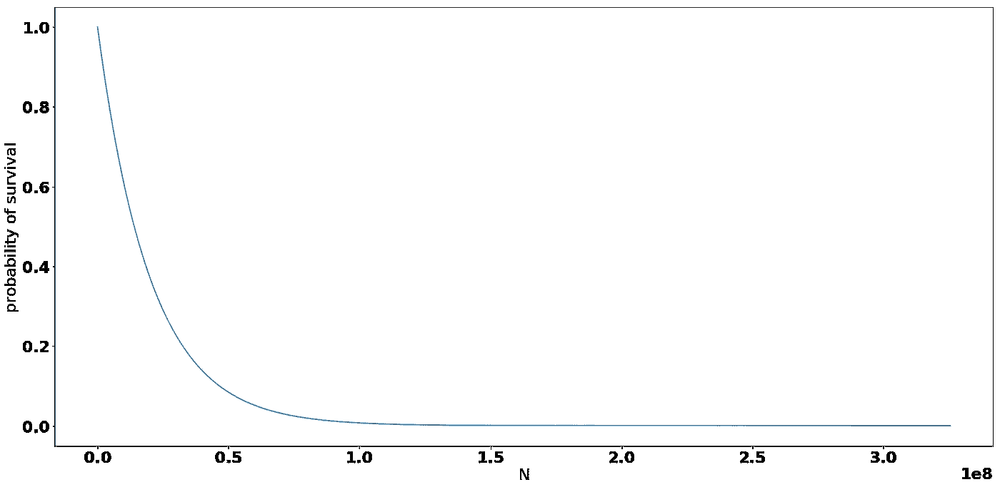

# 你应该坐飞机还是开车？

> 原文：<https://towardsdatascience.com/should-you-fly-or-should-you-drive-fd9395fd8d32?source=collection_archive---------13----------------------->

Photo by [Ross Parmly](https://unsplash.com/@rparmly?utm_source=medium&utm_medium=referral) on [Unsplash](https://unsplash.com?utm_source=medium&utm_medium=referral)

一想到飞机失事我就毛骨悚然，因为我需要定期飞回家看望家人。最近，一家埃塞俄比亚航空公司发生了一起悲惨的事故，所有乘客遇难。如果你对飞机失事的细节感兴趣，你可以在这里找到:

 [## 埃塞俄比亚航空公司坠机:我们所知的六张图表

### 在一次事故现场发现新证据后，波音公司停飞了其全球 737 Max 飞机机队

www.bbc.com](https://www.bbc.com/news/world-africa-47553174) 

如果发生了这样的事故，显然很难有人能幸免于难。我想提前警告你，这篇文章可能包含一些关于飞行的惊人数据，所以如果你容易焦虑，我建议不要阅读整篇文章。但是，也有一些关于飞行的积极的事情可以缓解紧张。

所以，最近，我从克罗地亚飞往德国。出发时天气平静晴朗，当然也伴有一些讨厌的风。在登机前，我已经开始思考埃塞俄比亚航空公司的坠机事件，这真的不是登上国际航班时的心态。我具体思考的是关于飞机死亡率的贝叶斯定理，换句话说，你死于登机还是开车的概率是多少？

Photo by [Paweł Puszkarski](https://unsplash.com/@bleffess?utm_source=medium&utm_medium=referral) on [Unsplash](https://unsplash.com?utm_source=medium&utm_medium=referral)

我想到这一点的原因是一个经典的假设，即从统计数据来看，坐飞机比开车更安全。让我告诉你，它肯定不喜欢它。你从飞机的窗户向外看，你会看到那些翅膀基本上在拍打，看起来一点也不结实——当然，一些机械工程师考虑到翅膀上的力，这是经过深思熟虑的，它们的灵活性使它们更结实，更不容易折断。因此，看起来灵活而不结实的翅膀是个好东西。我不需要陈述显而易见的事实，但我还是要陈述，我不是机械工程师。但我具备了使用谷歌的能力，而且幸运的是，我在大学里学过一些物理学。但是，尽管如此，我还是无法摆脱大脑中的偏见——健壮的东西不应该那样移动！

乘车相对来说比较平稳，大部分时间都没什么事情。另一方面，乘坐飞机有一种叫做湍流的乐趣。如果你经常坐飞机，你可能在生活中的某个时候经历过颠簸，那么你就会知道这不是一种真正的好感觉。

## 拯救统计数据

我仍然安全地躺在地上，想着贝叶斯统计中癌症测试的经典例子。我不会在这里详细解释贝叶斯统计，但简而言之，它处理的是条件概率，即在其他事情已经发生的情况下，某件事情发生的概率是多少。癌症测试示例之所以如此有趣，是因为基于测试的置信度，您患癌症的概率会显著下降，您可以在此处找到关于癌症示例的贝叶斯统计的更详细解释:

 [## 贝叶斯定理的直观(简短)解释

### 贝叶斯定理是一篇详细文章的主题。这篇文章很好，但是超过 15，000 字——这是…

betterexplained.com](https://betterexplained.com/articles/an-intuitive-and-short-explanation-of-bayes-theorem/) 

我具体感兴趣的是我死于坐飞机的概率和死于开车的概率(请原谅我听起来有点可怕):

幸运的是，当我经历人生中最大的动荡之一时，我正在思考这个问题，感谢达尔马提亚的 Bora(亚得里亚海上的强劲北风)。为了解决这个问题，我查阅了一些关于飞机和汽车碰撞和死亡的统计数据，我不允许使用图表，但我会通过链接分享相关的统计数据。

为了让它变得简单一点，因为这是一个快速的思维练习，而不是对飞行和驾驶的完整风险评估，我决定只看 2018 年的统计数据。

所以，首先是 2018 年发生的全球飞机死亡人数，统计数据如下:

 [## 2018 年全球空中交通死亡事故|统计

### 该图描绘了从 2006 年到 2018 年的全球空中交通死亡人数。2018 年，561 人死于空难…

www.statista.com](https://www.statista.com/statistics/263443/worldwide-air-traffic-fatalities/) 

由于我们着眼于 2018 年，死亡人数为 561 人。从积极的方面来说，我希望你记住以下几点:

> 死亡率，即死亡人数除以飞行次数，正在下降

我怎么知道这个？这是每年飞行次数的统计数据:

 [## 全球航空业-2019 年航班数量|统计

### 该统计数据给出了从 2004 年到 2019 年航空业在全球范围内执行的航班数量。乘客…

www.statista.com](https://www.statista.com/statistics/564769/airline-industry-number-of-flights/) 

请注意，一年中的航班数量在稳步增长。与之前的死亡人数图表相比，我们不能说每年的死亡人数在稳步下降。但是，由于每年的飞行次数在增加，死亡率实际上在下降。死亡人数的波动性是可以理解的，因为飞机坠毁是一个罕见的事件。

更积极的一点是:

> 并非所有的飞机失事都会导致死亡

2018 年，我们发现航班数量约为 3980 万次。我认为一个安全的假设是平均航班载有 300 名乘客(这当然不准确，但使事情更容易计算，可能与事实相差不远)。所有这些航班的乘客人数如下:

那么，你乘坐 1 次航班成为伤亡人员的概率有多大？嗯，粗略估计是这样的:

很小不是吗？不要抱太大希望。让我们根据以下来源来看一下乘车次数:

 [## 道路安全事实-安全国际道路旅行协会

### 查看世卫组织关于道路安全事实的信息图表。平均每年有近 125 万人死于车祸…

www.asirt.org](https://www.asirt.org/safe-travel/road-safety-facts/) 

每年大约有 125 万人死于车祸，这是一笔不小的数目……另一项统计显示，当今世界上有 12 亿辆汽车行驶在路上……12 亿辆！另一方面，想象一下由此造成的污染。这本身就值得进行统计分析。同样，为了简化数学，让我们假设每节车厢平均有 2 名乘客。此外，让我们假设平均来说，一辆汽车每天使用两次，因为大多数人都用它上下班。这是一个很强的假设，可能是错误的，我会假设平均值低于 2，因为许多人只有在长途旅行时才开车。不管怎样，我们要找的数字是一年内参加汽车旅行的人数:

现在我们可以推导出你在一次汽车事故中伤亡的概率:

这与航班相比如何？嗯，你可以注意到它有点低，你死于车祸的可能性大约是死于飞机失事的 16 倍。当你只听到这个数字而没有其他任何东西时，16 次听起来相当可怕。根据乘客的正确期望值，该比率可能会有很大变化。如果预期的乘客数量高于 2，那么该比率也变得更低。具体而言，如果预期乘客数量为 4，则该比率变为 8。但是不管这个比例，你应该看到的是**和**的概率都很低，没有理由害怕飞机或汽车。

当然，你使用汽车越多，发生悲惨事故的可能性就越大。不用说，这种可能性还取决于其他因素，如你开车的地点、你的驾驶经验、旅程的长度和汽车本身的质量。然而，让我们陈述另一个有趣的问题。根据概率，你需要坐多少次汽车或飞机才能使你死亡的概率收敛到 1？我们可以把这看作是幸存的概率收敛到 0。这种情况只会在无数次尝试后才会发生，但是让我们考虑一下这种情况，根据统计数据，你存活的概率是 1%，这是非常渺茫的存活机会。

所以，你需要做 960 万次汽车旅行才能让你的生存几率降到 1%。对于飞机来说，这种计算看起来如何？重复同样的过程，你会得出这样的结论:

你需要乘飞机旅行超过 9300 万次，才能让你的存活率下降到 1%。事实上，存活率是 N 的函数(基于上面的统计):

存活概率下降需要相当多的尝试，事实上，对于 N=1000 000，存活概率仍然超过 95%！这是一种安慰。你知道你什么时候会做一百万次飞机旅行吗？**从不**。如果您每天乘坐 1 次航班，您将会:

所以，如果你活到了 100 岁以上，你将需要大约 27 辈子的时间才能使你有 95%的生存概率。这很让人放心，我现在对飞机的感觉好多了…

只是不要太早乐观，我总是提醒自己墨菲定律:

> 任何可能发生的事情都会发生

显然，飞机和汽车相撞有时会发生，但我们可以肯定它们是极不可能的。如果你想知道更多关于极不可能事件的影响，我建议你读一读纳西姆·塔勒布的《黑天鹅》，这是一本非常有趣的书:

 [## 《黑天鹅》:第二版:《极不可能的事情的影响》;增加了一个新的章节:“关于…

### 黑天鹅是一个事件，积极的或消极的，被认为是不可能的，但造成巨大的后果。在这个…

amzn.to](https://amzn.to/2YatE9c) 

总而言之，基于我在这篇文章中写下的这些非常规定的统计数据，你应该对使用汽车或飞机旅行感到安全。但别忘了，这全是随机和运气。