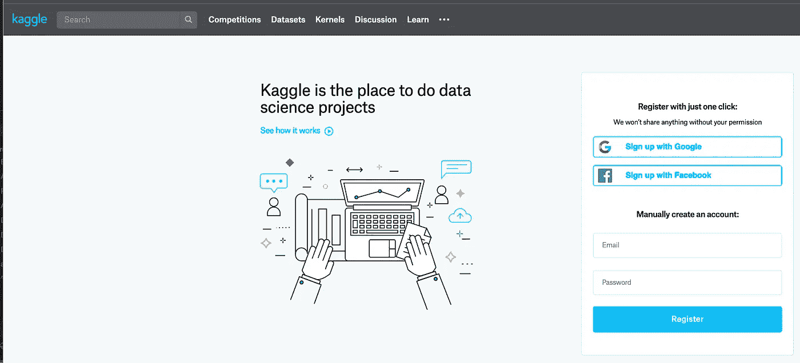
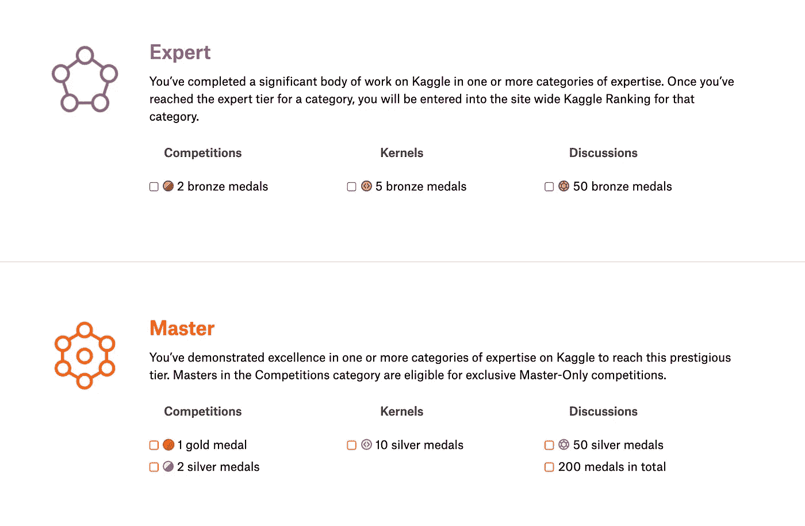
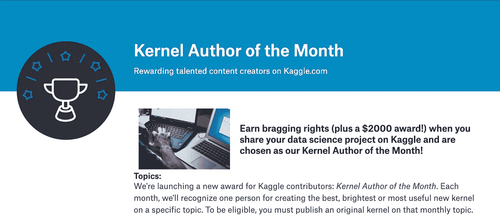
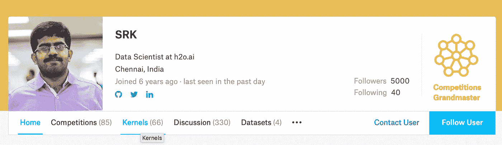

# 使用 Kaggle 内核展示您的数据科学技能

> 原文：<https://towardsdatascience.com/show-off-your-data-science-skills-with-kaggle-kernels-762403618c5?source=collection_archive---------12----------------------->

数据科学是每个大学毕业生都想进入的少数领域之一。这主要是由这个领域过去受到的大肆宣传推动的——从 HBR 的“[数据科学家:21 世纪最性感的工作](https://hbr.org/2012/10/data-scientist-the-sexiest-job-of-the-21st-century)”文章到最近的开发人员调查，这些调查将[数据科学家列为薪酬最高的角色之一](https://insights.stackoverflow.com/survey/2018/#work-salary-by-developer-type)。借助这种宣传，培训机构、教育机构和训练营开始引入商业分析/机器学习/数据科学/人工智能课程，许多在职专业人士和应届毕业生都参加了这些课程，希望这些课程能让他们在数据科学领域找到工作。但是几乎没有！

## 投资组合

因为，[任何一个理智的招聘人员](/how-to-flaunt-your-passion-for-analytics-in-data-science-job-interviews-2cb432cc3d3d)几乎都不会在意自己所学课程的名称，实际上重点是“**作品集**”——你所做/制作的展示你对数据/数字热情的东西。它可以是任何东西，从*公共数据的可视化*到*你的项目的 Github 代码和一个阅读良好的文档*。

> “如果你不生产，你就不会繁荣——不管你有多熟练或多有才华。”—加州新港

## 框架

在我们深入探讨之前，我想先为一个引人注目的投资组合设定一个框架。您想要建立的投资组合应该能够为您做以下事情:

*   **可在谷歌上找到更多信息(搜索)**
*   **创建品牌**
*   **允许建立粉丝群/观众群**
*   这是你可以向潜在雇主提供的评估你专业技能的东西。
*   **最终，在你希望进一步发展的领域获得良好声誉**

## 重点是——ka ggle 内核

在这篇文章中，我试图说明一个人如何用 Kaggle 内核展示他们的数据科学技能——在那里你可以建立你的投资组合——这可以是带有讲故事功能的[可视化](https://www.kaggle.com/nulldata/hacker-women-in-tech-hackerrank-analysis)或[最先进的神经网络实现](https://www.kaggle.com/hortonhearsafoo/fast-ai-lesson-1)。

## Kaggle 神话-竞赛赛道

名字 *Kaggle* 在数据科学社区引起了高度共鸣，是计算机科学社区中一个有竞争力的机器学习平台——很像 topcoder / hackerrank。正因为如此，许多初学者害怕进入 Kaggle 的世界，天真地认为 Kaggle 是专业人士的天地。他们中的大多数人(*在某个时候包括我*)忘记的是，那些专业人士(在 Kaggle 排名中是大师或大师)在加入 Kaggle 时也曾是初学者。此外，*竞赛*不仅仅是 Kaggle 的全部。竞赛只是 Kaggle 上可用的曲目之一。内核是 Kaggle 上另一个非常强大的轨道。Kaggle 内核是非常好的学习资源，也是非常好的分享资源——因此，让它成为你的数据科学投资组合。

## Kaggle 内核的优势——作为您的投资组合

*   Kaggle 内核由谷歌索引，这意味着，如果有人在这个星球上寻找与你的内核相关的东西，它将作为谷歌搜索结果显示出来

*   **Kaggle 内核——投票/奖牌**贡献内核级数系统和排名。也就是说，只要专注于 Kaggle 内核，你就可以完全远离竞赛，仍然是专家/大师/特级大师

*   **奖项/名声/金钱** —无论何时，只要你在拥有全球观众的平台上赢得了什么，你就获得了全球知名度。对 Kaggle 来说也是如此。Kaggle 经常举办基于内核的竞赛，并提供现金奖励或 Kaggle 奖品。最新的是本月的**内核作者，并有现金奖励(高达 2000 美元)!**

*   **观众/粉丝群** — Kaggle 个人资料带有关注者/跟随选项。这意味着，任何对你的工作感兴趣的 Kaggler 也可以在 Kaggle 上关注你。它还可以让你添加其他专业资料，比如 Linkedin、Github，人们可以在 Kaggle 之外进一步关注你。

*   **Kaggle 知名** — Kaggle 在熟悉数据科学/分析/机器学习的理智的招聘人员中非常知名。这意味着，在你的简历中添加一个足够体面的 Kaggle 个人资料链接将会给你带来很多额外的优势，并且你正在利用 Kaggle 在数据科学市场中为其建立的声誉。

## 结论

虽然拥有多样化的投资组合是明智的——比如博客帖子、Github 代码、幻灯片演示。对于那些无法管理多元化投资组合的人来说，Kaggle Kernels 平台是一个强大的替代选择。虽然符合我们上面讨论的投资组合框架，Kaggle 内核也可以在数据科学社区中留下您的名字。

因此，你可以简单地用 Kaggle 内核展示你的数据科学技能，这最终会帮助你找到工作。

如果你同意/不同意我的观点，请在评论中告诉我你的想法！

## 参考

*   卡格尔内核—【https://www.kaggle.com/kernels 
*   本月 Kaggle 内核作者——【https://www.kaggle.com/page/kernel-author-of-the-month 
*   https://www.kaggle.com/sudalairajkumar/ SRK 简介—
*   [https://towards data science . com/announcing-fast-ai-part-1-now-available-as-ka ggle-kernels-8 ef 4c a3 b 9 ce 6](/announcing-fast-ai-part-1-now-available-as-kaggle-kernels-8ef4ca3b9ce6)