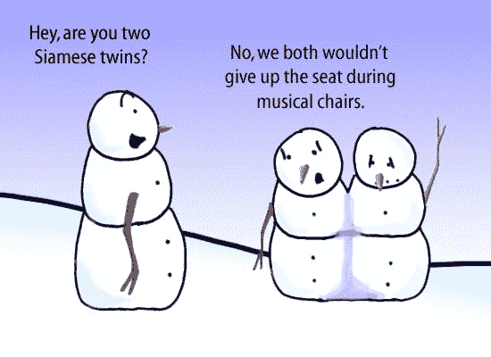
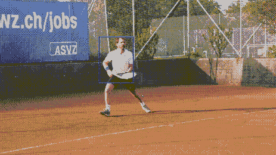
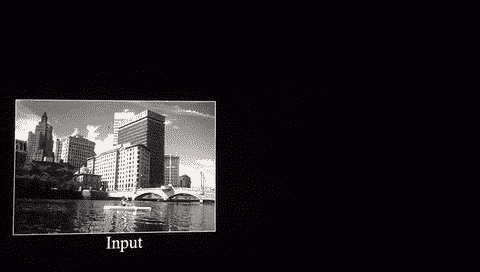
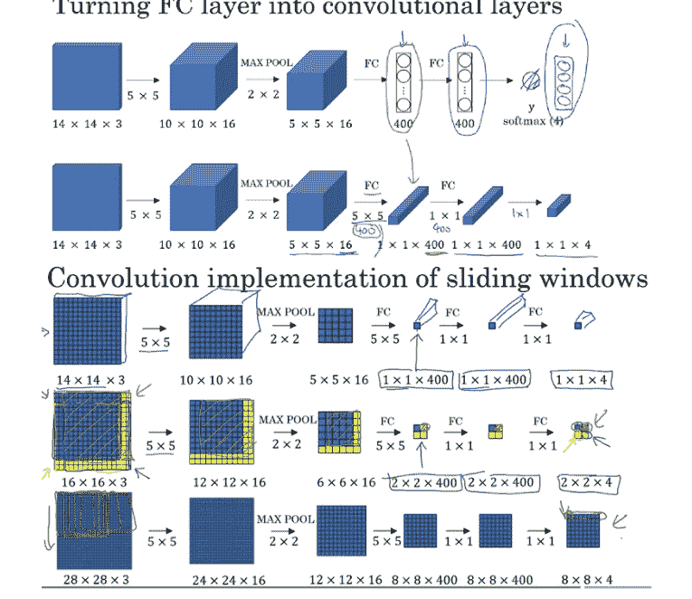
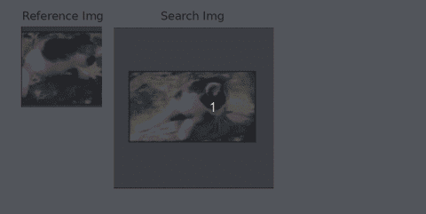

# 暹罗梦

> 原文：<https://towardsdatascience.com/siamese-dream-bf1953c01e17?source=collection_archive---------26----------------------->

## 用连体神经网络跟踪的初学者指南

你坐在你的沙发上，狗在你的脚边，一只手完全沉浸在一袋白切达奶酪智能食品中。网飞在电视上，你刚刚通过 IMDB 评分 6.4/10 的第 48 分钟，惊悚监视。你看着主角试图躲避警察的监视。他们仔细研究了无休止的闭路电视监控录像，跟踪了对手的每一个动作，却没有触动任何一个按钮。你不禁会想。他们不会真的这么做吧？这个问题的答案是肯定的，他们可以。这个例子描述了在计算机视觉的流行科学学科的研究中的许多可能的应用之一。这是一个不断发展的研究领域，已经出现了大量的用例以及有前途的算法。这种算法包括暹罗神经网络，可以实现这些在电视上看到的结果。


现在，让这成为一个警告，这篇文章不会让你一夜成名，你可能不会像这个网站上的其他文章一样，拿出一个功能齐全的原型。你将会了解这些网络是什么，以及它们如何达到这样的结果。

假定是卷积神经网络及其背后的数学的基本知识。如果您没有，我建议您保存此选项卡，观看此视频，然后再回来。

[了解卷积网络](https://www.youtube.com/watch?v=YRhxdVk_sIs)



# 暹罗概述

让我们考虑我们的最终目标是拍摄一段视频，选择一个目标，并在整个过程中跟踪它。现在让我们从兔子洞往下看，把它抽象出来。首先让我们想一想视频到底是什么。从根本上说，它只是一系列快速连续显示的照片或图像。因此，我们所要做的就是在视频的每一帧中找到一个目标，并在它周围画一个方框。这听起来和每个人最喜欢的儿童读物*“沃尔多在哪里”*出奇的相似。


用我们的眼睛，也许用我们的手指，从左到右扫描页面，看每一张脸，每一件衬衫或每一个特征，看看它是否与我们的老朋友沃尔多相匹配。甚至可能在他周围画一个圈，只是为了破坏其他可能想尝试的人的游戏。我们想训练一种算法来做到这一点。找到我们的目标，并在它周围画一个方框。



不幸的是，我们知道我们的网络记性不好。我们必须不断提醒它目标图像(瓦尔多)是什么样子的。为此，我们需要两个网络。一个处理我们的沃尔多图像，另一个处理我们要找的他的整个图像。这就是暹罗的用武之地。就像连体双胞胎一样。我们构建两个相同的全卷积网络*(我们稍后将讨论全卷积网络*)。twins 的工作是处理我们的两个图像(目标和搜索图像)并在两个独立的特征地图中表示不同的特征。它们是相互关联的，因为它们在完全相同的时间执行相同的工作，但是它们的输入是不同的。



它们需要相同的原因是为了以完全相同的方式表示两幅图像共有的特征。这对于比较我们是否拥有真正的瓦尔多至关重要。如果我们比较像他的衬衫这样的特征。我们必须确保我们有共同的属性(大小，颜色，图案)。保持这种状态的唯一方法是通过一个相同的网络来移动它们。

基本的想法是，如果我们可以将目标图像(Waldo)的表示放在搜索图像(场景)的上面。我们可以找到共享最多的特征在哪里，这将是我们的目标图像(Waldo)在图像中的位置。我们在它周围画一个方框，并对所有图像重复，直到视频结束！拍拍自己的背，你刚刚学会了这是如何工作的绝对基础。如果你为了考试或者为了给你的朋友留下深刻印象而学习这个，这可能是一个停止阅读的好地方。如果你正在寻找本质的细节，请继续关注。

为什么这是一种实时跟踪视频的有效方法的关键是我们需要理解的三个概念。这些是迁移学习、完全卷积网络和相关滤波器。我们已经知道什么是卷积神经网络，所以让我们看看什么使一个完全卷积。

# 全卷积网络

全卷积表示神经网络由卷积层组成，在网络末端没有任何全连接层。



在完全卷积实现中，网络在任何地方都在学习过滤器(特征图)。包括最终决策层。在全连接层中，每个神经元都连接到前一层中的每个神经元。每个连接都有它自己的重量。在卷积层中，每个神经元仅连接到前一层中的几个附近的局部神经元，并且对每个神经元使用相同的一组权重。

## 我们为什么要这么做？

***输入图像大小:*** 如果你的网络中没有任何完全连通的层，你可以将网络应用于几乎任何大小的图像。因为只有完全连接的层需要特定大小的输入。这就是为什么在像 [AlexNet](https://medium.com/@smallfishbigsea/a-walk-through-of-alexnet-6cbd137a5637) 这样的架构中，你必须提供一定大小的输入图像。由于大多数视频和图像都有不同的大小，这使得我们可以轻松地进行调整，以满足弹性处理所需的规范。在这种情况下，使用全卷积网络会使我们的实现更加鲁棒。

***计算成本和速度*** :卷积层和全连接层在计算和存储方面也有区别。由于完全连接的性质，它会消耗更多的计算。另一方面，如上所述，全卷积网络具有较少的集中在“本地”的连接。这对于查看图像来说是完美的，其中根据需要，特征是局部的(例如，“Waldo 的红白衬衫”由一组附近的像素组成，而不是遍布整个图像)。连接数越少，全卷积网络的速度越快，由于我们是实时操作，这对于效率至关重要。

# 迁移学习

当网络不是从零开始学习(调整权重和连接)时，通常使用迁移学习。相反，它使用预先训练的知识，并建立在此基础上。我能想到的一个例子是一名机械师，他可能在大众汽车经销店修理汽车工作了多年。也许他找到了一份修理校车的新工作。他已经知道如何修理汽车，也知道修理汽车的复杂性。虽然他需要专门化他的技能并学习更多的知识来将这些知识转移到一种新型的车辆上。迁移学习在同样的前提下起作用。在我们的例子中，第一对层是经过预训练的，并且承载着一个非常成功的大型网络的重量。这将给出如上所述的图像的一般表示。剩余的层在大型数据集上进行训练，例如具有预定义边界框和目标的[戈特-10K](http://got-10k.aitestunion.com/) 。由网络误差表示的功能损失(预测位置与地面真实值的比较)

```
Why do we want to do this? -It speeds up network and training!
```

# 相关过滤器

好了，我们现在真的开始把这些碎片拼在一起了。让我们回想一下沃尔多在哪里的类比。我们目前有一个我们在 Waldo 寻找的产品展示(眼镜、衬衫、帽子等。).我们所要做的就是将它与我们的搜索图像特征进行比较，看看我们是否能够将它们匹配起来！如果你做了功课，你应该记得卷积神经网络创建特征图的操作。它如何接受滤波器并执行矩阵数学运算，像滑动窗口一样在整个图像上移动。这产生了具有突出特征的新图像。在寻找我们的目标时，我们几乎要做同样的事情。我们将使用搜索图像的特征图，而不是使用一般的学习过滤器。将它逐块传递到图像上，我们对图像进行卷积。我们接收到的输出代表了逐块的相似性，匹配程度越高的区域得分越高。我们搜索图像中相似度最高的区域就是瓦尔多所在的地方。我们现在要做的就是在他周围画一个方框，然后重复。我知道你在想什么，这听起来像是实时发生的许多事情。谢天谢地，数学拯救了我们。我们能够实时进行这些操作的原因是因为它发生在更广阔的领域。我们真的不需要现在就弄清楚为什么会这样。只要知道它允许你的机器同时计算所有这些滑动窗口的操作，通过你的 GPU 的多个核心并行。这使得我们几乎可以在瞬间观察到结果。



# 未来

类似于我们的 Waldo 在哪里的例子，我们当前实现的问题是我们背景的相似性和遮挡导致了一个问题。我认为在这个领域继续研究是值得的。应用程序是丰富和非常重要的。自动驾驶汽车、机器人、智能跟踪，甚至基于视频跟踪的习得行为，都是特定研究的潜在领域。我强烈推荐 Luca Bertinetto 等人的论文 siamFC:提供了对该领域的一个很好的监督以及一个预训练演示。它是在 Tensorflow 中实现的，允许你在自己的视频上尝试。Github 回购的链接就在这里！如需进一步阅读和更复杂的方法，请查看 [siamRPN](https://github.com/foolwood/DaSiamRPN) 和 [siamMask](https://github.com/foolwood/SiamMask) 。

*最初发表于*[*【http://github.com】*](https://gist.github.com/b940d22e903d0f5daaa7908357d23d7b)*。*