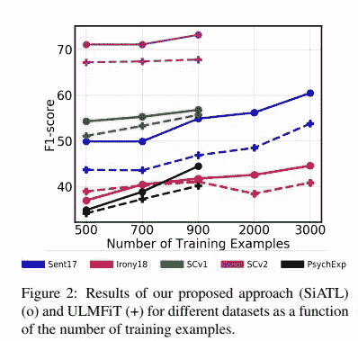

# SiATL 是最新最简单的迁移学习方法

> 原文：<https://towardsdatascience.com/siatl-is-the-newest-latest-and-simplest-transfer-learning-approach-2ca5decf224a?source=collection_archive---------25----------------------->

Photo by Allure Graphic Design

这份研究总结只是人工智能学者时事通讯上每周发布的许多研究总结之一。要开始接收每周简讯，[请在此](http://eepurl.com/ghCeNn)注册。

许多传统的迁移学习方法利用已经变得非常流行的预训练语言模型(LMs ),并且具有翻译上下文信息的能力，高级建模语法和语义语言特征在许多任务中产生高端结果，例如对象识别、机器翻译、文本分类等等。

然而，现有的 LMs 面临着缺点，包括高计算成本和对特定任务架构的需求。此外，大多数需要预先培训和微调手头的任务。现在情况不同了，因为研究人员最近发布了一种新的单步迁移学习方法，不需要预先训练或微调。此外，新方法在所有任务中都优于包括 ULMFiT 在内的最先进的迁移学习方法。

**单步辅助损失转移学习(SiATL)**

SiATL 是一种简单而有效的迁移学习方法，可以解决灾难性遗忘的问题。SiATL 将特定于任务的函数与在训练过程中调整的辅助 LM 损失相结合，并且基于预先训练 LM 并将其权重重新分配给分类器。这使它能够保持语言模型捕捉到的语言规则，同时促进解决任务的充分适应。

正如在简介中提到的，SiATL 不需要预先培训或微调，这使得它的使用非常简单。新模型已经在各种具有挑战性的文本分类任务上进行了测试，并产生了具有竞争力的结果，表明其优于传统的迁移学习方法。

**潜在用途和效果**

你已经知道了，模特训练不一定要从零开始，也不一定要野。SiATL 可用于驾驭为一项任务训练的模型，并以直接的方式将其应用于另一个领域。在数据不足的情况下，它也能派上用场。

对于数据科学家和开发人员来说，SiATL 提供了一种简单、廉价和实用的方法，通过迁移学习功能来加速模型训练，以增强各种应用的性能，如语音识别、智能视频分析、问答系统、医疗成像等。

感谢阅读。请评论，分享，别忘了订阅！另外，在推特和 T2【LinkedIn】上关注我。干杯！