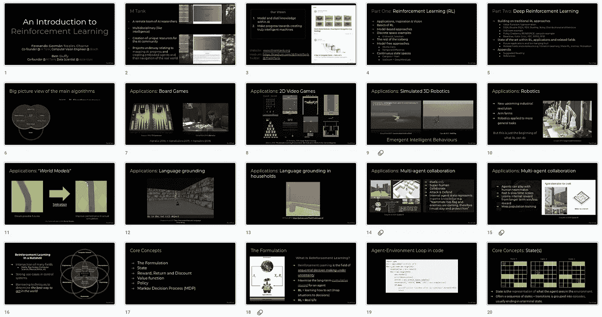
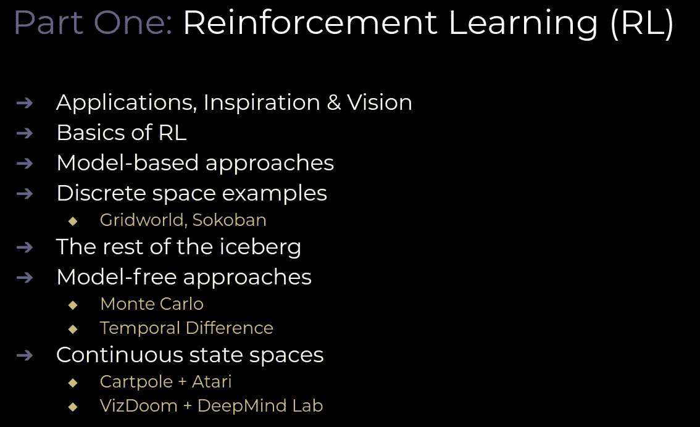
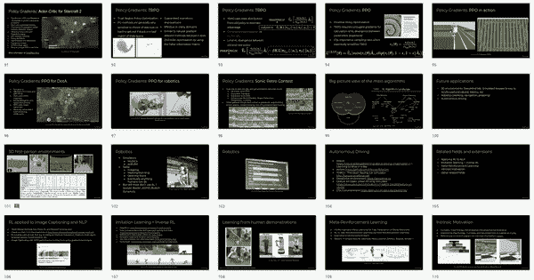

# 强化学习中的从零到 SOTA

> 原文：<https://towardsdatascience.com/side-notes-from-zero-to-sota-in-reinforcement-learning-853034e2f794?source=collection_archive---------18----------------------->

旁注:为初学者和专业人士发布 4 小时强化学习课程

除了我们的连载博客，****&**[**杯到觉悟**](/from-cups-to-consciousness-part-1-how-are-cups-related-to-intelligence-8b7c701fa197)’之外，我们还会偶尔发布一些&材料作为单机版或者短期系列。说到题外话，与我们的其他出版物相比，这些材料的性质有些模糊，我们选择称之为“**旁注**”。**

> ****旁注**就这样。与 [MTank](http://www.themtank.org) & AI 相关的附属作品，我们认为我们的读者可能会喜欢。格式会有所不同，但可能包含所有内容。把它想成是对额外项目、会谈&想法的总括。**

**也就是说，在过去一年左右的时间里，我们花了相当多的时间阅读、回归和提炼我们最喜欢的领域:**强化学习(RL)** 。对于那些对作为人工智能分支的 RL 感兴趣的人来说，我们正在开源我们去年建立的 RL 课程，作为对工程师&研究人员的介绍。**

****什么是强化学习？****

**强化学习是近年来最有前途的技术之一；使视频和棋盘游戏取得巨大进步，并提供解决一般顺序决策问题的框架，为更智能的机器铺平道路。我们已经对这个领域着迷了一段时间，并慢慢开始研究网上的核心材料和论文。**

> **虽然我们觉得有很多可用的资料，但我个人推荐理查德·萨顿的书([链接](http://www.incompleteideas.net/book/the-book-2nd.html))和大卫·西尔弗的 UCL RL 课程([链接](http://www0.cs.ucl.ac.uk/staff/d.silver/web/Teaching.html)),一般来说，这些资料都是零散的，或者过于入门，或者过于高深。最终，尽管看了看，我们没有找到适合对这个领域感兴趣的人的好的 10 小时以下的入门读物。所以我们造了一个。**

**我们做的东西**

> **我们创建了两部分的强化学习课程:强化学习入门和深度强化学习入门。第一个处理 RL 的一些理论基础――政策、奖励、等式，所有这些好东西。后者迅速将读者带入一些最先进的(SOTA)方法，这些方法在人工智能公司用他们的智能 RL 代理摧毁人类游戏玩家时不断出现在媒体上。**

**[**链接到幻灯片**](https://docs.google.com/presentation/d/1d3bxKoUn464ae_WQ2FFiFjmJPlWJI1GOydaDUAqVpJk/)**

****

**Tile-based view of the first 20 slides out of 125\. There are too many GIFs inside so initial loading of the slides can take some time. This is a price worth paying for awesome GIFs.**

****课程在哪里出现/我们为谁制作****

**该课程最初是为 Fernando 于 2018 年在博世内部举办的 4 小时 RL 研讨会组装的。我们也计划在今年夏天发布一个更新版本。此外，他还在 2 月份的 StuttgartAI meetup 上展示了该课程的节略版。**

**Ben 在开放数据科学大会(ODSC)上做了一个小时的演讲 **[** [**链接到站点**](https://odsc.com/)**】**涵盖了第一部分和第二部分的一些内容。演讲的视频可以从他们的网站获得:[**https://learnai . odsc . com/courses/introduction-to-reinforcement-learning**](https://learnai.odsc.com/courses/introduction-to-reinforcement-learning)及以下网址:**

> **这个课程是为完全初学 RL 的人、**和想“赶上”RL 和子领域的一些最新技术的人**而设计的。我们之所以这样做，是因为我们认为在 RL 上缺乏全面、简洁的材料资源，这些资源优先考虑真实世界的研究实例以及现代方法。**

**坦率地说，我们是为自己建造的。但是在这样做的时候，我们创造了一些对其他人也有价值的东西。这些幻灯片尚未定稿，将随着时间的推移和技术的变化不断更新。但希望其他人也能从这项工作中获得价值。**

****故障一目了然****

****

****第一部分**涵盖了 RL 的基础知识、核心概念和基本原理。RL 背后的主要应用、灵感和愿景。冰山的其他部分包括“信用分配”问题，勘探与开发。在算法方面，我们涵盖了:**蒙特卡罗与时间差异，加上动态规划(策略和值迭代)**。**

**一旦读者理解了第一部分，第二部分在概念上应该相当简单，因为我们只是建立在第一部分的主要概念上。正如下面可以看到的，我们在 RL 中添加了大量使用深度学习的最新方法。这些方法可以大致分为**政策梯度方法和基于深度 Q 学习的方法**。学习愉快！**

****

****收尾****

**我们希望我们的一些读者，或者未来的读者，会发现这个关于**强化学习**的闪电战课程很有价值，点击[链接](https://docs.google.com/presentation/d/1d3bxKoUn464ae_WQ2FFiFjmJPlWJI1GOydaDUAqVpJk/)。如果你知道，或者知道谁知道，那就把它传下去。此外，我们计划不断改变，完善和更新这些材料。因此，不要羞于发表评论，或者给[**info@themtank.com**](mailto:info@themtank.com)发电子邮件，帮助我们做得更好！**

**如果您有任何问题，需要参考，或希望我们澄清。您知道在哪里可以找到我们，随时乐意为您提供帮助！**

****

**We promised many GIFs**