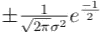
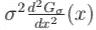
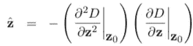

# 尺度不变特征变换

> 原文：<https://towardsdatascience.com/sift-scale-invariant-feature-transform-c7233dc60f37?source=collection_archive---------0----------------------->

## 在本文中，我将详细解释 SIFT 算法及其数学原理。

我希望你读完之后会明白这些🤔：

1.  筛选的主要步骤
2.  为什么我们需要将对数乘以σ来获得比例不变性
3.  使用 DoG 接近日志
4.  为什么我们使用 Hessian 来拒绝一些位于边缘的特征。

SIFT 是由大卫·g·洛在他的 T2 论文中提出的。(这篇论文很好理解，推荐大家看一看)。

一般来说，SIFT 算法可以分解为四个步骤:

1.  特征点(也称为关键点)检测
2.  特征点定位
3.  方向分配
4.  特征描述符生成。

而本文也将遵循这些步骤。

# 特征点检测

顾名思义，SIFT 具有 ***尺度不变性*** 的性质，这使得它比 [Harris](https://en.wikipedia.org/wiki/Harris_Corner_Detector) 更好。Harris 不是比例不变的，如果比例改变，一个 ***角*** 可能会变成一个 ***边*** ，如下图所示。

Harris is not scale-invariant

那么什么是尺度，尺度不变性是什么意思？托尼·林德伯格的论文给出了一个很好的解释:

> *世界上物体的一个固有属性是，它们只在一定的尺度范围内作为有意义的实体存在。一个简单的例子是树枝的概念，它只有在几厘米到几米的范围内才有意义。在纳米或千米级别讨论树的概念是没有意义的。在这些尺度上，谈论形成树叶的分子，或者树木生长的森林，更有意义。同样，只有在一定范围的粗尺度上谈论一朵云才有意义。在更精细的尺度上，更适合考虑单个的液滴，而液滴又由水分子组成，水分子由原子组成，原子由质子和电子等组成。*

图像标志的比例是其在图像中的(粗略)直径。它用σ表示，σ以像素为单位，你可以认为比例不变性是指我们可以检测相似的地标，即使它们的比例不同。

那么 SIFT 是如何实现尺度不变性的呢？
你还记得 ***金字塔*** 吗？

我们可以找到不同图像尺寸下的特征。
除此之外，我们还可以使用不同σ的高斯拉普拉斯(LoG)来实现这一点。

让我们先来看看日志。
正如[李因的文章](https://medium.com/lis-computer-vision-blogs/scale-invariant-feature-transform-sift-detector-and-descriptor-14165624a11)所指出的，日志操作是这样的。你拿一张图片，稍微模糊一下(使用高斯核)。然后，你计算它的二阶导数的和(或者，拉普拉斯算子)。这将定位图像的边缘和拐角。这些边缘和拐角有利于找到关键点(注意，我们想要一个关键点**的**检测器，这意味着我们将做一些额外的操作来抑制边缘)。LoG 常用于 ***blob 检测*** (后面我会解释)。
记住卷积和微分的关系。

我们可以只将图像与 ***高斯的二阶导数进行卷积，并对它们进行求和*** (或者只使用 LoG 进行卷积)。

举一个一维的例子， ***f*** 是图像的一条扫描线(即图像的一行的像素阵列)。

可以看到，如果我们使用 LoG 来检测边沿，我们需要找到过零的 LoG 响应。如上所述，我们可以使用 LoG 来检测 ***斑点*** ，而不是找到零交叉。

啊哈！我们不再需要找到零交叉，我们可以找到极值(最大值和最小值)。
然而，测井曲线并不是真正的*尺度不变，可以发现:拉普拉斯响应随尺度增大而衰减:*

**

*那么为什么会出现这种情况呢？*

*我会给你两种方法来解释:*

**

*   *高斯滤波器的导数对理想阶跃边沿的响应随着σ的增加而降低。*
*   *为了保持响应不变(比例不变)，必须将高斯导数乘以σ。*
*   *拉普拉斯是二阶高斯导数，所以必须乘以σ2。*

***如果你对上面的解释很满意，也厌倦了纠结一些数学概念，可以随意跳过下面的解释。***

*另一个解释来自[本教程 pdf](http://www.cim.mcgill.ca/~langer/558/2009/lecture11.pdf) 。*

*考虑一个无噪声的图像边缘 I(x)= u(x x0)，u 是 ***单位阶跃函数*** 。为了先前检测边缘，我们将它们与高斯导数卷积，然后在响应中寻找峰值。假设我们通过将 I(x)与一族高斯滤波器的一阶导数进行卷积来定义尺度空间，其中 ***一族*** 意味着我们有一族σ。*

**

*在边 x = x0 的位置，我们有*

**

*这取决于σ。*

****

*如果我们有一个 2D 图像，那么我们以同样的方式定义归一化导数滤波器，即*

**

*对于 y 也是类似的。使用与上面完全相同的参数来表明水平或垂直边缘处的
值将独立于σ。使用这些滤波器，可以以明显的方式定义归一化梯度尺度空间，并且可以发现任意方向的边缘处的梯度将与σ无关。
**接下来是二阶导数**
我们知道，如果我们对一个(无噪声)边缘进行滤波，I(x)= u(x x0)，利用高斯一阶导数，我们可以在边缘位置获得峰值响应。紧接着，如果我们用高斯的二阶导数来过滤边缘*

**

*那么在边缘的位置响应将为零。
高斯滤波器的二阶导数及其 2D 等价物在计算机视觉以及人类视觉建模中非常重要，并且是有影响力的早期边缘检测理论的基础。该滤波器对边缘图像的响应为:*

**

*请注意，当 x = x0 时，响应确实为 0，正如我们所预期的那样。峰值出现在哪里？取我们得到的导数*

**

*并将其设置为 0。因此，峰值出现在以下情况*

**

*即 x=x0 σ。代入，我们看到峰值的值为*

**

*正如我们对一阶导数滤波器所做的那样，我们可以通过乘以σ2 来归一化二阶导数滤波器，这样就定义了归一化二阶导数滤波器。*

**

*这消除了峰值高度的σ^(−2 依赖性。因此，我们看到，如果用高斯函数的归一化二阶导数(如上所述)对边缘进行滤波，那么在边缘位置会有一个过零事件，在距离边缘σ处会有峰值(正的和负的),但峰值的高度不取决于σ。*

*综上所述，我们需要 ***将 LoG 乘以σ2*** 才能得到真正的尺度不变性。以下是结果:*

**

*现在，我们可以在适当的比例下检测地标，这非常重要，因为我们需要在后面的步骤中描述该区域，并且我们需要基于该比例选择其周围区域，如下所示:*

**

*实际上，拉普拉斯算子是使用高斯差分(DoG)来近似的。*

**

****DoG*** 和 ***σ2LoG*** 之间的关系可以从热扩散方程中理解(用σ参数化，而不是更常见的 t = σ2，更多细节可以参见[第 11 页](https://people.kth.se/~tony/papers/scsptheory-review.jas94.pdf):*

**

*由此我们可以看出，利用 kσ和σ处附近尺度的差异，LoG 可以从∂G/∂σ的有限差分近似计算出来:*

**

*因此:*

**

*这表明当 DoG 函数具有相差一个常数因子的尺度时，它已经结合了尺度不变拉普拉斯算子所需的σ2 尺度归一化。等式中的系数(k1)在所有范围内都是常数，因此不会影响极值位置。*

*首先，SIFT 结合了金字塔和不同的σ空间来检测不同尺度下的斑点。*

****

*注意，极值是三维(即 x，y，σ)周围的最大值或最小值。*

# *特征点定位(亚像素定位)*

*这部分主要来自 [N 坎贝尔的文章](https://mi.eng.cam.ac.uk/~cipolla/lectures/PartIB/IB-SIFT-extra-material.pdf)。
在步骤 1 之后，我们检测一些关键点，这些关键点被粗略地定位，最好定位到最近的像素，这取决于特征在尺度空间中的位置。由于σ在尺度空间中被量化为相对较少的步骤，因此它们在尺度上的局部性也很差。SIFT 算法的第二阶段将这些特征点的位置精确到亚像素精度，同时去除任何不良特征。亚像素定位通过拟合泰勒展开来将 3D 二次表面(在 x、y 和σ上)拟合到局部区域以内插最大值或最小值来进行。忽略二次项以上的项，DoG 的展开式如下所示，其中导数在建议点 z0=[x0，y0，σ0]T 处计算，z=[δx，δy，δσ]T 是从该点的偏移。*

**

*然后，通过将 z 的导数设置为零来确定极值 z’的位置:*

**

*可以使用来自狗的相邻样本点的标准差分近似值来估计参数，从而得到可以有效求解的 3 × 3 线性系统。该过程可能需要迭代地执行，因为如果任何计算的偏移值移动超过半个像素，则有必要重新评估 z^，因为近似的适当邻域将会改变。不能快速收敛的点被认为不稳定而被丢弃。
可以对局部极值处的值进行插值，*

**

*并且任何具有低于某个阈值的值的点被拒绝作为低对比度点。
执行最终测试以移除位于图像边缘的任何特征，因为如果用于匹配目的，这些特征将遭受模糊。位于狗的脊上的峰(对应于图像中的边缘)将具有穿过脊的大的主曲率和沿着脊的低主曲率，而 ***轮廓分明的峰(斑点)将在两个方向上具有大的主曲率*** 。黑森**中的 H 和 y 中的***

**

*对于特征点，再次使用局部差分近似，以及对应于主曲率的特征值λ1 和λ2 的比率，与阈值比率 r 进行比较，如*

**

*并且拒绝高比率点。
这个有点类似于 Harris，关心的是所选点周围区域的导数分布。(你可以从[这个 pdf](https://www.cse.psu.edu/~rtc12/CSE486/lecture06.pdf) 中获得更多信息)*

**

*然而，海森 ***H*** 的特征值对应的是主曲率。那怎么做呢？*

*[这个 pdf](https://www.math.union.edu/~jaureguj/principal_curvatures.pdf) 给出了很好的解释。
让我们假设我们在 R 中有一个曲面 M，它由光滑函数 z = f(x，y)的图形给出。假设 M 穿过原点 p，并且它在那里的切面是{z = 0}平面(对于检测到的斑点几乎是正确的，想想向日葵)。设 N = (0，0，1)，在 p 处垂直于 M 的单位。*

**

*设 v 是 TpM 中的单位向量，说 v = (v1，v2，0)。设 c 是通过在 v 和 N 所跨越的平面上切割 M 而得到的参数化曲线:*

**

*那就是:*

**

*现在我们可以计算 c 沿 v = (v1，v2，0)方向的曲率。κv 是 p 处密切圆半径到 c 的倒数。*

**

*κv = c ′′( t)| t = 0
所以，*

****

*曲面在 p 处的主曲率将是κv 的最大和最小可能值λ1、λ2(因为 v 在可能的单位切向量上的范围)。如果你不明白这个论点，可以看看关于 PCA 的优秀[博客。](/a-one-stop-shop-for-principal-component-analysis-5582fb7e0a9c)*

# *方向分配*

*当然，我们将使用梯度方向直方图(HOG)*

**

*从关键点周围区域内的采样点的梯度方向形成方向直方图。方向直方图有 36 个仓，覆盖 360 度方向范围。添加到直方图的每个样本通过其梯度幅度和高斯加权圆形窗口进行加权，该圆形窗口的σ是关键点尺度的 1.5 倍。*

# *特征描述符生成*

*SIFT 算法的最后阶段是生成由归一化的 128 维向量组成的描述符。在算法的这个阶段，我们得到了一个特征点列表，这些特征点是按照位置、比例和方向来描述的。这允许我们围绕特征点构建局部坐标系，该坐标系在同一特征的不同视图中应该是相似的。
描述符本身是由灰度图像的梯度形成的直方图。使用梯度角度直方图的 4×4 空间网格。网格的尺寸取决于特征点的比例，并且网格以特征点为中心并旋转到为关键点确定的方向。每个空间仓包含分成 8 个部分的角度直方图。(128=4×4×8).图像梯度幅度和角度再次从尺度空间产生。*

******

*然后，将每个像素处的梯度角度添加到网格的适当空间仓中的相应角度仓。每个像素的权重由梯度的大小以及以特征点为中心的比例相关高斯(σ等于描述符窗口宽度的一半)给出，如蓝色圆圈所示。该高斯窗口的目的是避免窗口位置发生微小变化时描述符的突然变化，并减少对远离描述符中心的梯度的强调，因为这些梯度受重合失调误差的影响最大。*

*在直方图形成期间，使用三线性插值来添加每个值，即 x、y 和θ的插值。这包括基于到面元中心的距离对相邻空间面元上的像素权重进行插值，以及对相邻角度面元进行插值。下图展示了插值的效果。*

**

*它用于避免当样本从一个直方图平滑地移动到另一个直方图或从一个方向移动到另一个方向时描述符突然改变的所有边界效应。因此，使用三线性插值将每个梯度样本的值分布到相邻的直方图仓中。换句话说，每个面元的每个条目都乘以 1d 的权重，其中 d 是样本与面元中心值的距离，以直方图面元间距为单位进行测量。*

> *最后，修改特征向量以减少光照变化的影响。首先，向量被标准化为单位长度。图像对比度的变化(其中每个像素值乘以一个常数)将梯度乘以相同的常数，因此这种对比度变化将被向量归一化抵消。向每个图像像素添加常数的亮度变化不会影响梯度值，因为它们是根据像素差异计算的。因此，该描述符对于光照的仿射变化是不变的。然而，由于相机饱和或者由于以不同的量影响具有不同方向的 3D 表面的照明变化，也可能发生非线性照明变化。这些效应会导致某些梯度的相对幅度发生较大变化，但不太可能影响梯度方向。因此，我们通过将单位特征向量中的值阈值化为每个不大于 0.2，然后再归一化为单位长度，来减少大梯度幅度的影响。这意味着匹配大梯度的幅度不再那么重要，方向的分布更加重要。0.2 的值是使用包含相同 3D 对象的不同照明的图像通过实验确定的。*

***就这些，我真的希望这篇文章能帮助你理解 SIFT 算法。因为我还是一个计算机视觉的学习者，如果你有什么问题或者建议，随时联系我。如果你能指出我的错误，我会非常高兴。🤪***