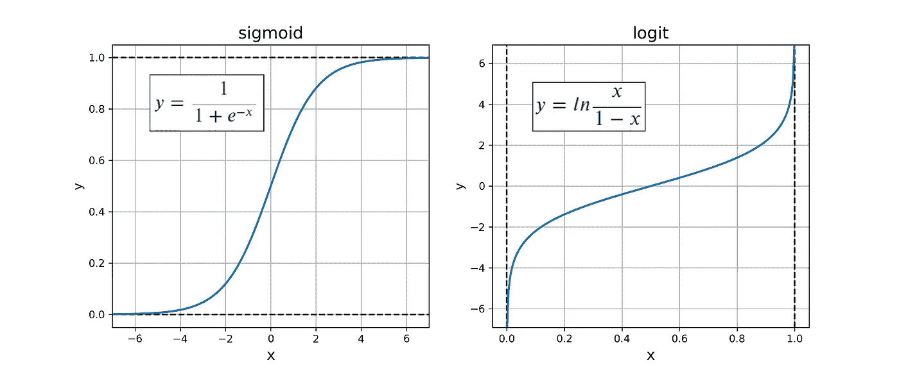
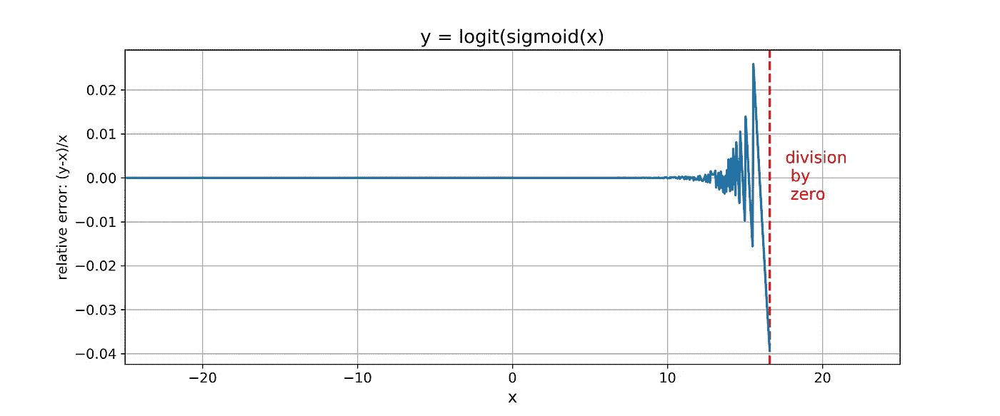
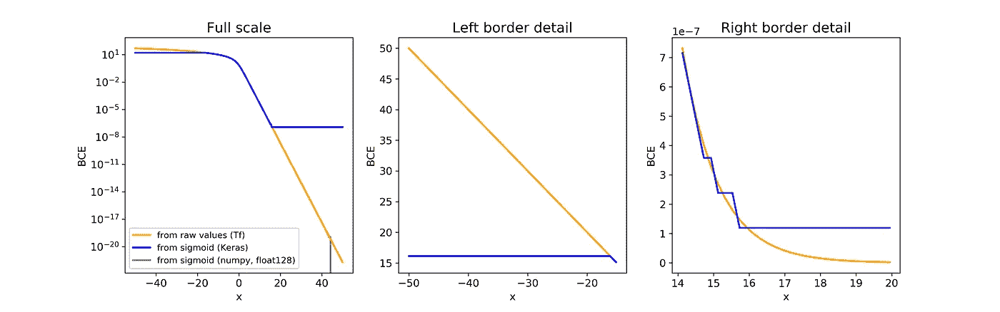
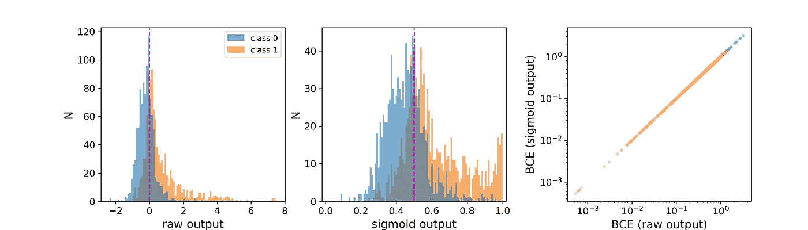
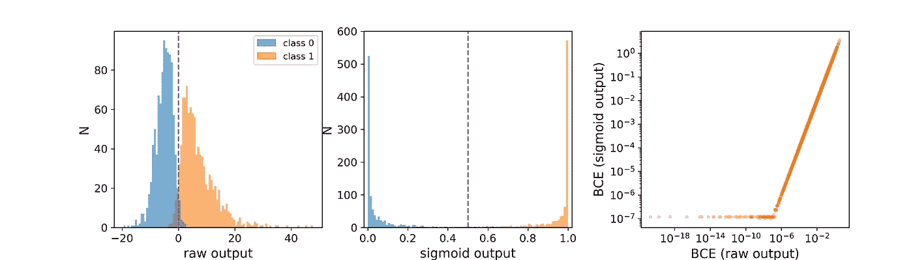
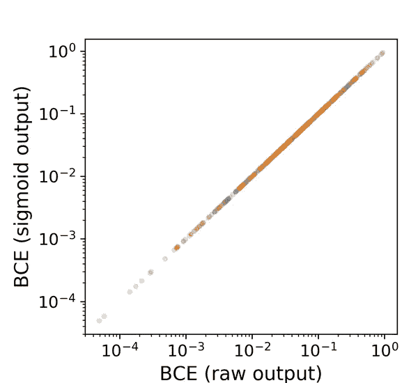

# Sigmoid 激活和二元交叉熵——不太完美的匹配？

> 原文：<https://towardsdatascience.com/sigmoid-activation-and-binary-crossentropy-a-less-than-perfect-match-b801e130e31?source=collection_archive---------6----------------------->

## 调查对数值不精确的关注

Really cross, and full of entropy…

在以**二进制分类**、最后(输出)层的 **sigmoid** 激活和作为损失函数的**二进制交叉熵(BCE)** 为任务的神经元网络中，这是标准配置。然而，偶尔有人会无意中发现这样的说法，即最后一层激活和损失[的这种特定组合可能会导致**数值不精确甚至不稳定**](https://www.kaggle.com/iafoss/pretrained-resnet34-with-rgby-0-460-public-lb) 。我想确保我得到了论点，精确到数字，特别是在我目前使用的框架中。听起来很有趣？意识到这可能也与一些图像分割任务相关，或者多类、多标记问题，而不仅仅是猫和狗的问题？那么，请跟我来。如果你喜欢提前复习一下 BCE，我想指出[丹尼尔·戈多伊](/understanding-binary-cross-entropy-log-loss-a-visual-explanation-a3ac6025181a)对 BCE 的精彩而深入的解释。

## 1.问题的定义

让我们从剖析 Keras 对 BCE 的实现开始:

因此，输入参数`output`首先被裁剪，然后被转换成 logits，然后被送入 TensorFlow 函数`tf.nn.sigmoid_cross_entropy_with_logits`。好吧…什么是逻辑来着？在数学中，logit 函数是 sigmoid 函数的逆，所以理论上 logit(sigmoid(x)) = x。

Figure 1: Curves you’ve likely seen before

在深度学习中，logits 通常和[不幸的是](https://stackoverflow.com/a/52111173/4334743)意味着分类网络最后一层的‘原始’输出，即在之前的层**的输出，它被传递到激活/标准化函数，例如 sigmoid。原始输出可以取任何值。这是 Keras 的`binary_crossentropy`的核心`sigmoid_cross_entropy_with_logits`所期待的。相比之下，在 Keras 中，期望变量`output`中的值代表概率，因此受限于[0 1]——这就是为什么`from_logits`默认设置为 False。因此，在输入`sigmoid_cross_entropy_with_logits`之前，它们需要被转换回原始值。重复一遍，我们**首先通过一个函数(sigmoid)运行数字，然后使用反函数(logit)** 将它们转换回来。这似乎有些迂回。然而，真正的潜在问题是这种来回可能导致的数值不稳定，在极端情况下会导致溢出。看看当 x 的类型是 float32 时 y = logit(sigmoid(x))的输出，这是 Keras 中的默认值，据我所知，在大多数其他框架中也是如此:**

Figure 2: Numerical imprecisions with float32

从大约 x=14.6 开始，误差达到 1%的范围，在大约 x=16.6 以上，由于被零除，游戏结束。当 sigmoid 中的分母恰好等于 1，而 logit 中的分母等于 0 时，就会被零除。我们可以通过`np.log(np.finfo(np.float32).eps)`估计 x 的极限，但是我发现数字的曲折变化很有趣，值得展示。不管怎样，这就是为什么 Keras 函数中的输入变量`output`的值需要并且实际上被剪裁了。所以，从一开始就打消一个想法:

**Keras 的 binary_crossentropy，当输入由 sigmoid 激活产生时，不会产生数字上溢或下溢。**

然而，剪切的结果是损失函数在边界处变平。为了形象化，让我们

1.  复制[设置最小网络](https://stackoverflow.com/questions/52125924/why-does-sigmoid-crossentropy-of-keras-tensorflow-have-low-precision)的巧妙技巧，手动设置权重，以及
2.  通过网络运行单一输入(样品，批量为 1)。

因此，我们能够比较从 Keras 中的 sigmoid 激活计算的 BCE 值和从 TensorFlow 中的原始输出计算的值。这是第一个模型，使用了 sigmoid 激活和 Keras 的标准 BCE:

没有 sigmoid 激活的模型，使用定制的损失函数，将值直接插入`sigmoid_cross_entropy_with_logits`:

因此，如果我们在标量输入 x 的扫描范围内评估模型，将标签(y)设置为 1，我们可以将模型生成的 BCE 相互比较，还可以与通过高精度浮点计算的 BCE 的简单实现产生的值进行比较。请再次注意，我们在这里是从单个样本计算 BCE，以便提取两种方法之间的差异。

Figure 3: Binary crossentropy computed for single samples in three ways. Note logarithmic y axis in the left plot, and linear y axes in the others.

有意思！使用 TensorFlow 的`sigmoid_cross_entropy_with_logits`从原始值计算的曲线在测试的 x 值范围内是平滑的，而使用 Keras 的`binary_crossentropy`从 sigmoid 变换值计算的曲线在两个方向上都变平(如预测的)。在大的正 x 值下，在达到限幅引起的极限之前，sigmoid 导出的曲线显示出阶梯状外观。最值得注意的可能是左边界上发生的情况，这在线性标度上是最好的理解(图 3，中心):原始值越负，由于削波对其 BCE 值的低估越严重。最后，即使使用 float128，如果我们从经过 sigmoid 变换的输入中获得 BCE 值，我们也不会走得太远(最左边的图中的灰色曲线)。

由于损失函数是学习的核心，这意味着采用最后一层 sigmoid + BCE **的模型无法区分预测类别与其标签极度一致或极度不一致的样本**。所以，理论上使用 sigmoid + BCE 确实有缺点。但是，在实践中有关系吗？毕竟我们说的是极端的边缘情况。在我们回答这个问题之前，一个更基本的问题是:原始的最后一层输出在实践中达到这样的极值吗？让我们看看。

## 2.在二元分类网络中检查单个样本的原始输出值

我训练了三个不同的网络来对狗和猫进行分类，使用了 2013 年 Kaggle 竞赛数据集的子集(2000 个训练图像，1000 个用于验证；效仿 F. Chollet ( *深度学习用 Python* )。纽约谢尔特岛曼宁出版公司。2017.)).是的，又是猫和狗，为了轻松和专注于手头的问题。

下面的图形和数字来自一个简单的手工制作的 convnet:四对 2D 卷积/最大池层，然后是一个单一的下降和两个密集层，所有这些都具有 relu 激活。最后一个单元素输出层没有激活，作为损失函数，我为 TensorFlow 的`sigmoid_cross_entropy_with_logits`使用了上面提到的 Keras 包装器。

首先，让我们看看个别图像是否真的会产生输出图层的极端原始值。训练后，我通过网络运行用于训练的相同图像，并从最后一层获得它们的原始输出。此外，我计算了 sigmoid 转换后的输出，以及从两个输出中导出的 BCE 值。这是我在**八个纪元**的训练后得到的，所以相对来说，我学到的东西很少:

Figure 4: Left and center, distribution of outputs of the last layer after training the network for **eight epochs**. Input for prediction consisted of the same 2000 images as used for training. Left, raw values; center, sigmoid-transformed values. Right, scatter plot of BCE values computed from sigmoid output vs. those computed from raw output. Batch size = 1.

显然，在训练的初始阶段，我们处于危险区之外；在这个例子中，原始最后层输出值由 ca [-3 8]限制，并且从原始和 sigmoid 输出计算的 BCE 值是相同的。同样令人高兴的是乙状结肠强烈的“挤压”效应(图 4，中间)。

当网络被**充分训练**(这里定义为在连续 15 个时期没有显示出减少的损失)时，情况是怎样的？

Figure 5: Same depiction as in Fig. 4, but after **full training** of the network (test accuracy of ca. 0.85). Same conventions as in Fig. 4 apply. Note clipping of BCE values computed from sigmoid outputs (right).

啊哈——正如我们所料，我们看到了更清晰的职业划分。并且少量的图像实际上导致了落入剪裁范围内的极端 logit 值。让我们把重点放在第一类(狗；图中的橙色)；另一个类也有类似的论点。没有一个样本产生比 ca 更负的原始输出值。-4，所以这也没问题。然而，一定数量的样本——最小的狗——达到大于大约 16 的原始输出值。因此，通过 sigmoid + Keras 的 binary_crossentropy 计算的相关 BCE 在 ca 处被剪切。10⁻⁷(图 5，右；也参见图 3)。这是一个非常小的值。如果狗和猫的 BCE 值更小(并且个体差异更大),我们会期望学习以一种系统化的不同方式发生吗？**特别是如果我们使用合理的批量，具有中等或低原始产值的样品将在损失中占主导地位。**图 6 显示了上述相同数据的批次大小为 4 的情况，这仍然是偏低的。

Figure 6: scatter plot of BCE values computed from sigmoid output vs. those computed from raw output of the fully trained network with batch size = 4.

结果**与基于 VGG16 和 Inception V3 的网络**在 imagenet 数据集上进行预训练(训练时没有对卷积部分进行微调)。

## 3.结论

首先，让我们重申，由于最后一层中的 sigmoid 激活和作为损失函数的 BCE 的结合，对数字不足或溢出的担心是不合理的——在使用 TensorFlow 后端的 Keras 中。我还不熟悉其他框架，但是如果它们没有类似的预防措施，我会感到非常惊讶。

基于上面对古老的 cats_vs_dogs 数据集的“实验”,似乎 sigmoid +BCE 在精度方面也很好。特别是如果您使用合理的批量和适当的数据，那么 BCE 的计算方式并不重要。然而，这只是一个数据集，很少有模型在上面测试。

所以，我的**试探性总结**:如果

1.  您知道或怀疑最后一层的许多样本的原始输出达到极值，并且
2.  您的批量非常小，和/或
3.  你想把数字不精确排除在麻烦的可能原因之外，

从原始输出计算 BCE 没有坏处。否则，就坚持乙状结肠+BCE。

其他框架的评论、建议和经验？很高兴听到这个消息。