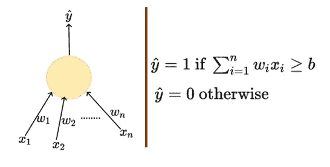
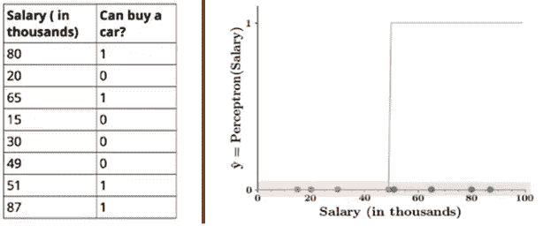
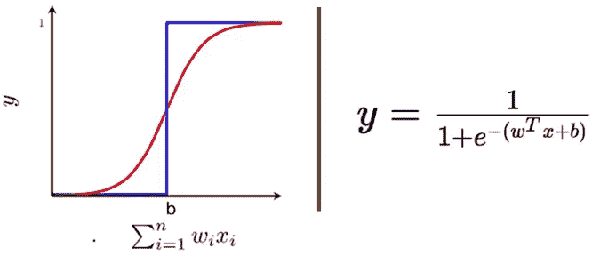
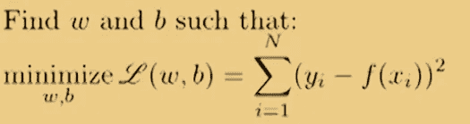
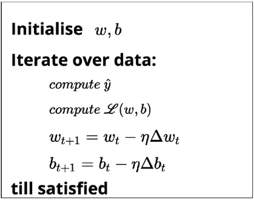
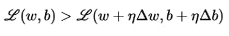
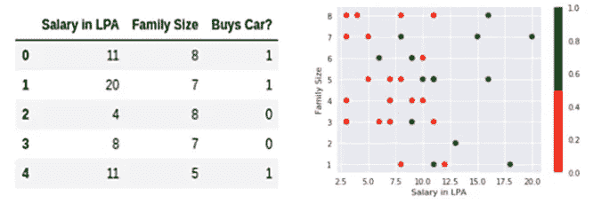
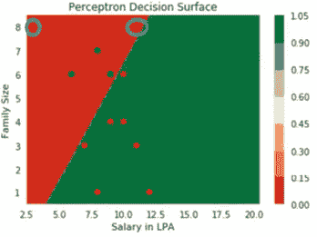
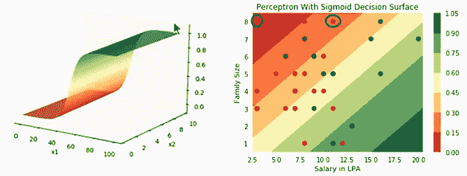

# Sigmoid 神经元——深度神经网络的构建模块

> 原文：<https://towardsdatascience.com/sigmoid-neuron-deep-neural-networks-a4cd35b629d7?source=collection_archive---------1----------------------->

深层神经网络的构建模块被称为乙状结肠神经元。Sigmoid 神经元类似于[感知器](https://hackernoon.com/perceptron-deep-learning-basics-3a938c5f84b6)，但是它们稍有修改，使得 sigmoid 神经元的输出比感知器的阶跃函数输出平滑得多。在这篇文章中，我们将讨论创造乙状结肠神经元的动机和乙状结肠神经元模型的工作原理。

*引用注:本文内容和结构基于四分之一实验室的深度学习讲座——*[*pad hai*](https://padhai.onefourthlabs.in)*。*

这是讨论 sigmoid 神经元的工作及其学习算法的两部分系列的第一部分:

1 | Sigmoid 神经元——深度神经网络的构建模块

2 | [用数学解释的 Sigmoid 神经元学习算法](/sigmoid-neuron-learning-algorithm-explained-with-math-eb9280e53f07)

# 为什么是乙状结肠神经元

在我们进入 sigmoid 神经元的工作之前，让我们简单地讨论一下感知器模型及其局限性。

感知器模型接受几个实值输入，并给出一个二进制输出。在感知器模型中，每个输入`xi`都有与之相关的权重`wi`。权重表明决策过程中输入的重要性。模型输出由阈值 **Wₒ** 决定，如果输入的加权和大于阈值 **Wₒ** 输出将为 1，否则输出将为 0。换句话说，如果加权和大于阈值，模型将被触发。

Perceptron (Left) & Mathematical Representation (Right)

根据数学表示，我们可以说感知器使用的阈值逻辑非常苛刻。让我们用一个例子来看看苛刻的阈值逻辑。考虑一个人的决策过程，他/她是否愿意购买一辆汽车仅基于一个输入`X1` —工资，并通过设置阈值 **b** ( **Wₒ** ) = -10 和权重 **W** ₁ = 0.2。感知器模型的输出如下图所示。

Data (Left) & Graphical Representation of Output(Right)

红点表示一个人不会买车，绿点表示这个人想买车。一个 50.1K 的人会买车而一个 49.9K 的人不会买车是不是有点奇怪？感知器输入的微小变化有时会导致输出完全翻转，比如从 0 到 1。这种行为并不是我们选择的具体问题或者我们选择的具体权重和阈值的特征。这是感知器神经元本身的特性，其行为类似于阶跃函数。我们可以通过引入一种叫做*s 形*神经元的新型人工神经元来克服这个问题。

> 要了解更多关于感知器的工作，请参考我以前关于[感知器模型](https://hackernoon.com/perceptron-deep-learning-basics-3a938c5f84b6)的帖子

# 乙状结肠神经元

我们能有一个更平滑(不那么苛刻)的函数吗？

引入 sigmoid 神经元，其输出函数比阶跃函数平滑得多。在乙状结肠神经元中，与阶跃输出相反，输入的小变化仅引起输出的小变化。有许多具有“**S**”**形曲线特征的函数称为 sigmoid 函数。最常用的函数是逻辑函数。**

****

**Sigmoid Neuron Representation (logistic function)**

**我们不再看到临界点 **b** 的急剧转变。乙状结肠神经元的输出不是 0 或 1。相反，它是一个介于 0-1 之间的真实值，可以解释为一个概率。**

# **数据和任务**

> **回归和分类**

**与 [MP 神经元](https://hackernoon.com/mcculloch-pitts-neuron-deep-learning-building-blocks-7928f4e0504d)中的布尔输入不同，sigmoid 神经元的输入可以是实数，输出也是 0-1 之间的实数。在乙状结肠神经元中，我们试图回归 **X** 和 **Y** 之间的概率关系。即使输出在 0-1 之间，我们仍然可以通过选择一些阈值来使用 sigmoid 函数进行二进制分类任务。**

# **学习算法**

**在本节中，我们将讨论通过使用梯度下降算法来学习 sigmoid 神经元模型的参数 **w** 和 **b** 的算法。**

****

**Minimize the Squared Error Loss**

**学习算法的目标是确定参数的最佳可能值，使得模型的总损失(平方误差损失)尽可能最小。学习算法是这样的:**

****

**Sigmoid Learning Algorithm**

**我们随机初始化 **w** 和 **b** 。然后，我们迭代数据中的所有观察值，对于每个观察值，使用 sigmoid 函数找到相应的预测结果，并计算平方误差损失。基于损失值，我们将更新权重，使得在新参数下模型的总损失将**小于模型的当前损失**。**

****

**Loss Optimization**

**我们将继续进行更新操作，直到我们满意为止。直到满意可能意味着以下任何一种情况:**

*   **模型的总损失变为零。**
*   **模型的总损失变成接近于零的非常小的值。**
*   **基于计算能力迭代固定次数。**

# **它能处理非线性数据吗？**

**感知器模型的局限性之一是，学习算法只有在数据是线性可分的情况下才有效。这意味着正的点在边界的一边，负的点在边界的另一边。sigmoid 神经元能处理非线性可分数据吗？。**

**让我们举一个例子，一个人是否会购买一辆汽车基于两个输入，x₁——年薪 10 万卢比(LPA)和 x₂——家庭规模。我假设在 **X** 和 **Y** 之间有一个关系，它是使用 sigmoid 函数近似得到的。**

****

**Input Data(Left) & Scatter Plot of Data(Right)**

**红点表示输出为 0，绿点表示输出为 1。从图中我们可以看到，没有一条线或者一条线性的边界可以有效的将红绿点分开。如果我们在这个数据上训练一个感知器，学习算法将**永远不会收敛**，因为数据不是线性可分的。我将运行模型一定次数的迭代，以尽可能减少误差，而不是追求收敛。**

****

**Perceptron Decision boundary for fixed iterations**

**从感知器决策边界，我们可以看到，由于苛刻的阈值逻辑，感知器无法区分靠近边界的点和位于内部的点。但是在现实世界的场景中，我们会期望一个站在边界围栏上的人可以选择任何一条路，而不像在决策边界内的人。**

**让我们看看 sigmoid neuron 将如何处理这些非线性可分离数据。一旦我使用 sigmoid 神经元拟合我们的二维数据，我将能够生成如下所示的 3D 等值线图，以表示所有观察的决策边界。**

****

**Sigmoid Neuron Decision Boundary (Left) & Top View of Decision Boundary (Right)**

**为了进行比较，让我们进行同样的两次观察，看看这些观察的乙状结肠神经元的预测结果是什么。如您所见，在图的最左侧出现的观察的预测值为零(出现在暗红色区域),而另一个观察的预测值约为 0.35，即该人有 35%的机会购买汽车。与感知器的刚性输出不同，现在我们有一个介于 0-1 之间的平滑连续的输出，可以解释为一个概率。**

> **仍然不能完全解决非线性数据的问题。**

**尽管我们已经引入了非线性 sigmoid 神经元函数，但是它仍然不能够有效地将红点与绿点分开。重要的一点是，从感知器中的刚性决策边界开始，我们已经朝着创建适用于非线性可分离数据的决策边界的方向迈出了第一步。因此，乙状结肠神经元是深层神经网络的构建模块，最终我们不得不使用神经元网络来帮助我们创建一个“*完美的*决策边界。**

# **继续学习**

**如果你有兴趣了解更多关于人工神经网络的知识，请查看来自 [Starttechacademy](https://courses.starttechacademy.com/full-site-access/?coupon=NKSTACAD) 的 Abhishek 和 Pukhraj 的[人工神经网络](https://courses.starttechacademy.com/full-site-access/?coupon=NKSTACAD)。还有，课程是用最新版本的 Tensorflow 2.0 (Keras 后端)讲授的。他们也有一个非常好的关于 Python 和 R 语言的[机器学习(基础+高级)](https://courses.starttechacademy.com/full-site-access/?coupon=NKSTACAD)的包。**

# **结论**

**在这篇文章中，我们看到了导致乙状结肠神经元产生的感知机的局限性。我们还看到了乙状结肠神经元的工作示例，以及它如何克服一些限制。我们已经看到感知器和 sigmoid 神经元模型是如何处理非线性可分离数据的。**

**在下一篇[文章](/sigmoid-neuron-learning-algorithm-explained-with-math-eb9280e53f07)中，我们将利用 math 详细讨论 sigmoid 神经元学习算法，并直观地了解为什么特定的更新规则有效。**

***推荐阅读:***

** [## 用数学解释的 Sigmoid 神经元学习算法

### 在本帖中，我们将详细讨论 sigmoid 神经元学习算法背后的数学直觉。

towardsdatascience.com](/sigmoid-neuron-learning-algorithm-explained-with-math-eb9280e53f07)  [## 感知器——深度学习基础

### 麦卡洛克-皮茨神经元的升级。

hackernoon.com](https://hackernoon.com/perceptron-deep-learning-basics-3a938c5f84b6) 

> *联系我
> GitHub:*[*https://github.com/Niranjankumar-c*](https://github.com/Niranjankumar-c) *LinkedIn:*[*https://www.linkedin.com/in/niranjankumar-c/*](https://www.linkedin.com/in/niranjankumar-c/)

**免责声明** —这篇文章中可能有一些相关资源的附属链接。你可以以尽可能低的价格购买捆绑包。如果你购买这门课程，我会收到一小笔佣金。**