# 用数学解释的 Sigmoid 神经元学习算法

> 原文：<https://towardsdatascience.com/sigmoid-neuron-learning-algorithm-explained-with-math-eb9280e53f07?source=collection_archive---------5----------------------->

Photo by [Antoine Dautry](https://unsplash.com/@antoine1003?utm_source=medium&utm_medium=referral) on [Unsplash](https://unsplash.com?utm_source=medium&utm_medium=referral)

这是讨论 sigmoid 神经元的工作及其学习算法的两部分系列的第二部分:

1 | [Sigmoid 神经元——深度神经网络的构建模块](/sigmoid-neuron-deep-neural-networks-a4cd35b629d7)

2 |用数学解释的 Sigmoid 神经元学习算法(当前故事)

在本帖中，我们将详细讨论 sigmoid 神经元学习算法背后的数学直觉。

*引用注:本文内容和结构基于四分之一实验室的深度学习讲座——*[*pad hai*](https://padhai.onefourthlabs.in)*。*

# 乙状结肠神经元概述

sigmoid 神经元类似于感知器神经元，对于每个输入`xi`，它都具有与该输入相关联的权重`wi`。权重表明决策过程中输入的重要性。与感知器模型不同，sigmoid 的输出不是 0 或 1，而是 0-1 之间的真实值，可以解释为概率。最常用的 sigmoid 函数是逻辑函数，它具有“ **S** 形曲线的特征。

Sigmoid Neuron Representation

# 学习算法

学习算法的目标是确定参数( **w** 和 **b** )的最佳可能值，使得模型的总损失(平方误差损失)尽可能最小。

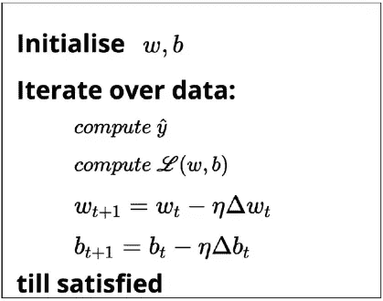

Learning Algorithm

我们随机初始化 **w** 和 **b** 。然后，我们迭代数据中的所有观察值，对于每个观察值，使用 sigmoid 函数找到相应的预测结果，并计算平方误差损失。基于损失值，我们将更新权重，使得模型在新参数下的总损失将比模型的当前损失小**。**

# 学习算法:数学部分

我们看到权重是如何根据损失值更新的。在本节中，我们将了解为什么这个特定的更新规则会减少模型的丢失。为了理解为什么更新工作规则有效，我们需要理解它背后的数学原理。

让我们从学习算法的数学部分开始。

[Cute No?](https://memegenerator.net/instance/81152522/excited-baby-face-lets-do-some-math)

在 sigmoid 神经元函数中，我们有两个参数 **w** 和**b。**I 将以向量θ的形式表示这些参数，θ是属于 R 的参数的向量。目标是找到使损失函数最小化的θ的最佳值。

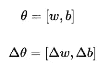

Vector Notation of Parameters

我们达到目标的方法是用一些小的随机值来更新θ，即δθ**δ**θ，它是 **w** 的变化和 **b** 的变化的集合。**δ**θ也是一个属于 R 的向量，我们来看看θ和**δ**θ的几何表示，

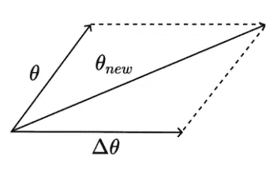

Geometric Representation

我们有一个向量θ，我们要给它加上另一个向量**δ**θ。从[向量平行四边形定律](https://www.mathstopia.net/vectors/parallelogram-law-vector-addition)我们会得到我们的合成向量θnew，它无非是平行四边形的对角线。从几何表示中，我们可以看到，在θ和θnew 之间，θ的值有很大的变化。与其在学习θ时迈大步，不如保守一点，只往同一个方向移动很小的量。

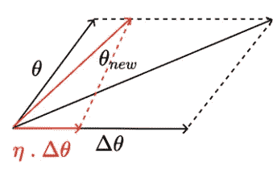

Geometric Representation with Learning Rate

记住**δ**θ是一个向量，为了在同一个方向上迈小步，我需要让**δ**θ有一个较小的幅度。为了得到一个小的量级，我将把**δ**θ乘以学习率(一个很小的值)。现在，合成矢量是红色矢量，表示θnew。新的θ将是向量θ从初始位置的移动。

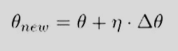

# 使用泰勒级数

但是我们如何决定**δ**θ的值以及使用什么样的**δ**θ才是正确的呢？。我们如何以主要方式获得正确的**δ**θ，使得新θ的损耗(是 **w** 和 **b** 的函数)应该小于旧θ的损耗。这个问题的答案来自泰勒级数。

泰勒级数告诉我们的是，如果我们有一个函数 **f** 并且我们知道该函数在特定点 **x** 的值，那么函数 **f** 在一个非常接近 **x** 的新点的值由下面的公式给出:

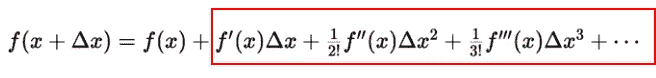

Taylor Series General Representation

靠近 **x** 的小步长后的函数值等于 **x** 处的函数值和其他一些量(出现在红框中)。如果我们观察红框中的数量，它的值完全取决于δ**x**。如果我能够找到 delta **x** 使得红框中表示的数量为负，那么我将知道新 **x** 处的新损失小于旧 **x** 处的损失。

用 sigmoid 神经元参数和损失函数表示泰勒级数。为便于记记，设**δ**θ= u，则我们有，

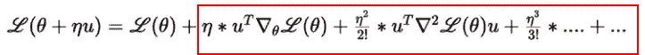

Replaced x with Parameter theta

将其与一般的泰勒级数方程进行比较，新θ的损耗等于旧θ的损耗和其他一些量(显示在红框中)。盒子中存在的量的值取决于变化向量 uᵀ.所以我们需要找到变化向量 uᵀ，使得红框中的量变成负数。如果为负，那么我们将知道θnew 处的损耗小于θold 处的损耗。

为了找到最佳变化向量 uᵀ，为了简单起见，让我们去掉泰勒级数中的一些项。我们知道学习率η非常小，那么η，η等…将非常接近于零。通过使用此逻辑，泰勒级数可以简化为以下形式:

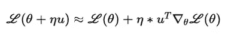

Truncated Taylor Series

只有当新θ处的损耗小于旧θ时，变化矢量 uᵀ才是最佳的，

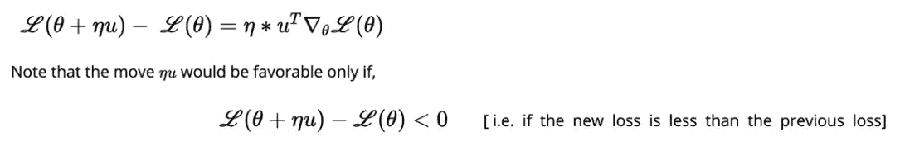

Optimal change vector

通过比较上述两个方程(变化向量 uᵀ优化方程和截断泰勒级数方程),

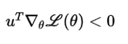

为了解决上面的方程，让我们回到一点线性代数，特别是两个向量之间的余弦角。我们知道 *cos(θ)的范围从-1 到 1。*

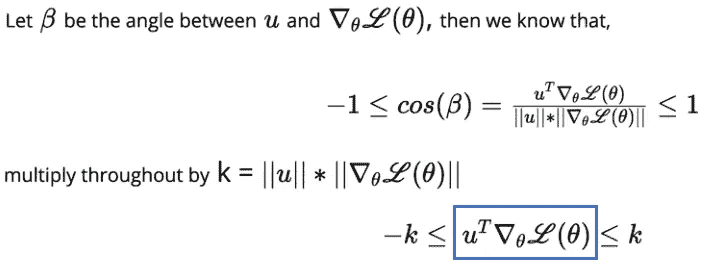

Cosine Angle between Vectors

由于余弦角公式的分母是一个数值，并且它总是正的，我们可以将余弦公式乘以 **k** (分母)而不影响不等式的符号。我们希望不等式之间的量(标在蓝框中)为负，这只有在 uᵀ和∇之间的余弦角等于-1 时才有可能。如果余弦角等于-1，那么我们知道向量之间的角度等于 180⁰.

如果角度等于 180⁰，这意味着我们选择的变化向量 uᵀ的方向，应该与梯度向量相反。我们可以将梯度下降规则总结如下:

类似地，我们可以如下编写参数更新规则，

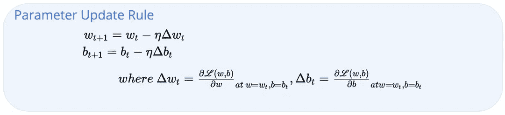

# 计算偏导数

到目前为止，在前面的章节中，我们已经看到了如何使用泰勒级数和向量之间的余弦角来达到参数更新规则。但是我们如何计算对 w 和 b 的偏导数呢？。

为了简单起见，我们假设只有一个点适合于乙状结肠神经元。所以一个点的损失函数可以写成，

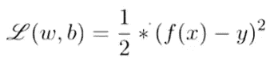

Loss function for one point

我们需要计算 **w** 和 **b** 对损失函数的偏导数。让我们推导这些导数，

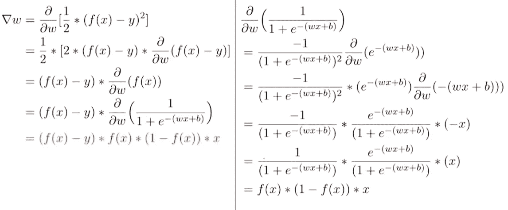

Derivation for partial derivatives of w

首先，我们将偏导数推到括号内，接下来，我们有 y，它是常数，它的偏导数为零。在 f(x)的地方，我们用逻辑函数代替，求逻辑函数 w.r .对 **w** 的偏导数。上图的右边部分解释了逻辑函数的偏导数。上述最终表达式(用红色标记)仅对一次观察有效，对于两次观察，表达式变为:

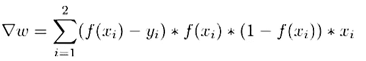

类似地，我们可以计算 **b** 对损失的偏导数，

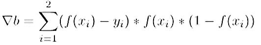

# 梯度下降规则

现在我们有了使用梯度下降实现参数更新规则所需的一切。让我们举一个例子，看看我们如何使用我们刚刚导出的参数更新规则来实现梯度下降，以最小化模型的损失。

我已经获取了一些玩具数据，并将参数初始化为 **w** = 0， **b** = -8，并将学习率设置为 1.0，然后迭代 1000 个时期的所有观察值，并计算不同值的 **w** (-2 到 6)和 **b** (-10 到 2) **的损失。O** 一旦我获得了 **w** 和 **b** 所有可能组合的损失值，我就能够生成下面的 3D 等高线图来显示损失值的变化。

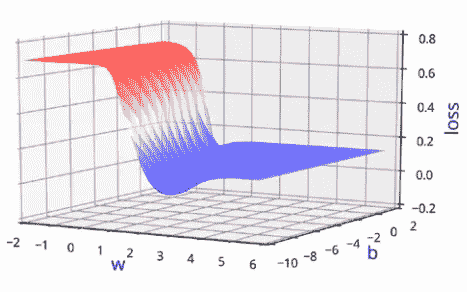

Loss Value for different w and b

以上代码片段显示了在 2D 玩具数据的情况下，参数 **w** 和 **b** 的梯度下降更新规则的实现。我们可以随机初始化参数值，但在这种情况下，我选择这些特定值只是为了更好地说明。

图表中较深的红色阴影表示损失值较高的区域，而山谷中较深的蓝色阴影表示损失的最低点。下面的动画显示了固定迭代的梯度下降规则，底部的点表示 **w** & **b** 的不同组合，轮廓上的点表示相应参数值的损失值。

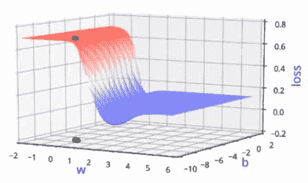

Animation of loss variation

我们已经成功地推导出梯度下降更新规则，该规则保证找到对于 **w** 和 **b** 的最佳参数值，其中只要我们在与梯度相反的方向上移动，函数的损失最小。

Photo by [JESHOOTS.COM](https://unsplash.com/@jeshoots?utm_source=medium&utm_medium=referral) on [Unsplash](https://unsplash.com?utm_source=medium&utm_medium=referral)

# 继续学习

如果你有兴趣了解更多关于人工神经网络的知识，请查看来自 [Starttechacademy](https://courses.starttechacademy.com/full-site-access/?coupon=NKSTACAD) 的 Abhishek 和 Pukhraj 的[人工神经网络](https://courses.starttechacademy.com/full-site-access/?coupon=NKSTACAD)。还有，课程是用最新版本的 Tensorflow 2.0 (Keras 后端)讲授的。他们还有一个非常好的包，关于 Python 和 R 语言的[机器学习(基础+高级)](https://courses.starttechacademy.com/full-site-access/?coupon=NKSTACAD)。

# 结论

在这篇文章中，我们简要地看了一下乙状结肠神经元。然后，我们看到了学习算法的 sigmoid neuron 数学自由版本，然后我们继续使用泰勒级数、线性代数和偏微分来详细了解学习算法背后的数学直觉。最后，我们证明了我们使用梯度下降导出的更新规则保证通过使用玩具数据找到最佳参数。

这是一个有点冗长&数学很重的帖子，即使你第一次阅读没有完全理解，也要再浏览一遍。如果你有任何问题或建议，请在回复部分发表。

*推荐阅读*

 [## Sigmoid 神经元—深度神经网络

### 深层神经网络的构建模块被称为乙状结肠神经元。

towardsdatascience.com](/sigmoid-neuron-deep-neural-networks-a4cd35b629d7) 

在以后的文章中，我们将讨论如何用 python 实现 sigmoid 神经元模型，还将讨论其他一些非线性函数，如 RELU、ELU。

Niranjan Kumar 在汇丰银行数据分析部门实习。他对深度学习和人工智能充满热情。他是 [Medium](https://medium.com/u/504c7870fdb6?source=post_page-----eb9280e53f07--------------------------------) 在[人工智能](https://medium.com/tag/artificial-intelligence/top-writers)的顶尖作家之一。在 [LinkedIn](https://www.linkedin.com/in/niranjankumar-c/) 上与我联系，或者在 [twitter](https://twitter.com/Nkumar_283) 上关注我，了解关于深度学习和人工智能的最新文章。

**免责声明** —这篇文章中可能有一些相关资源的附属链接。你可以以尽可能低的价格购买捆绑包。如果你购买这门课程，我会收到一小笔佣金。