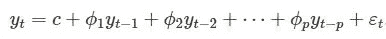
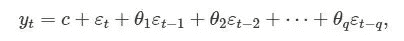
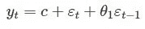

# ACF 图和 PACF 图在时间序列分析中的意义

> 原文：<https://towardsdatascience.com/significance-of-acf-and-pacf-plots-in-time-series-analysis-2fa11a5d10a8?source=collection_archive---------0----------------------->

这篇文章是为那些想知道使用 ACF 和 PACF 图确定自回归(AR)和移动平均(MA)序列的顺序背后的直觉的人写的。我们大多数人都知道如何使用 ACF 和 PACF 图来获得 p 和 q 的值，以馈入 AR-I-MA 模型，但我们缺乏背后的直觉，为什么我们使用 PACF 和 ACF 来分别获得 p 和 q，而不是相反。

让我们先了解一下我们所说的 ACF 和 PACF 是什么意思，

ACF 是一个(完全)自相关函数，它给出任何序列与其滞后值的自相关值。我们将这些值与置信带和 tada 一起绘制出来！我们有一个 ACF 图。简而言之，它描述了序列的当前值与其过去值的关联程度。时间序列可以包含趋势、季节性、周期性和残差等成分。ACF 在寻找相关性时考虑了所有这些成分，因此这是一个“完整的自相关图”。

**PACF** 是一个偏自相关函数。基本上，不是像 ACF 那样寻找当前与滞后的相关性，而是寻找残差(其在移除已经由早期滞后解释的效应之后剩余)与下一个滞后值的相关性，因此是“部分的”而不是“完整的”，因为我们在找到下一个相关性之前移除了已经找到的变化。因此，如果残差中有任何隐藏信息，可以通过下一个滞后进行建模，我们可能会获得良好的相关性，并且我们会在建模时将下一个滞后作为一个特征。请记住，在建模时，我们不希望保留太多相关的要素，因为这会产生多重共线性问题。因此，我们只需要保留相关的特性。

现在让我们看看什么是 AR 和 MA 时间序列过程，

**自回归(AR)过程**，当时间序列的当前值可以使用同一时间序列的先前值获得时，即当前值是其过去值的加权平均值，则称该时间序列为 AR。股票价格和全球气温上升可以被认为是一个 AR 过程。

订单 p 的 AR 流程可以写成:

ϵt 是白噪声，y't-₁和 y't-₂是滞后。阶 p 是滞后值，在此之后，PACF 图第一次越过置信区间上限。在预测 AR 时间序列时，这些 p 滞后将作为我们的特征。我们不能在这里使用 ACF 图，因为即使对于过去很久的滞后，它也会显示良好的相关性。如果我们考虑这些特征，我们将会有多重共线性问题。这对于 PACF 图来说不是问题，因为它去除了已经由早期滞后解释的成分，所以我们只得到与残差相关的滞后，即没有由早期滞后解释的成分。

在下面的代码中，我定义了一个简单的 AR 过程，并使用 PACF 图找到了它的顺序。我们应该期待我们的 AR 过程在 ACF 图中显示逐渐减少，因为作为 AR 过程，它的现在与过去的滞后有很好的相关性。我们预计 PACF 在接近滞后之后会大幅下跌，因为这些接近当前的滞后可以很好地捕捉变化，以至于我们不需要过去的滞后来预测当前。

现在让我们讨论第二种类型的过程，

**移动平均(MA)过程，**序列的现值被定义为过去误差的线性组合的过程。我们假设误差独立地服从正态分布。q 阶 MA 过程定义为:

在这里，ϵt 是一个白噪音。为了直观地了解 MA 过程，让我们考虑一下 1 阶 MA 过程，

让我们把 y t 看作原油价格，ϵt 是由于飓风引起的油价变化。假设 c=10(没有飓风时原油价格的平均值)和θ₁=0.5.假设今天有一场飓风，而昨天没有，那么 y 将是 15，假设由于飓风ϵt=5.，石油价格发生了变化明天没有飓风，所以ϵt=0 和ϵt-₁=5 不会有 12.5 度。假设后天没有飓风。在这种情况下，石油价格将是 10 美元，这意味着它在受到飓风的影响后稳定下来。所以在我们的例子中，飓风的影响只停留在一个滞后值上。在这种情况下，飓风是一个独立的现象。

MA 过程的 q 阶从 ACF 图中获得，这是 ACF 第一次越过置信区间上限后的滞后。正如我们所知，PACF 捕捉残差和时间序列滞后的相关性，我们可能会获得最近滞后以及过去滞后的良好相关性。为什么会这样？由于我们的序列是残差的线性组合，没有一个时间序列本身的滞后可以直接解释它的现在(因为它不是 ar)，这是 PACF 图的本质，因为它减去了早期滞后已经解释的变化，它的 PACF 在这里失去了它的力量！另一方面，作为一个 MA 过程，它没有季节或趋势成分，因此 ACF 图将只捕捉残差成分的相关性。你也可以把它看作 ACF，它是一个完整的图(捕捉趋势、季节性、循环和残差相关性),作为一个部分图，因为我们没有趋势、季节等。

在下面的代码中，我定义了一个简单的 MA 过程，并使用 ACF 图找到了它的顺序。我们可以预期 ACF 图显示与最近滞后的良好相关性，然后急剧下降，因为它不是与过去滞后具有良好相关性的 AR 过程。此外，我们预计 PACF 图会逐渐减少，因为这是一个 MA 过程，与 AR 过程不同，时间序列的最近滞后值不能真正预测其现值。因此，我们将得到残差与进一步滞后的良好相关性，因此逐渐减少。

总而言之，

在建立机器学习模型时，我们应该避免多重共线特征。这同样适用于时间序列模型。

我们使用 PACF 图找到 AR 过程的最佳特征或顺序，因为它消除了由早期滞后解释的变化，所以我们只得到相关的特征。

我们使用 ACF 图找到 MA 过程的最佳特征或顺序，因为作为 MA 过程，它没有季节和趋势分量，所以我们在 ACF 图中仅获得与时间序列滞后的残差关系。ACF 充当部分情节。

我希望你喜欢这篇文章，我已经尽量让它简单。由于这是我的第一篇关于媒体的文章，我将非常感谢反馈和建议，以便在以后的文章中提高自己。

感谢阅读，快乐学习！再见！