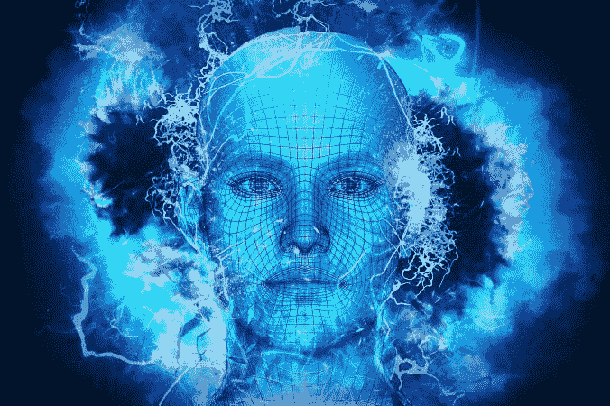

# 硅谷的大脑干预:科技设备的新领域

> 原文：<https://towardsdatascience.com/silicon-valleys-brain-meddling-a-new-frontier-for-tech-gadgetry-5bcd357c4189?source=collection_archive---------27----------------------->

哈佛大学分子和细胞生物学教授杰夫·李奇曼在向他的学生介绍人类大脑的研究时曾问道:“*如果理解你需要了解的关于大脑的一切是一英里，那么我们已经走了多远？*”。他得到的回答是“四分之三英里”、“半英里”和“四分之一英里”。

教授的回应？:*我想大概三寸。*

上个月，李奇曼的妙语被皇家学会纳入了一份新的[报告](https://royalsociety.org/topics-policy/projects/ihuman-perspective/)，该报告调查了神经(或“脑-机”)接口的前景，这是一个热门的研究领域，在过去的几年里，已经有数十亿美元的资金投入其中，这不是没有原因的。[预计](http://www.neurotechreports.com/pages/reportsumm.html)到 2022 年，神经科技产品的全球市场——定义为“电子和工程在人类神经系统中的应用”— [将达到 133 亿美元。](http://www.neurotechreports.com/pages/execsum.html)

因此，尽管我们承认缺乏理解，但对于寻求重新发明——或许是不可逆转地影响——我们与世界互动的方式的技术先锋来说，大脑似乎是一个新的重要前沿。

皇家学会的报告推测:

> 精神健康状况可以通过使用针对大脑相关部分的界面来治疗，从而缓解全球数亿抑郁症患者的痛苦。即使是已经证明对传统疗法有抵抗力的阿尔茨海默病，也可能被阻止或逆转。

医疗用途之外:

> 人们可以接受“全脑诊断”,以确定他们独特的才能和挑战。今天的“大脑训练”电脑游戏，其影响是有争议的，可能会让位于明显有效的“大脑清洁”或“大脑健身房”课程，以保持思维敏捷和创造力。
> 
> 神经接口为增强日常生活提供了无数的可能性。我们可以用我们的思维开门、开灯、玩游戏、操作设备或在电脑上打字。
> 
> 那么就有机会增强或增压大脑本身。植入物、头盔、头带或其他设备可以帮助我们记忆更多，学习更快，更快地做出更好的决定，解决问题，不受偏见的影响…
> 
> 心情、知识和记忆可以安全保密地备份或上传到数字云中。

我知道，太多了。我还省略了对心灵感应的提及，人类与人工智能的潜在融合，以及将你的神经接口连接到另一种动物(如鸟)的选项。

对于一个科幻迷来说，这一切听起来一定像来自天堂的甘露。对我们其他人来说，这可能有点令人困惑(至少可以这么说)。那么，这是一个*真实的*命题吗？或者只是一些野心勃勃的硅谷书呆子的(相当令人毛骨悚然的)愿望清单？

事实是，很难说脑机接口的长期轨迹会是怎样的，但在某种程度上，它们已经是*了。虽然仍然相当初级，但我们目前有可以只用大脑控制的[无人机](https://phys.org/news/2017-10-drones-brain-computer-interface.html)和[假肢](https://medium.com/@neurogress/upgrading-human-artificial-limb-controlled-with-your-real-brain-470cf80d078f)，以及[提高注意力和记忆力的耳机](https://www.wearable-technologies.com/2018/11/humms-edge-headset-stimulates-brain-to-boost-memory-and-kicks-your-learning-speed-into-overdrive/)。这些技术中有些是侵入性的，但许多不是。有些记录大脑活动并对其做出反应，有些刺激大脑活动，有些两者兼而有之。*

令人放心的是，非侵入性技术有望走向商业销售。其中大部分是对脑电图(EEG)的重新想象，EEG 是一种监测和记录大脑中电脉冲的系统。商业领域的领导者之一， [CTRL-Labs](https://www.ctrl-labs.com/) ，特别专注于它所谓的“意图捕捉”。他们的产品是一种基于肌电图的腕带，当电信号在用户手臂肌肉中激活时，它可以做出反应。目前，该公司的演示中有一个玩家只使用这种脉冲检测而没有物理移动来控制一个简单的游戏([看一下](https://youtu.be/D8pB8sNBGlE))。

如果你怀疑这件事能走多远，你应该知道脸书[上个月](https://www.theverge.com/2019/9/23/20881032/facebook-ctrl-labs-acquisition-neural-interface-armband-ar-vr-deal)收购了 CTRL-Labs，就在几周前[泄露了马克·扎克伯格内部会议的记录](https://www.theverge.com/2019/10/1/20892354/mark-zuckerberg-full-transcript-leaked-facebook-meetings)增强了该公司对脑机接口的浓厚兴趣。

在谈及埃隆·马斯克的 Neuralink 项目时，扎克说:

> 我对非侵入性的脑机接口感到非常兴奋。我们希望能够做到的是能够获得哪怕是一点点。所以你可以做一些事情，比如，你在 AR 里看一些东西，你可以用你的大脑点击。那太令人兴奋了…或者一个对话出现了，你不必用手，你可以只说是或不是。那是一点输入。如果你有两位，你可以开始控制一个菜单，对吧，基本上你可以滚动菜单并点击。你得到更多的比特，你可以开始用你的大脑打字，而不需要用你的手或眼睛或任何类似的东西。我认为这很令人兴奋。所以我认为作为 AR 和 VR 的一部分，我们将最终拥有手动界面，我们将最终拥有语音，我认为我们将拥有一点点直接大脑。

如果一点点“直接大脑”不会困扰你，那就值得期待超越基本系统基本控制的可能性。

例如，我们已经有了能够解读情绪和情感的神经系统。去年，*《南华早报》* [报道](https://www.scmp.com/news/china/society/article/2143899/forget-facebook-leak-china-mining-data-directly-workers-brains)中国公司已经部署了这种技术，希望利用头饰和帽子内置的设备监测员工的愤怒、焦虑或抑郁迹象。也许更令人印象深刻(或令人不安)的是，日本京都大学的研究人员已经能够使用深度神经网络将来自 fMRI 扫描(用于绘制神经活动)的大脑信号转换成图像，该图像包含扫描对象看到的许多形状和颜色特征。

这只是说，一旦这些类型的系统提供了在马克·扎克伯格的 AR hellscape 中点击或滚动的能力，它们就不太可能停止开发。

英国皇家学会的报告肯定会提出一些早期的担忧。大多数理性思考的人不会落后他们太多:如果一家外部公司或政府能够获得我们的情绪，甚至我们的想法，这将意味着什么？如果这些技术变得无处不在，人类的隐私——甚至自主权——将如何得到保护？我们如何确保它们不会被坏人或政府武器化以影响和控制整个人口？(如果他们只是想下意识地哄我们吃得更健康，或者尊重规则，这样可以吗……？)

不难想象，政府将会密切关注这项技术的发展。

尽管在急切敲响警钟之前权衡风险和收益是公平的，但即使在这里也存在模糊之处。这项技术商业化的好处似乎极其有限，至少从表面上看是这样。游戏玩法？健身？增强或虚拟现实环境的免提导航？这些都不像是出售大脑使用权的有力论据。

但是，那些可以提高记忆力或注意力，让我们在生活和工作中变得超级高效的神经接口呢？据推测，人们可以证明这是一笔值得的交易？顺便说一句，在皇家学会的报告发布后，完全独立的研究应该敦促人们对增强这种功能的尝试保持谨慎。

一份新的期刊在*科学上发表的发现似乎证实了长期持有的理论，即存在一种活跃的“[遗忘机制](https://www.nytimes.com/2017/02/02/science/sleep-memory-brain-forgetting.html?module=inline)，它在我们睡觉时启动。研究发现，当研究人员抑制小鼠体内产生自然产生的下丘脑黑色素浓缩激素(MCH)的神经元时，它们的记忆性能实际上有所提高。换句话说，如果没有这种非自然的抑制，这些激素就会非常故意地损害——或“调节”——我们的记忆。*

*这是生物学上的*附加*，而不是某种我们必须用技术来补偿的“缺失”。我们可以有把握地假设它服务于某种有价值的进化目的。*

*事实上，有很好的理由相信，如果我们不忘记，我们将生活在一个永久的混乱状态中，我们的大脑充斥着令人困惑的多余信息。一个有趣的故事讲述了记忆混乱的大脑，这个人被称为[主体的](https://www.nytimes.com/2019/09/19/science/brain-memory-forgetting-mind.html)；1929 年，一位年轻的驻莫斯科记者(后来被确认为[所罗门·舍雷舍夫斯基](https://www.newyorker.com/books/page-turner/the-mystery-of-s-the-man-with-an-impossible-memory))带着一个非常特殊的问题找到神经心理学家亚历山大·卢里亚博士:他无法忘记。*

*根据 Luria 的报告，受试者 s .能够记住外国诗歌、科学公式和一大串单词和数字，而这些都是在他被告知几十年之后。每次卢里亚测验他时，他都把它们背得滚瓜烂熟。*

*伟大的资产，是吧？在鸡尾酒会上永远不会忘记一个名字，不会错过一个生日，不会在一个你已经知道的事实或公式的测试中失败？用水晶般的清晰来回忆你自己的人生，而不是用模糊的薄雾来冲刷我们最珍贵的记忆？*

*并非如此。据《纽约时报》报道:*

> *南记忆能力也是日常生活中的一个障碍。他很难理解抽象的概念或比喻性的语言，他在识别面孔方面很糟糕，因为他已经记住了他们在一个确切的时间点，有特定的面部表情和特征。科学家们最终意识到，遗忘的能力和记忆的能力一样重要。*

*谁知道使用脑机接口来优化进化方面最终会带来什么心理或神经混乱…*

*但是我们可能还不应该尖叫着跑向山丘。这些系统还处于起步阶段，研究中已经取得了令人难以置信的突破，应该会给精神和身体障碍的人带来巨大的好处。尽管如此，英国皇家学会在伦理和道德困境面前走在前面是正确的，这种伦理和道德困境将伴随着这类技术的商业化。这是一个陌生的领域，允许一个系统干预我们的身体和精神能力是一种前所未有的侵犯，很容易变坏。当然，如果我们从迄今为止科技情报和监控的使用方式来判断的话。*

*现在，我们应该密切关注这项技术如何发展，以及对其使用的所有建议。有一件事似乎是真的，如果我们认为社会已经达到了它的技术饱和点，那么我们“还没有看到任何东西”。*