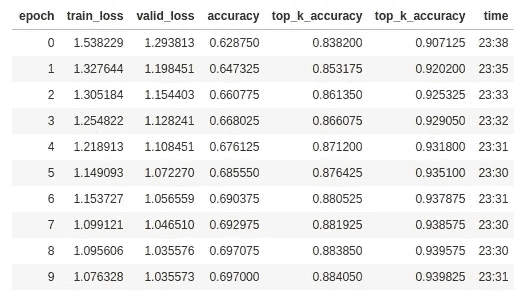

# 使用 FastAi 和 airy 的相似图片推荐

> 原文：<https://towardsdatascience.com/similar-images-recommendations-using-fastai-and-annoy-16d6ceb3b809?source=collection_archive---------14----------------------->

基于图像相似性的推荐，如上所示，是我们将要考虑的，给定一个基础图像，推荐视觉上相似的图像。基于图像的推荐在许多情况下非常方便，特别是在涉及用户视觉品味的情况下——服装、珠宝、配饰等。我们将使用 DeepFashion 数据集，其中有 **289，222 张服装图片**分布在 **42 个类别**。让我们快速看一下这个项目的工具箱。

[**FastAi**](https://github.com/fastai/fastai) **，【PyTorch 上的一个包装器，它使深度学习任务惊人地简单，并附带了所有最佳实践。**

[**PyTorch**](https://github.com/pytorch/pytorch) **，**深度学习库由脸书提供，我们将在我们的项目中使用 PyTorch 的一些功能。

****、**近似最近邻由 Spotify 开源实现，能够高效地索引和搜索特征向量。**

**这个项目的代码可以在这个 [jupyter 笔记本](https://jvn.io/gautham20/e6bd87b3597e4a12bb601216b4d2289d)中找到。**

# **嵌入或特征向量**

**嵌入或特征向量可以被认为是对象上的简洁的 n 维向量形式，其目的是捕获包含在对象中的大部分信息。在其 n 维特征空间中，当比较不同的对象时，相似的对象彼此更接近。**

**对于一幅图像，嵌入可以从**卷积神经网络** (CNN)中获得。CNN 能够理解/学习图像中包含的信息，在其每一层的不同细节层次上。初始卷积层理解诸如角、边等低级形状。而末端层理解图像中的复杂结构，人脸，建筑物等。基于任务。CNN 的末端层通常是完全连接的线性层。这些完全连接的层的输出被用作图像嵌入。**

****

**Image Embedding. CNN image source-[en.wikipedia.org/wiki/Convolutional_neural_network](https://en.wikipedia.org/wiki/Convolutional_neural_network)**

# **使用 FastAI 微调预训练的 Resnet152 模型**

**我们使用的 CNN 模型是在 [Imagenet 数据集](http://www.image-net.org/)上训练的[预训练 **Resnet152**](https://pytorch.org/docs/stable/torchvision/models.html) 用于图像分类。虽然这个模型可以直接用于获得嵌入，但使用 FastAi 对模型进行微调以适应深度时尚数据集将有助于模型更好地理解我们数据集的细微差别。这个过程叫做 [**迁移学习**](/a-comprehensive-hands-on-guide-to-transfer-learning-with-real-world-applications-in-deep-learning-212bf3b2f27a) 。**

**在 DeepFashion 类别预测任务上训练模型，取得了 88.4% 的**前 3 名准确率和 93.98%** 的**前 5 名准确率，优于 [DeepFashion 白皮书](https://www.cv-foundation.org/openaccess/content_cvpr_2016/papers/Liu_DeepFashion_Powering_Robust_CVPR_2016_paper.pdf)【1】中公布的基准分数。****

****

**Results of training resnet152 for 10 epochs**

**从这个微调的模型中提取特征向量。**

# **使用 PyTorch 钩子从模型中提取特征向量**

**根据 resnet152 架构，我们使用倒数第二个全连接层的输出作为嵌入，它们是维数为(512，1)的向量。
为了从 PyTorch 中的模型获得中间层的输出，我们使用了一个名为 Hook 的功能。可以添加钩子来从正向传递或反向传递中提取模型的中间值。**

**使用 PyTorch 钩子的最佳方法可以改编自 [FastAi 库代码](https://github.com/fastai/fastai/blob/master/fastai/callbacks/hooks.py)本身。**

**使用 Pytorch 钩子，我们为训练和有效数据集中的所有图像生成特征向量。**

# ****使用特征向量推荐相似图像****

**既然我们有了所有图像的特征向量，我们将不得不在给定一个基础图像的情况下得到相似的图像。最初，尝试一种简单的方法，给定一个基础图像，让计算它与数据集中所有其他图像的相似性得分，并获得前 n 个图像。**

**这种方法不可扩展，每个查询的复杂度为 O(N ),对于 249，222 张图像,大约需要 **10 秒的时间。为了将这种复杂性降低到亚线性时间，我们将使用**近似最近邻算法。**近似最近邻算法可以看作是精度和性能之间的权衡。《烦人》的作者 Eric Bernhardsson 在[的博客上发表了各种人工神经网络算法的基准比较。](https://erikbern.com/2018/02/15/new-benchmarks-for-approximate-nearest-neighbors.html)****

# **使用骚扰获得相似的图像**

****angry**(**A**approximate**N**earest**N**eighbor**O**h**Y**eah)是基于二叉树的 ANN 实现。对其工作原理的最佳解释可以在埃里克的文章中找到。**

****

**Annoy — binary tree traversal for a query, source-[erikbern.com/2015/10/01/nearest-neighbors-and-vector-models-part-2-how-to-search-in-high-dimensional-spaces.html](https://erikbern.com/2015/10/01/nearest-neighbors-and-vector-models-part-2-how-to-search-in-high-dimensional-spaces.html)**

**精度-性能的权衡由我们构建的二叉树的数量来控制，越多的树意味着越好的精度。我们将使用与数据集中的类数量相同的树。下面的代码用于构建索引。**

**现在让我们尝试查询恼人的指数。**

**使用 Annoy 的近似查询时间减少到了 **2ms** ，比简单的方法少了几个数量级。**

# ****相似图片推荐****

**下面再来几个通过查询骚扰指数得到的推荐。**

****

**Bridal Dresses**

****

**Hoodies**

****

**Girls tees**

****

**Men's pants**

# **资源**

**[1] [刘，罗，邱，王，唐。Deepfashion:通过丰富的注释支持强大的服装识别和检索。2016 年在 CVPR。](https://www.cv-foundation.org/openaccess/content_cvpr_2016/papers/Liu_DeepFashion_Powering_Robust_CVPR_2016_paper.pdf)**

**[恼人的解释—最近邻和向量模型—第 2 部分—算法和数据结构](https://erikbern.com/2015/10/01/nearest-neighbors-and-vector-models-part-2-how-to-search-in-high-dimensional-spaces.html)**

**[ANN 算法基准](https://erikbern.com/2018/02/15/new-benchmarks-for-approximate-nearest-neighbors.html)**

**希望这篇文章对你有所帮助，请在下面留下你的评论和想法。😊**