# 相似性度量—对文本文章评分

> 原文：<https://towardsdatascience.com/similarity-measures-e3dbd4e58660?source=collection_archive---------7----------------------->

许多现实世界的应用程序利用相似性度量来查看两个对象是如何联系在一起的。例如，我们可以在涉及计算机视觉和自然语言处理的应用程序中使用这些度量来查找和映射相似的文档。对于企业来说，一个重要的用例是将简历与职位描述相匹配，从而为招聘人员节省大量时间。另一个重要的用例是使用 K 均值聚类算法(也使用相似性度量)为营销活动细分不同的客户。

相似性通常是介于 0(无相似性)和 1(完全相似性)之间的正值。我们将具体讨论两个重要的相似性度量，即欧几里德和余弦，以及处理维基百科文章的编码示例。

## 欧几里得度量

你还记得毕达哥拉斯定理吗？？毕达哥拉斯定理用于计算两点之间的距离，如下图所示。

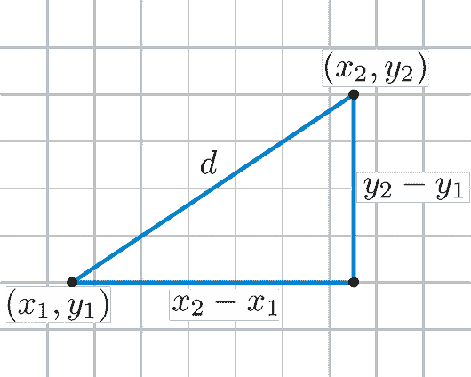

[http://rosalind.info/glossary/euclidean-distance/](http://rosalind.info/glossary/euclidean-distance/)

在图中，我们有两个数据点(x1，y1)和(x2，y2 ),我们感兴趣的是计算这两个点之间的距离或接近程度。为了计算距离，我们需要先从 x1 到 x2 水平移动，然后从 y1 到 y2 垂直向上移动。这就组成了一个直角三角形。我们对计算斜边 d 感兴趣，使用毕达哥拉斯定理可以很容易地计算出斜边 d。

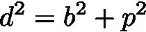

其中 b 是直角三角形的底边，p 是直角三角形的垂线。

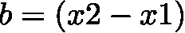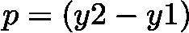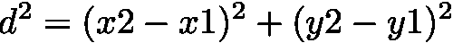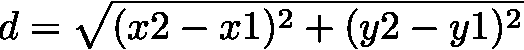

这就完成了我们二维空间中两点的欧氏距离公式。

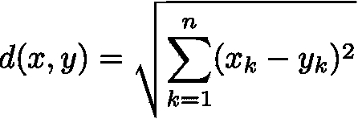

这定义了一维、二维、三维或更高维空间中两点之间的欧几里德距离，其中 n 是维数，x_k 和 y_k 分别是 x 和 y 的分量。

**定义欧氏距离的 Python 函数**

```
def euclidean_distance(x, y):   
    return np.sqrt(np.sum((x - y) ** 2))
```

这里 x 和 y 是两个向量。

也可以使用 sklearn 库来计算欧氏距离。这个函数在计算上更有效。

```
from sklearn.metrics.pairwise import euclidean_distances
```

距离越大，两个对象之间的相似性越低；距离越小，两个对象之间的相似度越高。要将这个距离度量转换为相似性度量，我们可以用最大距离除以对象的距离，然后减去 1，以得到 0 和 1 之间的相似性得分。在讨论了余弦度量之后，我们将看看这个例子。

## **余弦**公制

这是专门为文档寻找相似性的另一个度量。如图所示，此指标用于测量 x 和 y 之间的角度，当矢量的大小无关紧要时使用。

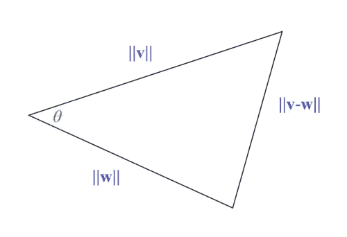

[https://en.wikipedia.org/wiki/Cosine_similarity](https://en.wikipedia.org/wiki/Cosine_similarity)

如果 v 和 w 之间的角度是 0 度，那么余弦相似度=1(完全相似)。

**点积余弦公式:**

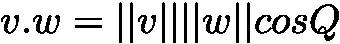

‖⋅‖表示矢量长度

𝐯和𝐰.之间的𝜃:角这里我们感兴趣的是测量 v 和 w 之间的相似性。

如果你想知道如何推导点积的余弦公式，请参考本页:[https://proofwiki.org/wiki/Cosine_Formula_for_Dot_Product.](https://proofwiki.org/wiki/Cosine_Formula_for_Dot_Product)这个点积公式是从你们在学校学过的余弦定律推导出来的。

**让我们用符号 x 和 y 代替 v 和 w。**

示例:

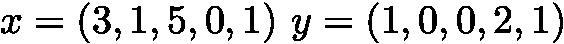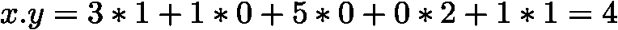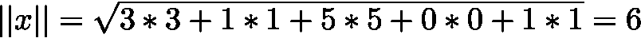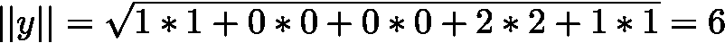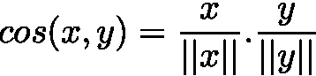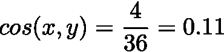

这两个向量具有低相似性，由 0.11 的值来解释。该值接近 0，这意味着 x 和 y 之间的角度接近 90 度。如果该值接近 1，那么这将是角度接近 0 度的非常相似的对象。

将 x 和 y 除以它们的长度，将其长度归一化为 1，这就是所谓的单位向量。这表明余弦相似性不考虑 x 和 y 的大小。当我们需要考虑大小时，欧几里得可能是更好的选择。

如果我们已经有了长度为 1 的向量，余弦相似性可以很容易地使用简单的点积来计算。因此，建议首先归一化矢量，使其具有单位长度，以减少计算时间。

**Python 函数定义余弦相似度**

```
def cosine_similarity(x, y):
    return np.dot(x, y) / (np.sqrt(np.dot(x, x)) * np.sqrt(np.dot(y, y)))
```

## 我应该使用哪个指标**？**

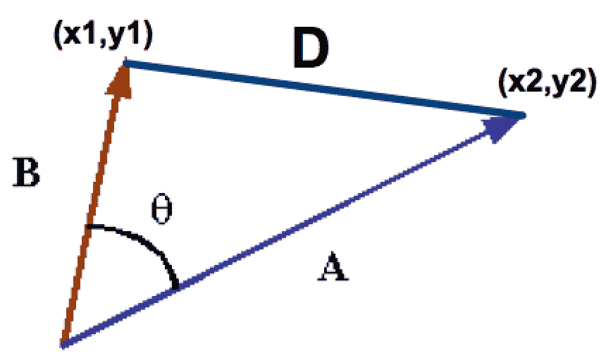

该图总结了欧几里德度量和余弦度量。

余弦着眼于两个向量之间的角度，忽略大小，而欧几里得着眼于直线距离，考虑向量的大小。

文本挖掘是我们可以利用余弦相似性来映射相似文档的领域之一。我们还可以使用它来根据给定的单词向量对文档进行排序，简历入围就是我们可以利用余弦相似度的用例之一。

让我们看一下我们需要匹配相似文档的问题，我们首先创建文档术语矩阵，它包含术语在文档集合中出现的频率。我们通常有不均匀长度的文档，例如维基百科的文章。假设单词 math 在文档 1 中比在文档 2 中出现得更多，在这种情况下，余弦相似度将是一个完美的选择，因为我们不关心文档的长度，而是它包含的内容。如果我们要考虑长度，那么欧几里得可能是一个完美的选择。

## 现在我们将使用 Python 编写简短的代码来映射类似的维基百科文章。

```
import wikipediaarticles=['Data Mining','Machine Learning','Cricket','Swimming','Tennis']
wiki_lst=[]for article in articles:
    print(article)
    wiki_lst.append(wikipedia.page(article).content)
```

在这里，我们刚刚从 5 篇维基百科文章中提取了内容。

```
from sklearn.feature_extraction.text import CountVectorizer
cv = CountVectorizer()
X=cv.fit_transform(wiki_lst)
```

计数矢量器只是将文档集合转换成字数矩阵。

现在让我们使用欧几里德度量来找出我们的文章是相似的。这里，我们将这些欧几里得距离归一化为 0 到 1，然后减去 1，使其范围在 0 到 1 之间。因此，它越接近 1，相似性越高。

```
from sklearn.metrics.pairwise import euclidean_distances
print("Data Mining and Machine Learning",1-euclidean_distances(X[0],X[1])/np.max((euclidean_distances(X))))
print("Data Mining and Cricket",1-euclidean_distances(X[0],X[2])/np.max((euclidean_distances(X))))
print("Data Mining and Swimming",1-euclidean_distances(X[0],X[3])/np.max((euclidean_distances(X))))
print("Data Mining and Tennis",1-euclidean_distances(X[0],X[4])/np.max((euclidean_distances(X))))
```

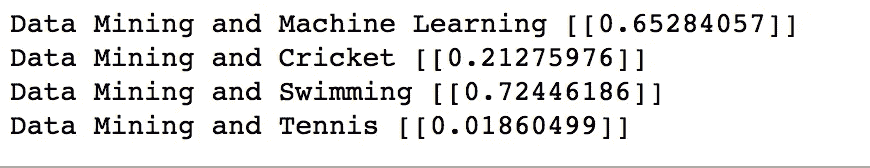

这两篇文章(数据挖掘游泳)怎么最像？这没有任何意义。现在让我们试试余弦相似度。

```
from sklearn.metrics.pairwise import cosine_similarity
print("Data Mining and Machine Learning",cosine_similarity(X[0],X[1]))
print("Data Mining and Cricket",cosine_similarity(X[0],X[2]))
print("Data Mining and Swimming",cosine_similarity(X[0],X[3]))
print("Data Mining and Tennis",cosine_similarity(X[0],X[4]))
```

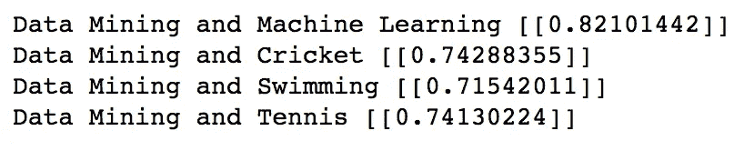

这对我们来说是有意义的。数据挖掘非常接近机器学习。

## **结论**

欧几里得度量在这里似乎集中于长度而不是内容，而余弦集中于内容而忽略了幅度。

**参考文献**

【https://proofwiki.org/wiki/Cosine_Formula_for_Dot_Product?】[1]T4source = post _ page-E3 DBD 4 e 58660-

[【2】https://cmry.github.io/notes/euclidean-v-cosine?source = post _ page-E3 DBD 4 e 58660-](https://cmry.github.io/notes/euclidean-v-cosine?source=post_page-----e3dbd4e58660----------------------)