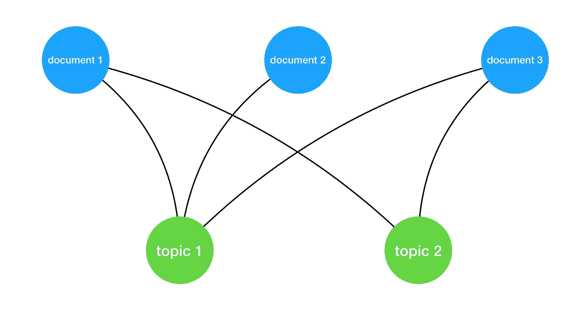

# 随机游走文档的相似性

> 原文：<https://towardsdatascience.com/similarity-of-documents-with-random-walks-98f94fd2c76c?source=collection_archive---------20----------------------->

## Python 代码和解释，用于计算带有重启的随机行走的图中节点的相似性

考虑具有 5 个节点的无向图，其中节点的连接如下。



Document-topic assignment graph

我们看到有两种类型的节点。一类是*文档*另一类是*题目。*在这篇博客文章中，我将解释如何使用重启随机漫步来计算基于主题的文档之间的相似性。您还可以想到一个更大的图，它的节点类型是*单词*而不是*主题*，其连接告诉我们哪个单词出现在哪个文档中。为了简单起见，我将选择主题。

## 随机行走

现在想象我们站在文档 1 的节点上，随机(统一)决定走哪条边到达另一个节点。因为我们只有两条边，所以我们去*主题 1* 的概率是 0.5，就像我们去*主题 2* 的概率一样。我们总共有 1 英镑。

如果我们对所有的节点进行这样的想象，我们最终会得到一个矩阵 M，它的起点是列，概率在相应的行中。这个矩阵可以用 python 创建，代码如下:

```
**import** numpy **as** np

M = np.array([
    [0, 0, 0, 1./3., 0.5],
    [0, 0, 0, 1./3., 0],
    [0, 0, 0, 1./3., 0.5],
    [0.5, 1, 0.5, 0, 0],
    [0.5, 0, 0.5, 0, 0]
])
```

通常的随机漫步不会只有一步，而是两步。因此，两步后，您从*文档 1* 到达节点*文档 3* 的概率就是这些概率的组合。为了计算一个步行者在两步后到达的概率，下面的脚本会有所帮助。

```
v = np.array([1., .0, .0, .0, .0]) # starting point
**for** step **in** range(n):
    v = np.dot(M, v)
```

变量 v 告诉我们当前节点的概率。因为我们从*文档 1* 开始，所以在该节点的概率是 100%。点乘取这个概率，并与下一个可能节点的概率执行向量乘法。因此，我们得到一个向量，它告诉我们，基于我们之前去过的地方的概率，我们可能到达的地方的概率。对于第一步，这只是 m 的第一列。从那里开始，我们可以在*主题 1* 或*主题 2* 处，并且必须将这个概率乘以下一个路径的概率。

## 重新启动

带重启的随机行走算法包括重启的概念。在这里，一个步行者有β的概率继续行走而不需要重新开始，因此 1-β再次传送到它的起点并从那里开始行走。这有助于探索更多样化的道路。

实现相当容易。我们不只是用转移矩阵 M 乘以我们现在可能在哪里的概率，而是包括我们在开始节点结束的概率。

```
start = np.array([1., .0, .0, .0, .0]) # starting point
v = start
**for** step **in** range(n):
    v = beta*np.dot(M, v) + (1-beta)*start
```

因此，我们将通常的步行乘以β，并加上到达起点的剩余机会(1-β)。

## 实验

如果我们进行 n 步随机行走，我们得到以下概率:

```
array([0.34461028, 0.06633499, 0.14461028, 0.24875622, 0.19568823])
```

它们会告诉我们可能会到达哪个节点。有 34%的概率我们会再次回到起点，7%的概率我们会在*文档 2* 、*处，14%的概率我们会在*文档 3* 处，依此类推。因此，出现在*文档 3* 的概率是*文档 2* 的两倍，因此我们可以说*文档 1* (我们的起点)与*文档 3* 的相似度是*文档 2* 的两倍。*

## 结论

由于事先的题目分配，已经清楚*文件 3* 与*文件 1* 相似。无论如何，这个简单的例子可以推广到更复杂的图形和实体之间的关系。结合简单的实现，这是一种计算相似性的好方法。