# 使用 Python 进行简单和多元线性回归

> 原文：<https://towardsdatascience.com/simple-and-multiple-linear-regression-with-python-c9ab422ec29c?source=collection_archive---------1----------------------->

**线性回归**是对单个**因变量**(目标变量)和一个(简单回归)或多个(多元回归)**自变量**之间的关系进行建模的方法。线性回归模型假设输入和输出变量之间存在线性关系。如果存在这种关系，我们就可以估计模型对新数据进行预测所需的系数。

在本文中，您将学习如何使用多个库，如 **Pandas** 、 **Numpy** 、 **Scikit-Learn** 、**、**和 **Scipy** ，从零开始在 **Python** 中可视化和实现**线性回归算法**。此外，我们将使用**皮尔森** **相关系数**来衡量两个变量之间线性关系的方向和强度，以及使用**均方差**等评估指标来衡量线性回归模型的预测精度。

现在！我们开始吧💜

# 数据集的分析

本文使用的**数据集**是在 [**Kaggle**](https://www.kaggle.com/) 中获取的。 [**Kaggle**](https://www.kaggle.com/) 是一个数据科学家和机器学习者的在线社区，在这里可以找到各种各样的**数据集**。所选的**数据集**包含 5000 名男性和 5000 名女性的身高和体重，可通过以下链接下载:

 [## 你的数据科学之家

### 编辑描述

www.kaggle.com](https://www.kaggle.com/mustafaali96/weight-height/downloads/weight-height.zip/1) 

第一步是使用 [**熊猫**](https://pandas.pydata.org/) 导入数据集。 [**Pandas**](https://pandas.pydata.org/) 是一个用于**数据科学**的 **Python** 开源库，允许我们轻松处理结构化数据，如 **csv 文件**、 **SQL 表**或 **Excel 电子表格**。导入 csv 文件后，我们可以打印数据集的前五行、每列的数据类型以及空值的数量。

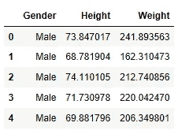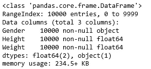

正如我们可以很容易地观察到的那样，**数据帧**包含三列:性别、身高和体重。性别列包含 object 类型的两个唯一值:男性或女性。高度和重量列中使用了浮点数据类型。由于**数据帧**不包含空值，并且数据类型是预期的类型，因此没有必要清理数据。

为了更好地理解身高和体重这两个变量的分布，我们可以简单地用直方图来描述这两个变量。**直方图**是显示数字变量分布的图表，将数据分组到多个条块中。条形的高度代表每个箱的观察数量。

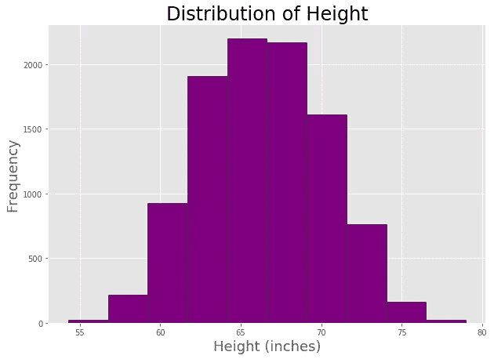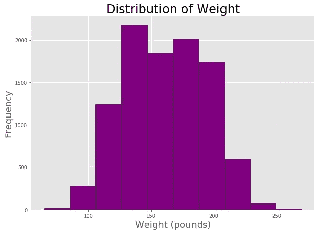

前面的图表显示，身高和体重这两个变量呈现出**正态分布**。作为我们**探索性分析**的一部分，在单独的**直方图**中绘制男性和女性的分布也是很有趣的。

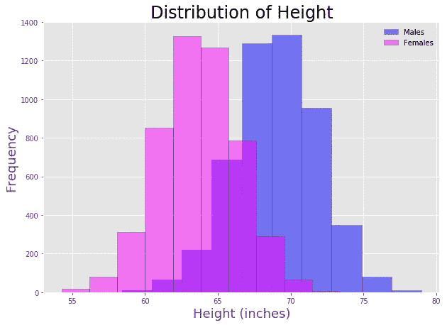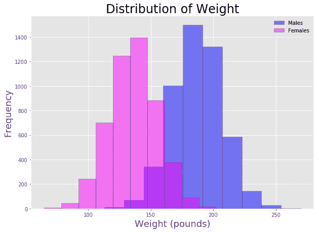

前面的图显示，男性和女性的身高和体重都呈现出**正态分布**。虽然两种分布的平均值**对于男性来说更大，但是**两种性别的分布范围**是相似的。 **Pandas** 提供了一个名为 **describe** 的方法，用于生成数据集的描述性统计数据(集中趋势、分散和形状)。**

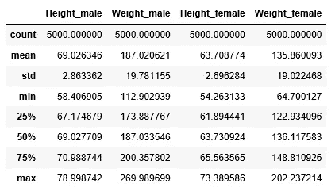

**探索性数据分析**包括分析数据集的主要特征，通常采用**可视化方法**和**汇总统计**。目标是理解数据，发现模式和异常，并在我们执行进一步评估之前检查假设。经过探索性分析，我们可以得出结论:身高和体重是正态分布。男性分布呈现出较大的平均值，但是与女性分布相比，分布的扩散确实是相似的。

但也许此时你会问自己:身高和体重有关系吗？我可以用一个人的身高来预测他的体重吗？

两个问题的答案都是肯定的！😃 💪让我们继续▶️ ▶️

# 使用 Matplotlib 的散点图和使用 Numpy 的线性回归

**散点图**是一种二维数据可视化，显示两个数值变量之间的关系——一个沿 x 轴绘制，另一个沿 y 轴绘制。 [**Matplotlib**](https://matplotlib.org/) 是一个 Python 2D 绘图库，包含一个内置函数来创建散点图**Matplotlib . py plot . scatter()**函数。

下图显示了男性和女性的身高和体重之间的关系。可视化包含 10000 个观察结果，这就是为什么我们观察到**过度绘制**。**当数据在可视化中重叠时，会出现过度绘制**，使得难以可视化单个数据点。在这种情况下，原因是大量的数据点(5000 个男性和 5000 个女性)。另一个原因可能是少量的唯一值；例如，当散点图的一个变量是离散变量时。

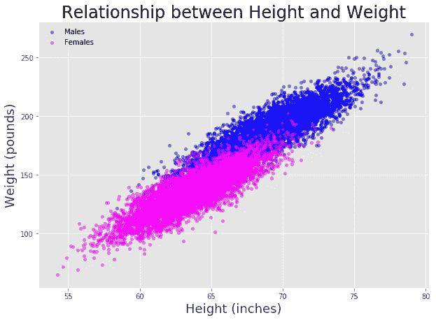

在下面的图中，我们随机选取了 500 名女性的身高和体重。该图没有**过度绘制**，我们可以更好地区分各个数据点。正如我们在前面的图中所观察到的，雄性和雌性的体重随着身高的增加而增加，在两种情况下都显示出线性关系。

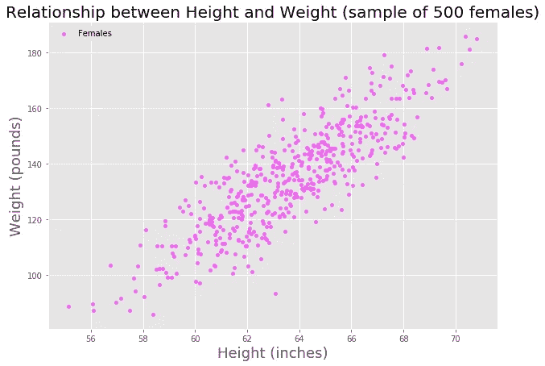

**简单线性回归**是一种对**因变量**和**自变量**之间的关系进行建模的线性方法，可获得最符合数据的直线。

> y =a+bx

其中 **x** 为**自变量**(身高) **y** 为**因变量**(体重) **b** 为**斜率**， **a** 为**截距。****截距**表示 x 为 0 时 y 的值，而**斜率**表示直线的陡度。目标是获得最符合我们数据的线(**最小化误差平方和的线**)。误差是实际值 **y** 和预测值 **y_hat** 之间的差值，预测值是使用计算的线性方程得到的值。

> 误差= y(真实)-y(预测)= y(真实)-(a+bx)

使用 [**Numpy**](https://numpy.org/) 我们很容易得到这条线。 [**Numpy**](https://numpy.org/) 是一个用于科学计算的 python 包，它提供了高性能的多维数组对象。numpy 函数 polyfit [**numpy.polyfit(x，y，deg)**](https://docs.scipy.org/doc/numpy/reference/generated/numpy.polyfit.html) 将一个次数为 *deg* 的多项式拟合到点 *(x，y)，*返回最小化平方误差的多项式系数。在下面几行代码中，我们获得了预测女性和男性体重的多项式。

下图描述了散点图以及之前的回归线。

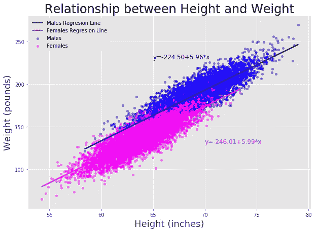

# 带有 seaborn 的散点图和线性回归线

[Seaborn](https://seaborn.pydata.org/) 是基于 [matplotlib](https://matplotlib.org/) 的 Python 数据可视化库。我们可以使用[**seaborn . reg plot**](https://seaborn.pydata.org/generated/seaborn.regplot.html)函数轻松地用 seaborn 创建回归图。与之前的方法相比，所需的线路数量要少得多。

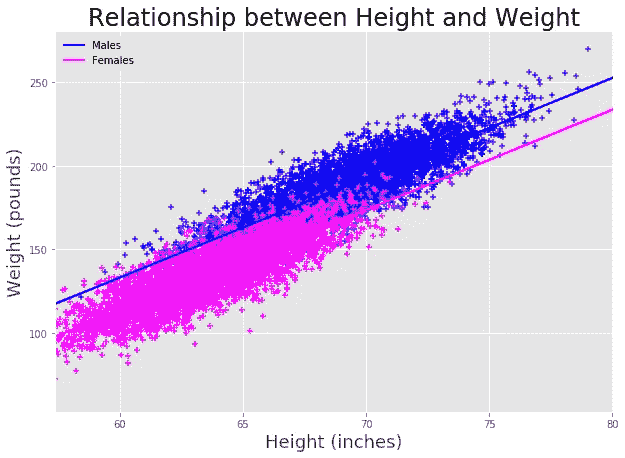

前面的图显示了绘制 10000 个样本时的过度绘制。该图显示了男性和女性的身高和体重之间的正线性关系。为了更直观，下图显示了 300 个随机选择的样本的回归图。

# 使用 sklearn 拟合简单的线性模型

[**Scikit-learn**](https://scikit-learn.org/stable/) 是一个免费的 python 机器学习库。我们可以使用 linear regression 类通过 Scikit-learn 轻松实现线性回归。创建线性回归对象后，我们可以通过调用 fit 方法来获得最适合我们的数据的直线。

使用 **Sklearn** 线性回归获得的值与之前使用 **Numpy** polyfit 函数获得的值相匹配，因为两种方法都计算使**平方误差**最小的直线。如前所述，误差是因变量的实际值与模型预测值之间的差异。最小平方误差通过最小化**平方误差**的总和 S 找到最佳参数值。

一旦我们拟合了模型，我们就可以使用预测方法进行预测。我们还可以通过使用 [**polyval**](https://docs.scipy.org/doc/numpy/reference/generated/numpy.polyval.html) 函数，使用 **Numpy** 中计算的多项式进行预测。使用 **Scikit Learn** 和 **Numpy** 获得的预测是相同的，因为这两种方法使用相同的方法来计算拟合线。

# 皮尔逊相关系数

**相关性**衡量两个变量相关的程度。**皮尔逊相关系数**用于衡量两个变量之间线性关系的**强度**和**方向**。该系数的计算方法是将变量的 [**协方差**](https://en.wikipedia.org/wiki/Covariance) 除以其 [**标准差**](https://en.wikipedia.org/wiki/Standard_deviation)****的乘积，其值介于+1 和-1 之间，其中 1 表示完全正线性相关，0 表示没有线性相关，1 表示完全负线性相关。****

****我们可以通过使用 [**获得一个数据帧的变量的**相关系数**。**corr()](https://pandas.pydata.org/pandas-docs/stable/reference/api/pandas.DataFrame.corr.html)法。默认情况下，计算皮尔逊相关系数；然而，也可以计算其他相关系数，例如 Kendall 或 Spearman 相关系数。****

**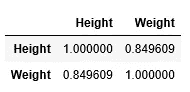****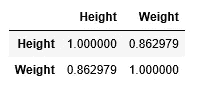**

**解释相关系数大小的经验法则如下:**

*   **1–0.8→非常强**
*   **0.799–0.6→强**
*   **0.599–0.4→中等**
*   **0.399–0.2→弱**
*   **0.199–0→非常弱**

**在之前的计算中，我们已经获得了大于 0.8 的**皮尔逊** **相关系数**，这意味着身高和体重对于男性和女性来说都是高度相关的。**

**我们也可以使用 **Scipy** 的 **stats** 包计算**皮尔逊相关系数**。函数[**scipy . stats . Pearson r(*x*， *y* )**](https://docs.scipy.org/doc/scipy-0.14.0/reference/generated/scipy.stats.pearsonr.html) 返回两个值 **Pearson 相关系数**和 **p 值**。**

**可以看出，使用**熊猫**和 **Scipy** 的**相关系数**是相同的:**

*   **雌性相关系数:0.849608**
*   **男性相关系数:0.8629788**

# **残差图**

**我们可以使用数值，如**皮尔逊相关系数**或可视化工具，如**散点图**来评估线性回归是否适合预测数据。进行这种评估的另一种方法是使用残差图。残差图显示实际值和预测值之间的差异。如果残差图中的点随机分布在水平轴周围，则线性回归模型适用于该数据；否则，非线性模型更合适。**

**我们可以使用 **Seaborn** 创建**残差图**，如下所示:**

**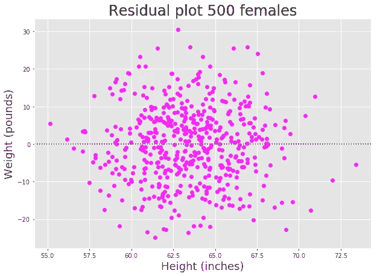****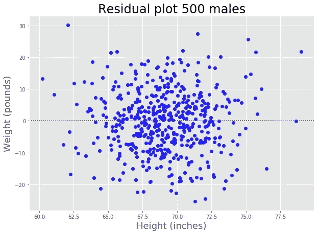**

**正如我们所见，这些点随机分布在 0 附近，这意味着线性回归是预测我们数据的合适模型。如果残差图呈现曲率，则线性假设是不正确的。在这种情况下，非线性函数将更适合预测数据。**

# **多元线性回归**

****简单线性回归**使用线性函数来预测目标变量 **y** 的值，该函数只包含一个自变量 **x₁** 。**

> **y =b ₀+b ₁x ₁**

**在将线性方程拟合到观测数据后，我们可以获得最符合数据的参数 **b₀** 和 **b₁** 的值，最小化**平方误差**。**

**之前，我们已经计算了两个线性模型，一个用于男性，另一个用于女性，以根据人的身高预测体重，获得了以下结果:**

*   **男性→体重=-224.50+5.96 *身高**
*   **女性→体重=-246.01+5.99 *身高**

**到目前为止，我们已经采用了一个独立变量来预测人的体重 ***【体重= f(身高)*** ，创建了两个不同的模型。也许你在想💭❓:我们可以用身高和性别作为独立变量建立一个预测体重的模型吗？答案是肯定的！😄⭐️，这就是多元线性回归发挥作用的地方！**

****多元线性回归**使用线性函数预测目标变量 **y** 的值，包含函数 **n** 自变量**x=[x₁,x₂,x₃,…,xₙ】**。**

> **y = b ₀+b ₁x ₁+b**₂x₂+b₃x₃+…+**b**ₙ**x**ₙ****

**我们使用与简单线性回归相同的技术(**最小平方误差**)获得参数 **bᵢ** 的值。拟合模型后，我们可以用方程预测目标变量 **y** 的值。在我们的例子中，我们用身高和性别来预测一个人的体重 ***体重= f(身高，性别)。*****

# **多元线性回归中的分类变量**

**统计学中使用的变量有两种:**数值型**和**分类变量**。**

*   ****数字变量**代表可以测量并按升序和降序排序的值，如人的**身高**。**
*   ****分类变量**是可以分组或分类的值，例如一个人的**性别**。**

****多元线性回归**不仅接受**数值变量**，还接受**分类变量**。要将**分类变量**包含在回归模型中，变量必须编码为**二进制变量(虚拟变量)**。在 **Pandas** 中，我们可以使用[**Pandas . get _ dummies**](https://pandas.pydata.org/pandas-docs/stable/reference/api/pandas.get_dummies.html)函数轻松地将**分类变量**转换为**哑变量**。该函数返回一个伪编码数据，其中 1 表示分类变量存在，0 表示不存在。**

**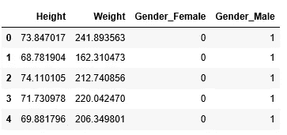**

**为了避免多重共线性，我们必须删除其中一个虚拟列。**

**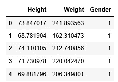**

**然后，我们可以使用这个数据框架，使用 **Scikit-learn** 获得一个**多元线性回归**模型。**

**在拟合线性方程后，我们得到以下多元线性回归模型:**

*   **体重=-244.9235+5.9769 *身高+19.3777 *性别**

**如果我们想预测一个男性的体重，性别值是 1，得到下面的等式:**

*   **男→体重=-244.9235+5.9769 *身高+19.3777 * 1 =-225.5458+5.9769 *身高**

**对于女性，性别值为 0。**

*   **女→体重=-244.9235+5.9769 *身高+19.3777 * 0 =-244.9235+5.9769 *身高**

**如果我们比较简单线性模型和多元线性模型，我们可以观察到类似的预测结果。多元线性回归模型的性别变量只改变直线的截距。🙌**

# **关键要点**

1.  ****简单线性回归**是对一个**因变量**和一个**自变量**之间的关系进行建模的线性方法。**
2.  ****多元线性回归**使用线性函数来预测包含函数 **n** 自变量的**因变量**的值。**
3.  ****探索性数据分析**包括分析数据集的主要特征，通常采用**可视化方法**和**汇总统计**。**
4.  ****直方图**是显示数值变量分布的图表，将数据分组到箱中。**
5.  ****Pandas** 提供探索性数据分析的方法和函数，如 **Dataframe.describe()、Dataframe.info()、Dataframe.dtypes 和 Dataframe.shape.****
6.  ****散点图**是二维数据可视化，显示两个数值变量之间的关系——一个沿 x 轴绘制，另一个沿 y 轴绘制。 **Matplotlib** 和 **Seaborn** 提供了绘制散点图的内置函数。**
7.  **我们可以使用诸如 **Numpy** 或 **Scikit-learn** 之类的库来拟合一个**简单线性回归**模型。**
8.  ****相关性**衡量两个变量相关的程度。**皮尔逊相关系数**用于衡量**强度**和**方向**两个变量之间的线性关系。**
9.  ****残差图**可用于分析**线性回归模型**是否适用于数据。**
10.  ****分类变量**必须转换成**虚拟变量**才能在**多元线性回归模型**中使用。**

**感谢阅读🙌 😍 😉 🍀**