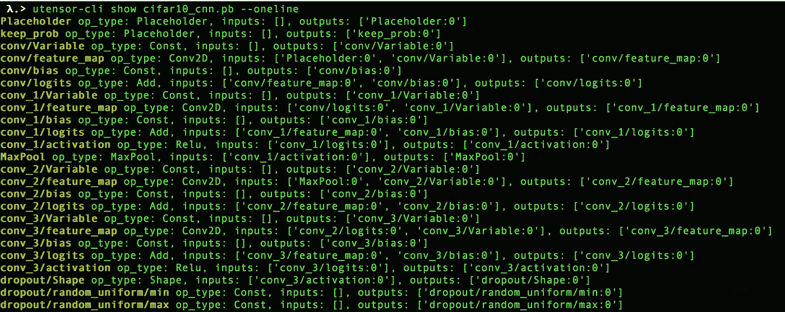
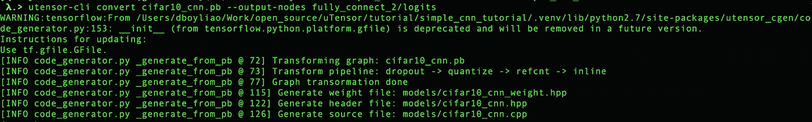
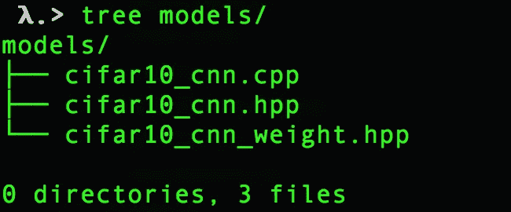
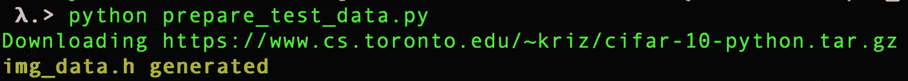
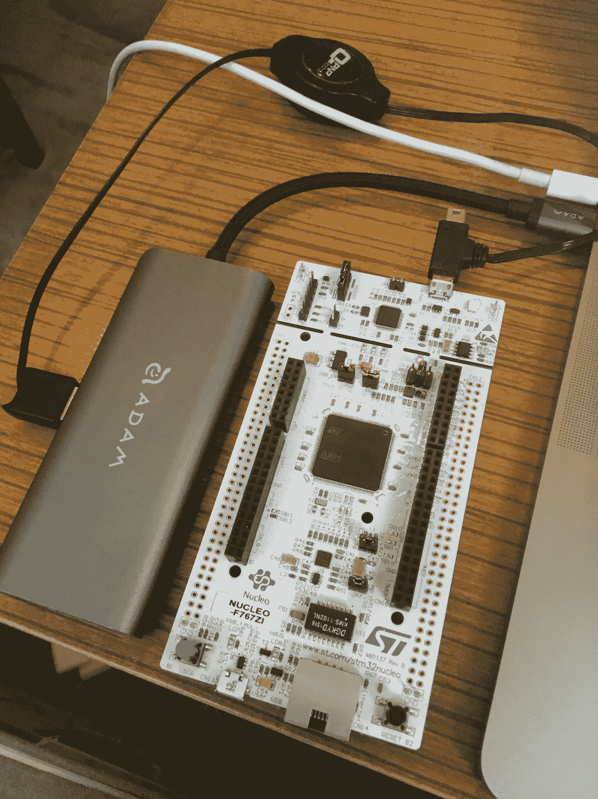
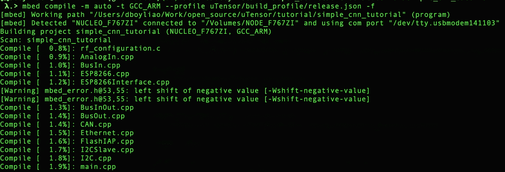
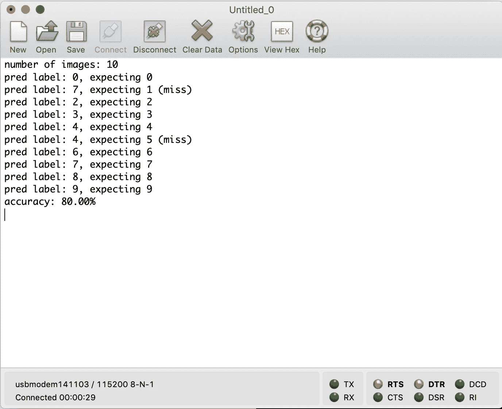

# 使用 uTensor 在 MCU 上运行卷积神经网络的端到端教程

> 原文：<https://towardsdatascience.com/simple-cnn-on-mcu-with-utensor-372265ecc5b4?source=collection_archive---------14----------------------->

我试图在 uTensor 上展示 CNN，但在 2018 年的台湾 COSCUP 上没有成功。问题是，我不小心给所有的输入类输入了相同的图像，这和随机猜测一样好。在 CIFAR10 上，这产生了大约 10%准确度。尽管事实上分类器确实在工作！

这是 CNN 关于 uTensor 的背景故事。

在这篇文章中，我将指导你如何用 uTensor 构建一个 CNN。我们将使用`utensor-cli`将 Tensorflow 中训练的简单 CNN 无缝转换为等效的 uTensor 实现，在 MCU(具体来说是 STM32F767)上编译和运行。

如果你是 uTensor 的新手，在继续之前，你可能想读一读由 uTensor 核心开发者之一， [Neil Tan](https://medium.com/u/4477866e81dd?source=post_page-----372265ecc5b4--------------------------------) 撰写的这篇 [**伟大的 MLP 教程**](https://blog.hackster.io/simple-neural-network-on-mcus-a7cbd3dc108c) 。

好了，我们开始吧！

# 获取演示代码

首先，克隆回购:

```
% git clone [https://github.com/uTensor/simple_cnn_tutorial.git](https://github.com/uTensor/simple_cnn_tutorial.git)
% cd simple_cnn_tutorial
```

接下来，通过运行以下命令来设置环境:

```
# setup a python virtual environment and activate it
% python2.7 -m virtualenv .venv
% source .venv/bin/activate# install mbed-cli and setup libraries
% pip install mbed-cli
% mbed deploy# install uTensor cli *after* setting up the libraries
% pip install utensor_cgen==0.3.3.dev2
```

安装完成后，如果没有其他错误，就可以开始了。

在回购中，有几个 python 脚本您可能想研究一下:

*   `model.py`是构建 CNN 图表的脚本。
*   `train.py`是训练脚本。如果你想自己训练一个，你可以运行`python train.py --help`来查看所有可用的超参数。在本教程中，我们将使用一个预先训练好的 protobuf 文件，`cifar10_cnn.pb`。
*   `cifar10_cnn.pb`是我们将在本教程中使用的预训练模型。
*   `prepare_test_data.py`是一个 python 脚本，它将为您生成`img_data.h` ，这是在 MCU 上运行测试的数据。

如果您想立即看到结果，您可以连接开发板并运行`make compile`。它应该编译和闪存图像到您的开发板。然后按照 [Neil Tan](https://medium.com/u/4477866e81dd?source=post_page-----372265ecc5b4--------------------------------) 的[教程](https://blog.hackster.io/simple-neural-network-on-mcus-a7cbd3dc108c)中“获取输出”部分的说明进行操作。

# 从 Tensorflow 到 uTensor

用`utensor-cli`激活虚拟环境。我们将首先识别输出节点，然后从模型中生成 C++文件。

检查图形并找到输出节点:`utensor-cli show <model.pb>`

该命令显示给定模型文件中的所有操作/节点。例如，如果您运行`utensor-cli show cifar10_cnn.pb --oneline`，您将在终端上看到以下内容:



如您所见，该命令打印出给定`cifar10_cnn.pb`中的所有图节点。

当我们想将 protobuf 文件转换成 uTensor C++文件时，需要提供一个带有`--output-nodes`选项的输出节点列表。与其他工具如`tensorboard`相比，`show`命令对于探索模型是有用的和轻量级的。

在`cifar10_cnn.pb`中，`fully_connect_2/logits`就是我们要找的。它是这个模型中的输出节点。

然后，使用`convert`命令将文件转换成 C++文件:

```
% utensor-cli convert cifar10_cnn.pb --output-nodes \
fully_connect_2/logits
```

您将在控制台上看到:



此时，您应该在`models`目录中找到您的模型的 uTensor 实现，它是由`utensor-cli`生成的。



最后，通过运行以下命令生成一批测试图像:

```
% python prepare_test_data.py # generate testing image batch
```



它只需下载 cifar10 数据集，并随机生成一批图像进行测试。您可以在`img_data.h`中看到像素值(标准化为[0，1])。

# 看，美国有线电视新闻网在 MCU 上

在`main.cpp`中，您可以看到如何使用 cli 生成的模型文件。简要总结:

1.  创建一个`Context`对象
2.  在本教程中，使用 cli 生成的助手函数构建神经网络。
3.  获取您想要用于推理的张量。
4.  评估神经网络。

注意`uTensor`将在评估后清除参考计数为 0 的张量。如果你在神经网络评估后得到张量**，你会得到一个错误或悬空指针问题。**

好了，编码的东西够多了。有趣的部分来了，我们准备在 MCU 上编译和运行 CNN。

首先，将开发板连接到计算机上:



My NUCLEO-F767ZI

接下来，运行:

```
% mbed compile -m auto -t GCC_ARM --profile \
uTensor/build_profile/release.json -f
```

*   `mbed`将自动检测您的开发板型号，带有`-m auto`标志。
*   使用概要文件构建二进制文件，在本教程中为`release.json`。
*   并将二进制映像闪存到您的主板，并启用`-f`标志。

如果一切顺利，您应该会看到:



可能需要一段时间才能完成，耐心一点就好；)

为了看到我的 NUCLEO-F767ZI 的串行输出，我使用了 CoolTerm(你可以从[这里](http://freeware.the-meiers.org/)下载)。按照[尼尔·谭](https://medium.com/u/4477866e81dd?source=post_page-----372265ecc5b4--------------------------------)的[教程](https://blog.hackster.io/simple-neural-network-on-mcus-a7cbd3dc108c)中所述设置 CoolTerm，并按下重置按钮，您应该会看到:



精确度可能因您使用`prepare_test_data.py`生成的随机图像批次而异。如果你这一批运气不好，就试试另一批:P

恭喜你。我们的 CNN 在 MCU 上直播。

# 下一步是什么

[**助理团队**](https://github.com/orgs/uTensor/people) 非常活跃，试图将数据科学带入边缘计算领域。

在本教程中，我们提供了一个展示案例，您可以使用 uTensor 和其他神经网络框架(如 Tensorflow)进行端到端应用。

如果你是 PyTorch 的忠实粉丝，想知道 PyTorch 是否在 uTensor 的路线图上，不要担心。我也是 PyTorch 的粉丝，我们的团队正在努力让 PyTorch 与 Tensor 集成，就像我们与 Tensorflow 集成一样。我们正在取得进展，但欢迎你加入。

你可以在[https://github.com/uTensor](https://github.com/uTensor)找到代码，有两个回购你应该先通过:

*   [助手](https://github.com/uTensor/uTensor):c++运行时
*   ❤用 python 写的 uTensor CLI

最后，特别感谢[尼尔·谭](https://medium.com/u/4477866e81dd?source=post_page-----372265ecc5b4--------------------------------)和 [](https://www.linkedin.com/in/tsung-yu-hsieh-017b1466/) [卡扎米](https://medium.com/u/263e69d858c1?source=post_page-----372265ecc5b4--------------------------------)给我的有用建议和帮助我调试本教程。