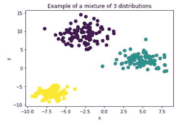
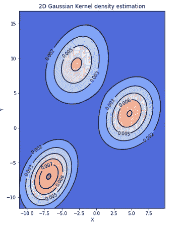
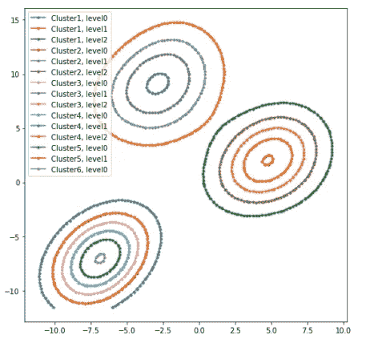
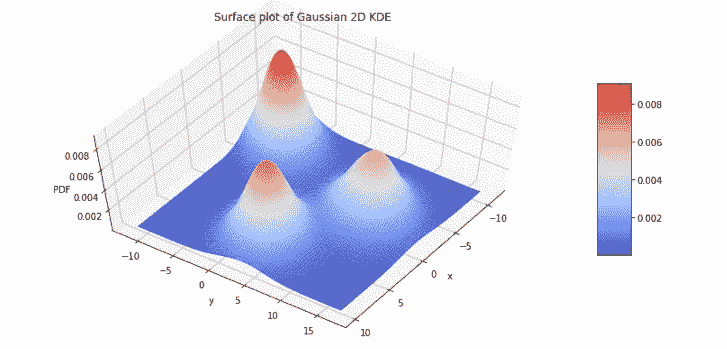
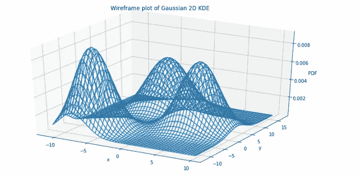
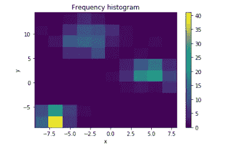

# python 中 2D 密度图的简单示例

> 原文：<https://towardsdatascience.com/simple-example-of-2d-density-plots-in-python-83b83b934f67?source=collection_archive---------0----------------------->

## 如何可视化联合分布


这篇文章将向你展示如何:

*   使用高斯核估计两个分布的概率密度函数
*   使用 Matplotlib 用密度图周围带标签的等高线来表示 PDF
*   如何提取等高线
*   如何在 3D 中绘制上面的高斯核
*   如何使用 2D 直方图绘制相同的 PDF

让我们从生成包含 3 个斑点的输入数据集开始:

```
import numpy as np
import matplotlib.pyplot as plt
import scipy.stats as st
from sklearn.datasets.samples_generator import make_blobsn_components = 3
X, truth = make_blobs(n_samples=300, centers=n_components, 
                      cluster_std = [2, 1.5, 1], 
                      random_state=42)plt.scatter(X[:, 0], X[:, 1], s=50, c = truth)
plt.title(f"Example of a mixture of {n_components} distributions")
plt.xlabel("x")
plt.ylabel("y");
```



为了拟合高斯核，我们指定一个网格，该网格将在每个轴上使用 100 点插值(例如，mgrid(xmin:xmax:100j)):

```
# Extract x and y
x = X[:, 0]
y = X[:, 1]# Define the borders
deltaX = (max(x) - min(x))/10
deltaY = (max(y) - min(y))/10xmin = min(x) - deltaX
xmax = max(x) + deltaXymin = min(y) - deltaY
ymax = max(y) + deltaYprint(xmin, xmax, ymin, ymax)# Create meshgrid
xx, yy = np.mgrid[xmin:xmax:100j, ymin:ymax:100j]
```

我们将使用 scipy 的 *gaussian_kde* 方法来拟合高斯内核:

```
positions = np.vstack([xx.ravel(), yy.ravel()])
values = np.vstack([x, y])
kernel = st.gaussian_kde(values)
f = np.reshape(kernel(positions).T, xx.shape)
```

# 用带注释的轮廓绘制内核

```
fig = plt.figure(figsize=(8,8))
ax = fig.gca()
ax.set_xlim(xmin, xmax)
ax.set_ylim(ymin, ymax)
cfset = ax.contourf(xx, yy, f, cmap='coolwarm')
ax.imshow(np.rot90(f), cmap='coolwarm', extent=[xmin, xmax, ymin, ymax])
cset = ax.contour(xx, yy, f, colors='k')
ax.clabel(cset, inline=1, fontsize=10)
ax.set_xlabel('X')
ax.set_ylabel('Y')
plt.title('2D Gaussian Kernel density estimation')
```



完成整个魔术的 matplotlib 对象被称为 QuadContour set(代码中的 *cset* )。我们可以通过迭代 *allsegs* 对象来编程访问轮廓线。计算标签可从*标签文本*访问。

```
plt.figure(figsize=(8,8))for j in range(len(cset.allsegs)):
    for ii, seg in enumerate(cset.allsegs[j]):
        plt.plot(seg[:,0], seg[:,1], '.-', label=f'Cluster{j}, level{ii}')plt.legend()
```



# 三维 KDE 图

我们将使用来自 mplot3d 的 matplotlib 的 axes3d。我们可以将密度绘制成一个表面:

```
fig = plt.figure(figsize=(13, 7))
ax = plt.axes(projection='3d')
surf = ax.plot_surface(xx, yy, f, rstride=1, cstride=1, cmap='coolwarm', edgecolor='none')
ax.set_xlabel('x')
ax.set_ylabel('y')
ax.set_zlabel('PDF')
ax.set_title('Surface plot of Gaussian 2D KDE')
fig.colorbar(surf, shrink=0.5, aspect=5) # add color bar indicating the PDF
ax.view_init(60, 35)
```



或者作为线框:

```
fig = plt.figure(figsize=(13, 7))
ax = plt.axes(projection='3d')
w = ax.plot_wireframe(xx, yy, f)
ax.set_xlabel('x')
ax.set_ylabel('y')
ax.set_zlabel('PDF')
ax.set_title('Wireframe plot of Gaussian 2D KDE');
```



**使用 2D 直方图的表示法**

呈现相同信息的另一种方式是使用 2D 直方图。将参数 *normed* 设置为 False 将返回实际频率，而设置为 True 将返回 PDF。

```
h =plt.hist2d(x, y)
plt.colorbar(h[3])
```



完整的代码可以在 [Github](https://github.com/ciortanmadalina/modality_tests/blob/master/2Dkde.ipynb) 上获得。