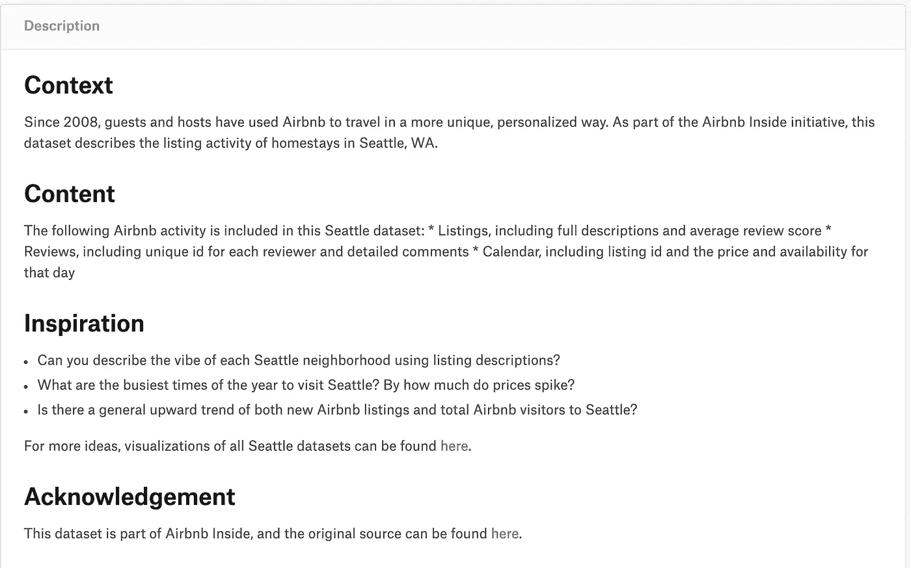
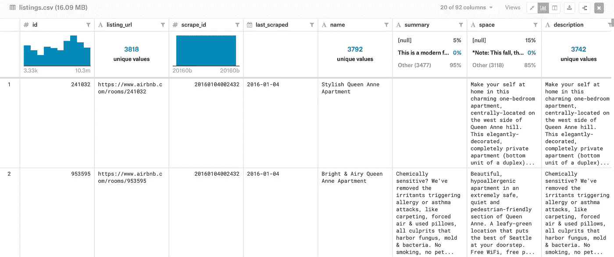
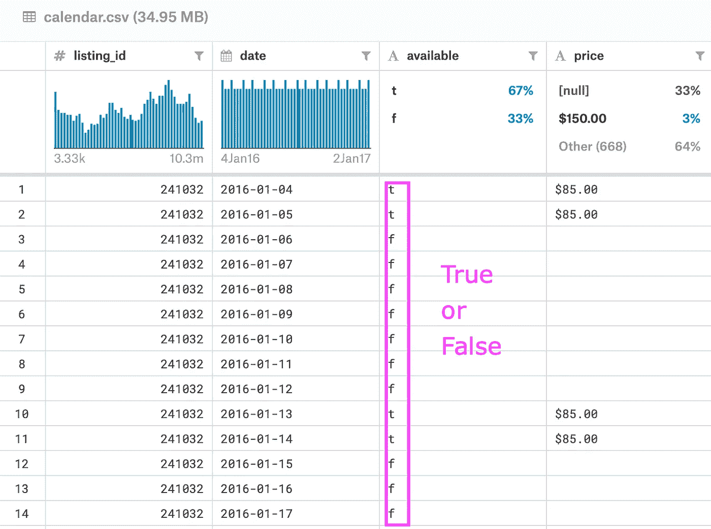
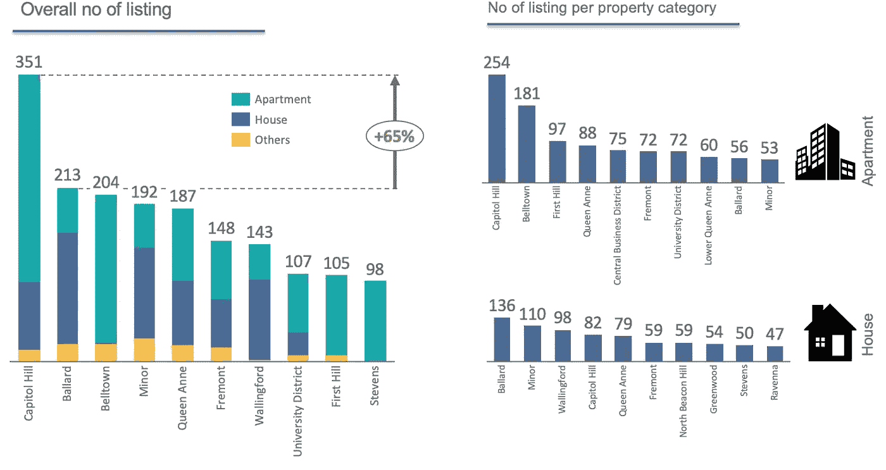
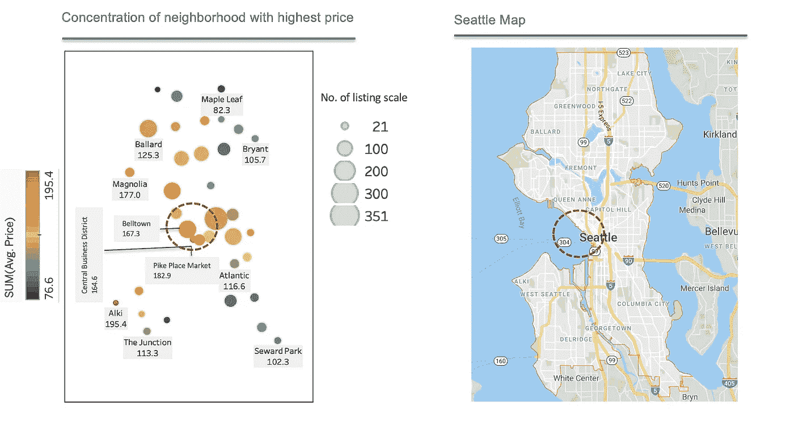
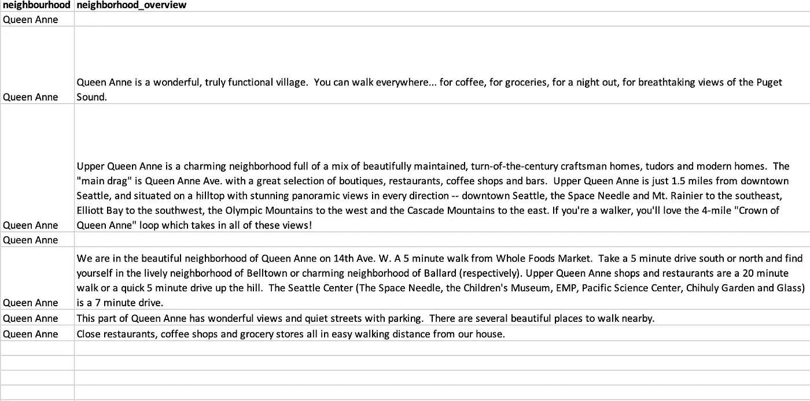
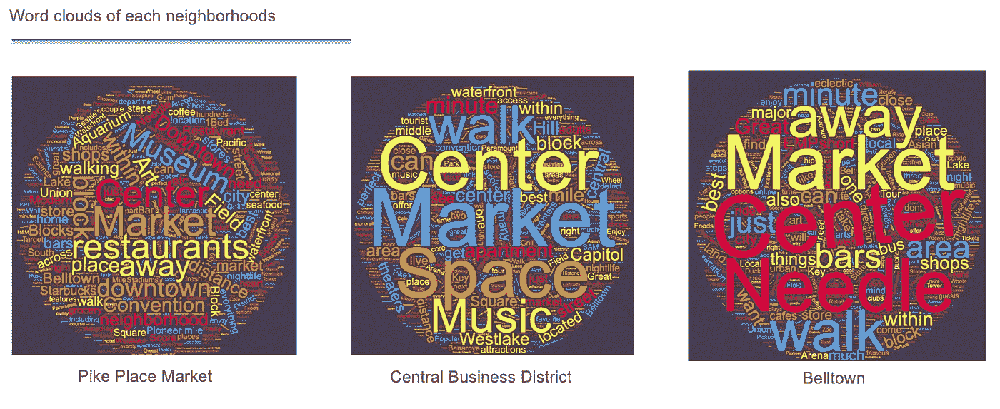
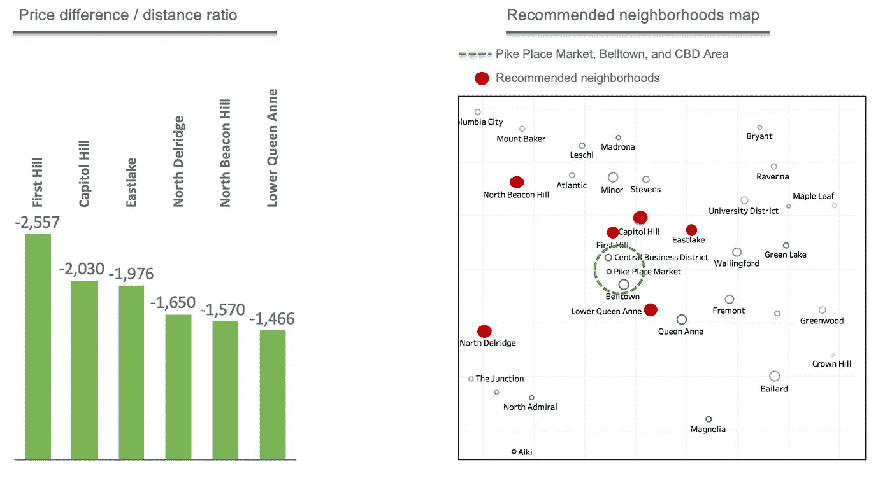
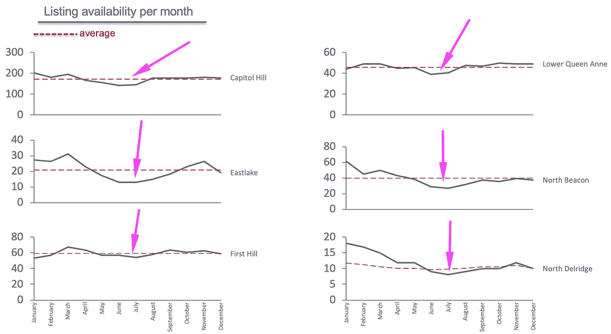
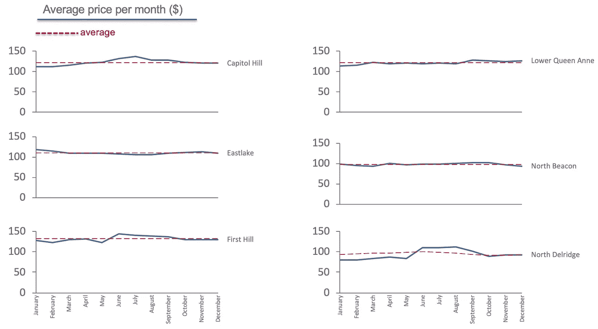

# 简单的探索性数据分析:基于西雅图邻里特征的房地产列表(Airbnb 数据)

> 原文：<https://towardsdatascience.com/simple-exploratory-data-analysis-real-estate-listings-based-on-seattles-neighborhood-67a51c515506?source=collection_archive---------15----------------------->

你好，数据人员！这是我的第一个媒体帖子。在这第一篇文章中，让我们看看如何利用简单的 EDA(探索性数据分析)从数据中提取有用的初步见解。对于数据或分析领域的新手来说，通常首先想到的是机器学习或复杂的统计建模。事实上，根据我过去几年的经验，在我们进行的每次分析中，并不总是强制执行一个花哨的统计模型或机器学习技术。我们可以只使用简单的 EDA 结合良好的领域知识。

Photo by [Luca Bravo](https://unsplash.com/@lucabravo?utm_source=medium&utm_medium=referral) on [Unsplash](https://unsplash.com?utm_source=medium&utm_medium=referral)

首先，了解什么是 EDA 是有好处的。根据[维基百科](https://en.wikipedia.org/wiki/Exploratory_data_analysis)😊、**探索性数据分析** ( **EDA** )是一种对 [数据集](https://en.wikipedia.org/wiki/Data_set)进行[分析以总结其主要特征的方法，往往采用可视化的方法。一个](https://en.wikipedia.org/wiki/Data_analysis)[统计模型](https://en.wikipedia.org/wiki/Statistical_model)可以使用也可以不使用，但是 EDA 主要是为了看看数据能告诉我们什么，而不仅仅是正式的建模或假设检验任务。简而言之，EDA 通常在分析的早期阶段进行，以便为我们提供数据的主要思想，有进一步的假设，并可能导致新的数据收集和实验。单独使用 EDA 并呈现我们的发现也是可以的(就像本文中的分析一样！).

# **数据源和上下文**

我们可以从 [***这个 Kaggle 链接***](https://www.kaggle.com/airbnb/seattle#listings.csv) **得到 Airbnb 提供的数据集。**数据集由 3 个表组成(列表、日历和评论)。

Data description

‘listings’ table consists of detailed information of each listing (e.g. listing id, url, posted time, listing description, neighborhood description, normal price, location coordinate, etc)

‘calendar’ table. The availability of each listing in particular date and the price within that day

*概述:*

1.  Airbnb 是一个提供寄宿家庭或旅游服务的在线市场。它充当东道主的经纪人/聚合人，并从每笔预订中收取佣金。
2.  西雅图是美国西海岸的一个海港城市，截至 2018 年有 73 万居民。

在这篇文章中，让我们关注“西雅图每个社区的氛围”。

Photo by [Thom Milkovic](https://unsplash.com/@thommilkovic?utm_source=medium&utm_medium=referral) on [Unsplash](https://unsplash.com?utm_source=medium&utm_medium=referral)

# **调查结果**

国会山是 Airbnb 列出的房产可用性最高的社区。它的上市量甚至比上市量第二高的 Ballard 高出 65%。

国会山、贝尔敦和第一山的房源以公寓为主，而巴拉德、米纳尔和沃灵福德的房源大多是房子。安妮女王由一个更加平衡的房子和公寓组合而成。

挂牌价格最高且集中在相对较近区域的三个主要社区是派克市场、贝尔敦和中央商务区。

My Tableau, unfortunately, wasn’t able to connect and overlap the plot to the real map :( So let’s just display the snapshot from Gmaps side by side instead :)

在“列表”表中有“邻居概述”列，在该列中，我们可以获得列表者/物业所有者给出的关于邻居的概述。

neighborhood overview column example

使用邻居概况数据，三个邻居共享或多或少相同的关键词:“中心”、“市场”、“市中心”、“游客”、“博物馆”、“空间”、“博物馆”、“步行”。很明显，派克市场、中央商务区和贝尔敦是西雅图最受欢迎的地区，因为它们位于西雅图市中心、市场/贸易中心，并且靠近旅游景点。因此，这个地区的房租价格较高。

通过计算价格差/距离比，存在一些提供更便宜的挂牌价格但靠近市中心的社区。第一山、国会山和东湖是价格差/距离比最高的社区，因此是西雅图推荐的租房社区。

参观这些街区最繁忙的时间是一年中的五月到八月，而岁末年初是最空闲的时候。

价格不像供货情况那样波动。不过由于最忙的时候是年中，所以最高价也在 6-8 月这个区间。

**关键要点**

1.  国会山的上市数量最多，其次是巴拉德和贝尔敦。国会山、贝尔敦和第一山以公寓为主，而巴拉德、米纳尔和沃灵福德以住宅为主

2.挂牌价格最高且集中在相对较近区域的三个主要社区是派克市场、贝尔敦和中央商务区

3.派克市场、中央商务区和贝尔敦是西雅图最受欢迎的地区，因为它们位于西雅图市中心、市场/贸易中心，并且靠近旅游景点。因此，这个地区的房产租金价格较高

4.第一山、国会山和东湖是最值得推荐的社区，因为它们的挂牌价格更便宜，而且靠近市中心

5.每年 5 月至 8 月是推荐区域租赁物业的最繁忙时间，年末和年初是最空闲的时间

6.价格不像供货情况那样波动。然而，由于最繁忙的时间是在年中，最高价格也在 6 月至 8 月的范围内

## **附录**

工具:

1.用于数据查询和处理的 SQL 和 Excel

2.可视化的 Tableau 和 Thinkcell

3.wordclouds.com 制造单词云

—我很乐意讨论关于分析的进一步想法，请通过[https://www.linkedin.com/in/muhammad-lutfi-hernandi/](https://www.linkedin.com/in/muhammad-lutfi-hernandi/)联系我😄 —

—干杯—