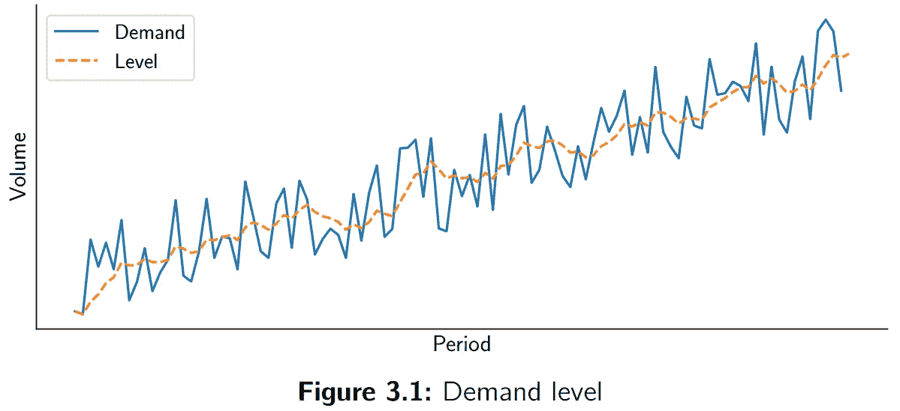
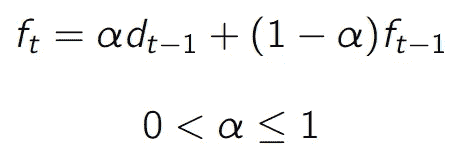
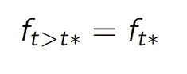
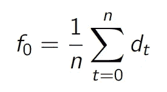
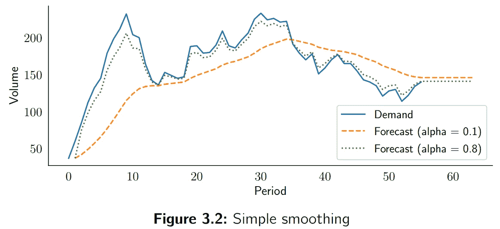
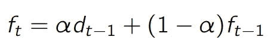
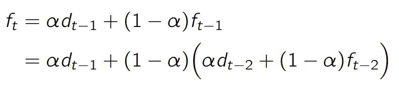
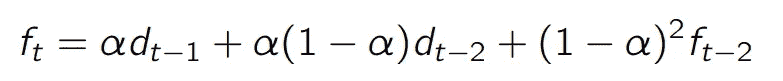
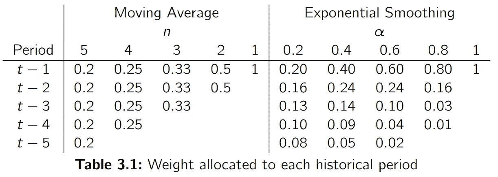

# 时间序列预测的简单指数平滑法

> 原文：<https://towardsdatascience.com/simple-exponential-smoothing-749fc5631bed?source=collection_archive---------6----------------------->

## 简单指数平滑法是预测时间序列的一种简单而强大的方法。此外，它还被许多其他模型用作构建模块。让我们看看它是如何工作的。

*本文摘自我的著作* [*供应链预测的数据科学*](https://www.amazon.com/Data-Science-Supply-Chain-Forecasting/dp/3110671107/ref=sr_1_1?dchild=1&keywords=vandeput&qid=1627634223&sr=8-1) *。你可以在这里* *阅读我的其他文章* [*。我也活跃在*](https://nicolas-vandeput.medium.com)[*LinkedIn*](https://www.linkedin.com/in/vandeputnicolas/)*。*

# 想法

简单的指数平滑法是预测时间序列最简单的方法之一。该模型的基本思想是假设未来将或多或少与(最近的)过去相同。因此，该模型将从需求历史中学习的唯一模式是其水平(你可以在我的[博客](https://nicolas-vandeput.medium.com/list/demand-forecasting-models-bda2909bbcbf)或我的[书](https://www.amazon.com/Data-Science-Supply-Chain-Forecasting/dp/3110671107/ref=sr_1_1?dchild=1&keywords=vandeput&qid=1627634223&sr=8-1)中了解更复杂的模型)。

该水平是需求随时间变化的平均值。如下图所示，该水平是需求的平滑版本。

然后，指数平滑模型将预测未来需求，作为其对水平的最后估计。重要的是要明白，没有明确的数学定义的水平。相反，由我们的模型来**估计**它。

与更简单的预测模型(如简单模型或移动平均模型)相比，指数平滑模型具有一些优势:

*   随着时间的推移，每个观察值的权重呈指数级下降(最近的观察值权重最高)。这通常比移动平均模型更好，移动平均模型对所有相关的历史月份分配相同的权重。
*   离群值和噪声的影响比简单方法小。

# 模型

指数平滑模型的基本思想是，在每个时期，模型将从最近的需求观察中学习一点，并记住它所做的最后一次预测。神奇的是，模型填充的最后一个预测已经包含了一部分先前的需求观察和一部分先前的预测。诸如此类。**这意味着之前的预测包括了模型基于需求历史**到目前为止了解到的所有信息。平滑参数(或学习率)**α**将决定给予最近的需求观察多少重要性。让我们用数学来表示它，

这个公式背后的直觉是什么？

*   **alpha** 是相对于需求历史的重要性，模型将分配给最近观察的重要性的比率(或百分比)。
*   **alpha d{t-1}** 表示之前的需求观察乘以学习率。您可以说，该模型将某个权重(alpha)附加到最后一次需求发生上。
*   **(1-alpha) f{t-1}** 表示模型对其先前预测的记忆程度。注意，这就是递归魔术发生的地方，因为 f{t-1}本身被定义为部分 d{t-2}和 f{t-2}。

这里需要在*学习*和*记忆*反应性和稳定性之间做出必要的权衡。如果 alpha 较高，则模型将分配更多的重要性给最近的需求观察(即，模型将快速学习)，并且它将对需求水平的变化做出反应。但是它对异常值和噪声也很敏感。另一方面，如果 alpha 较低，模型不会注意到级别的快速变化，但也不会对噪声和异常值反应过度。

# 未来预测

一旦我们离开了历史时期，我们需要填充未来时期的预测。这很简单:上一次预测(基于最近需求观察的预测)只是对未来的推断。如果我们根据需求历史将 f{t*}定义为我们可以做出的最后一个预测，我们只需

# 模型初始化

与每个模型一样，问题来自于第一次预测的初始化。不幸的是，这个简单的问题没有简单的答案。在本书中经常会出现这种情况:最简单的问题并不总是有明确和绝对的答案。正如我们将反复讨论的那样，只有实验才能让我们理解哪种技术最适合每个数据集。我们来讨论一些想法。

**简单初始化** —我们将第一个预测(期间 0)初始化为第一个需求观察。然后我们有

这是初始化预测的一种公平而直接的方式。

**平均值** —我们将预测初始化为第一个 *n 个*需求发生的平均值。

在这种情况下，我建议测试不同的 *n* 值。它可以设置为一个固定的小值(3 到 5)，也可以设置为学习率的倒数(1/alpha)。如果 *n* 被设置为学习率的倒数，这允许随着学习率降低而更平滑地估计 f_0。这是有意义的，因为 alpha 的低值意味着我们希望我们的模型对变化做出平滑的反应。

**数据泄露**

如果您选择的初始化方法包括关于未来多个期间的信息，例如，如果您将初始预测定义为前五个期间的平均值，您将面临**数据泄漏**。这意味着你为你的模型提供了关于未来的信息。基本上你告诉它:*“你能给我提供一个下期的预测吗，知道未来五期的需求平均值是 10？”*。这是一个典型的过度拟合的例子:该模型将为您提供初始阶段的良好预测准确性(这很简单，您给了它这些阶段的平均需求！)但未来将无法复制这样的准确性。

当你初始化一个模型的不同参数时，一定要小心，不要给它太多关于未来的信息。

# 洞察力

## 阿尔法的影响

下图显示，使用低 alpha 值(此处为 0.1)进行的预测将需要更多时间来对不断变化的需求做出反应，而使用高 alpha 值(此处为 0.8)进行的预测将密切跟踪需求波动。

## 为什么叫指数平滑？

该模型被称为指数平滑，因为给予每个需求观察的权重是指数减少的。为了说明这一点，我们将从回顾指数平滑模型开始。

如您所见，给予最近需求观察 d{t-1}的权重是α。现在让我们用公式来代替 f{t-1}。

如果我们做一点代数运算，我们会得到下面的公式:

我们看到，给予第二个最近的需求观察值 d{t-2}的权重是α(1-α)，低于给予 d{t-1}的重要性。

让我们更进一步，用它的公式代替 f{t-2}。

我们看到给 d{t-3}的权重是 alpha(1-alpha)，是给 d{t-2}的权重乘以(1-alpha)。从这里，我们推断出，给予每个进一步的需求观察的权重减少了一个因子(1-α)。这就是为什么我们称这种方法为指数平滑。

# 限制

这个简单的指数平滑模型比移动平均模型稍微聪明一点，因为它对历史需求观察的加权更聪明。但是它有许多限制:

*   它不预测趋势。我们将通过我们的下一个模型来解决这个问题:趋势指数平滑，也称为**双指数平滑**。
*   它不承认任何季节性模式。我们将使用**三重指数平滑模型**来解决这个问题。
*   它不能使用任何外部信息(如定价或营销费用)。

总之，第一个指数平滑模型很可能过于简单，无法获得好的结果，但它是以后创建更复杂模型的良好基础。

# 霍尔特-温特斯模型简史

指数平滑模型通常被称为“霍尔特-温特斯”，这是基于提出这些模型的研究人员的名字。指数平滑预报的早期形式最初是由布朗于 1956 年提出的。1957 年，来自麻省理工学院和芝加哥大学的美国工程师 Charles C. Holt 在他的论文“*通过指数加权平均值预测趋势和季节”中完善了他的方程三年后，彼得·温特斯再次改进了指数平滑模型。他们的两个名字被记住，并被赋予不同的指数平滑技术，我们有时称之为*“霍尔特-温特斯”**

Holt & Winters 提出了不同的指数平滑模型(简单、双重和三重),这些模型也可以理解和预测趋势或季节性。这种模型集合对于预测任何时间序列都是相当稳健的。而且，正如霍尔特和温特斯在 1960 年已经解释过的，这些预测只需要适度使用计算能力。

# 自己做

可以在 Excel ( [此处](https://medium.com/@nicolas.vandeput/diy-simple-exponential-smoothing-with-excel-df4b8728e19e))或者 Python ( [此处](https://medium.com/@nicolas.vandeput/diy-simple-exponential-smoothing-with-python-dbb570d30fb5))中做自己简单的指数平滑。

# 关于作者

 [## Nicolas vande put——顾问，创始人——供应链| LinkedIn

### 查看 Nicolas Vandeput 在世界上最大的职业社区 LinkedIn 上的个人资料。尼古拉斯有 7 份工作列在…

www.linkedin.com](https://www.linkedin.com/in/vandeputnicolas/) 

icolas Vandeput 是一名供应链数据科学家，擅长需求预测和库存优化。他在 2016 年创立了自己的咨询公司 [SupChains](http://www.supchains.com/) ，并在 2018 年共同创立了 [SKU 科学](https://bit.ly/3ozydFN)——一个快速、简单、实惠的需求预测平台。尼古拉斯对教育充满热情，他既是一个狂热的学习者，也喜欢在大学教学:自 2014 年以来，他一直在比利时布鲁塞尔为硕士学生教授预测和库存优化。自 2020 年以来，他还在法国巴黎的 CentraleSupelec 教授这两个科目。他于 2018 年出版了 [*供应链预测的数据科学*](https://www.amazon.com/Data-Science-Supply-Chain-Forecasting/dp/3110671107)(2021 年第 2 版)和 2020 年出版了 [*库存优化:模型与模拟*](https://www.amazon.com/Inventory-Optimization-Simulations-Nicolas-Vandeput/dp/3110673916) 。

