# 用熊猫探索简单的足球数据集

> 原文：<https://towardsdatascience.com/simple-football-data-set-exploration-with-pandas-60a2bc56bd5a?source=collection_archive---------9----------------------->

## 从 1872 年到 2019 年的国际足球结果

Image Courtesy of [Syed Ali](https://unsplash.com/@syedmohdali121) via Unsplash

# 熊猫的简单可视化——一个足球的例子

这篇教程文章详细介绍了如何使用 Python Pandas 库高效地探索数据集。具体来说，这个例子将使用数据集，从 1872 年到 2019 年的国际足球结果，可从 [Kaggle 网站](https://www.kaggle.com/martj42/international-football-results-from-1872-to-2017)获得。首先，本教程将探索简单的可视化，以及如何过滤它们以允许更细粒度的探索。

此外，本教程旨在展示如何使用熊猫来回答数据科学相关的问题。

The Data-set is available by [following the link attached](https://www.kaggle.com/martj42/international-football-results-from-1872-to-2017), and has records for more than 40 thousand international football results.

# 画出每年国际比赛的次数？

首先，除了 matplotlib 库允许探索性的数据可视化之外，还需要导入 Pandas 库用于数据分析。我读入保存在本地目录中的 CSV 文件，并将其保存到名为 results 的数据帧中。接下来，我使用 head 方法查看结果数据帧的前 5 条记录。数据帧中的每一行代表一场国际足球比赛。为了帮助自己熟悉数据集，我还查看了列的数据类型。

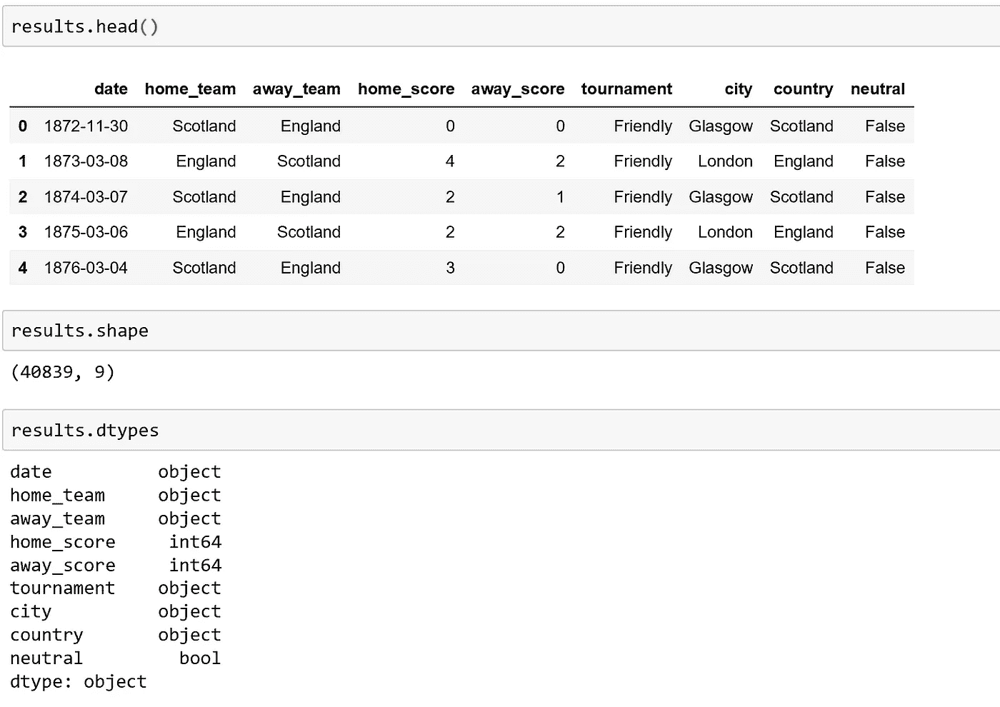

To familiarize myself with the Dataframe, I check the number of rows and columns using the shape attribute, and check the datatype of the columns.

要计算和可视化每年发生的比赛数量，一个好的起点是查看日期列，因为它有每场比赛的日期。如前所示，日期列有一个对象数据类型。为了方便地从这个日期列中提取年份，只需对结果数据帧中的日期序列使用 pd.to_datetime 方法，并创建一个新列。这里，我创建的新列名为“date_time ”,现在具有 datetime 数据类型。

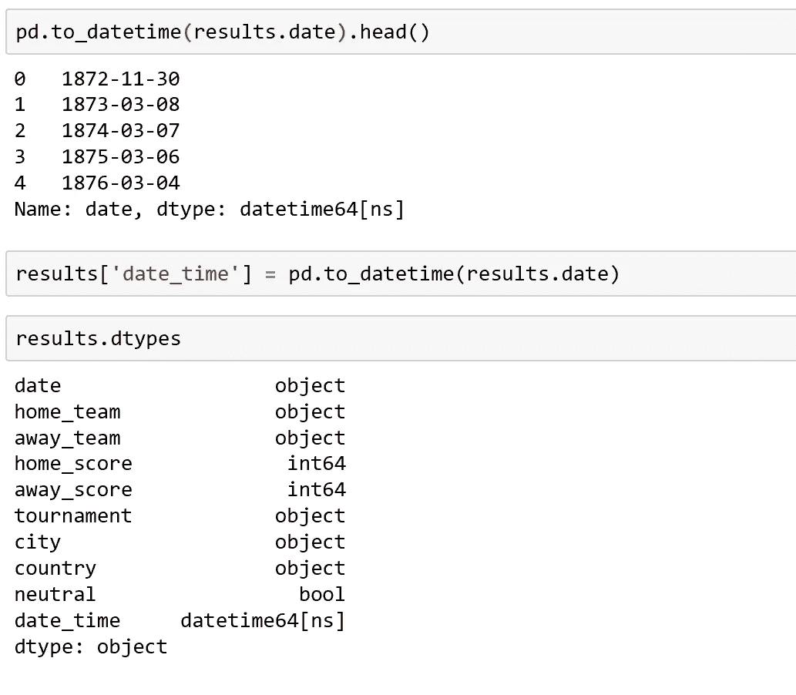

通过使用“dt”名称空间，可以提取诸如 year 之类的方便的属性，并且可以应用 value_counts 方法。为了绘图，必须对索引(显示在左侧的年份)进行排序。

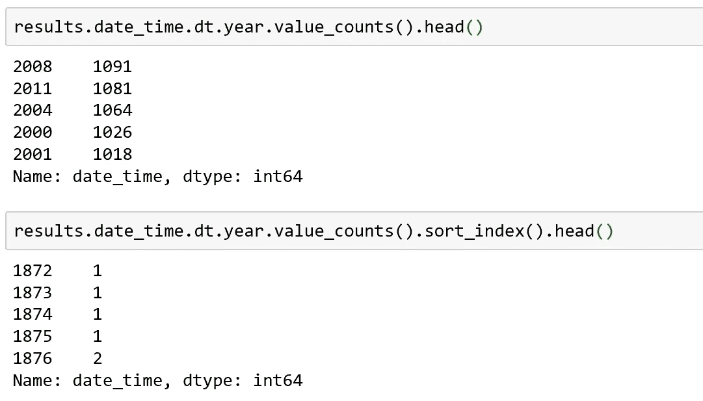

通过简单的写作。情节，情节现在可以可视化和国际比赛的数量显示。

虽然这个情节当然可以使用一些视觉上的增强，一个简单的熊猫单句就能够传达每年发生的比赛数量！

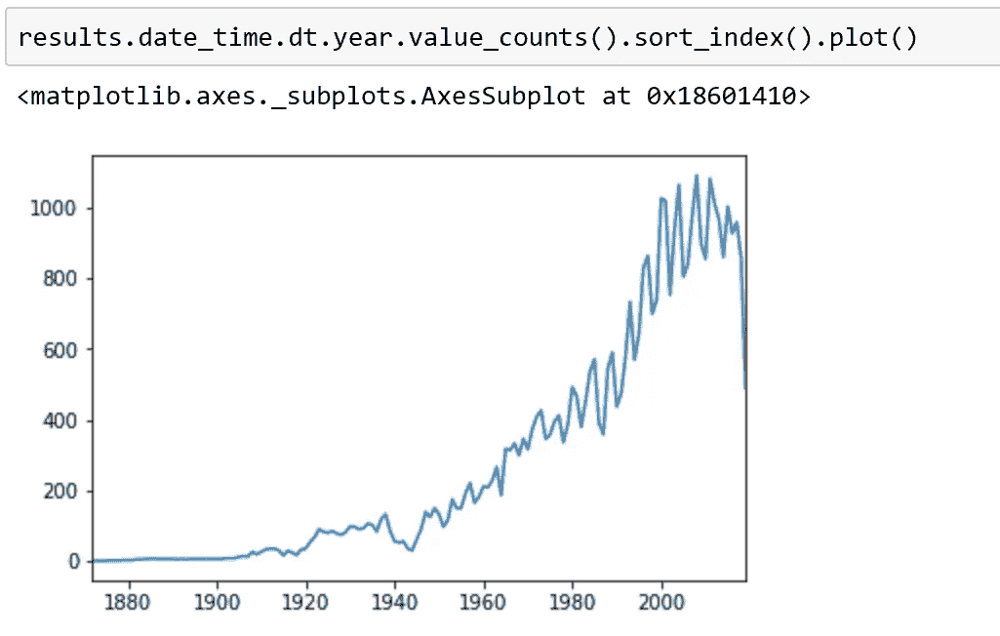

The default for plot() is line. A line plot type is ideally suited for time-series data.

# 过滤时间序列以获得更精细的细节

看看更小范围的国际比赛也是很有见地的。时间序列列 date_time 可以使用 Pandas 一行程序进行过滤。在所示示例中，仅显示了 2014 年至 2019 年的国际比赛。

值得注意的是，2019 年的国际比赛似乎有所下降。然而，经过仔细检查，date_time 序列中最后记录的日期是在 2019 年年中，如对 date_time 序列使用 max()方法所示。这可能解释了 2019 年国际比赛突然明显下降的原因。

提示:我们可以很容易地使用多个条件语句过滤日期范围，如注释掉的第一行所示。有趣的是，我们还可以使用 between 方法，通过指定 left=和 right=关键字参数的值来选择和提取年份范围。注意，指定的两个值都包含在内。

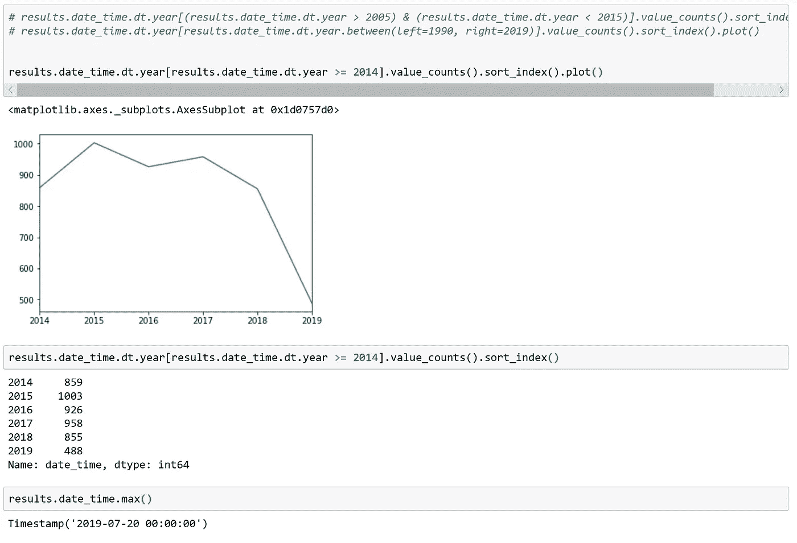

Filtering using conditionals or the between method can permit more fined grained details to be visualized.

# **哪种锦标赛最激动人心？**

## 使用数据集中表现良好的数据！

最激动人心的国际比赛可以用很多方式来定义，但其中一种方式可能是调查进球！为了决定哪一场比赛是最激动人心的，我创建了一个新的列，使用下面显示的代码片段计算每场国际比赛的比赛进球数。为了确认已经创建了该列，我从结果数据帧中抽取了三列，即 home_score、away_score 和 match_goals，并从结果数据帧中随机抽取 5 条记录进行验证。

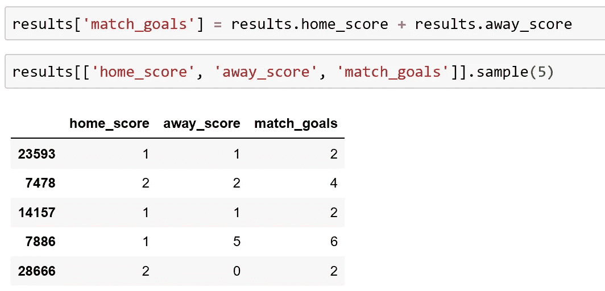

对于每场锦标赛，我现在可以使用 Pandas groupby 来计算平均比赛进球数，并根据这一指标确定最激动人心的锦标赛。

然而，我必须注意要有合理的样本量，这样结果才有意义。在这个演示中，我将只包括数据帧中有 100 个或更多记录(国际比赛)的锦标赛。

我在结果数据帧的锦标赛系列中使用了 value_counts 方法。该命令返回一个新的系列，其中锦标赛是索引，值是特定锦标赛在数据帧中出现的次数。

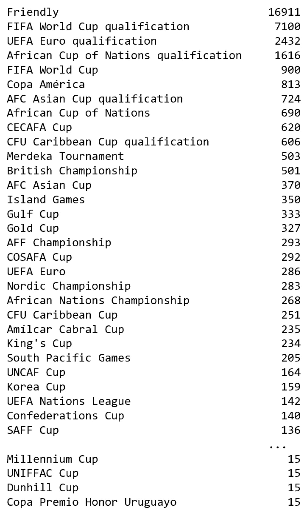

我将这个系列保存到一个名为 tournament_count 的变量中，并过滤这个系列，使每个锦标赛只包含 100 个或更多的记录。然后，我选择索引，并使用 isin()方法调用过滤结果数据帧，这将返回一个新的数据帧，该数据帧现在只包括在数据集中出现 100 次或更多次的锦标赛！

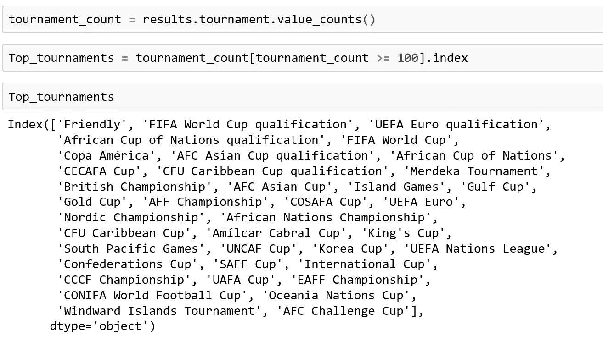

现在，我在过滤后的数据框架中对每场锦标赛进行分组，查看每场锦标赛的记录数量(使用计数)，并根据平均比赛进球数进行排序。我看着数据帧的尾部，因为排序是按升序进行的。

结果显示，“南太平洋运动会”平均每场比赛有 5.9 个进球，并且在过滤的数据帧中出现了 205 次，表示为 _tour。

进球显然不是决定哪场比赛最激动人心的唯一指标，数据集中缺少像射门次数、点球失误、犯规和所有其他增加比赛价值的因素，这是一个明显的弱点。

*提示！要可视化特定的锦标赛，请使用接受列表的 filter 方法。*

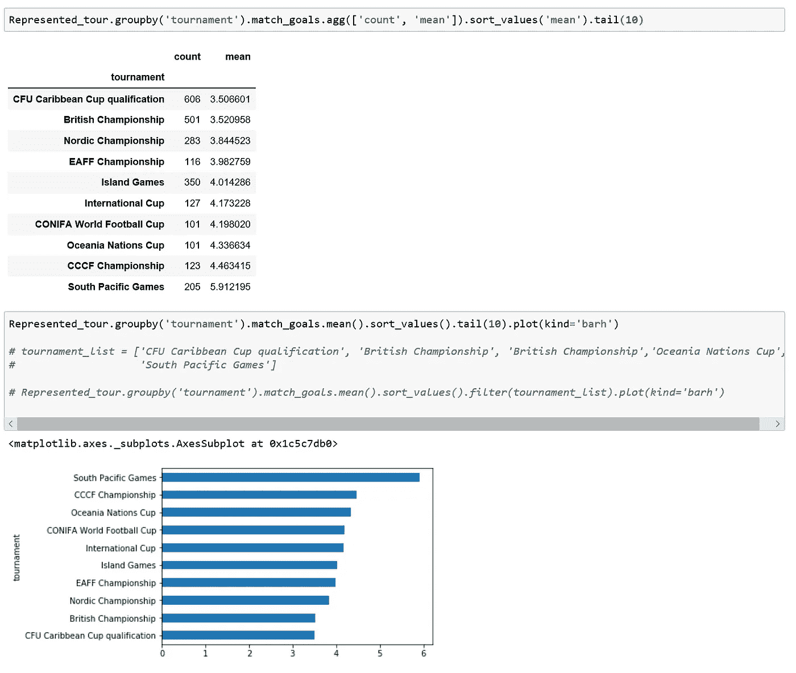

kind=’barh’ plots a horizontal bar plot, which is useful to differentiate between categories.

**使用。过滤方法**

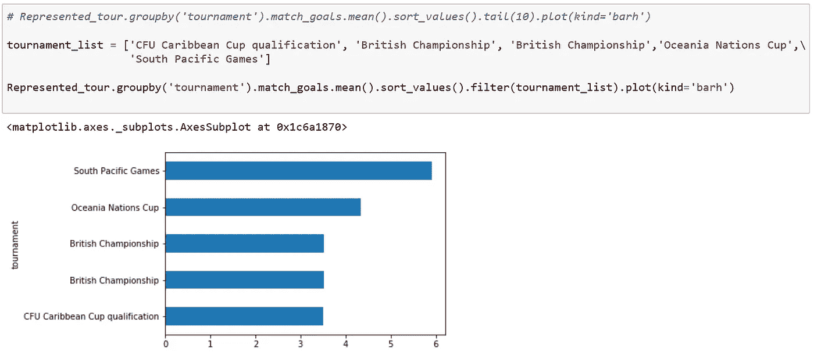

# 过去 5 年的锦标赛次数

这个问题再次展示了熊猫在帮助回答与数据科学相关的问题方面有多么有用。

首先，我过滤结果数据框架，只包括 2015 年以后的数据(过去 5 年)。然后，通过从 date_time 列(具有 datetime 数据类型)中提取 year 属性，对每年进行分组。对于过滤后的数据帧中的每一年，我对锦标赛执行 value_counts，返回一个多系列索引，我使用 unstack 方法将它转换为数据帧。

最后，为了防止输出中出现大量的 nan，我用 0 填充它们。例如，国际足联世界杯每 4 年举行一次，因此每 4 年只有一次有人居住的场地。我将这个输出保存到一个名为“last_5_years”的新数据帧中，并提取我在我的旅程列表中指定的列。

现在我们可以清楚地看到，2018 年有 64 场世界杯比赛，但我们也可以看到一些有趣的关系，例如在 2019 年，非洲国家杯发生了 52 场比赛，这与 2015 年和 2017 年发生的 32 场比赛有所偏差。

用于调查过去 5 年比赛的相关代码包含在 github gist 中，如下图所示。

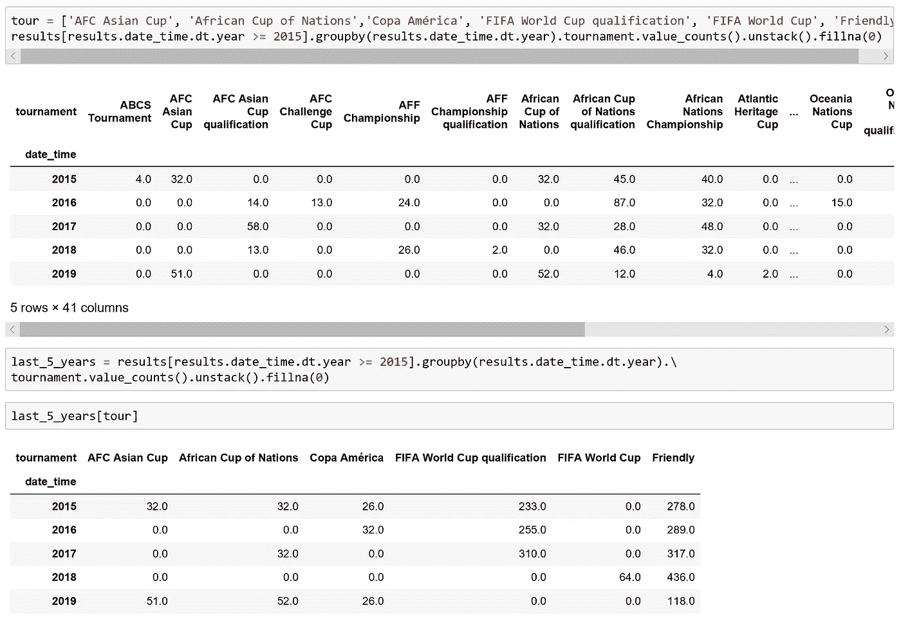

这与我的最后一个问题有关，自从非洲国家杯(AFCON)成立以来，已经举行了多少场比赛？

# 绘制非洲杯比赛开始以来的比赛次数

一幅图将有效而清晰地呈现这些数据。我只是通过出现“非洲杯”的锦标赛系列来过滤结果数据帧，并对每一年的锦标赛进行数值计算，然后使用 unstack 返回数据帧。然后，我从 afcon 数据框架中提取“非洲杯”列，并使用柱状图进行绘制。

名词（noun 的缩写）B I 不得不提取“非洲杯”列，以获得一个系列，我可以在那里绘制指数(x 轴上的年数)，y 轴上的比赛数量。

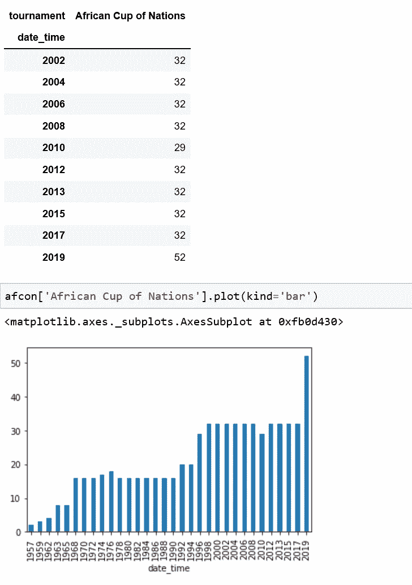

现在，每个 Afcon 的游戏数量已经显示出来。快速的在线搜索显示，在最近的 2019 年 Afcon 锦标赛中，比赛数量确实有所增加。

# 摘要

熊猫可以直观地用来回答数据科学问题。所展示的从 1872 年到 2019 年的国际足球比赛结果提供了一个很好的用例来展示如何实现这一点。