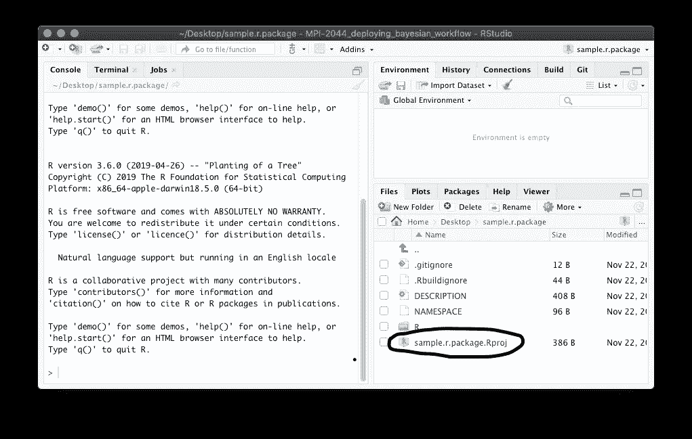
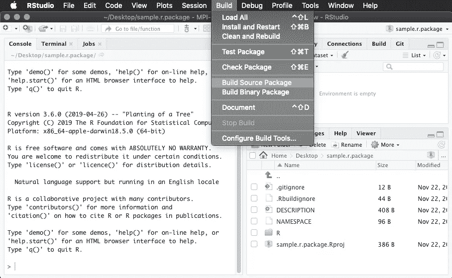
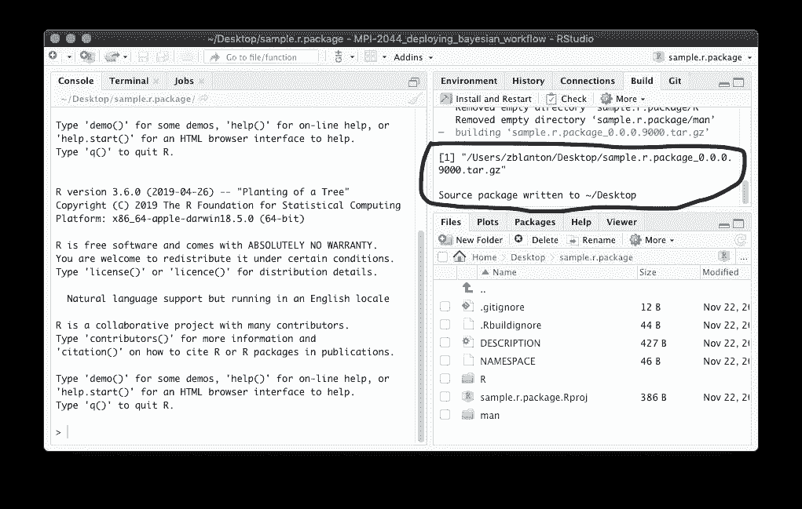
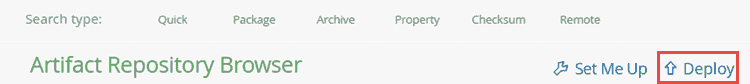
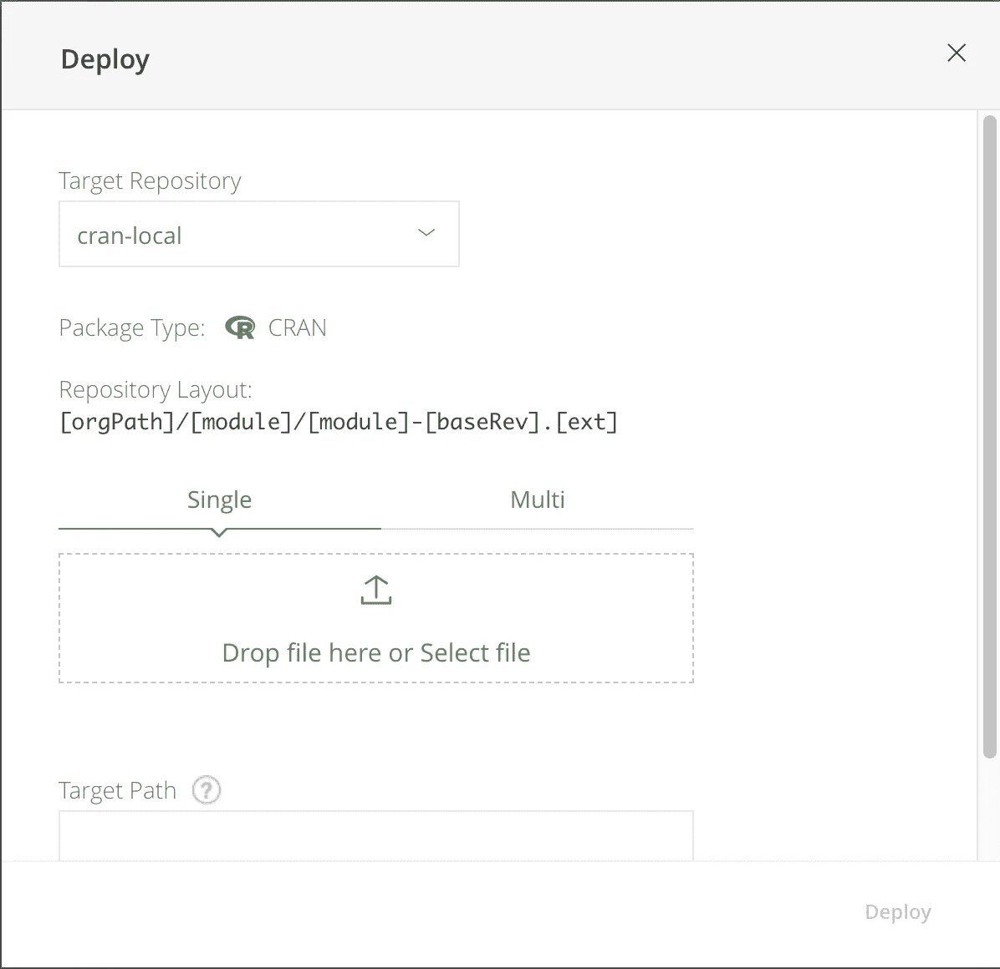
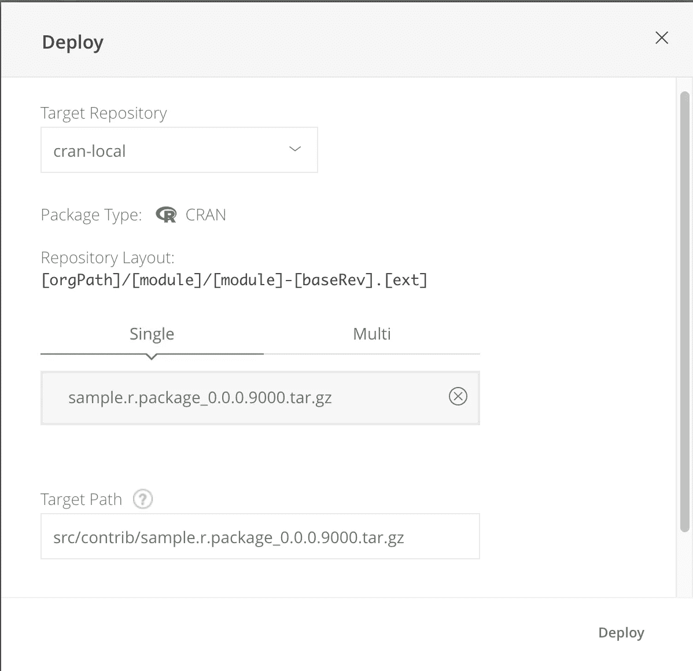
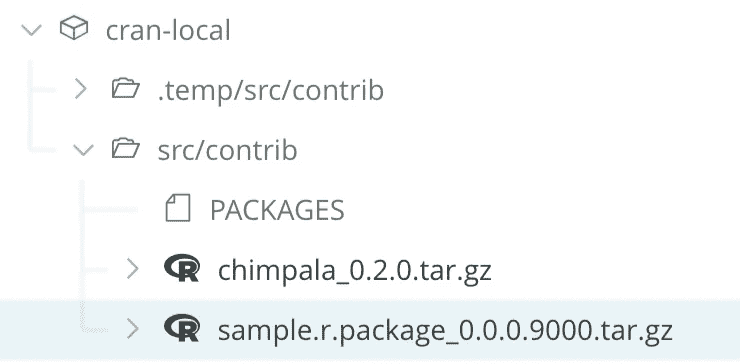

# 如何将 R 包上传到 Artifactory

> 原文：<https://towardsdatascience.com/simple-guide-to-uploading-packages-to-cran-repositothosted-by-artifactory-ef302db74d04?source=collection_archive---------29----------------------->

## 带截图的快速入门指南

Photo by [Paul Hanaoka](https://unsplash.com/@plhnk?utm_source=unsplash&utm_medium=referral&utm_content=creditCopyText) on [Unsplash](https://unsplash.com/s/photos/server?utm_source=unsplash&utm_medium=referral&utm_content=creditCopyText)

# 工厂起重机

假设您想将您的 R 包上传到某个地方，以便其他人可以下载它们。一种简单的方法是使用 [Artifactory](https://jfrog.com/artifactory/) 托管本地 CRAN 存储库。在下面的指南中，我将向您展示如何以最少的麻烦(主要是通过可视界面)自己完成这项工作，当然，当您想开始更多地自动化这项工作时，一切都是可以脚本化的。

## 步骤 0:安装 RStudio

这是标准的 IDE，所以您可能已经安装了它。如果没有，就在这里下载:【https://rstudio.com/T2

## 步骤 1:在 Artifactory 中创建 CRAN 存储库

在 web 浏览器中导航到 Artifactory UI，然后转到“管理”选项卡。

从那里，转到**仓库、仓库、本地**，然后选择**起重机**作为**包类型**。请记住您的回购的名称，因为您稍后将使用它来上传您的文件！如果您没有访问管理页面的权限，您可能需要请求您的 Artifactory 管理员为您创建 CRAN repo。更多信息可以看[官方文档](https://www.jfrog.com/confluence/display/JFROG/CRAN+Repositories#CRANRepositories-LocalRepositories)。

## 步骤 1:创建您的 R 包

如果你发现这篇博文，你可能已经创建了 R 包，但是如果你还没有打包好，这里有一篇关于这个的经典博文:[https://Hilary Parker . com/2014/04/29/writing-an-R-package-from-scratch/](https://hilaryparker.com/2014/04/29/writing-an-r-package-from-scratch/)

## 步骤 2:构建您的包

一旦你有了你的 R 包，你应该用 RStudio 打开它。在这里，您可以打开 Rproj 文件，以便 RStudio 知道您正在构建一个包。

click on this file in the RStudio file browser

从“构建”菜单中选择“构建源代码包”。如果你有很多文件需要针对特定平台进行编译，那么你可以选择“构建二进制包”，但是你上传到 Artifactory 的时候就要输入相关数据了。此操作的结果将是一个压缩文件，然后您可以上传到您的 CRAN on Artifactory。

this is where the Build menu is

## 步骤 3:将包上传到 Artifactory

首先，使用 RStudio 找到您的包 tarball 是在哪里生成的。它应该位于包含您的软件包源代码的目录旁边。

the build window shows where the tar file is generated. it should be located in the parent directory of your package.

导航到您的 Artifactory web 应用程序。然后，在 Artifactory 上打开工件存储库窗口，并点击 deploy 按钮。

从“目标存储库”菜单中选择您的 CRAN repo。它应该显示为“包装类型:起重机”，如下所示。然后，选择您生成的包文件或将它拖到此窗口中。满意后点击部署。

this is what the deploy menu should look like before you add your package

this is what the deploy menu looks like after you add your package

现在，您应该能够在工件存储库浏览器的树浏览器视图中看到您的包。

you should be able to see your package in artifactory now

## 步骤 4:检查是否可以从工厂起重机安装

首先，您想通过运行`remove.packages("sample.r.package")`从 R 库中移除示例包。然后，您可以通过运行`install.packages("sample.r.package", repos=c("http://my_artifactory.com/artifactory/my-cran/"))`从本地 CRAN 安装它。希望一切都已正确安装，现在您可以与组织的其他成员共享您的软件包了！

# 恭喜你！您将第一个包上传到 Artifactory！

既然你已经有了自己的计划，世界就是你的了！告诉你公司的每个人你的软件包，他们可以很容易地安装它，而不必使用 [devtools](https://www.r-project.org/nosvn/pandoc/devtools.html) 。不错！

旅程的下一步是开始将二进制包上传到 Artifactory。这就是使用像 CRAN 这样的包管理器的真正优势所在，因为这意味着你的包的用户不必安装复杂的工具链来为他们自己的系统重新编译你的包。当你准备好采取下一步行动时，请点击这里的[查看文档。](https://www.jfrog.com/confluence/display/RTF/CRAN+Repositories)