# 卷积神经网络简介

> 原文：<https://towardsdatascience.com/simple-introduction-to-convolutional-neural-networks-cdf8d3077bac?source=collection_archive---------0----------------------->

在本文中，我将使用许多 swan 图片来解释卷积神经网络(CNN)的概念，并将使用 CNN 的常规多层感知器神经网络来处理图像。

**图像分析**

让我们假设我们想要创建一个能够识别图像中天鹅的神经网络模型。天鹅具有某些特征，可以用来帮助确定天鹅是否存在，例如它的长脖子、白色等等。

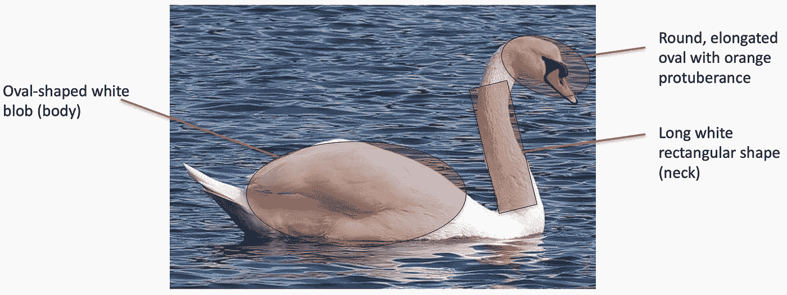

A swan has certain characteristic features that can be used for recognition purposes.

对于某些图像，可能更难确定是否存在天鹅，请看下图。

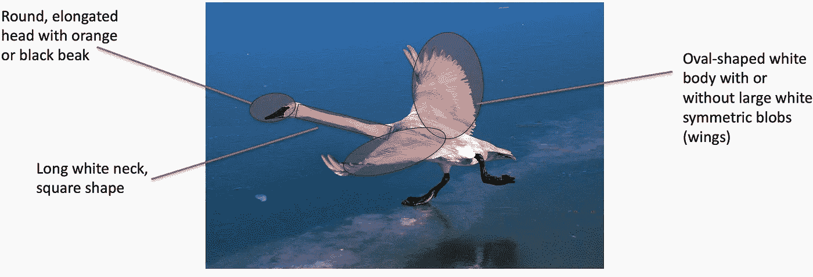

Harder to classify swan image.

这些特征在上面的图像中仍然存在，但我们更难挑出这些特征。让我们考虑一些更极端的情况。

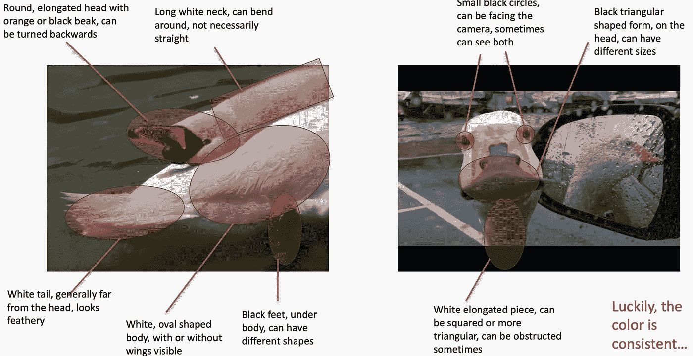

Extreme cases of swan classification.

至少颜色是一致的吧？或者是…

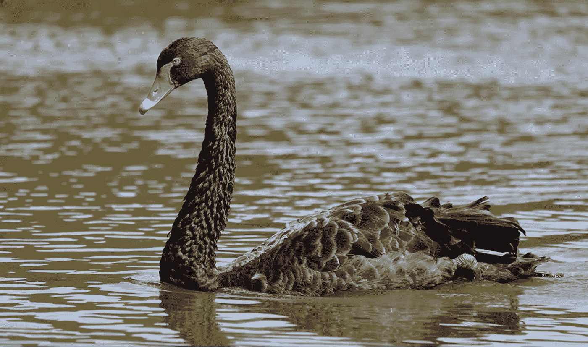

Don’t forget about those black swans!

还能更糟吗？肯定可以。

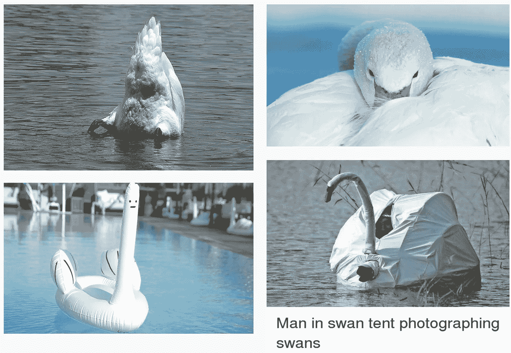

Worst-case scenarios.

好了，天鹅的照片已经够多了。先说神经网络。我们一直在以一种非常天真的方式谈论检测图像中的特征。研究人员建立了多种计算机视觉技术来处理这些问题:筛选、快速、冲浪、摘要等。然而，类似的问题也出现了:探测器要么太普通，要么太复杂。人类正在设计这些特征检测器，这使得它们要么过于简单，要么难以推广。

*   如果我们学会了检测特征会怎么样？
*   我们需要一个可以进行表征学习(或者特征学习)的系统。

表征学习是一种允许系统自动找到给定任务的相关特征的技术。取代手动特征工程。有几种技术可以做到这一点:

*   无监督的(K 均值、主成分分析等)
*   监督(Sup。字典学习，神经网络！)

**传统神经网络的问题**

我将假设你已经熟悉传统的神经网络称为多层感知器(MLP)。如果您对这些不熟悉，Medium 上有数百个概述 MLP 如何工作的教程。这些都是在人脑上模拟的，神经元受到连接节点的刺激，只有当达到某个阈值时才会被激活。

A standard multilayer perceptron (traditional neural network).

MLP 有几个缺点，尤其是在图像处理方面。MLP 为每个输入使用一个感知器(例如，图像中的像素，在 RGB 情况下乘以 3)。对于大图像，权重的数量很快变得难以管理。对于具有 3 个颜色通道的 224 x 224 像素图像，大约有 150，000 个权重必须被训练！因此，在训练和过度配合时会出现困难。

另一个常见的问题是 MLP 对输入(图像)及其平移版本的反应不同，它们不是平移不变的。例如，如果一张图片中的图像的左上方出现了一只猫，而另一张图片的右下方出现了一只猫，则 MLP 会尝试自我纠正，并假设图像的这一部分中总会出现一只猫。

显然，MLP 不是图像处理的最佳选择。一个主要问题是当图像被展平为 MLP 时，空间信息丢失。靠近的节点很重要，因为它们有助于定义图像的特征。因此，我们需要一种方法来利用图像特征(像素)的空间相关性，这样无论猫出现在哪里，我们都可以在照片中看到它。在下图中，我们正在学习多余的功能。这种方法并不可靠，因为猫可能会以另一种姿势出现。

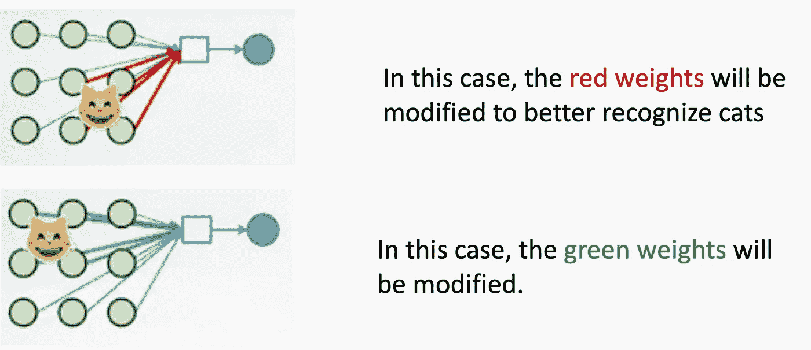

A cat detector using an MLP which changes as the position of the cat changes.

**进入卷积神经网络**

我希望这个案例清楚地说明为什么 MLP 是一个用于图像处理的糟糕想法。现在让我们继续讨论如何使用 CNN 来解决我们的大部分问题。

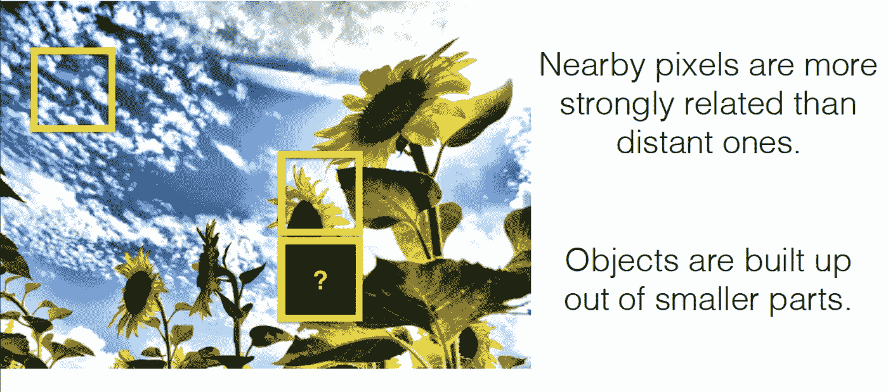

CNN’s leverage the fact that nearby pixels are more strongly related than distant ones.

我们用一种叫做过滤器的东西来分析附近像素的影响。一个过滤器就是你所想的那样，在我们的情况下，我们采用一个由用户指定大小的过滤器(一个经验法则是 3x3 或 5x5 ),我们将它从左上向右下移动穿过图像。对于图像上的每个点，使用卷积运算基于过滤器计算一个值。

过滤器可以与任何东西相关，对于人类的图片，一个过滤器可以与看到的鼻子相关联，我们的鼻子过滤器会给我们一个指示，即鼻子在我们的图像中出现的强度，以及出现的次数和位置。与 MLP 相比，这减少了神经网络必须学习的权重数量，也意味着当这些特征的位置改变时，它不会扰乱神经网络。

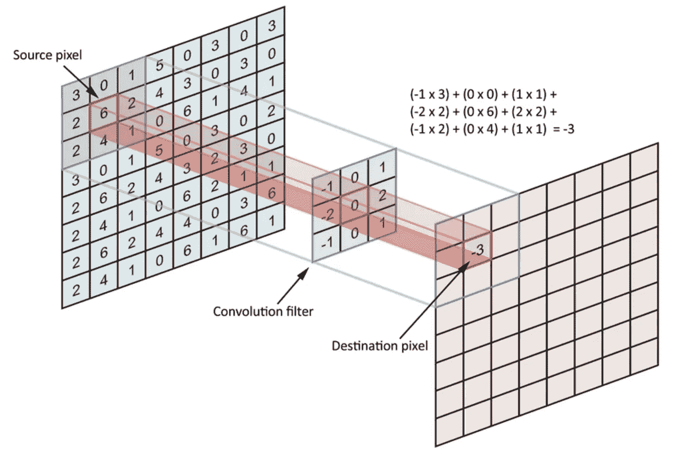

The convolution operation.

如果您想知道网络如何学习不同的特征，以及网络是否有可能学习相同的特征(拥有 10 个鼻子过滤器有点多余)，这是非常不可能发生的。在构建网络时，我们随机指定过滤器的值，然后随着网络的训练，过滤器不断更新自身。除非选择的过滤器数量非常大，否则生产出两个相同的过滤器是非常不可能的。

下面是一些过滤器的例子，我们称之为内核。

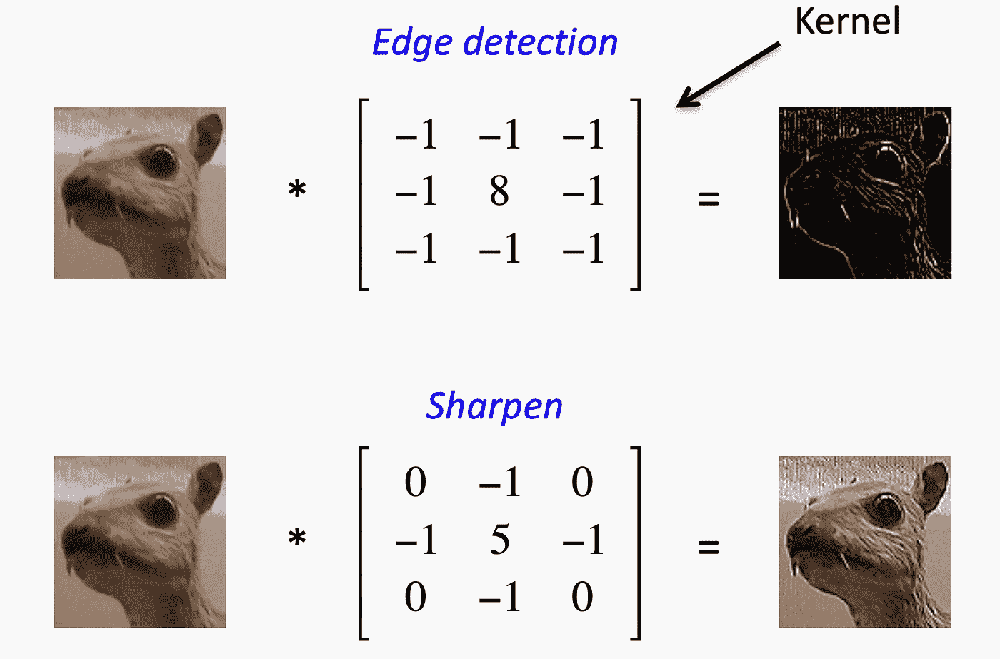

Examples of kernel filters for CNN’s.

在滤波器通过图像之后，为每个滤波器生成特征图。然后通过激活函数获取这些图像，激活函数决定某个特征是否出现在图像中的给定位置。然后我们可以做很多事情，例如添加更多的过滤层和创建更多的特征地图，随着我们创建更深的 CNN，这些变得越来越抽象。我们还可以使用合并图层来选择要素地图上的最大值，并将其用作后续图层的输入。理论上，任何类型的操作都可以在池化图层中完成，但在实践中，仅使用最大池化，因为我们希望找到异常值-这些是我们的网络看到的要素！

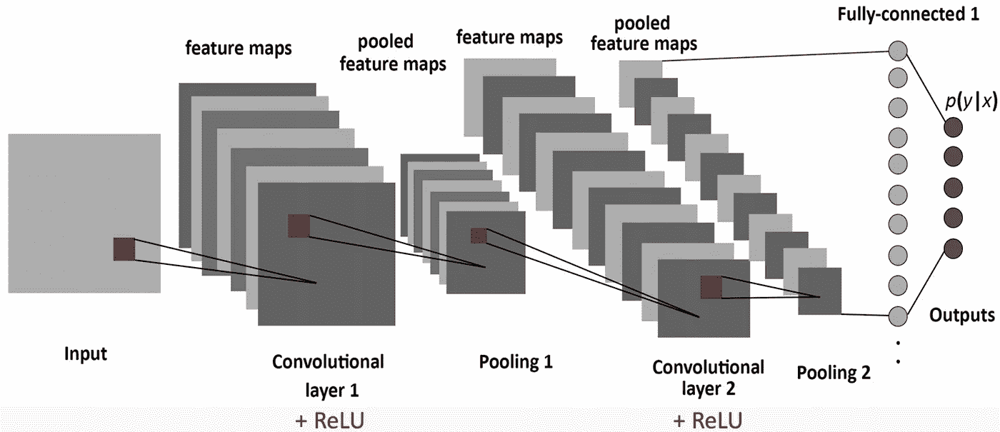

An example CNN with two convolutional layers, two pooling layers, and a fully connected layer which decides the final classification of the image into one of several categories.

只是重申一下我们目前的发现。我们知道 MLP:

*   不适合图像缩放
*   忽略像素位置和与邻居的相关性带来的信息
*   无法处理翻译

CNN 的总体想法是智能地适应图像的属性:

*   像素位置和邻域具有语义含义
*   感兴趣的元素可以出现在图像中的任何地方

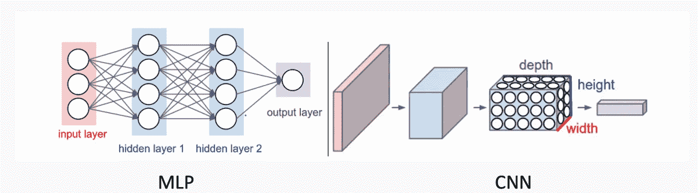

Comparison of architecture for MLP and CNN.

CNN 也是由层组成的，但这些层并不完全相连:它们有过滤器，即应用于整个图像的立方体形状的权重集。滤波器的每个 2D 切片被称为内核。这些过滤器引入了平移不变性和参数共享。它们是如何应用的？回旋！

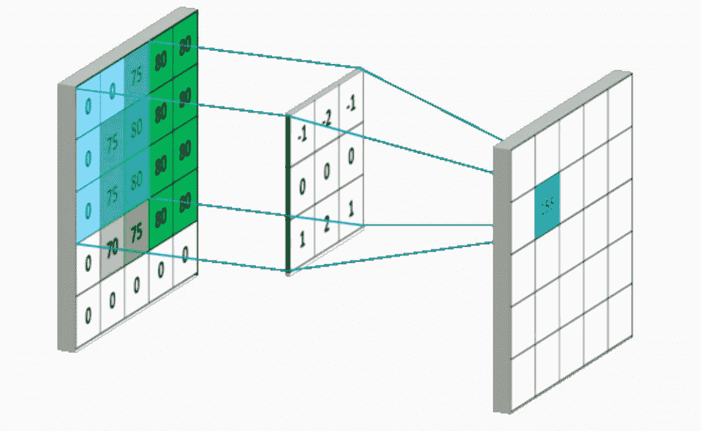

Example of how convolutions are applied to images using kernel filters.

现在的一个好问题是图像的边缘会发生什么？如果我们在普通图像上应用卷积，结果将根据滤波器的大小进行一定量的下采样。如果我们不想让这种情况发生，我们该怎么做？我们可以用衬垫。

**填充**

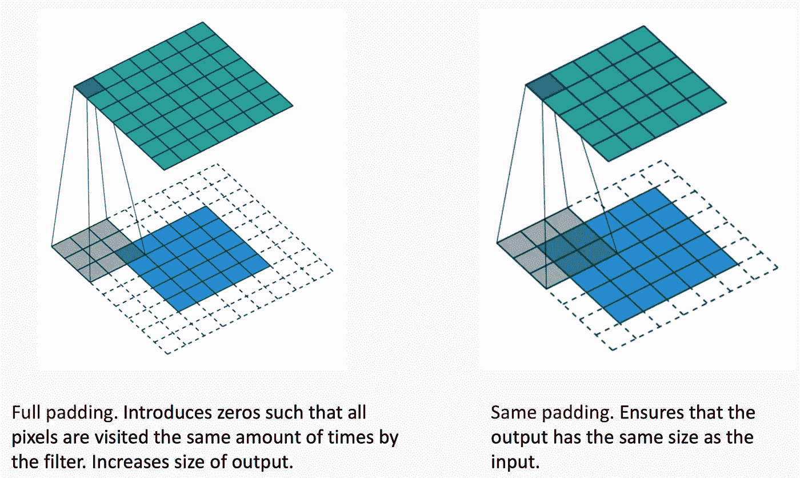

Illustration of how full padding and same padding are applied to CNN’s.

填充本质上使得由滤波器核产生的特征图与原始图像具有相同的大小。这对于深度 CNN 非常有用，因为我们不希望输出减少，这样我们在网络的末端只剩下一个 2×2 的区域来预测我们的结果。

**我们如何将过滤器连接在一起？**

如果我们有许多特征地图，如何在我们的网络中组合这些地图以帮助我们获得最终结果？

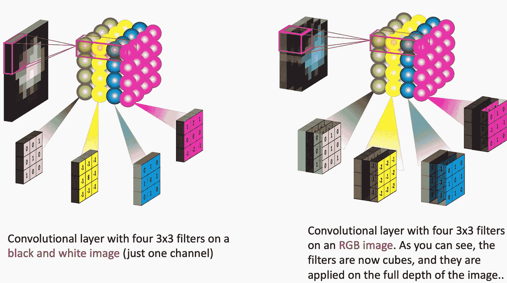

为了清楚起见，每个过滤器都与整个 3D 输入立方体进行卷积，但会生成 2D 要素地图。

*   因为我们有多个过滤器，我们最终得到一个 3D 输出:每个过滤器一个 2D 要素地图
*   从一个卷积层到下一个卷积层，特征映射维度可能会发生巨大变化:如果一个层有 128 个滤波器，我们可以以 32x32x16 的输入进入该层，以 32x32x128 的输出退出。
*   用滤波器对图像进行卷积产生特征图，该特征图突出了图像中给定特征的存在。

在卷积层中，我们基本上是在图像上应用多个滤波器来提取不同的特征。但最重要的是，我们正在学习那些过滤器！我们遗漏了一件事:非线性。

**介绍 ReLU**

CNN 最成功的非线性是整流非线性单元(ReLU ),它解决了 sigmoids 中出现的梯度消失问题。ReLU 更容易计算并产生稀疏性(并不总是有益的)。

**不同层的对比**

卷积神经网络中有三种类型的层:卷积层、池层和全连接层。这些图层中的每一个都有不同的参数可以优化，并对输入数据执行不同的任务。

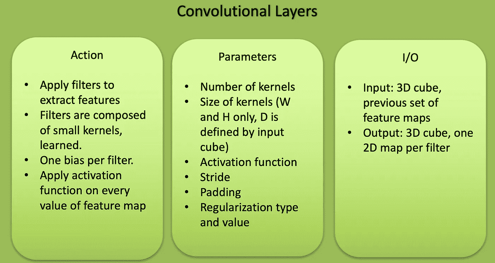

Features of a convolutional layer.

卷积层是对原始图像或深层 CNN 中的其他特征地图应用过滤器的层。这是网络中大多数用户指定参数的位置。最重要的参数是颗粒的数量和颗粒的大小。

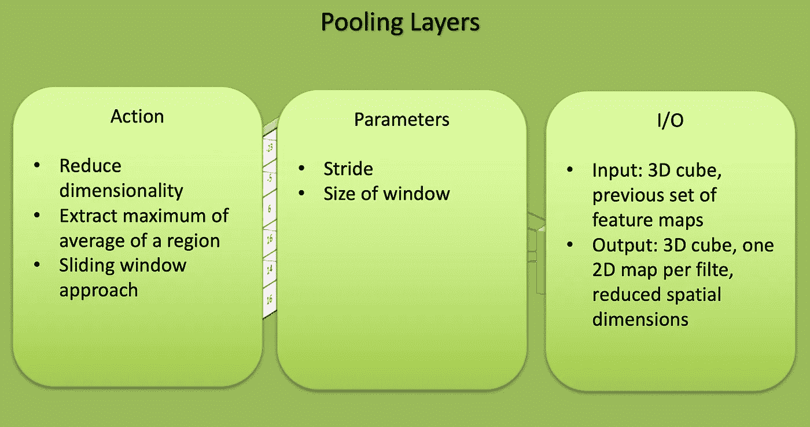

Features of a pooling layer

池层类似于卷积层，但它们执行特定的功能，如最大池(在某个过滤区域取最大值)或平均池(在某个过滤区域取平均值)。这些通常用于降低网络的维度。

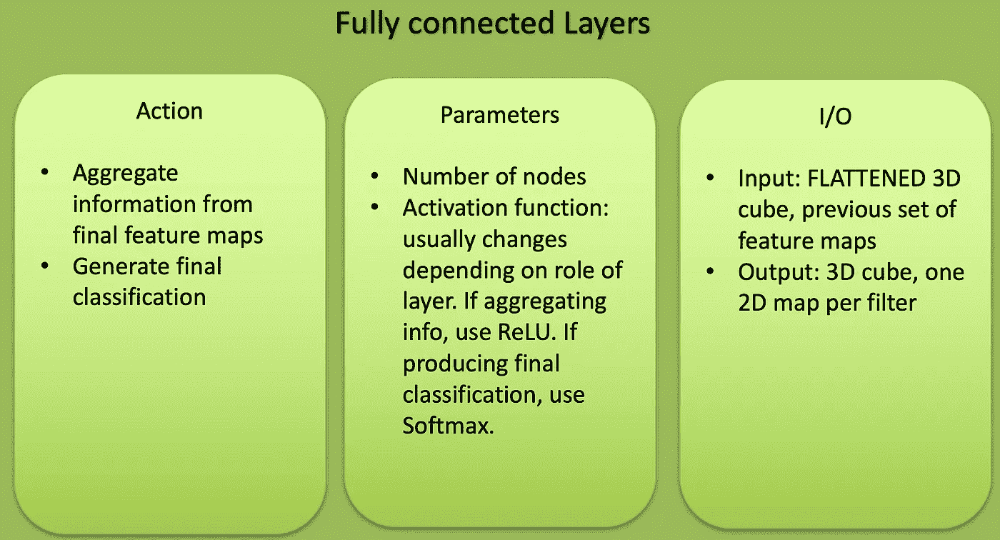

Features of a fully connected layer.

完全连接的图层位于 CNN 的分类输出之前，用于在分类之前展平结果。这类似于 MLP 的输出图层。

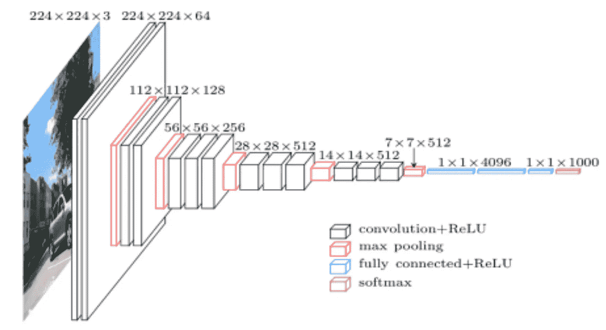

The architecture of a standard CNN.

CNN 层学什么？

*   CNN 的每一层都学习越来越复杂的过滤器。
*   第一层学习基本的特征检测过滤器:边缘、拐角等
*   中间层学习检测物体部分的过滤器。对于面部，他们可能会学会对眼睛、鼻子等做出反应
*   最后一层有更高的表现:他们学习识别不同形状和位置的完整物体。

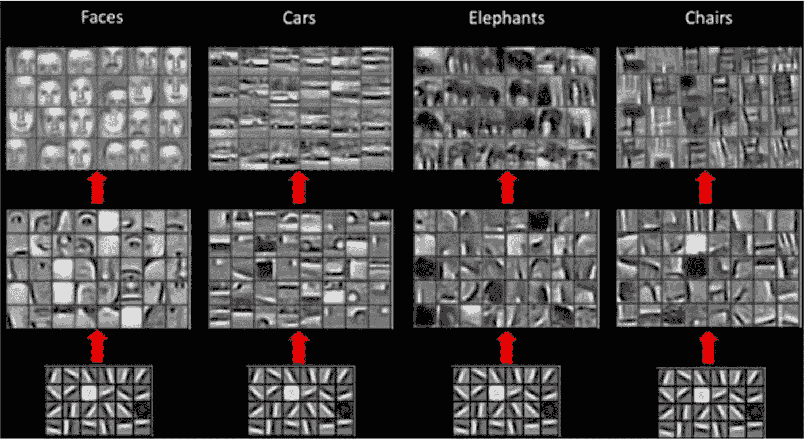

Examples of CNN’s trained to recognize specific objects and their generated feature maps.

要看 CNN 实际工作的 3D 例子，请点击下面的链接[这里](http://scs.ryerson.ca/~aharley/vis/conv/)。

## 时事通讯

关于新博客文章和额外内容的更新，请注册我的时事通讯。

 [## 时事通讯订阅

### 丰富您的学术之旅，加入一个由科学家，研究人员和行业专业人士组成的社区，以获得…

mailchi.mp](https://mailchi.mp/6304809e49e7/matthew-stewart)