# 神经网络导论

> 原文：<https://towardsdatascience.com/simple-introduction-to-neural-networks-ac1d7c3d7a2c?source=collection_archive---------2----------------------->

## 神经网络的详细概述，有大量的例子和简单的图像。

> “你的大脑不会制造思想。你的思想塑造了神经网络。” ***—狄巴克·乔布拉***

本文是旨在揭开神经网络背后的理论以及如何设计和实现它们的系列文章中的第一篇。这篇文章旨在对神经网络进行详细而全面的介绍，面向广泛的个人:对神经网络如何工作知之甚少或一无所知的人，以及相对精通其用途但可能不是专家的人。在这篇文章中，我将涵盖神经网络的动机和基础知识。未来的文章将深入探讨关于神经网络和深度学习的设计和优化的更详细的主题。

这些教程主要基于哈佛和斯坦福大学计算机科学和数据科学系的课堂笔记和例子。

我希望你喜欢这篇文章，并且不管你以前对神经网络的理解如何，都能学到一些东西。我们开始吧！

# **神经网络的动机**

未经训练的神经网络模型很像新生婴儿:他们生来对世界一无所知(如果考虑 *tabula rasa* 认识论的话)，只有通过接触世界，即*后验*知识，他们的无知才会被慢慢修正。算法通过数据体验世界——通过在相关数据集上训练神经网络，我们试图减少它的无知。我们衡量进度的方法是监控网络产生的错误。

在深入研究神经网络世界之前，了解这些网络背后的动机以及它们为什么工作是很重要的。要做到这一点，我们必须谈一谈逻辑回归。

以**定量**响应变量(如出租车接送数量、自行车租赁数量)的建模和预测为中心的方法被称为回归(以及岭、套索等。).当响应变量为**分类**时，则该问题不再被称为回归问题，而是被标记为分类问题。

让我们考虑一个二元分类问题。目标是尝试根据一组预测变量*将每个观察值分类到由 ***Y*** 定义的类别(如类或聚类)中。*

*假设我们希望根据患者的特征来预测患者是否患有心脏病。这里的响应变量是分类的，有有限的结果，或者更明确地说，是二元的，因为只有两个类别(是/否)。*

*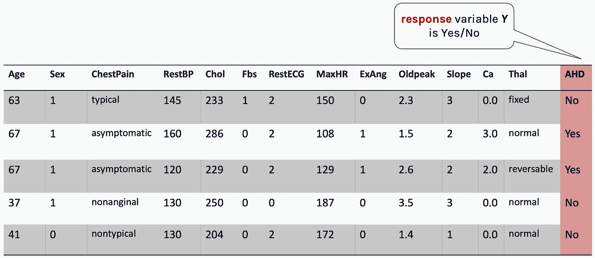*

*这里有很多特性—现在，我们将只使用 MaxHR 变量。*

*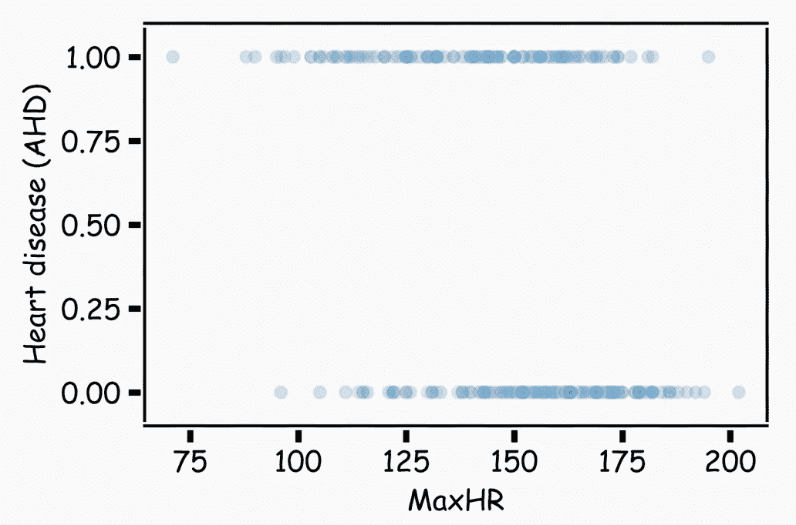*

*为了进行这种预测，我们将使用一种称为逻辑回归的方法。逻辑回归解决了在给定输入值 *X* 的情况下，估计某人患有心脏病的概率 *P(y=1)* 的问题。*

*逻辑回归模型使用一个名为**逻辑**函数的函数来模拟 *P(y=1)* :*

*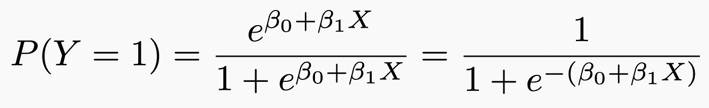*

*因此，模型将使用一条 *S* 形曲线预测 *P(y=1)* ，这是逻辑函数的一般形状。*

**β₀* 将曲线向左或向右移动*c =β₀/β₁，*而 *β₁* 控制 *S* 形曲线的陡度。*

*请注意，如果 *β₁* 为正，则预测的 *P(y=1)* 从小值 *X* 的零变为大值 *X* 的一，如果 *β₁* 为负，则具有相反的关联。*

*这在下面用图表进行了总结。*

*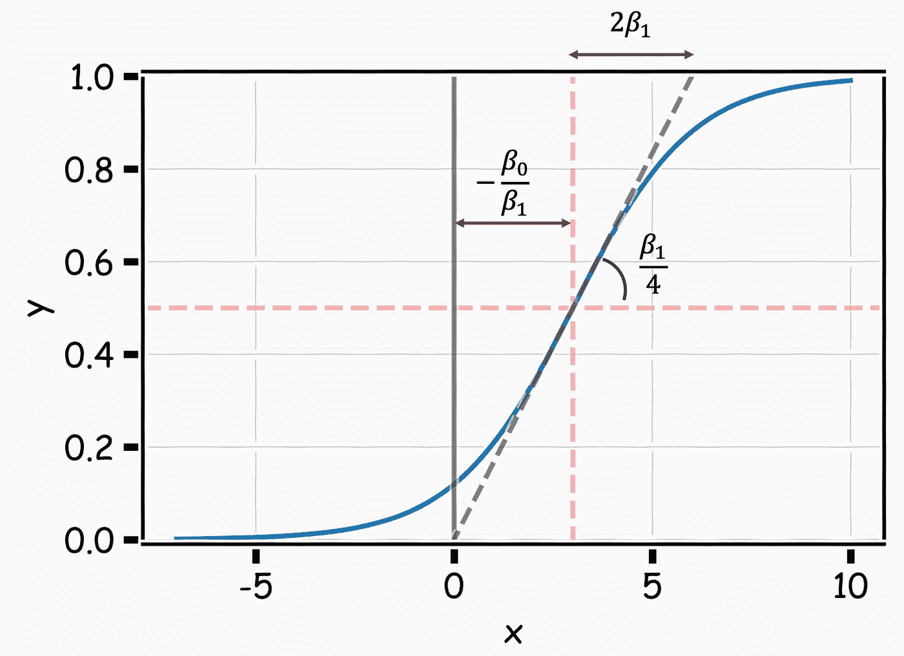*

*既然我们已经了解了如何操作我们的逻辑回归曲线，我们可以利用一些变量来得到我们想要的曲线。*

*我们可以改变 *β₀* 值来移动我们的偏移量。*

*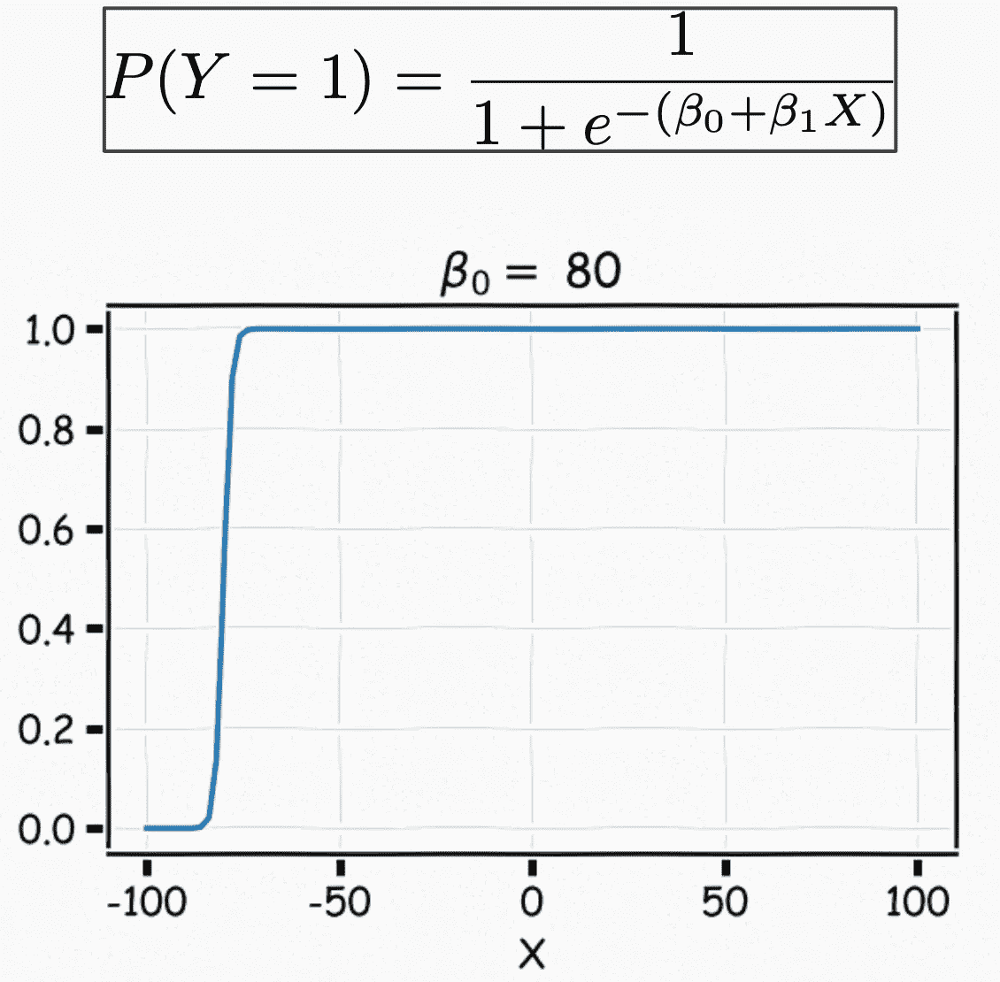*

*我们可以改变 *β₁* 值来扭曲我们的渐变。*

*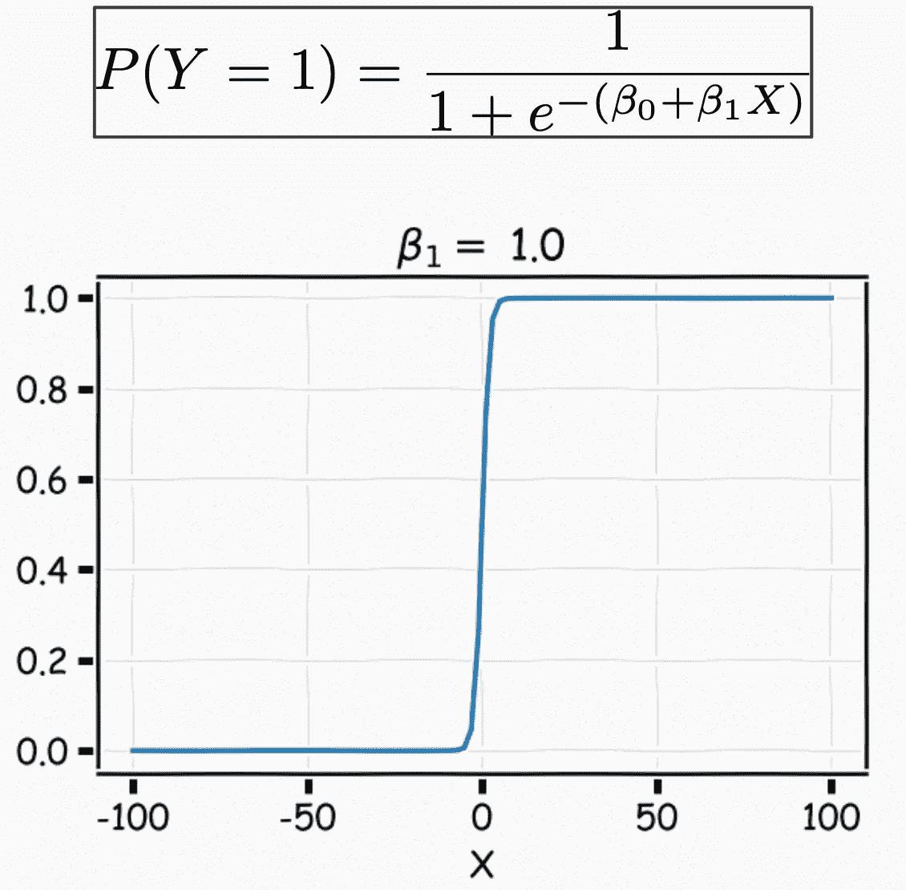*

*手动完成这项工作非常繁琐，而且不太可能收敛到最佳值。为了解决这个问题，我们使用损失函数来量化属于当前参数的误差水平。然后我们找到最小化这个损失函数的系数。对于这种二元分类，我们可以使用二元损失函数来优化我们的逻辑回归。*

*因此，神经网络的参数与网络产生的误差有关系，当参数改变时，误差也会改变。我们使用一种叫做[梯度下降](https://en.wikipedia.org/wiki/Gradient_descent)的优化算法来改变参数，这种算法对于寻找函数的最小值很有用。我们正在寻求最小化误差，这也被称为**损失函数**或**目标函数**。*

*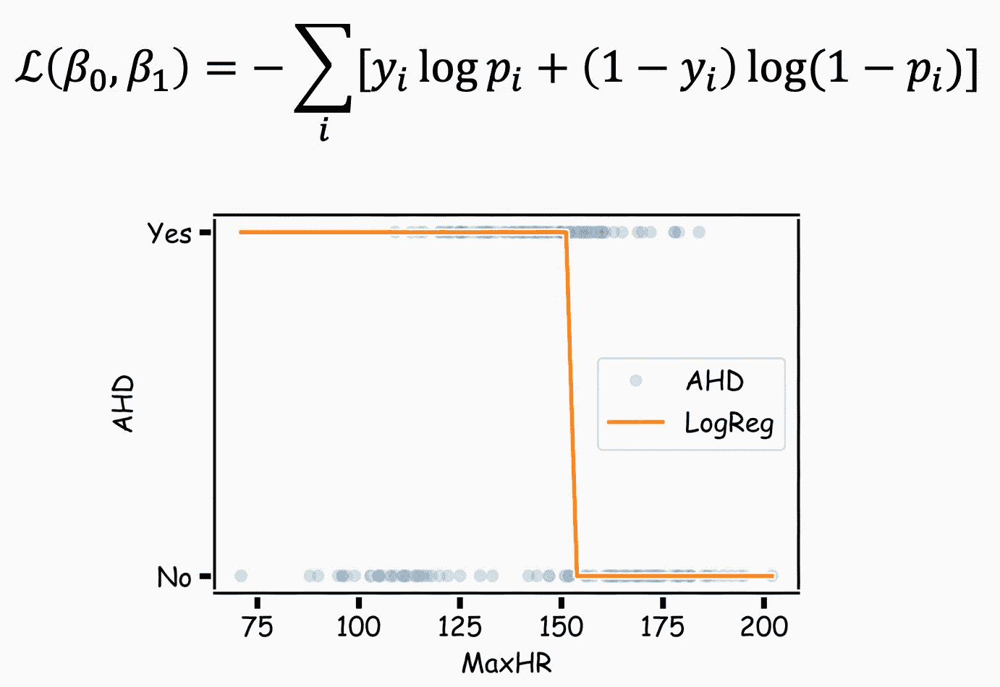*

*那么我们刚才做的有什么意义呢？这和神经网络有什么关系？实际上，我们刚刚做的基本上是由神经网络算法执行的相同程序。*

*我们在之前的模型中只使用了一个特性。取而代之的是，我们可以采用多种特征，并以网络格式来说明这些特征。我们有每个特征的权重，也有一个偏差项，它们共同构成了我们的回归参数。根据问题是分类问题还是回归问题，表述会略有不同。*

*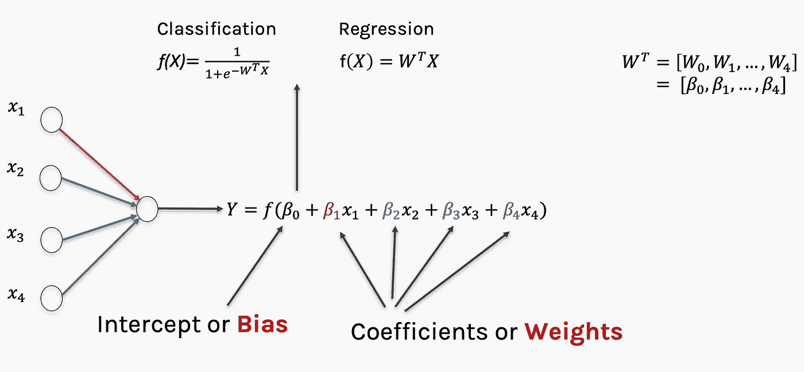*

*当我们谈论神经网络中的权重时，我们讨论的是我们各种输入函数的这些回归参数。然后将其传递给一个激活函数，该函数决定结果是否足够重要，足以“触发”该节点。我将在下一篇文章中更详细地讨论不同的激活函数。*

*所以现在我们开发了一个非常简单的网络，它由具有四个特征的多重逻辑回归组成。*

*我们需要从一些任意的值公式开始，以便开始更新和优化参数，这将通过在每次更新后评估损失函数并执行梯度下降来完成。*

*我们做的第一件事是设置随机选择的权重。最有可能的是，它会表现得很糟糕——在我们的心脏数据中，模型会给我们错误的答案。*

*然后，我们通过惩罚表现不佳的网络来“训练”它。*

*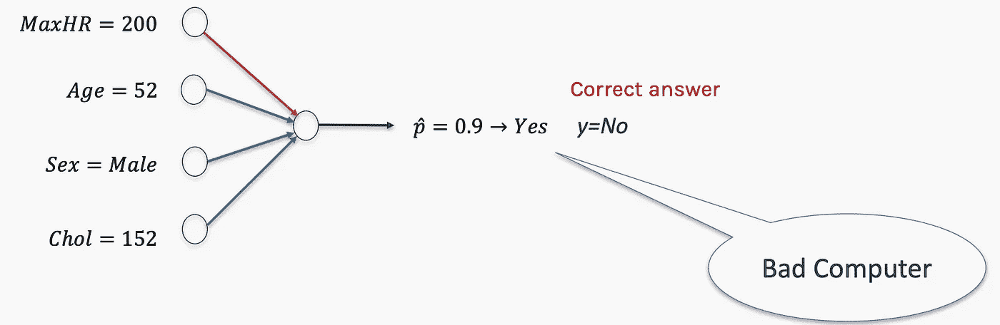*

*然而，仅仅告诉计算机它的性能是好是坏并没有特别的帮助。您需要告诉它如何更改这些权重，以提高模型的性能。*

*我们已经知道如何告诉计算机它运行良好，我们只需要参考我们的损失函数。现在，程序变得更加复杂，因为我们要处理 5 个砝码。我将只考虑一个重量，但所有重量的程序都是类似的。*

*理想情况下，我们想知道给出最小 *ℒ (w)的 *w* 的值。**

*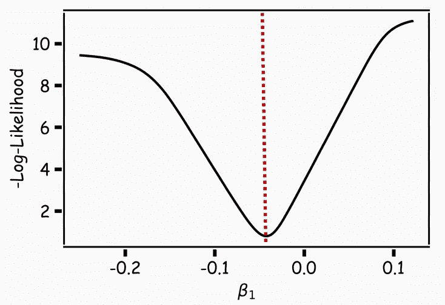*

*为了找到函数*ℒ(w)*的最佳点，我们可以对权重进行微分，然后将其设置为零*。**

*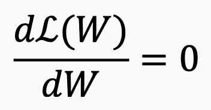*

*然后，我们需要找到满足该等式的 *w* 。有时没有明确的解决方案。*

*比较灵活的方法是从任意一点出发，然后确定往哪个方向走可以减少损失(本例中是向左还是向右)。具体来说，我们可以计算函数在这一点的斜率。如果斜率为负，我们向右移动，如果斜率为正，我们向左移动。然后重复这个过程，直到收敛。*

*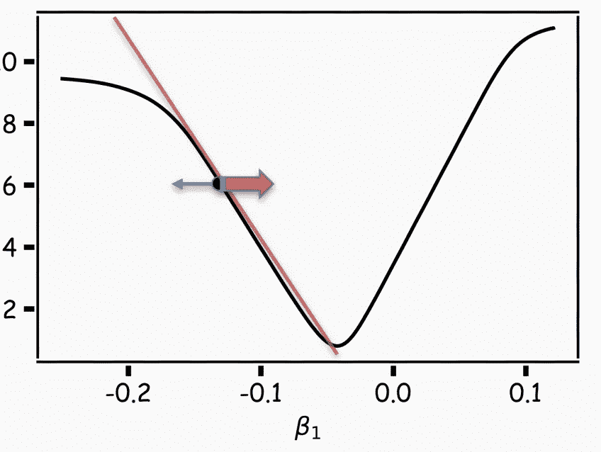*

*如果步长与斜率成比例，则可以避免超过最小值。*

*我们如何执行此更新？这是用梯度下降法来完成的，这在前面已经简单提到过了。*

# ***梯度下降***

*梯度下降是一种寻找函数最小值的迭代方法。梯度下降有各种风格，我将在后续文章中详细讨论这些。[这篇博文](http://ruder.io/optimizing-gradient-descent/)介绍了更新权重的不同方法。现在，我们将坚持传统的梯度下降算法，有时被称为[德尔塔法则](http://www.cs.stir.ac.uk/courses/ITNP4B/lectures/kms/3-DeltaRule.pdf)。*

*我们知道，我们想要朝着导数的相反方向前进(因为我们试图“远离”误差)，我们知道我们想要做出与导数成比例的一步。这一步由称为学习率的参数λ控制。我们的新权重是旧权重和新步长的相加，其中步长是从损失函数和我们的相关参数在影响学习速率中的重要程度(因此是导数)导出的。*

*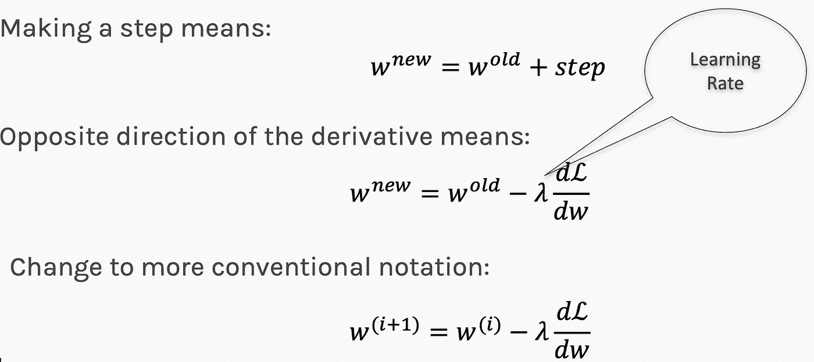*

*一个大的学习率意味着更多的权重放在导数上，这样算法的每次迭代都可以进行大的步骤。较小的学习速率意味着导数的权重较小，因此每次迭代的步长较小。*

*如果步长太小，算法将需要很长时间才能收敛，如果步长太大，算法将不断错过最佳参数选择。显然，在建立神经网络时，选择学习速率可能是一个重要的参数。*

*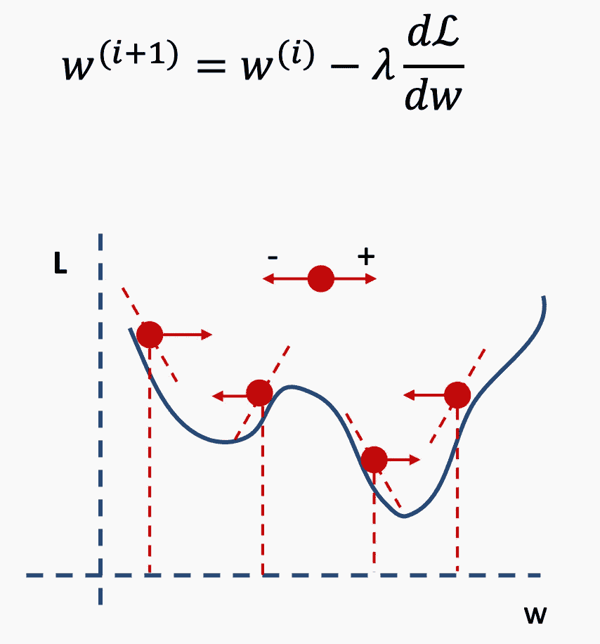*

*梯度下降有各种考虑因素:*

*   *我们仍然需要求导。*
*   *我们需要知道学习率是多少，或者如何设置。*
*   *我们需要避免局部最小值。*
*   *最后，完整的损失函数包括所有单个“误差”的总和。这可以是几十万个例子。*

*现在求导是用自动微分来完成的，所以我们不太关心这个。然而，决定学习速率是一个重要而复杂的问题，我将在后面的系列教程中讨论。*

*局部最小值对于神经网络来说可能是非常成问题的，因为神经网络的公式不能保证我们将达到全局最小值。*

*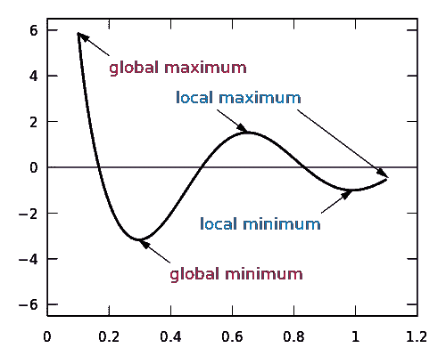*

*[Source](https://en.wikipedia.org/wiki/Backpropagation#/media/File:Extrema_example.svg)*

*陷入局部最小值意味着我们的参数有一个局部好的优化，但在我们的损失面上有一个更好的优化。神经网络损失曲面可能具有许多这样的局部最优值，这对网络优化是有问题的。例如，参见下图所示的损失面。*

**

*Example neural network loss surface. [Source](https://www.cs.umd.edu/~tomg/projects/landscapes/)*

*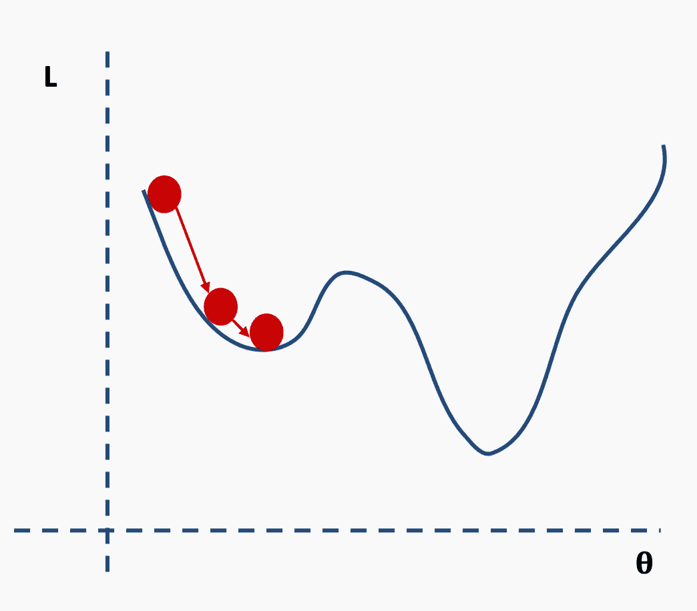*

*Network getting stuck in local minima.*

*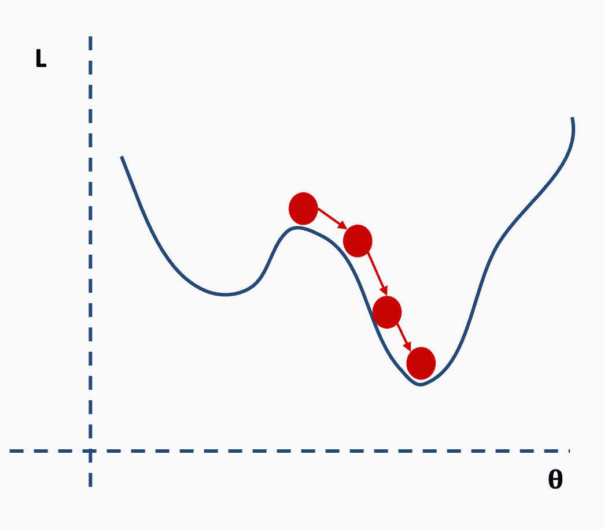*

*Network reach global minima.*

*我们如何解决这个问题？一个建议是使用批量和随机梯度下降。这个想法听起来很复杂，但很简单——使用一批(子集)数据，而不是整个数据集，这样损失面在每次迭代过程中会部分变形。*

*对于每次迭代 *k* ，以下损失(可能性)函数可用于导出导数:*

*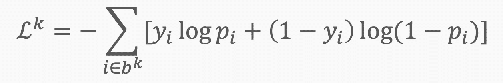*

*这是全损失函数的近似值。我们可以用一个例子来说明这一点。首先，我们从完全损失(可能性)表面开始，我们随机分配的网络权重为我们提供了初始值。*

*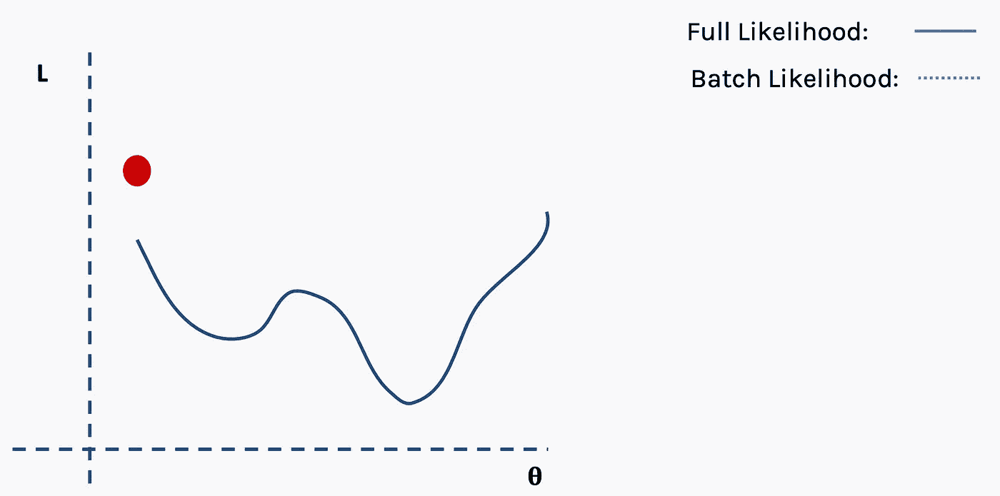*

*然后，我们选择一批数据，可能是整个数据集的 10%，并构建一个新的损失面。*

*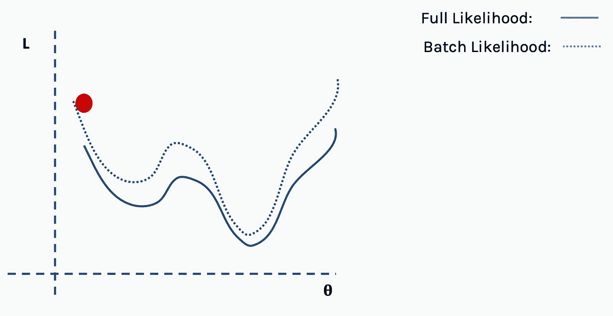*

*然后，我们对该批次执行梯度下降，并执行我们的更新。*

*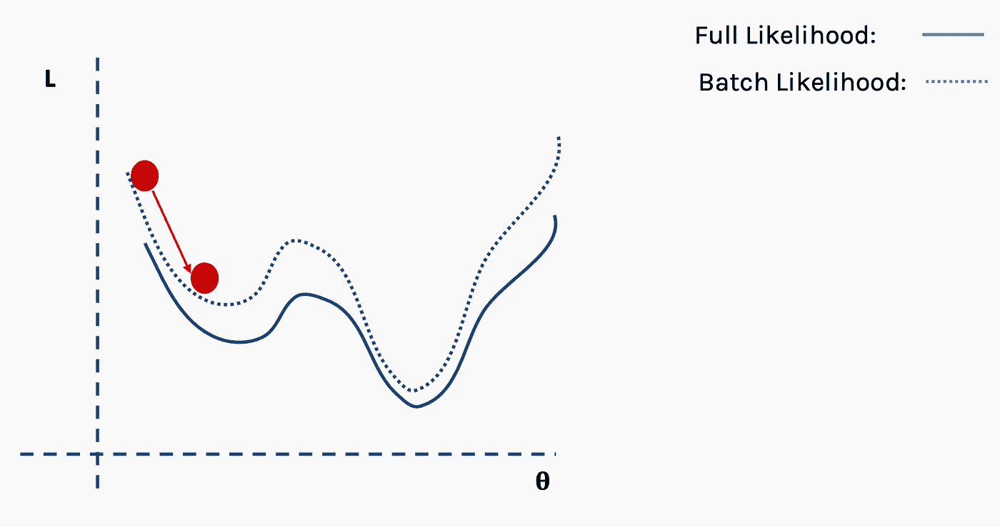*

*我们现在在一个新的地方。我们选择完整数据集的一个新的随机子集，并再次构建我们的损失面。*

*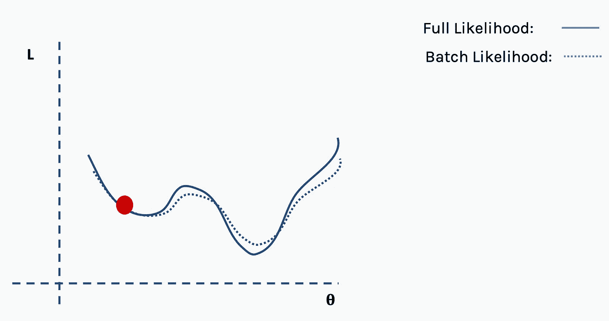*

*然后，我们对该批次执行梯度下降，并执行我们的更新。*

*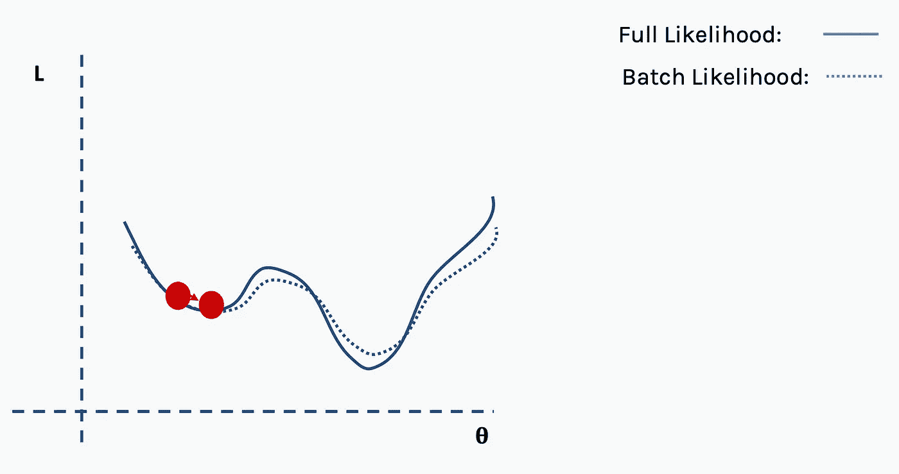*

*我们用新的子集再次继续这个过程。*

*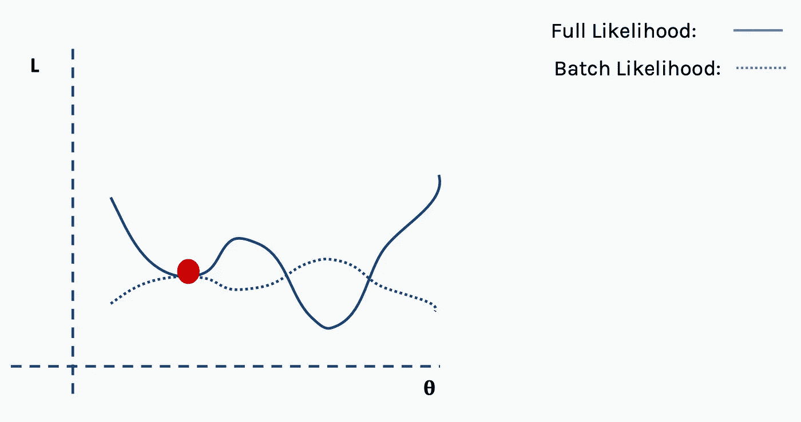*

*执行我们的更新。*

*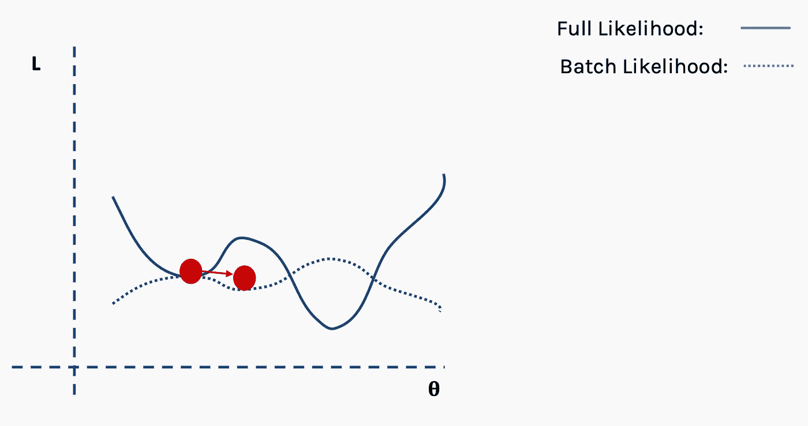*

*这个过程持续多次迭代。*

*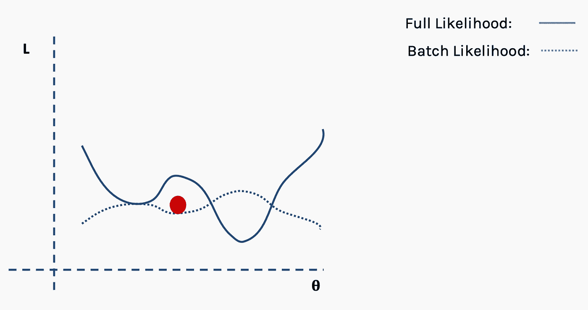*

*直到网络开始收敛到全局最小值。*

*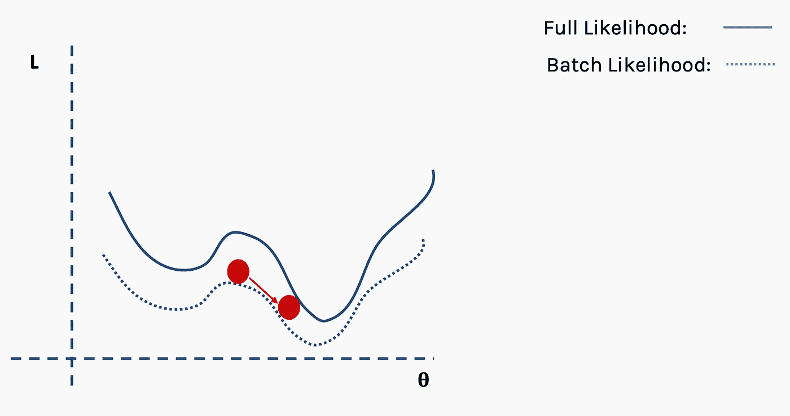*

*我们的工具包中现在有足够的知识来着手建立我们的第一个神经网络。*

# ***人工神经网络***

*既然我们了解了逻辑回归是如何工作的，我们如何评估我们网络的性能，以及我们如何更新网络以提高我们的性能，我们就可以着手建立一个神经网络了。*

*首先，我想让我们明白神经网络为什么叫神经网络。你可能听说过这是因为它们模仿了神经元的结构，神经元是大脑中存在的细胞。神经元的结构看起来比神经网络复杂得多，但功能是相似的。*

*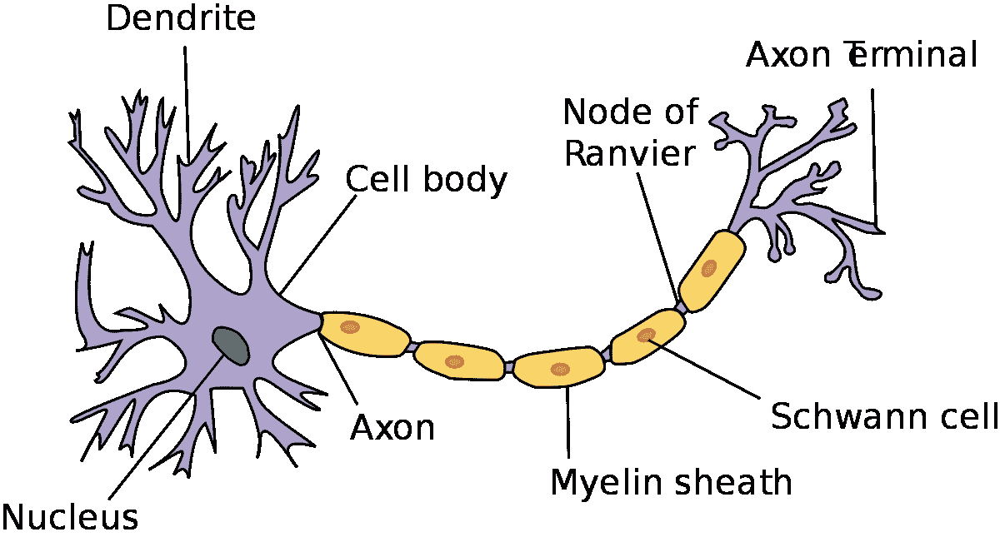*

*[Source](https://simple.wikipedia.org/wiki/Neuron)*

*实际神经元的工作方式涉及电势的积累，当超过特定值时，会导致突触前神经元穿过轴突放电，并刺激突触后神经元。*

*人类有数十亿相互连接的神经元，可以产生极其复杂的放电模式。与我们能够做到的相比，人脑的能力是不可思议的，甚至与最先进的神经网络相比也是如此。由于这个原因，我们可能不会很快看到神经网络模仿人脑的功能。*

*我们可以画一个神经图，把神经网络中的神经元结构和人工神经元进行类比。*

*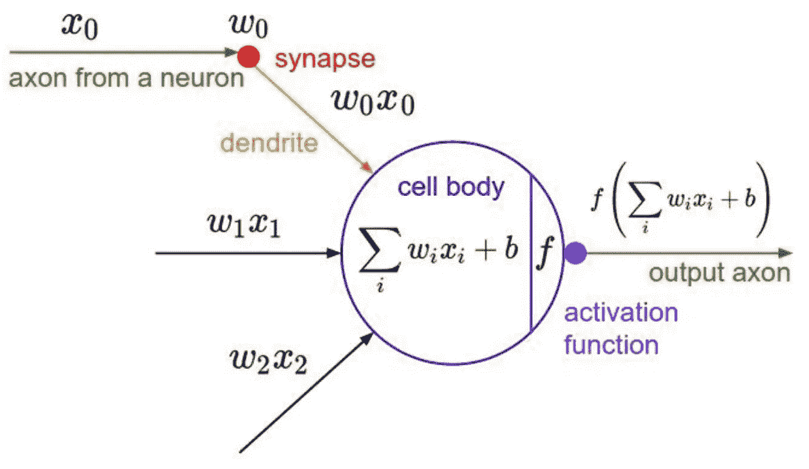*

*[Source](http://cs231n.stanford.edu/slides/2017/cs231n_2017_lecture6.pdf)*

*鉴于人类大脑的能力，应该很明显，人工神经网络的能力在范围上是相当无限的——特别是一旦我们开始将这些与传感器、致动器以及互联网的财富联系起来——这解释了它们在世界上无处不在，尽管事实上我们正处于它们发展的相对初期阶段。*

*毕竟，还原论者可能会认为人类只不过是通过神经系统的各个部分连接到传感器和执行器的神经网络的集合。*

*现在让我们想象我们有多种特征。每个特征都要经过一种叫做仿射变换的东西，这基本上是一种加法(或减法)和/或乘法。这给了我们一个类似回归方程的东西。在多层感知器中，当多个节点汇聚到一个节点时，仿射变换就变得很重要。*

*然后，我们通过激活函数传递这个结果，这给了我们某种形式的概率。这个概率决定了神经元是否会触发——我们的结果可以插入到我们的损失函数中，以评估算法的性能。*

*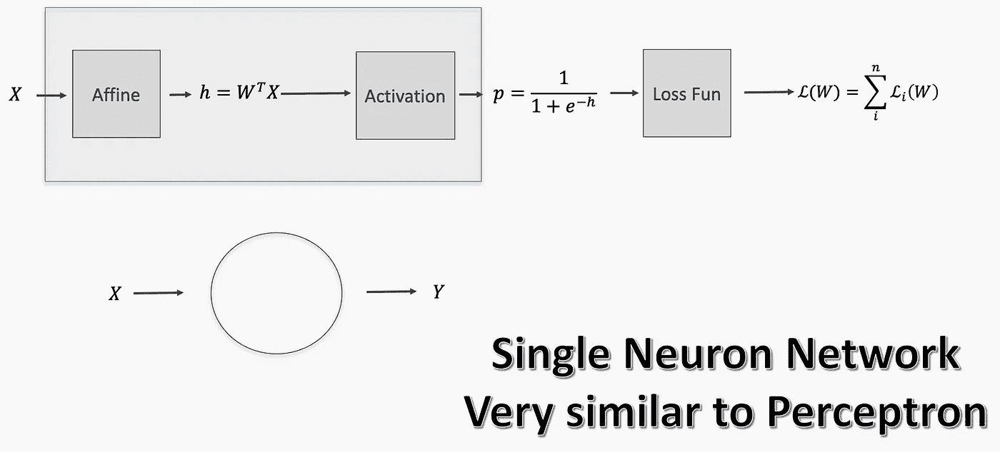*

*从现在开始，我将把仿射块和激活块抽象成一个块。然而，要清楚的是，仿射变换是来自上游节点的输出的合并，然后求和的输出被传递到激活函数，该函数评估概率以确定它是否是足以使神经元激活的量化值(概率)。*

*我们现在可以回到第一个例子，看看我们的心脏病数据。我们可以将两个逻辑回归合并在一起。个体逻辑回归看起来像下面的情况:*

*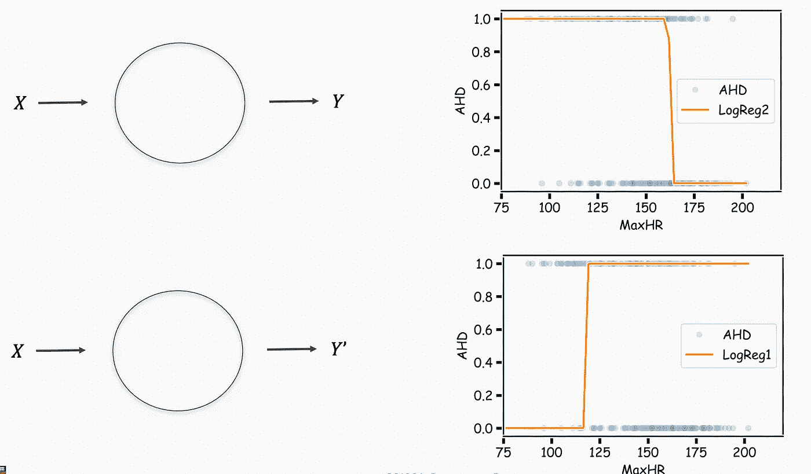*

*当我们连接这两个网络时，由于增加了自由度，我们获得了具有增加的灵活性的网络。*

*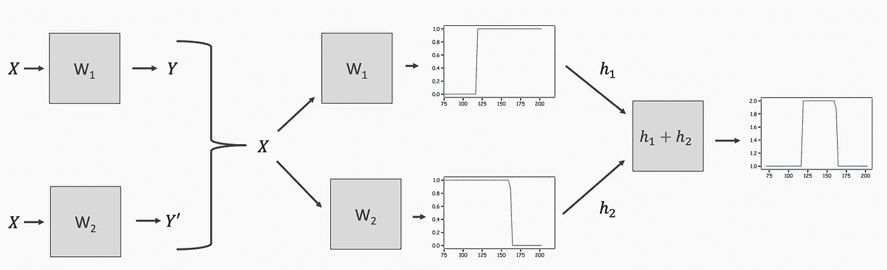*

*这很好地说明了神经网络的力量，我们能够将多个函数串在一起(求和),这样，通过大量的函数——这些函数来自大量的神经元——我们能够产生高度非线性的函数。有了足够大的一组神经元，就可以产生任意复杂的连续函数。*

*这是一个非常简单的神经网络的例子，然而，我们看到，即使是这样一个简单的网络，我们也已经遇到了问题。我们应该如何更新我们的权重值？*

*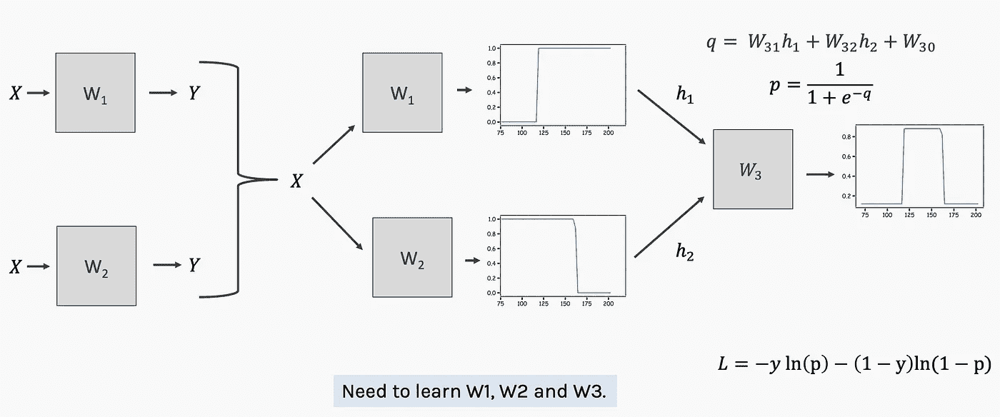*

*我们需要能够计算损失函数相对于这些权重的导数。为了学习缺失的权重，w₁、w₂和 w₃，我们需要利用反向传播。*

# ***反向传播***

*反向传播是神经网络学习的中心机制。它是告诉网络网络在预测过程中是否犯了错误的信使。反向传播的发现是整个神经网络研究中最重要的里程碑之一。*

**传播*就是在特定的方向或通过特定的媒介传递某种东西(如光、声)。当我们在神经网络的上下文中讨论反向传播时，我们谈论的是信息的传输，并且该信息与神经网络在对数据进行猜测时产生的误差有关。*

*在预测过程中，神经网络通过网络节点向前传播信号，直到信号到达做出决策的输出层。然后，网络通过网络反向传播关于该错误的信息，从而可以改变每个参数。*

*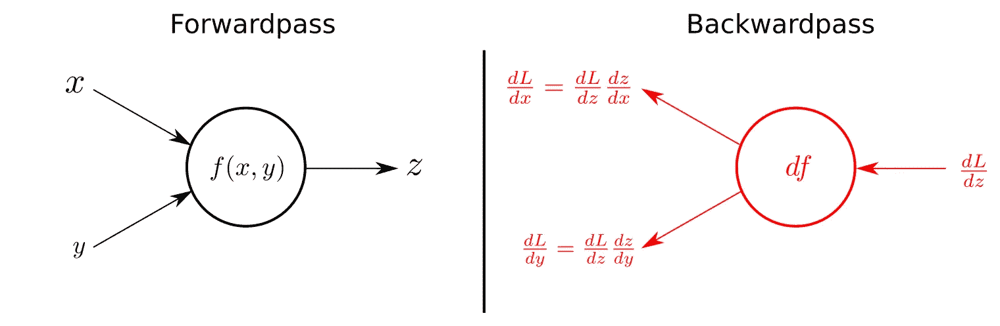*

*[Source](https://becominghuman.ai/back-propagation-in-convolutional-neural-networks-intuition-and-code-714ef1c38199)*

*反向传播是我们计算网络中每个参数的导数的方法，这是执行梯度下降所必需的。这是一个重要的区别，因为很容易混淆反向传播和梯度下降。首先执行反向传播，以便获得执行梯度下降所需的信息。*

*你可能已经注意到了，我们仍然需要计算导数。计算机不能区分，但可以建立一个函数库来做到这一点，而不需要网络设计人员参与，它为我们抽象了这个过程。这就是所谓的自动微分。下面是一个例子。*

*我们可以像这样手动完成，然后针对每个网络架构和每个节点进行更改。*

*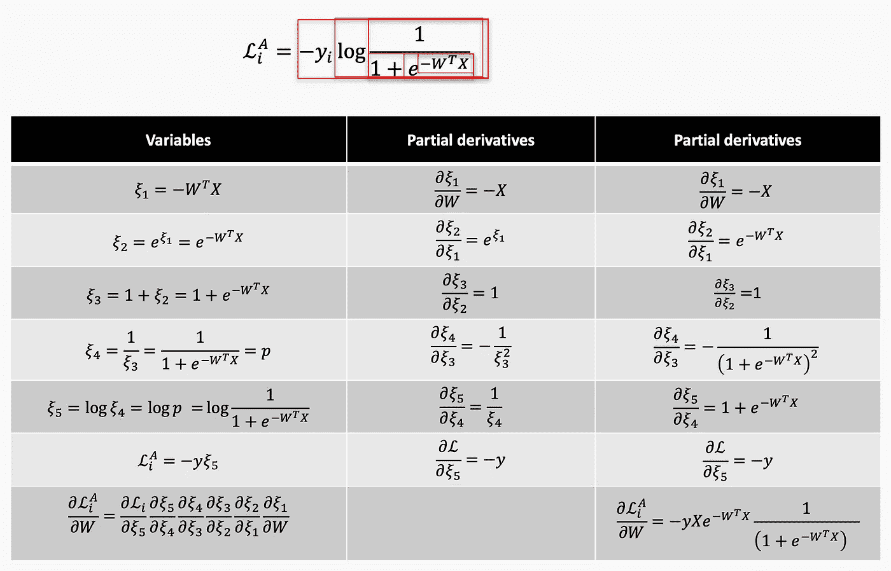*

*或者我们可以编写一个函数库，该函数库与体系结构有着内在的联系，这样，当网络体系结构更新时，该过程就会被抽象出来并自动更新。*

**

*如果你真的想了解这种抽象的自动微分过程有多有用，请尝试制作一个具有半打节点的多层神经网络，并编写代码来实现反向传播(如果有人有耐心和勇气做到这一点，那么向你致敬)。*

# ***更复杂的网络***

*具有两个节点的网络对于大多数应用来说不是特别有用。通常，我们使用神经网络来逼近传统方法难以描述的复杂函数。*

*神经网络很特别，因为它们遵循一种叫做 [**的通用近似定理**](https://en.wikipedia.org/wiki/Universal_approximation_theorem) 。该定理指出，给定神经网络中无限数量的神经元，可以精确地表示任意复杂的连续函数。这是一个相当深刻的声明，因为它意味着，给定足够的计算能力，我们可以近似任何函数。*

*显然，在实践中，这个想法有几个问题。首先，我们受到现有数据的限制，这限制了我们预测类别或估计值的潜在准确性。其次，我们受到计算能力的限制。设计一个远远超过世界上最强大的超级计算机能力的网络是相当容易的。*

*诀窍是设计一种网络架构，使我们能够使用相对较少的计算能力和最少的数据实现高精度。*

*更令人印象深刻的是，一个隐藏层足以表示任意精度的任何函数的近似值。*

*那么如果一层就够了，为什么人们还要用多层神经网络呢？*

**

*A neural architecture with multiple hidden layers.*

*答案很简单。该网络将需要具有非常宽的神经架构，因为浅网络比深网络需要(指数地)更多的宽度。此外，浅网络对过度拟合具有更高的亲和力。*

*这就是为什么深度学习领域存在(深度指的是神经网络的多层)并主导机器学习和大多数涉及数据分类和预测的领域的当代研究文献背后的刺激因素。*

# *摘要*

*本文讨论了神经网络的动机和背景，并概述了如何训练它们。我们讨论了损失函数、误差传播、激活函数和网络架构。下图很好地总结了所有讨论的概念以及它们是如何相互联系的。*

*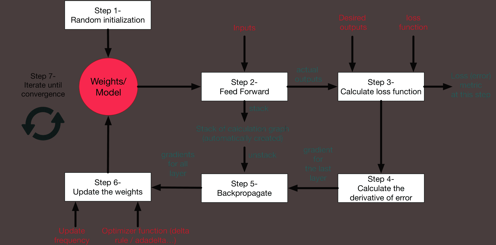*

*Neural networks step-by-step. [Source](https://medium.com/datathings/neural-networks-and-backpropagation-explained-in-a-simple-way-f540a3611f5e)*

*这篇文章中的知识将为我们提供一个强大的基础，我们可以在未来的文章中讨论如何提高神经网络的性能并将其用于深度学习应用。*

## *时事通讯*

*关于新博客文章和额外内容的更新，请注册我的时事通讯。*

* [## 时事通讯订阅

### 丰富您的学术之旅，加入一个由科学家，研究人员和行业专业人士组成的社区，以获得…

mailchi.mp](https://mailchi.mp/6304809e49e7/matthew-stewart) 

# **参考文献**

J.《数值最优化》，施普林格，1999 年

TLDR: J. Bullinaria，“用动量学习，共轭梯度学习”，2015*