# Numpy 中从头开始的简单线性回归

> 原文：<https://towardsdatascience.com/simple-linear-regression-from-scratch-in-numpy-871335e14b7a?source=collection_archive---------10----------------------->

线性回归很可能是你已经学会的，或者打算学习的第一个“机器学习”算法。这是一个简单的算法，最初是在统计领域开发的，并作为理解输入和输出变量之间关系的模型进行研究。

顾名思义，它是一个线性模型，因此它假设输入变量(***)X***)和单个(*【连续】*)输出变量( ***y*** )之间是线性关系。更准确地说， ***y*** 可以从输入变量的线性组合中计算出来。

在只有一个输入变量的情况下，该方法被称为**简单线性回归**，这将是本文的主题。你可以说在现实世界中你有不止一个输入变量，这是真的，但是从基础开始总是一个好主意。

线性方程为每个输入值分配一个比例因子，称为系数，通常用希腊字母 Beta ( ***β*** )表示。增加了一个系数，给线一个额外的自由度(*向上或向下*移动线)，称为截距或**偏差系数**。

简单的线性回归可以表示为:

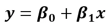

如果你有一个以上的输入变量，回归“线”将被称为一个平面或超平面。此外，不用说，你会有更多的β系数，每一个乘以一定的输入值。如果β系数为零，它告诉你那个位置的变量对模型没有影响。

学习一个线性回归模型意味着**用你现有的数据来估计表示中使用的系数的值。**

# 线性回归的假设

准备用于线性回归的数据时，您应该记住以下几点:

1.  **线性假设** —模型假设变量之间的关系是线性的
2.  **无噪声** —模型假设输入和输出变量没有噪声——因此，如果可能的话，移除异常值
3.  **无共线性**-当输入变量高度相关时，模型会过度拟合
4.  **正态分布**-如果输入和输出变量呈正态分布，模型将做出更可靠的预测。如果不是这样，试着对你的变量进行一些变换，使它们看起来更正常
5.  **重定标输入** —使用定标器或规格化器进行更可靠的预测

# 贝塔系数公式

在简单线性回归中，有两个系数——β0 和β1。它们不一定要‘学习’，你可以通过一个简单的公式计算出来(*仅用于简单的线性回归*):

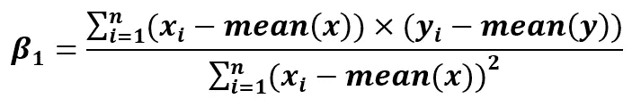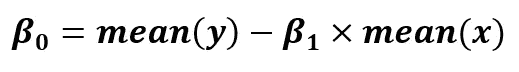

可以手工计算，也可以用 Python 计算。我会用 Python。

# 数据集介绍

我决定不从网上下载任意的数据集，而是自己制作。它由 300 个任意点组成:

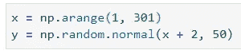

快速散点图将揭示变量之间清晰的线性趋势:

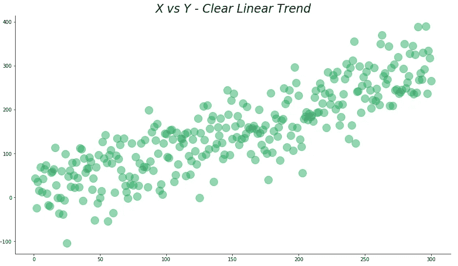

现在，您可以将 ***x*** 和 ***y*** 插入上面的公式中。首先，我将计算β1 系数:

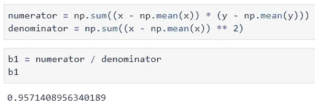

这并不难。β0 或偏差系数的计算将更加简单:

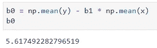

仅此而已。你现在可以做预测了。为此，我决定声明一个函数，***calc _ predictions()***，它将接受 ***x*** 项作为输入。然后，您可以轻松计算预测值:

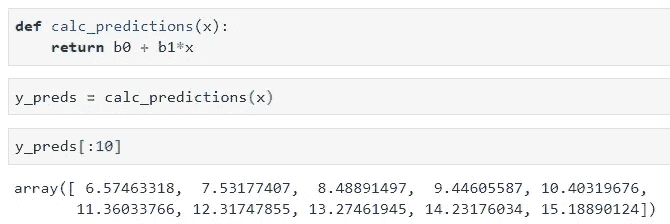

现在那些 ***y_preds*** 可以用来绘制回归线:

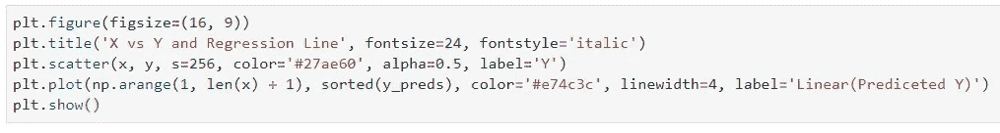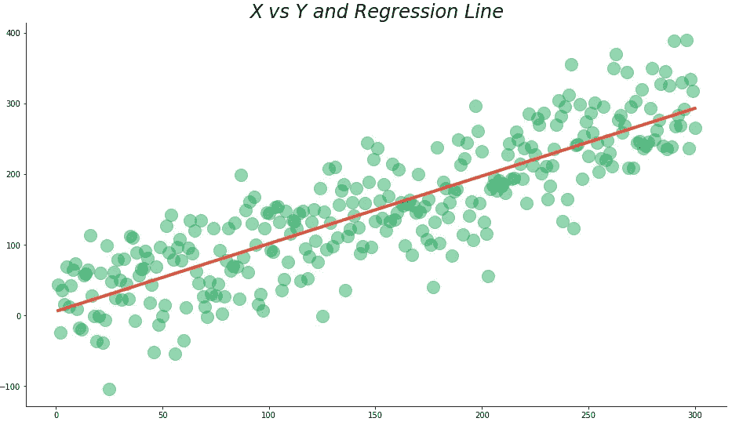

***那才叫爽。*** 快也。但是你现在可能想知道，有没有更简单快捷的方法来计算系数？

# 更简单的方法

你不必使用上面的公式来获得系数，有一个更短的方法。还涉及到公式的用法，不过要短很多。偏差截距的公式保持不变，但β1 的公式发生了变化:

下面是用 Python 实现它的方法:

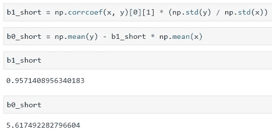

请注意您必须如何使用数组索引来获得相关系数，您的任务是探索如果不使用它会发生什么。
你可以看到系数值和之前计算的一样，所以一切正常(*万岁*)。

# 模型评估

评估一个回归模型的方法有很多，但我会用 [*均方根误差*](https://en.wikipedia.org/wiki/Root-mean-square_deviation) 。计算方法如下:

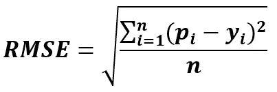

其中 ***Pi*** 为预测值。

要在 Python 中使用它，有两个选项:

1.  从 Scikit 中导入 MSE 学习并求它的平方根
2.  从头开始写

我将使用第二个选项，因为计算非常简单:

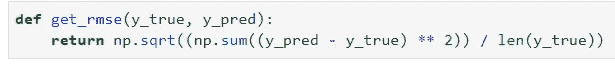

现在可以对模型进行评估:

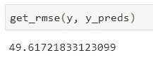

# 最后的话

该说再见了。这是一篇相当短的文章，但是我想说这是线性回归的一个很好的介绍。稍后，我将从头开始发表一篇关于多元线性回归的文章，它在现实世界中有实际应用，因为您的数据集可能有多个输入变量。

在此之前，尝试在您的数据集上使用这些方程，然后尝试将结果与 Scikit-Learn 的线性回归进行比较。

喜欢这篇文章吗？成为 [*中等会员*](https://medium.com/@radecicdario/membership) *继续无限制学习。如果你使用下面的链接，我会收到你的一部分会员费，不需要你额外付费。*

 [## 通过我的推荐链接加入 Medium-Dario rade ci

### 作为一个媒体会员，你的会员费的一部分会给你阅读的作家，你可以完全接触到每一个故事…

medium.com](https://medium.com/@radecicdario/membership)