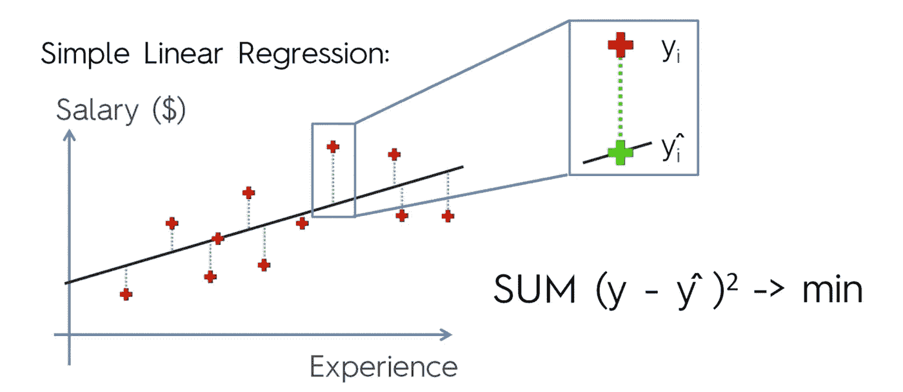
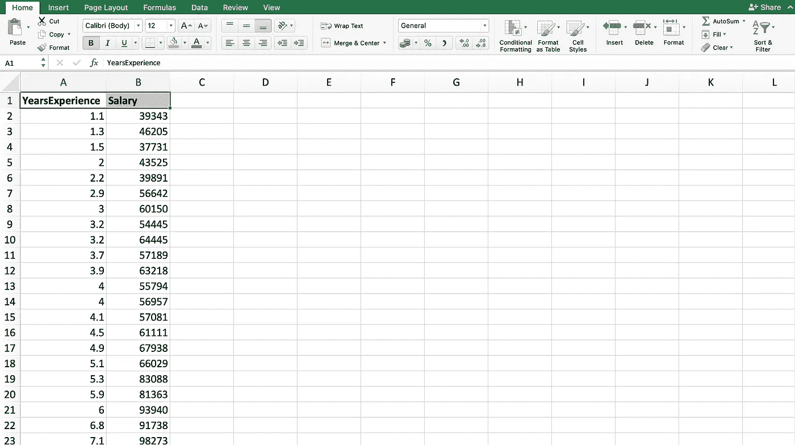
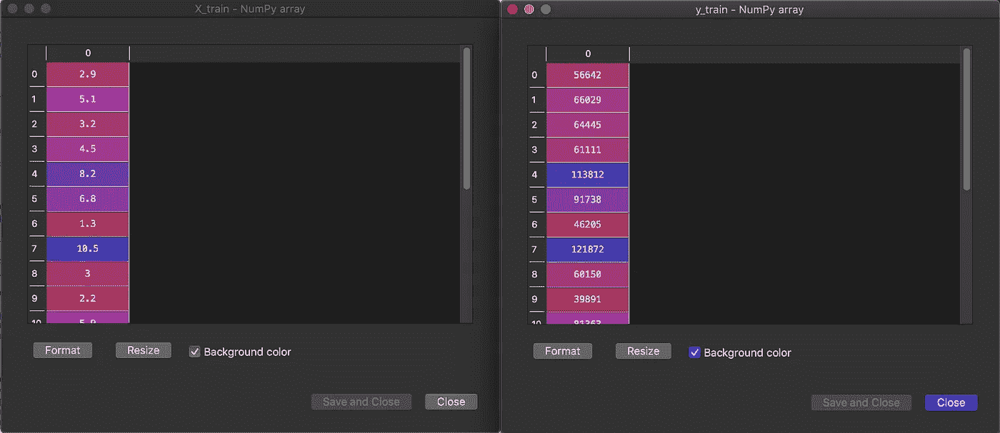
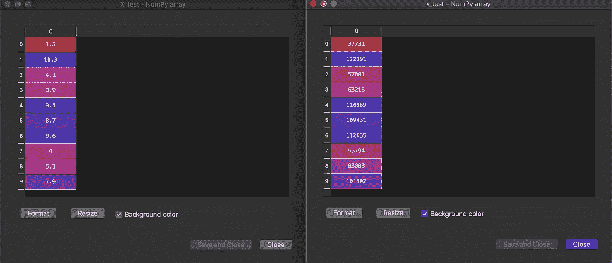
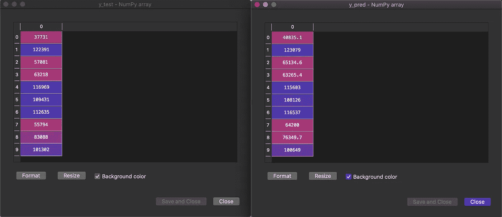
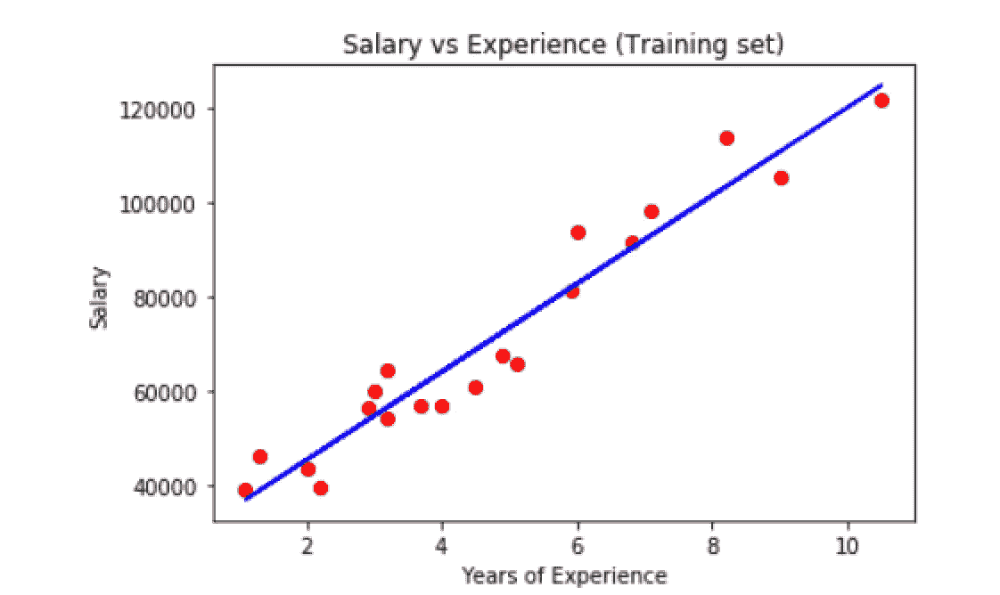
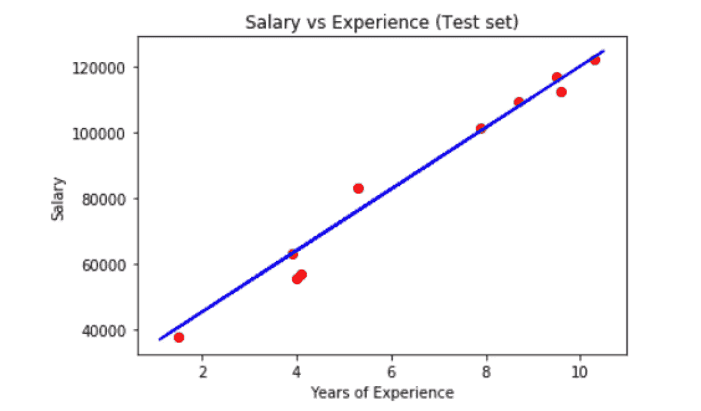

# Python 中的简单线性回归

> 原文：<https://towardsdatascience.com/simple-linear-regression-in-python-8cf596ac6a7c?source=collection_archive---------11----------------------->

## 一个带有简化解释的机器学习模型…

Video version of the story, if you are into that sort of thing | Performed by the author

简单线性回归是一种寻找两个连续变量之间关系的统计方法。在现有的两个变量中，一个是自变量，另一个是因变量。统计关系在确定两个变量之间的关系时不准确。比如身高和体重的关系。

这种关系是由著名的线方程定义的，你们在高中应该学过。

> ***y = b0 + b1*x***

在哪里，

*y* 是因变量

*x* 是自变量

*b0* 是关系的基值

*b1* 是解释 *y & x.* 关系的直线的斜率

例如，y 指的是一个人的工资如何随着他所拥有的经验年限而变化。因此，在这种情况下，工资将是因变量，经验将是自变量，基本价值将是一个没有经验的人的工资。在我们的代码示例中，我们将处理这样的数据集。

为了确定什么是最佳拟合线，让我们看看下面的曲线。



带有红叉的点是实际或真实的数据点，而带有绿叉的点是回归模型的预测值。这里的目标是建立这样一个回归模型，使得误差平方和最小。

> I **导入数据集并进行数据预处理**

今天，我们进入代码的数据集。我们有一个业务问题，一家公司希望在员工的工资和他们的经验之间建立一种关系。我们将使用简单的线性回归来研究这种相关性。

简单的线性回归会告诉我们这种关系的最佳拟合线是什么。让我们来看看数据集。你可以点击下载[数据集。](https://github.com/tarunlnmiit/machine_learning/blob/master/SimpleLinearRegression.csv)



我们的数据由总共 30 个对象和两个属性组成， ***年经历*** 和 ***薪水*** 。属性***years experience***是独立属性，属性 ***Salary*** 是从属属性。

我将使用 **Spyder** 来编写这个机器学习模型。在进入模型的回归部分之前，我们需要对数据集执行[数据预处理](/data-preprocessing-in-python-b52b652e37d5)。我将直接为其编写代码，但是如果您想了解更多，请访问下面的文章。

概念性数据预处理文章:

[](/data-preprocessing-in-data-mining-machine-learning-79a9662e2eb) [## 数据挖掘和机器学习中的数据预处理

### 有了详细的概念…

towardsdatascience.com](/data-preprocessing-in-data-mining-machine-learning-79a9662e2eb) 

编程数据预处理文章:

[](/data-preprocessing-in-python-b52b652e37d5) [## Python 中的数据预处理

### 对于机器学习与工作代码的例子…

towardsdatascience.com](/data-preprocessing-in-python-b52b652e37d5) 

```
# Importing the libraries
import numpy as np
import matplotlib.pyplot as plt
import pandas as pd# Importing the dataset
dataset = pd.read_csv('SimpleLinearRegression.csv')
X = dataset.iloc[:, :-1].values
y = dataset.iloc[:, -1].values# Splitting the dataset into the Training set and Test set
from sklearn.model_selection import train_test_split
X_train, X_test, y_train, y_test = train_test_split(X, y, test_size = 1/3, random_state = 0)
```

执行完这段代码后，我们将训练集和测试集分别与独立属性和从属属性的数组和向量分开。它们应该是这样的:



> **将数据集拟合到简单的线性回归模型中**

在中，为了使数据适合我们的回归模型，我们需要导入一个库，调用回归方法，并使我们的训练数据适合该回归模型。我们的做法如下:

```
# Fitting Simple Linear Regression to the Training set
from sklearn.linear_model import LinearRegression
regressor = LinearRegression()
regressor.fit(X_train, y_train)
```

由于我们的机器学习模型已经知道了我们的训练集的相关性，我们现在将预测我们的测试集的值，然后稍后将它们与测试集的实际值进行比较。

为了预测测试集的值，我们需要编写以下代码:

```
# Predicting the Test set results
y_pred = regressor.predict(X_test)
```

在执行完代码之后，我们可以手动查看预测的测试集值和实际的测试集值，看看它们有什么不同。



如您所见，这些值互不相同。一些具有非常低的差异，如第 4 个条目，而一些具有稍高的差异，如第 8 个条目。

> **可视化数据集中的相关性**

在中，为了判断数据之间的实际相关性，我们将绘制两条曲线。

*   可视化训练集结果

我们使用以下代码来实现这一点:

```
# Visualising the Training set results
plt.scatter(X_train, y_train, color = 'red')
plt.plot(X_train, regressor.predict(X_train), color = 'blue')
plt.title('Salary vs Experience (Training set)')
plt.xlabel('Years of Experience')
plt.ylabel('Salary')
plt.show()
```



可以看出，这里的线并没有那么差，因为只有几个点离它很远，大多数点都在线的周围。

*   可视化测试集结果

我们使用以下代码来实现这一点:

```
# Visualising the Test set results
plt.scatter(X_test, y_test, color = 'red')
plt.plot(X_train, regressor.predict(X_train), color = 'blue')
plt.title('Salary vs Experience (Test set)')
plt.xlabel('Years of Experience')
plt.ylabel('Salary')
plt.show()
```

这里，关于为什么在`plt.plot(X_train, regressor.predict(X_train), color = 'blue')`到`X_test`中`regressor.predict()`的参数没有被改变，可能存在混淆。这是因为，如果我们这样做，我们将得到一个新的行，但我们希望将我们的测试集与我们从训练集中得到的行进行比较。曲线看起来会像这样:



这里可以看到，10 个数据点中有 5 个数据点位于直线上。10 分中有 3 分非常接近终点线，10 分中只有 2 分稍微远一点。

这篇关于 Python 中用于机器学习建模的简单线性回归的文章到此结束。

我将免费赠送一本关于一致性的电子书。在这里获得你的免费电子书。

如果你喜欢阅读这样的故事，那么你应该 [**在你的收件箱**](https://tarun-gupta.medium.com/subscribe) 中收到我的帖子，如果你想支持我成为一名作家，考虑[注册成为一名媒体成员](https://tarun-gupta.medium.com/membership)。每月 5 美元，你可以无限制地阅读媒体上的故事。如果你注册使用我的链接，我会赚一小笔佣金，不需要你额外付费。

[](https://tarun-gupta.medium.com/membership) [## 加入我的推荐链接-塔伦古普塔

### 作为一个媒体会员，你的会员费的一部分会给你阅读的作家，你可以完全接触到每一个故事…

tarun-gupta.medium.com](https://tarun-gupta.medium.com/membership) 

感谢阅读。如果你喜欢这个，可以看看我的其他帖子:

 [## 标记故事列表的快速链接—感谢您的访问

### 我也有一份以快节奏出版为目标的出版物。读书成为作家。

tarun-gupta.medium.com](https://tarun-gupta.medium.com/thank-you-for-visiting-my-profile-9f708062c75e)