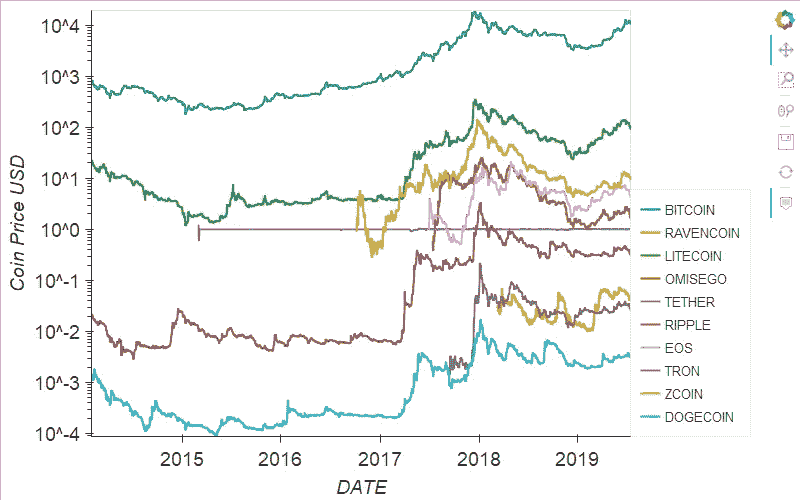
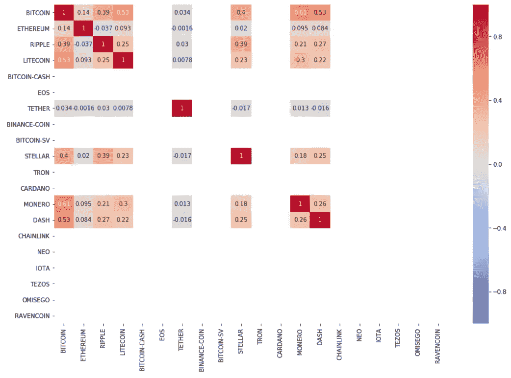
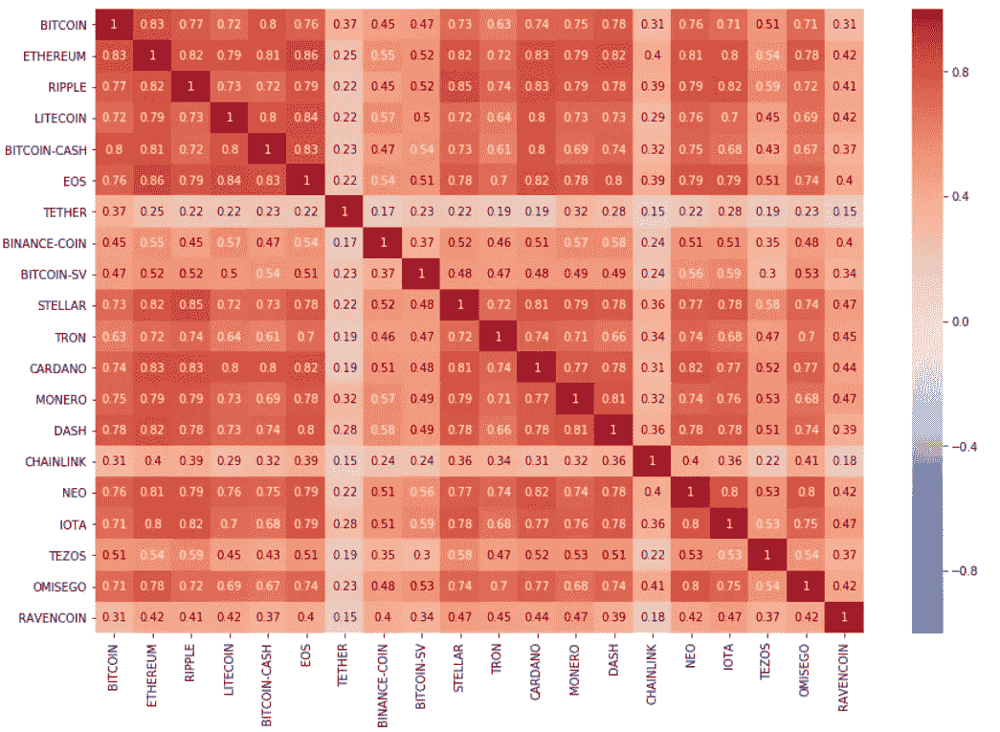
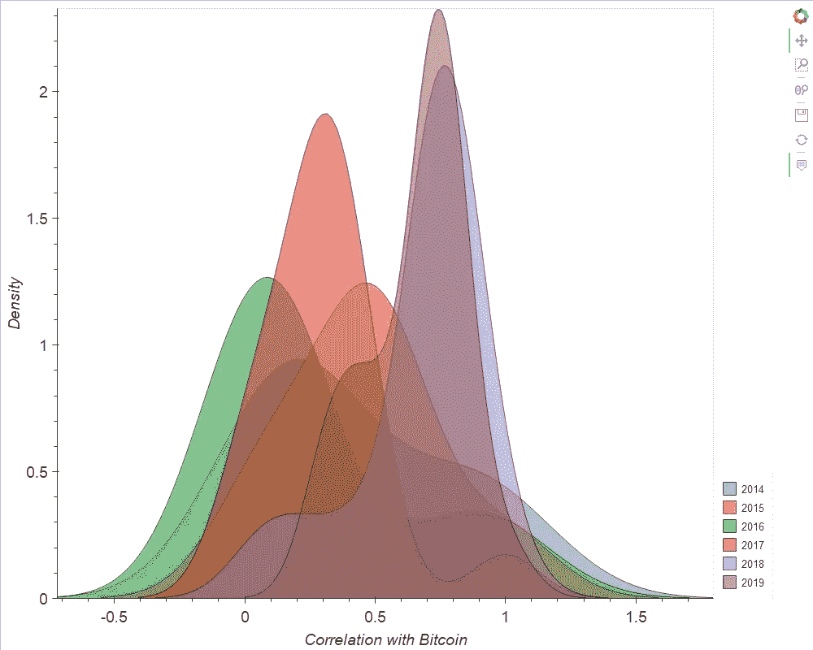
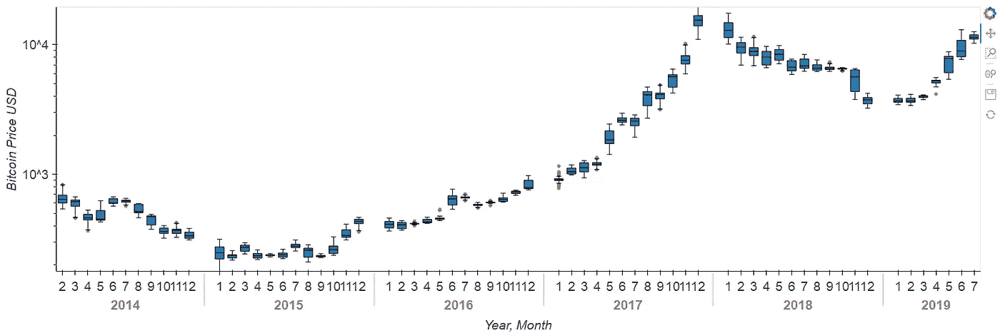
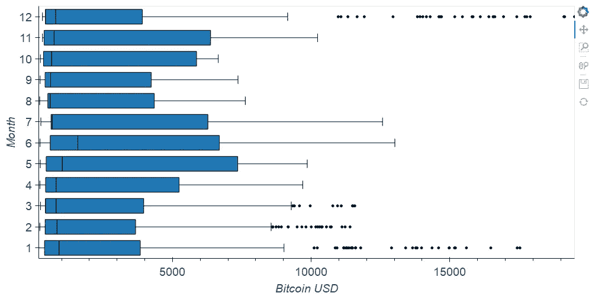

# 评估下一次加密投资的简单方法

> 原文：<https://towardsdatascience.com/simple-method-to-assess-your-next-crypto-investment-9443f56ee4bf?source=collection_archive---------5----------------------->

Photo by [Quantitatives](https://unsplash.com/@quantitatives?utm_source=unsplash&utm_medium=referral&utm_content=creditCopyText) on [Unsplash](https://unsplash.com/s/photos/cryptocurrency?utm_source=unsplash&utm_medium=referral&utm_content=creditCopyText)

在本帖中，我们将使用 Python 研究加密货币市场的相关性，以分析和可视化这些市场是如何发展的，并为更深入的分析提供一个基础框架。

不熟悉加密？你可以找到一篇关于区块链技术、加密货币以及它们与中本聪创新的关系的精彩概述。

TLDR:评估各种加密货币之间的相关性和趋势，以了解:

*   **哪些硬币可以帮助分散你的投资组合**:硬币之间通常有很强的相关性，因此很难分散风险(购买和持有比特币是一种安全的押注)。
*   **稳定的硬币实际上是稳定的吗**:一般来说，它们似乎与比特币价格波动无关。
*   **如果有可能预测下一轮牛市**:最多投机。然而，2019 年底看起来与 2015 年、2016 年和 2017 年相似……准备好装满你的袋子吧。

*注:所有用于分析的代码都可以在我的* [*github 页面*](https://github.com/PriceTT/DSND4) *上找到，数据来自 coinmarketcap.com，2014 - 2019 年市值排名前 100 的加密货币。*

# **时间序列价格数据的相关性分析？**

Image by the author | Price trend for 10 random coins from 2014 to 2019

从上图可以看出，一般来说，每个硬币的趋势似乎是相关的。然而，众所周知，直接在[非平稳时间序列数据](http://www.statsoft.com/Textbook/Time-Series-Analysis)上计算相关性会给出[有偏相关值](https://stats.stackexchange.com/questions/278375/finding-correlation-between-time-series-is-it-a-meaningless-value)。因此，**每日百分比变化**用于评估相关性。以下是市值最高的 20 种硬币价格变化的相关性。

Image by the author | Correlation of the price change of the current top 20 coins by market cap in 2015

Image by the author | Correlation of the price change of the top 20 coins by market cap in 2019

总的来说，市值排名前 20 位的加密货币有三个主要趋势:

*   所有稳定硬币(一种与法定货币或其他商品挂钩的加密货币，如与美元挂钩的系绳)和 Ravencoin 与比特币和其他替代硬币的价格变化百分比的相关性非常低。
*   如下图所示，这种相关性有逐年增加的总体趋势。
*   目前排名前 20 的硬币中只有 45%是 5 年前的。

Image by the author | Density plot of the correlation of the top 20 coins from 2014 to 2019

# 哪些硬币有助于分散你的投资组合？

值得注意的是，几乎所有的加密货币都变得更加相互关联。实际上，投资股市时，拥有多样化的投资组合可以降低风险。然而，拥有一个前 20 名硬币的多元化投资组合，并不具有与交易股票相同的效果。

足够有趣的是，Ravencoin，这是比特币的一个分支，增加了资产发行的功能，而 transfer 与比特币和前 20 名中的大部分 altcoins 的相关性非常低。我不确定这样做的原因，但它肯定是值得关注的硬币之一。

此外，虽然比特币、以太币和莱特币在过去 5 年中一直排名前 5，但进一步评估其他硬币进入前 20 的驱动因素(技术、营销、创新、用例)将是有趣的。然而，这超出了本文的范围。

# 你稳定吗兄弟？

稳定的硬币，如系绳，似乎与比特币价格的波动无关。稳定的硬币有助于消除对转换率的怀疑，使加密货币更适合购买商品和服务。这是因为基础资产与比特币不相关。然而，对稳定硬币的主要[批评](https://www.investopedia.com/tech/goldpegged-vs-usdpegged-cryptocurrencies/)(除了那些集中的)，是证明用于支持稳定硬币的商品/法定货币的数量，反映了稳定硬币的流通供给。

# **月亮什么时候出现(我们能预测下一次牛市吗)？**

Image by the author | Bitcoin price grouped by months from 2014 to 2019

这种分析在很大程度上是推测性的，并且是基于上面的箱线图，在过去的 6 年里按月分组。在 2015 年、2016 年和 2017 年，我们看到比特币价格在第 6 个月和第 7 个月左右飙升，之后我们看到年底出现牛市。

同样，2014 年和 2018 年非常相似，第 5 个月和第 6 个月出现增长，但接下来的几个月增长缓慢，预示着市场看跌。

对于 2019 年，如果 8 月份看起来像 7 月份一样强劲，根据 2015 年、2016 年和 2017 年的趋势，我们可能会迎来另一轮牛市，打破以前的纪录。

我们应该在什么时候看到这些高点…下面的直方图显示，比特币高点往往发生在 12 月和 1 月(由这几个月的大量异常值表示)。

Image by the author | Box plot of Bitcoin price grouped by months from 2014 to 2019

# 接下来呢？

在这一分析的基础上，还可以做更多的事情。我想到的几个例子是:

*   使用来自流行交换的 API 来获得最新的设置。
*   添加市值和交易量等其他指标来丰富分析。
*   添加一些基于 google tends 或 twitter feed 分析的情绪分析来预测未来价格。
*   训练一个预测机器学习模型来预测未来价格。

感谢您的阅读，希望这能激发您对该领域的兴趣。欢迎建设性的反馈，如果你发现代码有问题，你可以在 Github repo [这里](https://github.com/PriceTT/DSND4)提出问题。

***来自《走向数据科学》编辑的提示:*** *虽然我们允许独立作者根据我们的* [*规则和指导方针*](/questions-96667b06af5) *发表文章，但我们不认可每个作者的贡献。你不应该在没有寻求专业建议的情况下依赖一个作者的作品。详见我们的* [*读者术语*](/readers-terms-b5d780a700a4) *。*