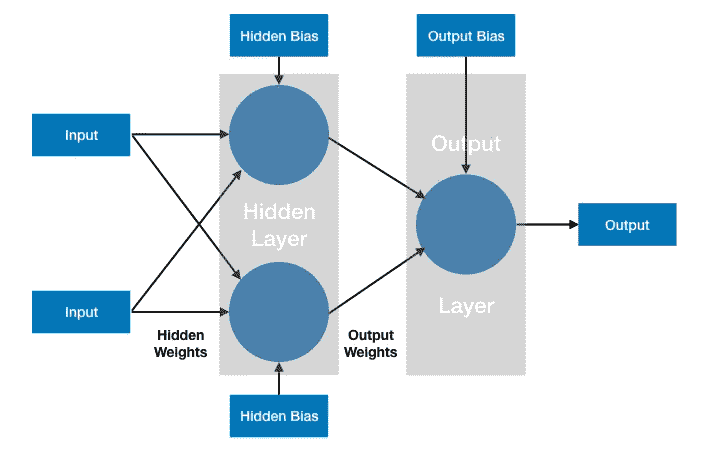
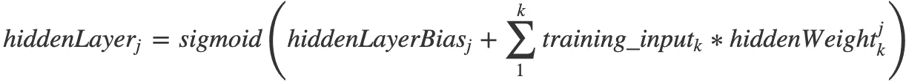
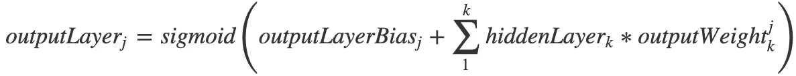
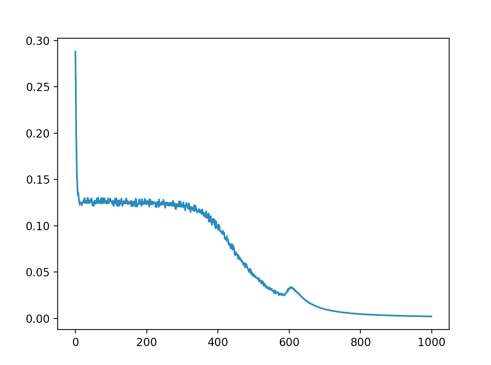

# 用 C 语言实现简单的神经网络

> 原文：<https://towardsdatascience.com/simple-neural-network-implementation-in-c-663f51447547?source=collection_archive---------3----------------------->


Photo by [JJ Ying](https://unsplash.com/@jjying?utm_source=medium&utm_medium=referral) on [Unsplash](https://unsplash.com?utm_source=medium&utm_medium=referral)

作为深入研究机器学习概念的一部分，我决定在没有任何向量或矩阵库的帮助下，用 C 从头开始编写一个简单的神经网络。

*“为什么 C 并没有向量或矩阵库？…"*

网上发布的大多数样本神经网络都是用 Python 编写的，并且使用了 numpy 等强大的数学库。虽然这些示例中的代码简洁明了，但是当复杂的矩阵运算被压缩到一条语句中时，可能很难掌握反向传播背后的细节。当你被迫用 C 写出循环时，概念背后的数学变得更加清晰。我强烈建议这样做，即使你最终会使用一个健壮的库，比如 TensorFlow。

本文假设您已经理解了神经网络和反向传播背后的概念。如果你还没有到那里，我建议从这里开始[。我将通过讨论下面的关键代码片段来浏览代码。如果你想看看完整的源代码，你可以在这里找到它](https://medium.com/datathings/neural-networks-and-backpropagation-explained-in-a-simple-way-f540a3611f5e)。

我们开始吧！我们首先定义几个辅助函数，包括激活函数及其相应的导数。第三个函数用于初始化 0.0 和 1.0 之间的权重:

```
// Activation function and its derivative
**double** sigmoid(**double** x) { **return** 1 / (1 + exp(-x)); }
**double** dSigmoid(**double** x) { **return** x * (1 — x); }// Init all weights and biases between 0.0 and 1.0
**double** init_weight() { **return** ((**double**)rand())/((**double**)RAND_MAX); }
```

我们的网络将由一个具有 2 个节点的隐藏层和一个输出层节点组成。这是学习 XOR 函数的最低配置:



下面我们定义网络的维度，并为层、偏差和权重分配数组:

```
**static** **const** **int** numInputs = 2;
**static** **const** **int** numHiddenNodes = 2;
**static** **const** **int** numOutputs = 1;**double** hiddenLayer[numHiddenNodes];
**double** outputLayer[numOutputs];**double** hiddenLayerBias[numHiddenNodes];
**double** outputLayerBias[numOutputs];**double** hiddenWeights[numInputs][numHiddenNodes];
**double** outputWeights[numHiddenNodes][numOutputs];
```

就反向传播算法而言，我考虑了与如何迭代训练数据相关的两个选项。虽然有许多口味可供选择，但最基本的两种是*随机梯度下降(SGD)* 和*批量梯度下降*。在这种情况下，我选择了 *SGD* ，其中权重基于一对输入/预期输出进行更新。用这种方法更容易将算法概念化。使用这种方法时，为了最大化网络收敛到正确解的机会，随机化训练对的顺序是很重要的。

以下是训练集:

```
**static** **const** **int** numTrainingSets = 4;**double** training_inputs[numTrainingSets][numInputs] = { {0.0f,0.0f},{1.0f,0.0f},{0.0f,1.0f},{1.0f,1.0f} };**double** training_outputs[numTrainingSets][numOutputs] = { {0.0f},{1.0f},{1.0f},{0.0f} };
```

主循环首先迭代一定数量的历元(本例中为 10，000 个)，对于每个历元，它挑选一对输入和预期输出进行操作。因为 *SGD* 要求输入/输出对是随机的，所以我在每个时期打乱一个索引数组，以便选择一个随机对，同时确保每个时期使用所有输入:

```
// Iterate through the entire training for a number of epochs **for** (**int** n=0; n < epochs; n++) { // As per SGD, shuffle the order of the training set
  **int** trainingSetOrder[] = {0,1,2,3};
  shuffle(trainingSetOrder,numTrainingSets); // Cycle through each of the training set elements
  **for** (**int** x=0; x<numTrainingSets; x++) {
    **int** i = trainingSetOrder[x];
```

其余的代码片段在上面的循环中运行，构成了反向传播算法的“核心”。根据 *SGD* ，我们采用单对训练输入，由变量 *i* 指定，并执行以下操作:

第一部分是在给定当前权重的情况下计算网络的输出，从根据以下公式计算隐藏层激活开始:



其中 *j* 是隐藏节点的数量(2)，而 *k* 是输入的数量(2):

```
// Compute hidden layer activation **for** (**int** j=0; j<numHiddenNodes; j++) {
  **double** activation=hiddenLayerBias[j];
    **for** (**int** k=0; k<numInputs; k++) {
      activation+=training_inputs[i][k]*hiddenWeights[k][j];
    }
  hiddenLayer[j] = sigmoid(activation);
}
```

然后，我们通过下式计算输出层激活:



其中 *j* 是输出节点(1)的数量，而 *k* 是隐藏节点(2)的数量:

```
// Compute output layer activation
**for** (**int** j=0; j<numOutputs; j++) {
  **double** activation=outputLayerBias[j];
  **for** (**int** k=0; k<numHiddenNodes; k++) {
    activation+=hiddenLayer[k]*outputWeights[k][j];
  }
  outputLayer[j] = sigmoid(activation);
}
```

下一步包括计算网络权重的微小增量变化，这将使网络朝着最小化网络刚刚计算的输出误差的方向移动。这一步从输出节点开始，向后进行。我们通过计算误差的导数并将其乘以该节点输出的导数来计算权重的变化( *deltaOutput* )。这里我们使用*均方误差(MSE)* 函数来计算误差。然而，请注意，对于反向传播本身，我们只需计算误差的导数，对于 *MSE* 而言，该导数就是预期输出和计算输出之间的差值。参见[这篇文章](/back-propagation-demystified-in-7-minutes-4294d71a04d7)以获得这背后更完整的数学解释。对于输出层，我们计算每个输出节点的增量:

```
// Compute change in output weights **double** deltaOutput[numOutputs];
**for** (**int** j=0; j<numOutputs; j++) {
  **double** dError = (training_outputs[i][j]-outputLayer[j]);
  deltaOutput[j] = dError*dSigmoid(outputLayer[j]);
}
```

对于隐藏层，这是一个类似的过程，除了给定隐藏节点的误差计算是所有输出节点的误差之和(对其应用适当的权重):

```
// Compute change in hidden weights **double** deltaHidden[numHiddenNodes];
  **for** (**int** j=0; j<numHiddenNodes; j++) {
    **double** dError = 0.0f;
    **for**(**int** k=0; k<numOutputs; k++) {
      dError+=deltaOutput[k]*outputWeights[j][k];
    }
  deltaHidden[j] = dError*dSigmoid(hiddenLayer[j]);
}
```

现在我们已经有了每个输出和隐藏节点的增量，最后一步是将它们应用到各自的权重矩阵和偏差单位:

```
// Apply change in output weights **for** (**int** j=0; j<numOutputs; j++) {
  outputLayerBias[j] += deltaOutput[j]*lr;
    **for** (**int** k=0; k<numHiddenNodes; k++) {
      outputWeights[k][j]+=hiddenLayer[k]*deltaOutput[j]*lr;
    }
}
// Apply change in hidden weights
**for** (**int** j=0; j<numHiddenNodes; j++) {
  hiddenLayerBias[j] += deltaHidden[j]*lr;
  **for**(**int** k=0; k<numInputs; k++) {
    hiddenWeights[k][j]+=training_inputs[i][k]*deltaHidden[j]*lr;
  }
}
```

差不多就是这样！最后一个细节是学习率，在这个应用中设置为 0.1。这是一个值，它必须随着时期的数量进行调整，以最大化网络有效学习问题的机会。对于这个问题，0.1 的学习率和 10，000 的纪元的组合似乎是一个很好的组合。这是一张追踪训练过程中误差的图表。对于该图，我每 10 个时期绘制一个样本:



虽然编写这段代码时没有考虑到可扩展性，但是扩展它的功能，使之包括以下内容会很有趣:可配置的隐藏层数、批量梯度下降以及激活和错误函数的附加选项。请随意摆弄代码，不要犹豫提出问题或反馈！