# 使用 Keras 的简单神经网络情感分析器

> 原文：<https://towardsdatascience.com/simple-neural-network-sentiment-analyser-using-keras-179bc9f50fbc?source=collection_archive---------22----------------------->


# 什么是情绪分析器？

想知道产品负责人如何在不阅读数以百万计的文章和评论的情况下，深入了解客户对其产品的反应吗？一个**情绪分析器**是答案，这些东西可以被快速部署，然后连接到 twitter、评论网站、数据库或所有上述网站，使我们能够了解互联网对我们的产品/服务/业务的总体感受。

这是一种非常懒惰的方式来理解一个产品是如何在很短的时间内被一大群顾客感知的。

# Keras 是什么？

维基百科引用:*“Keras 是一个用 Python 编写的开源神经网络库。它能够运行在 TensorFlow、微软认知工具包、Theano 或 PlaidML 之上。旨在实现深度神经网络的快速实验，它专注于用户友好、模块化和可扩展*

对于那些会用 python 编码，但可能不太熟悉 TensorFlow 或 Theano 的人来说，这是一个很好的选择。

# 让我们开始吧…导入和格式化数据

对于这段简单的代码，我们将使用通常引用的 IMDB review 数据集，它可以直接从 Keras 中免费获得，它的使用如此频繁，甚至在他们的示例中也是如此。

我们需要做的第一件事是从 Keras 导入 IMDB 数据集，然后将其分成训练和测试数据集。

```
from keras.datasets import imdb top_words = 10000 (x_train, y_train), (x_test, y_test) = imdb.load_data(num_words=top_words)
```

我们应该会看到一个下载屏幕和一个警告，上面写着“正在使用 tensorflow backend”，这没什么问题，让它做它自己的事吧。

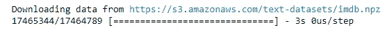

我们可以运行下面这段代码来看看数据集，它基本上是来自英语词典的单词和相应的 id。我们稍后将使用这些 id 进行翻译，因为神经网络更喜欢处理数字而不是纯文本。

```
imdb.get_word_index()
```

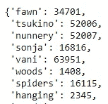

接下来的部分可能是唯一复杂的部分，它几乎是可选的——为了测试我们的数据看起来不错，我们需要抓住我们的第一次审查，并把关键内容转化为实际的单词。

```
word_dict = imdb.get_word_index() 
word_dict = { key:(value + 3) for key, value in word_dict.items() } word_dict[''] = 0 
# Padding word_dict['&amp;amp;amp;gt;'] = 1 
# Start word_dict['?'] = 2 
# Unknown word reverse_word_dict = { value:key for key, value in word_dict.items() } print(' '.join(reverse_word_dict[id] for id in x_train[0]))
```

*我说的是可选的，但是在现实世界中，你总是想要做这些检查。*

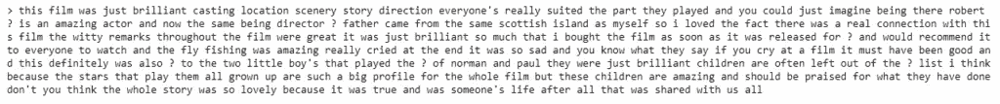

Here is our first review reversed out into text.

接下来需要做一些整理，我们需要确保所有进入神经网络的东西都是相同的形状。也就是说，我们将指定评论的最大字符长度，并将其分配给变量 max_review_length，然后遍历我们的数据集，并用零填充任何评论的结尾，以确保所有内容的长度为 500 个字符。

```
from keras.preprocessing import sequence 
max_review_length = 500 
x_train = sequence.pad_sequences(x_train, maxlen=max_review_length) x_test = sequence.pad_sequences(x_test, maxlen=max_review_length)
```

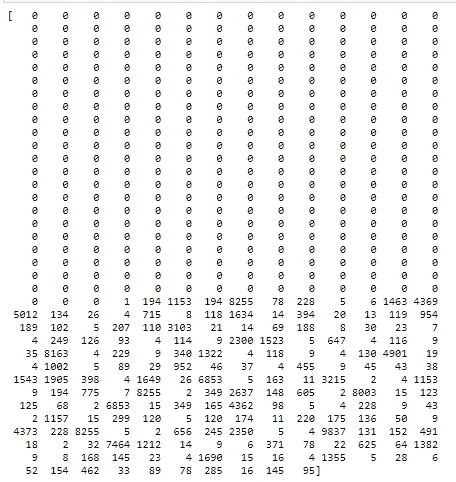

If we print out our word dictionary, notice we just have a load of numbers? These all correspond to words in our word dictionary.

# 建立模型

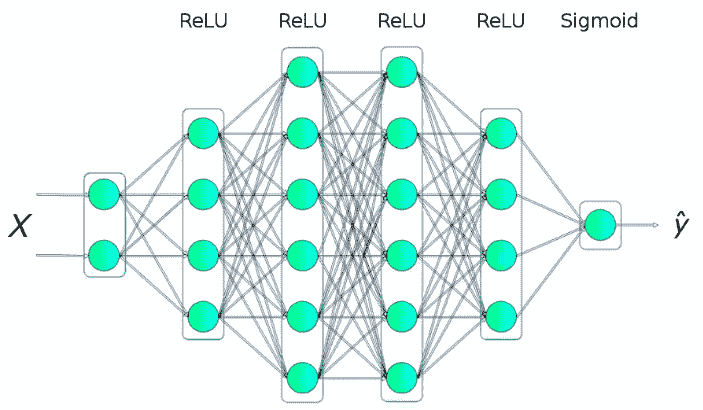

模型如下所示。这是一段可重用的便捷代码。如果你真的想了解这一切是如何联系在一起的，在这个博客[这里](https://machinelearningmastery.com/use-word-embedding-layers-deep-learning-keras/)有大量关于单词嵌入的信息。

您将看到代码被分解以便于理解，并显示在一个完整的块中，以供检查或复制。

首先我们导入必要的包并设置一个可变的“嵌入向量长度”。[单词嵌入](https://machinelearningmastery.com/what-are-word-embeddings/)提供了单词及其相关含义的密集表示。

```
#Build the Model from keras.models 
import Sequential from keras.layers 
import Dense from keras.layers.embeddings 
import Embedding from keras.layers 
import Flattenembedding_vector_length = 32
```

接下来定义模型:这告诉我们，我们正在使用一个顺序模型——即由许多层堆叠在一起构建的模型，在 Keras 文档中有很多关于这方面的信息。

```
model = Sequential()
```

我们添加了一个嵌入层——这是处理文本时使用的最佳实践——它将向量排列成表格，因此更容易处理大量数据。

```
model.add(Embedding(top_words, embedding_vector_length, input_length=max_review_length))
```

接下来，我们将输入数据展平，以便下一层使用

```
model.add(Flatten())
```

我们添加一些密集层，它们控制模型“如何”学习——前两层有 16 个神经元，我们可以在稍后改变这些神经元来改变模型的准确性。

```
model.add(Dense(16, activation='relu')) 
model.add(Dense(16, activation='relu'))
```

Relu 是一个激活函数——在文档中有更多，但是现在我们只需要知道 Relu 是我们正在做的事情中最流行的。

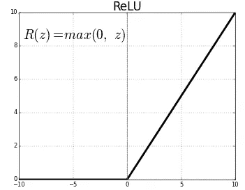

The gradient of the ReLU function ensures that we don’t use all the neurons in the network at the same time, therefore its great for high performance deep learning.

最后的密集层是我们的输出层——它被设置为 1 个神经元，因为我们只想要一个整体的输出——情绪的分数！

```
model.add(Dense(1, activation='sigmoid'))
```

我们使用 sigmoid 作为我们的输出层激活函数，因为我们提供的输出是 0 到 1 之间的分数，取决于积极或消极的情绪。

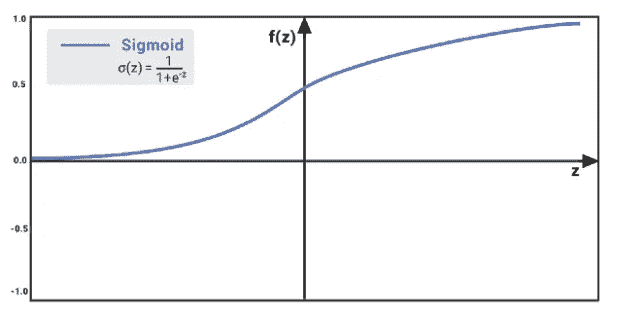

接下来，我们需要编译或建模，这是有效地把它们粘在一起。不要进入太多的细节，优化器是我们的网络如何优化它的权重和它如何学习。你可能听说过“梯度下降”这个词，Adam 是它的变体。

```
model.compile(loss='binary_crossentropy',optimizer='adam', metrics=['accuracy'])
```

我们还可以改变衡量结果的方式。一般来说，我们使用“准确性”,但在 Keras 中有不同的说法。

我们在执行之前做的最后一件事是打印出模型——这将使我们能够检查我们对配置是否满意。

```
print(model.summary())
```

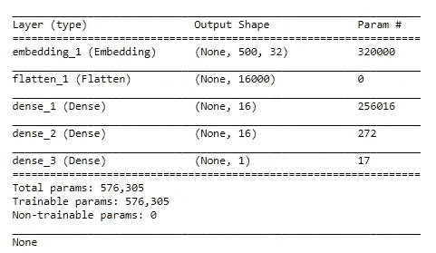

正如所承诺的，这里是完整的代码。

```
import Sequential from keras.layers 
import Dense from keras.layers.embeddings 
import Embedding from keras.layers 
import Flattenmodel = Sequential()
model.add(Embedding(top_words, embedding_vector_length, input_length=max_review_length))
layer model.add(Flatten()) 
model.add(Dense(16, activation='relu')) 
model.add(Dense(16, activation='relu'))
model.add(Dense(1, activation='sigmoid')) model.compile(loss='binary_crossentropy',optimizer='adam', metrics=['accuracy'])print(model.summary())
```

# 拟合模型

拟合模型——你可能在机器学习过程中遇到过这种情况。纪元编号是我们决定进行的迭代次数，意味着我们通过神经网络的次数。

注意，我们在同一行代码中用训练数据拟合，用测试数据验证？

批次大小 128 是随机的，通常较小的批次大小会更准确，但我们仍然需要注意过度拟合—稍后讨论。

```
hist = model.fit(x_train, y_train, validation_data=(x_test, y_test), epochs=5, batch_size=128)
```

运行代码，我们应该能够跟踪神经网络，通过你要求它做的任何数量的时期——在我的例子中是 5，所以 5 行结果。

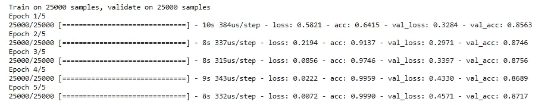

These results are produced to track the progress of a neural network in Keras.

***这就是我们需要小心过度拟合的地方。*** 如果我们看到 acc(训练精度)和 val_acc(测试集精度)值之间的精度相似，那么我们可能会有一个过拟合问题，对此的快速解决方法是记下我们完成的历元数。

# 模型分数

得分是固有的。我们所需要做的就是观想它！

```
import seaborn as sns 
import matplotlib.pyplot as plt 
%matplotlib inline 
sns.set() val = hist.history['val_acc'] epochs = range(1, len(acc) + 1) plt.plot(epochs, val, ':', label='Validation accuracy') plt.title('Validation Accuracy') plt.xlabel('Epoch') plt.ylabel('Accuracy') plt.legend(loc='upper left') 
plt.plot()
```

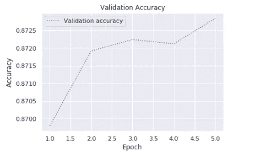

# 使用我们的代码

现在我们需要做的就是编写一个函数，允许我们提交自己的评论，并根据我们的模型进行分析！下面的代码可以做到这一点。

```
import string 
import numpy as np def analyze(text): 
# Prepare the input by removing punctuation characters, converting characters to lower case, and removing words containing numbers translator = str.maketrans('', '', string.punctuation) 
text = text.translate(translator) 
text = text.lower().split(' ') 
text = [word for word in text if word.isalpha()] # Generate an input tensor input = [1] for word in text: 
    if word in word_dict and word_dict[word] &amp;amp;lt; 
    top_words: input.append(word_dict[word]) 
    else: 
       input.append(2)   
       padded_input = sequence.pad_sequences([input], maxlen=max_review_length) # Invoke the model and return the result result = model.predict(np.array([padded_input][0]))[0][0] return result
```

# 测试情感分析器

现在，我们可以使用自己的评论来测试神经网络。我们所要做的就是将我们的评论输入到我们刚刚创建的“分析”函数的参数中。

我们可以从下面我输入的基本评论中看到，非常强烈的评论得分很高，非常负面的评论得分很低，所以看起来我们的情绪分析器神经网络起作用了！

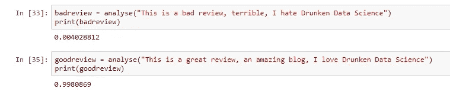

*原载于 2019 年 5 月 19 日*[*http://drunkendatascience.com*](http://drunkendatascience.com/simple-neural-network-sentiment-analyser-using-keras/)*。*