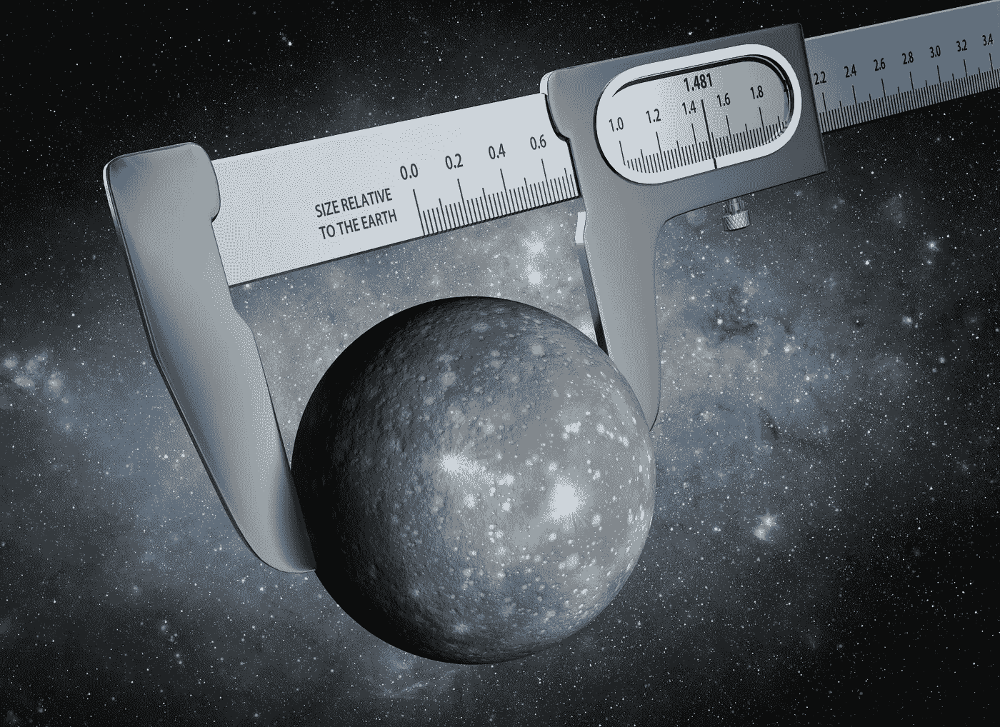
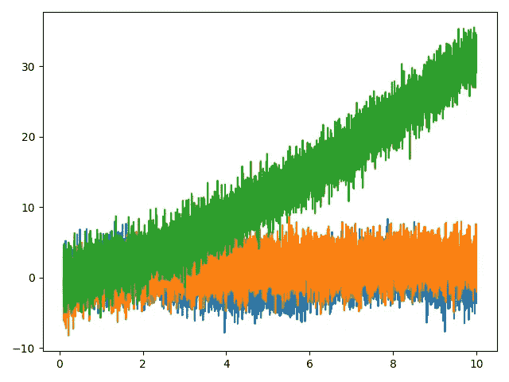
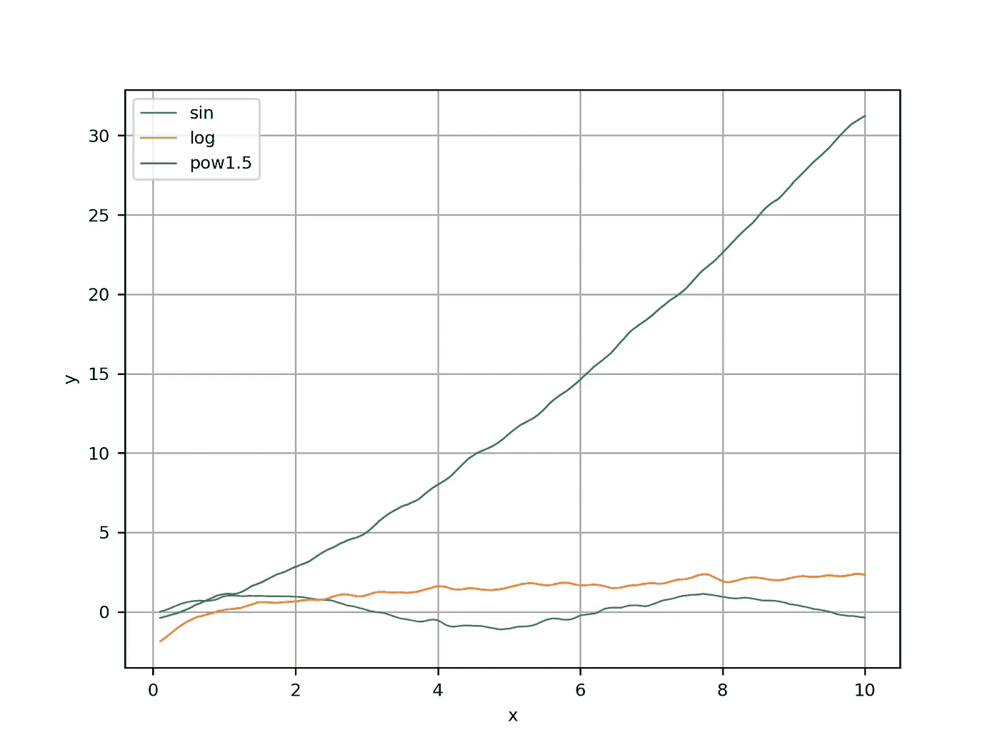
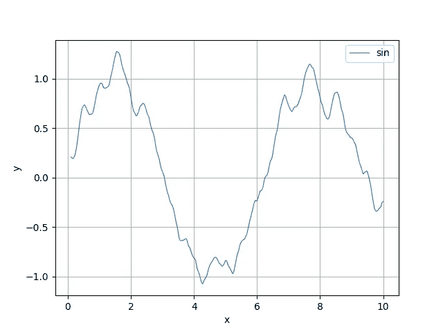
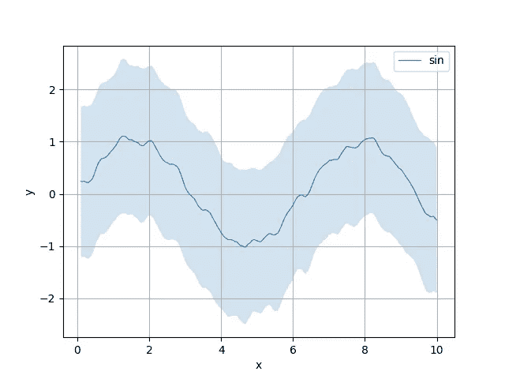
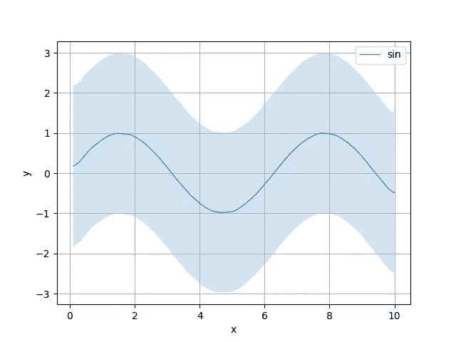
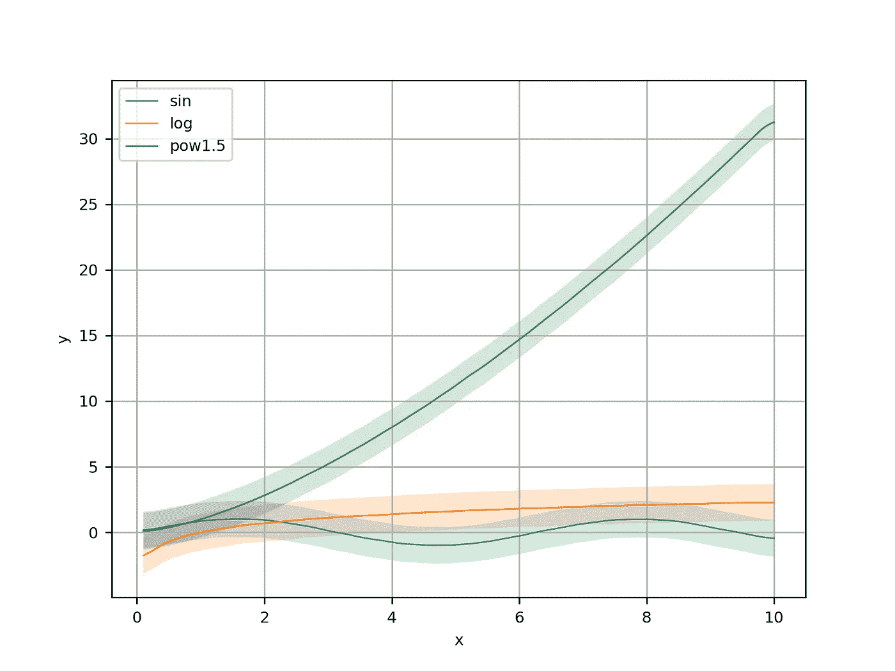

# python 中的简单绘图(因此您可以专注于更大的事情)

> 原文：<https://towardsdatascience.com/simple-plotting-library-in-python-43e8ac687d23?source=collection_archive---------33----------------------->



Today it’s all about having the numbers

**TLDR** :使用[的纸笔](https://github.com/ikamensh/pennpaper)在建造原型时快速启动你的绘图和洞察力

所以你有了新的实验想法💡。也许是一种新的强化学习算法？新哈希表？我不会再尝试猜测了:)为什么要猜测，当我确定你需要做一件事，无论这个想法是什么，来验证它——你需要绘制一些实验数据。所以你知道如何用 python 实现你的想法，而且你在一个令人惊讶的短时间内就做到了。现在是时候观察这个想法在一些不同的输入上的表现了。并查看性能是否可靠，或者每次运行代码时性能是否会发生变化。

那么，抽象地说，你将采取什么步骤来可视化你正在运行的过程？以下是我在实验中的想法:

1.  定义我要测量的量' **Y'** 。示例:批次损失
2.  定义 **Y** 所依赖的数量' **x** '(考虑时间步长或输入大小)
3.  在我的代码中找到便于记录这些量的值的地方
4.  重复几次实验，也许是针对系统的一些不同配置。
5.  产生那些美丽而有见地的情节。

这是一个明确的计划。然而，很少有技术挑战逃过我们的注意:如果我们运行几次实验，以某种方式在图中平均结果并显示它们的方差/标准差是有意义的。

..此外，从长远来看，将所有信息存储在一个巨大的全球字典中可能是一件痛苦的事情。

…此外，这些噪声图可以使用一些过滤。

让我们看一个例子，看看我们如何解决它。让我们假设一些添加了噪声的数学函数是您正在开发的新原型:

结果，嗯，不是很好:



介绍[**pen ' n ' paper**](https://github.com/ikamensh/pennpaper)—一个简单方便绘图的 python 库；

```
**import** pennpaper **as** pp

metrics = **[]for** name, func **in** funcs.items***()***:
    m = pp.Metric***(***name***)*** m.add_arrays***(***X, func***(***X***))*** metrics.append***(***m***)*** pp.plot_group***(***metrics, smoothen=**True*)***
```

好了，这给了我们一个有名字的传说，并且去掉了大部分的噪音:



接下来我想做的是，通过对过程进行多次采样，并将有关标准差的信息添加到图中，进一步降低噪声。为了简化代码，让我们从一个函数开始——正弦波。

我们得到了单独策划的罪恶:

```
**import** pennpaper **as** pp

name = **'sin'** func = funcs***[***name***]*** m1 = pp.Metric***(***name***)*** m1.add_arrays***(***X, func***(***X***))*** pp.plot***(***m1, smoothen=**True*)***
```



你可以做的是将纸笔指标相加:

```
m1 = pp.Metric***(***name***)*** m1.add_arrays***(***X, func***(***X***))*** m2 = pp.Metric***(***name***)*** m2.add_arrays***(***X, func***(***X***))*** m3 = pp.Metric***(***name***)*** m3.add_arrays***(***X, func***(***X***))*** pp.plot***(***m1 + m2 + m3, smoothen=**True*)***
```



似乎有 3 个度量标准有所帮助。让我们有 300？

```
metrics = ***[]* for** i **in** range***(***300***)***:
    m = pp.Metric***(***name***)*** m.add_arrays***(***X, func***(***X***))*** metrics.append***(***m***)*** pp.plot***(***sum***(***metrics***)***, smoothen=**True*)***
```



大数定律在我们这边，我们得到相当精确的图。另请注意，阴影区域的大小代表标准差，与正弦波相差 2 个单位，这正是我们在噪声公式中输入的值:y += np.random.normal(0，2，size=y.size)。

让我们把我们所学的放在一起，画出所有 3 个函数，画出一个带平滑的图和一个不带平滑的图:

```
**import** pennpaper **as** pp
**from** collections **import** defaultdict

metrics = defaultdict***(***list***)* for** i **in** range***(***90***)***:
    **for** name, f **in** funcs.items***()***:
        m = pp.Metric***(***name***)*** m.add_arrays***(***X, f***(***X***))*** metrics***[***m.name***]***.append***(***m***)*** metrics = ***[***sum***(***v***)* for** v **in** metrics.values***()]*** pp.plot_group***(***metrics***)*** pp.plot_group***(***metrics, smoothen=**True*)***
```


No smoothing, just the effect of averaging 90 tries



Smooth version

**总结**:我们已经学会了如何使用 pen'n'paper Metric class 轻松组合多个测量值，并使用。plot()和。plot_many()方法。您可以使用以下方式安装笔和纸:

```
pip install pennpaper
```

给它一颗星🌟这里:[https://github.com/ikamensh/pennpaper](https://github.com/ikamensh/pennpaper)

这是一个我为个人使用而写的便利工具，但是我想你可能会发现它的用处！:)