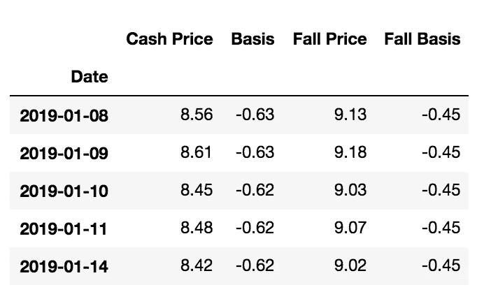
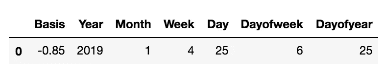
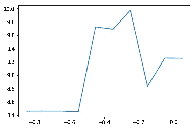

# 基于 Fast.ai 随机森林的简单大豆价格回归

> 原文：<https://towardsdatascience.com/simple-soybean-price-regression-with-fast-ai-random-forests-44ab46bf384e?source=collection_archive---------10----------------------->


image credit: Pexels.com

将前沿机器学习应用于商品价格。

作为一名对农业感兴趣的 fast.ai 机器学习 for Coders MOOC 的学生，想到的 fast.ai 随机森林回归库的第一个应用是根据历史数据预测大豆价格。大豆是一种全球大宗商品，在过去十年里，其每蒲式耳的价格每天都在大幅波动。

个别商品的价格历史可以作为简单的结构化表格数据在网上免费获得，这使得这成为一个直截了当的开头话题。下面是代码——注意我们使用的是 Python 3 和 fast.ai 0.7，所以请遵循安装说明。

首先，我们需要在开始之前导入我们的包:fast.ai、quandl、pandas、sk learn——常见的数据科学库。

```
%load_ext autoreload
%autoreload 2
%matplotlib inlineimport quandlfrom fastai.imports import *
from fastai.structured import *from pandas_summary import DataFrameSummary
from sklearn.ensemble import RandomForestRegressor, RandomForestClassifier
from IPython.display import displayfrom sklearn import metrics
```

数据来自免费的 Quandl TF grain/大豆数据集。Quandl 为他们的 API 提供了一个简单的 Python SDK，即入门指南。下拉整个数据集只有一行(很短):

`data = quandl.get("TFGRAIN/SOYBEANS", authtoken="<your token")`

这将返回一个 Pandas 数据帧(我们称之为“数据”)，并且`data.info()`显示有 4535 行数据被事件日期时间索引。我们可以用`data.tail()`来表示格式:

```
<class 'pandas.core.frame.DataFrame'>
DatetimeIndex: 4535 entries, 2000-12-01 to 2019-01-14
Data columns (total 4 columns):
Cash Price    4535 non-null float64
Basis         4535 non-null float64
Fall Price    4516 non-null float64
Fall Basis    4516 non-null float64
dtypes: float64(4)
memory usage: 177.1 KB
```



data.head()

由于我们有日期时间，这是一个很好的机会来利用 fast.ai 库的日期处理功能工程能力。我将索引重命名为“data ”,并创建了一个新列，其中包含可以由`add_datepart()`函数处理的相同值:

```
data.rename_axis('Date')
data['Date'] = data.index
add_datepart(data, 'Date')
data.info()
```

新列如下。杰瑞米·霍华德在 ML1 第一课中深入解释了这些新列是如何创建的，以及为什么创建。

```
<class 'pandas.core.frame.DataFrame'>
DatetimeIndex: 4535 entries, 2000-12-01 to 2019-01-14
Data columns (total 18 columns):
id                  4535 non-null int64
Cash Price          4535 non-null float64
Basis               4535 non-null float64
Fall Price          4516 non-null float64
Fall Basis          4516 non-null float64
Year                4535 non-null int64
Month               4535 non-null int64
Week                4535 non-null int64
Day                 4535 non-null int64
Dayofweek           4535 non-null int64
Dayofyear           4535 non-null int64
Is_month_end        4535 non-null bool
Is_month_start      4535 non-null bool
Is_quarter_end      4535 non-null bool
Is_quarter_start    4535 non-null bool
Is_year_end         4535 non-null bool
Is_year_start       4535 non-null bool
Elapsed             4535 non-null int64
dtypes: bool(6), float64(4), int64(8)
```

为了简单起见，我在大豆价格回归中第一次删除了一些列。我只保留 col_list 变量中列出的列。

```
col_list = ['Cash Price', 'Basis', 'Year', 'Month', 'Week', 'Day', 'Dayofweek', 'Dayofyear']dfdata = dfdata[col_list]
```

为了清理格式，我从 Pandas 数据帧中提取值并重新导入:

```
df = dfdata.values
df = pd.DataFrame.from_records(df)
df.columns = col_list
```

现在我们又有了一个 Pandas dataframe，我使用了另一个方便的 fast.ai 函数，它(如文档所解释的那样)**将字符串列转换为分类值列，并就地完成。**为什么？允许随机森林回归器理解表格数据。同样，这将在本课程中更深入地讨论。

```
train_cats(df)
```

另一个 fast.ai 预处理器(如文档所述)**获取数据帧，分离响应变量，并将测向转换为全数字数据帧。**我们的因变量(‘y’)是这个谷物升降机的大豆每日现金价格，其他一切都是自变量。

```
df, y, nas = proc_df(df, 'Cash Price')
```

现在我们已经准备好适应我们的数据了！这很简单，因为:

```
m = RandomForestRegressor(n_jobs=-1)
m.fit(df, y)
m.score(df,y)Score: 0.9991621993655437
```

相当不错！Fast.ai 对此的准确率为 99.91%，因此现在我们可以向回归器投掷一个测试数据帧(具有相同的格式)，并获得实际的预测。这是我们的单行测试数据框架:

```
df1 = pd.DataFrame({'Basis':[-.85],
                    'Year':[2019],
                    'Month':[1],
                    'Week':[4],
                    'Day':[25],
                    'Dayofweek':[6],
                    'Dayofyear':[25],})
```



并获得对 2019 年 1 月 25 日的价格的单一预测，给定 85 美分的基数:

```
train_cats(df1)
m.predict(df1) Return: array([8.465])
```

一蒲式耳大豆估计售价为 8.465 美元。

为了好玩，我画了一张图，显示基差的变化如何影响一天(2019 年 1 月 25 日)的回归。代码:

```
df1.iloc[0:, 0] = -.95
iterpreds = list()
a = list()
for x in range(0,10):
    df1.iloc[0, 0] += .1
    b = df1.at[0, 'Basis']
    iterpreds.append(m.predict(df1).astype(float).item(0))
    a.append(b)plt.plot(a, iterpreds)
```



basis on x axis, price on y

可以做得更多！我们应该扩展我们的模型，以包括所有可用的列，看看是否有第二种商品可以添加到模型中，以探索其他作物价格是否同步移动，并绘制随着时间的推移其他变量的变化的影响。

参考资料:

[1][https://course.fast.ai/ml.html](https://course.fast.ai/ml.html)

[2][https://forums . fast . ai/t/fastai-v 0-7-install-issues-thread/24652](https://forums.fast.ai/t/fastai-v0-7-install-issues-thread/24652)

[3]https://docs.quandl.com/docs/getting-started

附加代码在我的 github 上:[www.github.com/matthewarthur](http://www.github.com/matthewarthur)，我的 LinkedIn 是[https://www.linkedin.com/in/matt-a-8208aaa/](https://www.linkedin.com/in/matt-a-8208aaa/)。