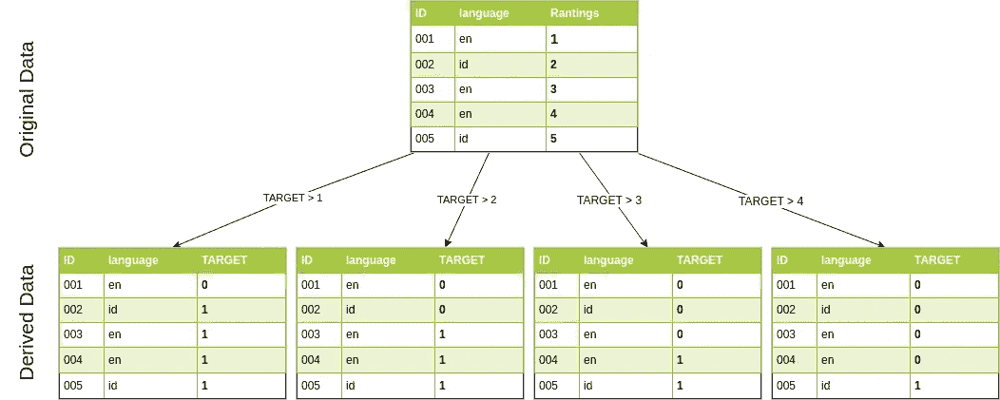
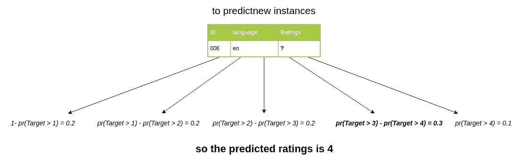

# 用任何分类器训练有序回归的简单技巧

> 原文：<https://towardsdatascience.com/simple-trick-to-train-an-ordinal-regression-with-any-classifier-6911183d2a3c?source=collection_archive---------5----------------------->

在这篇文章中，我将展示一个简单的方法来处理任何序数回归(序数分类)问题，使用任何现有的二进制分类算法，该方法是由 Eibe Frank 和 Mark Hal 开发的。

原始论文
(Eibe Frank 和 Mark Hal，lECML 2001。第 12 届欧洲会议)[https://www . cs . waikato . AC . NZ/~ eibe/pubs/ordinal _ tech _ report . pdf](https://www.cs.waikato.ac.nz/~eibe/pubs/ordinal_tech_report.pdf)

机器学习的实际应用有时涉及目标值在不同类别之间显示顺序的情况。然而，标准分类算法不能利用这种排序信息，因为它们将每个类属性视为一组无序值[1]。

本文介绍了一个简单的技巧，它能使任何标准分类算法利用类属性中的排序信息。该论文还表明，这个简单的技巧优于天真的分类方法，天真的分类方法将每个类视为一组无序的值。

## 问题定义

(维基百科)在[统计](https://en.wikipedia.org/wiki/Statistics)中，**有序回归**(也称为**有序分类**)是[回归分析](https://en.wikipedia.org/wiki/Regression_analysis)的一种，用于预测[有序变量](https://en.wikipedia.org/wiki/Ordinal_variable)，即一个变量的值存在于任意尺度上，其中只有不同值之间的相对顺序是有意义的。

有序回归问题的一些例子是预测人类偏好(强烈不同意到强烈同意)，预测温度(热、温和、冷)，预测书/电影评级(1 到 5)。

## 一些可能的方法

解决序数回归问题的一些简单而天真的方法是

1.  将其视为回归问题
    如果序数值表示间隔或比率，并且我们有原始间隔/比率值，我们可以将其视为回归问题
    我们将回归算法拟合到相应的间隔/比率值，该值可以映射到实际的序数值
    **缺点**:如果序数值不表示任何连续的间隔/比率(如书籍/电影评级)，或者如果我们没有原始间隔/比率值，我们就不能使用这种方法。
2.  将其视为标准分类问题
    我们将每个序数值视为一个无序集，并在其上安装一个多类分类算法
    **缺点**:丢失每个类的排序信息，因为标准分类算法将每个类视为一组无序值

## 提议的方法

只要我们使用能够估计输出类别概率的分类器，所提出的方法将会工作

我们可以通过将一个 *k 类*有序回归问题转化为一个 *k-1* 二进制分类问题来利用有序类值，我们将带有有序值 V1、V2、V3、… Vk 的有序属性 A*转化为 k-1 个二进制属性，每个属性对应于原始属性的前 k-1 个值。第 I 个二元属性表示测试 A* > Vi [1]

例如，如果我们有一个具有从 1 到 5 顺序值电影评级的预测目标，我们可以将其转换成 4 个二进制分类问题，使得

1.  如果等级> 1，二元目标为 1，因此分类器将预测 *Pr(目标> 1)*
2.  如果等级> 2，二元目标为 1，因此分类器将预测 *Pr(目标> 2)*
3.  如果等级> 4，二元目标为 1，因此分类器将预测 *Pr(目标> 3)*
4.  如果等级> 4，二元目标为 1，因此分类器将预测 *Pr(目标> 4)*



Example of the transformation to binary classification problem is done

在我们训练了 4 个二元分类器之后，我们可以使用它来预测序数值的概率，方法是:

*Pr(y=1) = 1-Pr(目标> 1)
Pr(y=2) = Pr(目标> 1)-P(目标> 2)
Pr(y=3) = Pr(目标> 2)-P(目标> 3)
Pr(y=4) = Pr(目标> 3)-P(目标> 4)
Pr(y=5) = Pr(目标【T6*

或者一般来说，对于第一个序数值，我们可以使用第一个分类器来预测*V1**=*1—*Pr(y>V1)* 的概率，我们可以使用最后一个分类器来预测
*Vk**= Pr(Target>Vk-1)* 的概率，我们可以使用中间分类器来预测
Vi 的概率



这样我们就不会丢失来自类标签的排序信息。

## Python 实现

我们通过创建`OrdinalClassifier`类来实现上述技巧，当调用`fit`时，该类将训练 k-1 个二元分类器，并且如果调用`predict`，将返回预测的类。在训练(`fit`)阶段`OrdinalClassifier`会将每个训练好的二进制分类器存储到一个 python 字典中。

定义我们的 OrdinalClassifier 的参数是
**clf:** 任何在其中实现`predict_proba`方法的 sklearn 分类器

举例来说，使用 max_depth = 3 的决策树创建一个 OrdinalClassifier 应该是:

```
clf = OrdinalClassifier(DecisionTreeClassifier(max_depth=3))
```

python 中实现的顺序分类器示例:

1.  **__init__:** 构造函数，简单地定义我们的`OrdinalClassifier`并初始化`clfs`作为一个字典，它将用于存储我们的 k-1 二进制分类器
2.  **拟合**:首先我们存储每个可用的唯一标签，然后对于第一个 k-1 值，对于每次迭代，我们将其标签转换为表示测试 A* > Vi `binary_y = (y > self.unique_class[i].astype(np.uint8))`的二进制标签，然后我们在转换后的标签上拟合一个新的分类器(`binary_y`)最后，将我们的分类器存储到以`i`为关键字的`clfs`字典中
3.  **predict_proba** :要获得每个类的预测概率:首先我们从存储在`clfs`上的所有分类器中获得所有的预测概率，然后简单地枚举所有可能的类标签并将其预测添加到我们的`predicted`列表中，之后，将其作为 numpy 数组返回
4.  **预测**:要获得预测的类，只需使用我们`predict_proba`的`argmax`

## 结论

我们可以通过使用一个简单的技巧来解决一个序数分类问题，即把序数分类分成 k-1 个二进制分类

## 参考

[[1]艾贝·弗兰克和马克·霍尔，序数分类法的一种简单方法(2001)，2001 年。第 12 届欧洲会议](https://www.cs.waikato.ac.nz/~eibe/pubs/ordinal_tech_report.pdf)