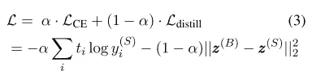
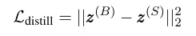

# 蒸馏伯特的简单教程

> 原文：<https://towardsdatascience.com/simple-tutorial-for-distilling-bert-99883894e90a?source=collection_archive---------10----------------------->

## 基于 BERT 知识构建特定任务模型

Photo by [Iker Urteaga](https://unsplash.com/@iurte?utm_source=unsplash&utm_medium=referral&utm_content=creditCopyText) on [Unsplash](https://unsplash.com/s/photos/tube-chemistry?utm_source=unsplash&utm_medium=referral&utm_content=creditCopyText)

> **2019 年 12 月 4 日—更新:**这种方法的实验代码可在[这里](https://github.com/pvgladkov/knowledge-distillation/tree/master/experiments/sst2)获得。

# 关于伯特

伯特和变形金刚，总的来说，是 NLP 的一个全新步骤。它是由谷歌在 2018 年推出的，自那以来，它在不同的语言理解任务中表现出了最先进的结果。在[https://papers with code . com/paper/Bert-pre-training-of-deep-bidirectional](https://paperswithcode.com/paper/bert-pre-training-of-deep-bidirectional)查看他们的论文和结果。

但是有一点美中不足。在生产中很难使用 BERT。 **BERT-base** 包含 **110M** 参数。较大的变型 **BERT-large** 包含 **340M** 参数。这样大的神经网络在实践中是有问题的。由于大量的参数，在移动设备等资源受限的系统中部署 BERT 非常困难。此外，低推理时间使其在实时系统中无用。这就是为什么找到让它更快的方法如此重要。

当我第一次面对变形金刚时，尝试用它们来完成日常任务是非常诱人的。文本分类就是其中之一。但是如何克服我上面写的局限性呢？在这篇文章中，我想展示一种简单而有效的方法来训练一个特定于任务的分类模型，该模型与基于 BERT 的模型在同一水平上执行。

# 知识的升华

有几种可能的方法可以加速 BERT。我强烈推荐阅读[**加速 BERT**](https://blog.inten.to/speeding-up-bert-5528e18bb4ea)，其中包含了完整的概述。蒸馏就是其中之一。

里奇·卡鲁阿纳和他的同事描述了知识的升华。想法很简单:训练一个小的“学生”模型，模仿“教师”模型的行为。

# 样本问题

假设我们有一个常规的二进制文本分类问题。为了简单起见，`X`是句子列表，`y`是标签列表(0 或 1)。额外的细节对于描述主旨并不重要。

# 训练伯特

我就不描述微调 BERT 的全过程了:参考[本帖](/https-medium-com-chaturangarajapakshe-text-classification-with-transformer-models-d370944b50ca)详细了解这个过程。让我们想象一下，我们已经用来自变形金刚库[的`num_labels=2`训练了`BertForSequenceClassification`。这个模型将是我们想要将其知识转移到“学生”模型的“老师”。](https://github.com/huggingface/transformers)

# 让我们构建“学生”模型

首先，我们将训练一个小型的 BiLSTM 模型作为基线。

输入数据是词汇表中的单词索引。为了构建词汇表，我使用了`torchtext`包中的内置功能。这些函数将帮助我们将训练数据集中的单词翻译成单词索引。

为了简单起见，我没有使用任何预先训练的单词嵌入。我们的模型将在训练过程中学习投射到内部空间。

## 模型

我们的模型看起来像:

## 列车基线

对于这个特定的基线模型，我们设置`output_dim=1`，因为我们有一个二元分类，因此损失函数是 logloss。PyTorch 有`BCEWithLogitsLoss`类，它结合了 sigmoid 函数和二元交叉熵:

一个纪元是:

每个时期后的评估:

使用一些辅助函数进行培训的完整代码如下:

## 蒸馏

这个特别的想法最初来自于论文“ [**从 BERT 中提取特定于任务的知识到简单的神经网络**](http://arxiv.org/abs/1903.12136) ”。

我们的“学生”模型必须学会模仿 BERT 模型的行为。但什么是“行为”？在我们的例子中，它是训练数据集的输出`y_bert`。主要思想是使用**原始**预测，即最终激活函数之前的预测，通常是 softmax 或 sigmoid。假设通过使用原始值，模型可以比使用“硬”预测更好地学习内部表示。Softmax 将这些值归一化为 1，同时保持最大值较高，并将其他值减小到非常接近零的值。零中的信息很少，所以通过使用原始预测，我们也可以从非预测类中学习。

为了学习“行为”,我们通过在传统的交叉熵损失(L_ce)上增加一个额外的项 L _ distill 来修改损失函数:

其中 L _ distill 是学生网络的逻辑值与教师的逻辑值之间的均方误差(MSE)损失:

其中 z(B)和 z(S)分别是教师和学生的逻辑。

我们几乎完全重用了代码，只做了一处修改——损失函数。为了计算交叉熵损失，我使用了`CrossEntropyLoss`，它结合了 softmax 函数和交叉熵。

为了正确计算损失函数，我们还将输出数量从 1 改为 2。完整的代码应该是:

仅此而已。我们将知识从伯特模型转移到一个更简单的模型。

## 结果

在我的工作中，我尝试用这种方法来解决二元分类问题。它有高度不平衡的类，因此关键度量是平均精度分数。该模型的比较如下表所示。有趣的是，经过提炼的版本甚至比基于 BERT 的模型具有更好的平均精度分数。在我看来，这个事实是进一步研究的一个很好的切入点。

# 结论

这是知识升华的一个非常基本的方法。具体的浅层网络的结构和超参数将取决于您的特定任务。在我看来，在现实生活实践中还是挺有用的。它在训练时有些复杂，但是您可以得到一个更好的模型，同时在执行时保持其原始的简单性。