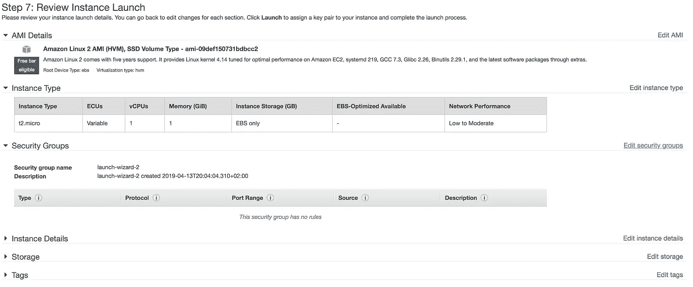

# 将机器学习模型部署到云的简单方法

> 原文：<https://towardsdatascience.com/simple-way-to-deploy-machine-learning-models-to-cloud-fd58b771fdcf?source=collection_archive---------2----------------------->

## 使用简单的技术堆栈将您的第一个 ML 模型部署到生产环境中


Photo by [Randy Fath](https://unsplash.com/@randyfath?utm_source=medium&utm_medium=referral) on [Unsplash](https://unsplash.com?utm_source=medium&utm_medium=referral)

机器学习领域目前看到数据科学家(DS)扮演以下两个突出角色中的一个或两个:

1.  其中，DS 接收数据转储，对数据应用某种机器学习算法，并以某种演示或报告的形式报告结果。
2.  其中 DS 为利益相关者创建一个可用的软件来使用机器学习模型。

在这篇博文中，我试图展示一个 DS 工作的第二个方面的示例方法，即创建一些可以被利益相关者使用的软件。具体来说，我们将创建一个 web 服务，可以通过查询从机器学习模型中获得预测。这篇文章主要是为那些想超越仅仅开发模型的机器学习实践者准备的。

**Tech-stack** : Python、 [Flask](http://flask.pocoo.org/) 、 [Docker](https://www.docker.com/) 、 [AWS ec2](https://aws.amazon.com/ec2/)

工作流程可以分为以下几个基本步骤:

1.  在本地系统上训练机器学习模型。
2.  将推理逻辑包装到 flask 应用程序中。
3.  使用 docker 将 flask 应用程序容器化。
4.  在 AWS ec2 实例上托管 docker 容器并使用 web 服务。

**免责声明**:这里展示的系统与商业生产系统的样子相差甚远。这篇博文的关键点应该是开发工作流程，熟悉技术栈，并初步体验构建 ML 生产系统。

让我们从第一步开始。

## 在本地系统上训练机器学习模型

我们需要一些可以包装在网络服务中的机器学习模型。出于演示的目的，我选择了一个逻辑回归模型来对 iris 数据集进行多类分类(是的，非常简单！# LazinessFTW)。使用 python 3.6 在本地系统上训练该模型。

使用熟悉的 scikit-learn，可以快速训练上述模型。关于模型开发，请参考本博客 [github 报告](https://github.com/tanujjain/deploy-ml-model)中的笔记本“Model_training.ipynb”。我只想强调模型开发的两个重要方面:

1.  训练后生成的模型文件存储为 pickle 文件，这是一种用于存储对象的序列化格式。(在回购中，该文件被命名为“iris_trained_model.pkl”)
2.  推理调用(。predict())调用需要 numpy 数组形式的每个测试样本 4 个特征。

## 将推理逻辑包装到 flask web 服务中

现在我们已经有了训练好的模型文件，我们准备好查询模型来获得一个测试样本的类标签。推断非常简单，只需用测试数据对训练好的模型调用 predict()函数。然而，我们希望将推理构建为一个 web 服务。为此，我们将使用烧瓶。

Flask 是一个强大的 python microwebserver 框架，它允许我们以最少的配置麻烦快速构建基于 REST API 的 web 服务。让我们深入研究代码:

a.首先，让我们定义一个简单的函数来加载训练好的模型文件。

这里，我们定义了一个名为“model”的全局变量，并将其填充到 load_model()函数中。使用全局变量的目的很快就会变得清楚。

b.接下来，我们实例化一个名为“app”的 Flask 对象:

c.现在，我们定义一个 home 端点，当点击它时，返回一个“Hello World！”消息。

注意 app.route decorator 的使用。

d.现在，我们定义一个“预测”端点。端点接受“POST”请求，其中我们希望得到预测的测试数据由端点接收。简单地说，该函数仅在需要预测单个测试样本时才起作用(如果在对端点的单次调用中需要预测多个样本，则该函数不起作用)。

请注意通过“模型”变量对预测函数的直接调用。

e.最后，声明主函数:

在这里，对 load_model()函数的调用确保了变量“model”由经过训练的模型属性填充(因此需要一个全局模型变量)。因此，没有必要在每次调用预测端点时重复加载模型。这使得网络服务变得快速。响应以字符串的形式返回，该字符串是预测的类标签。

完整的烧瓶特定代码如下:

此时，web 服务就可以在本地运行了。我们来测试一下。

从终端执行命令`python app.py`。进入浏览器，点击网址`0.0.0.0:80`，显示一条信息`Hello World!`。这对应于归属端点返回消息。

**注意**:此时可能会收到权限错误。在这种情况下，在`app.py`的`app.run()`命令中将端口号更改为 5000。(端口 80 是一个特权端口，所以将其更改为某个非特权端口，例如:5000)

接下来，让我们在终端上使用下面的 curl post 请求，测试我们是否可以使用这个 web 服务获得预测:

```
curl -X POST \
   0.0.0.0:80/predict \
   -H 'Content-Type: application/json' \
   -d '[5.9,3.0,5.1,1.8]'
```

curl 请求向我们的 web 服务器发送一个测试样本`[5.9,3.0,5.1,1.8]`，并返回一个类标签。

## 使用 docker 将 flask 服务容器化

到目前为止，我们有一个本地运行的 web 服务。我们的最终目的是能够在云虚拟机上运行这段代码。

在软件开发领域，一个开发人员给出了一个著名的理由，他的代码被测试人员破解了:'*但是它在我的机器上工作了！*’。这里描述的问题通常可以归因于缺乏在不同机器上运行软件的一致环境。理想情况下，我们的代码本身应该独立于运行它的底层机器/操作系统。容器化允许开发人员提供这样的隔离。

*它在这里有多重要？*

我们的目的是在云虚拟机上运行我们的 web 服务。云虚拟机本身可以运行任何操作系统。我们网络服务器的容器化使我们避免了遇到环境相关问题的麻烦。如果容器化的代码能在一台机器上运行，那么不管这台机器的特性如何，它肯定能在另一台机器上运行。在这一点上，Docker 是最著名的容器化技术，我们将在这里使用同样的技术。关于 docker 的快速教程，请查看这个[链接](https://docker-curriculum.com/)。

让我们深入了解 docker 文件，它包含一组 docker 守护进程构建 docker 映像的指令。

我们从 python dockerhub repo 中提取基本 docker 映像，在其上执行我们的特定构建指令。复制命令只是从当前文件夹中取出特定的文件，并将它们复制到我们试图构建的 docker 映像中名为“deploy”的文件夹中。除了 app.py 和模型文件之外，我们还需要一个需求文件，其中列出了我们用来运行代码的 python 包的特定版本。WORKDIR 命令将工作目录更改为映像中的“deploy/”。然后，我们发出一个运行命令，使用需求文件安装特定的 python 包。EXPOSE 命令使外部世界可以访问端口 80(我们的 flask 服务运行在端口 80 上；我们需要容器内部的这个端口在容器外部是可访问的)。

发出 build 命令，以 docker 映像结束:

```
docker build -t app-iris .
```

(不要忘记命令末尾的句号)。

使用命令“docker images”查看创建了名为“app-iris”的 docker 存储库的 docker 映像。(还将看到另一个名为 python 的存储库，因为它是我们构建自定义映像的基础映像。)

现在，映像已经构建好，可以运行了。我们可以使用以下命令来实现这一点:

```
docker run -p 80:80 app-iris .
```

上述命令使用-p 标志将本地系统的端口 80 映射到 docker 容器的端口 80，以便将本地 HTTP 端口 80 上的流量重定向到容器的端口 80。(如果您使用本地端口 5000 而不是端口 80，请将命令的端口映射部分更改为 5000:80)。

让我们通过在应该显示“Hello World！”的浏览器上点击 URL: [http://0.0.0.0:80](http://0.0.0.0:80) 来测试这是否可行这是本地端点输出消息(如果使用端口 5000，请在 url 中将 http 端口修改为 5000)。此外，使用前面提到的 curl 请求来检查是否返回了预测的类标签。

## 在 AWS ec2 实例上托管 docker 容器

我们已经有了一个在本地系统上运行的容器化应用程序。现在，如果其他人希望使用该服务呢？如果我们需要围绕需要可用、自动化和可伸缩的服务构建一个架构生态系统，会发生什么？显而易见，让 web 服务在本地运行是一个非常糟糕的主意。因此，我们希望在互联网上的某个地方托管 web 服务，以满足我们列出的要求。对于这个博客，我们选择在一个 [AWS ec2 实例](https://aws.amazon.com/ec2/)上托管我们的服务。

作为先决条件，需要有一个 AWS 帐户才能使用 ec2 实例。对于新用户，有几个 AWS 资源可以免费使用 1 年(通常有一定的限制)。在这篇博客中，我将使用一个符合自由层条件的' *t2.micro* ' ec2 实例类型。对于已经用完 AWS 免费层的用户来说，在写这篇博客的时候，这个实例的费用大约是每小时 1 美分；一笔可以忽略不计的费用。

先说流程。

登录 AWS 管理控制台，在搜索栏中搜索 ec2 以导航到 EC2 仪表板。


Search for ec2 on the aws management console

寻找下面的窗格，选择“密钥对”并创建一个。


Select Key Pairs for looking at existing key pairs and creating new ones

这将下载一个。pem '文件，这是密钥。将此文件安全地保存在某个地方。现在，导航到系统上该文件的位置，发出下面的命令，用您的密钥文件名替换它:

```
chmod 400 key-file-name.pem
```

该命令将您的密钥对文件的权限更改为[私有](https://chmodcommand.com/chmod-400/)。稍后将解释密钥对的使用。

接下来，单击 EC2 仪表板上的“启动实例”:


Launch ec2 instance

从选项列表中选择 Amazon 机器实例(AMI)。AMI 决定了 VM 将要运行的操作系统(以及其他一些我们现在不关心的东西)。对于这篇博客，我选择了默认选择“Amazon Linux 2 AMI”。


Choosing AMI

下一个屏幕允许您选择实例类型。这是可以选择虚拟机硬件部分的地方。如前所述，我们将使用“t2.micro”实例。


Selecting instance type

您可以选择“查看并启动”，进入“第 7 步:查看实例启动”屏幕。在这里，您需要单击“编辑安全组”链接:



Security Groups

现在，您必须修改安全组，以允许外部世界访问您的实例的端口 80 上的 HTTP 流量。这可以通过创建规则来实现。最后，您应该会看到这样一个屏幕:


Adding HTTP rule to security group

如果没有这条规则，您的 web 服务将永远无法到达。有关安全组和配置的更多信息，请参考 [AWS 文档](https://docs.aws.amazon.com/AWSEC2/latest/UserGuide/using-network-security.html)。点击“启动”图标会弹出一个窗口，要求确认是否有密钥对。使用之前生成的密钥对的名称，并启动虚拟机。

您将被重定向到启动屏幕:


Launch Status of ec2 instance

使用“查看实例”按钮导航至显示正在启动的 ec2 实例的屏幕。当实例状态变为“正在运行”时，它就可以使用了。

现在，我们将使用命令从本地系统终端 ssh 到 ec2 机器，该命令的 public-dns-name 字段替换为您的 ec2 实例名(格式:【ec2–x–x–x–x.compute-1.amazonaws.com】和您之前保存的密钥对 pem 文件的路径)。

```
ssh -i /path/my-key-pair.pem [ec2-user@](mailto:ec2-user@ec2-198-51-100-1.compute-1.amazonaws.com)public-dns-name
```

这将使我们进入实例的提示，我们将首先安装 docker。这是我们的工作流所需要的，因为我们将在 ec2 实例中构建 docker 映像(对于这一步，有更好但稍微复杂的替代方法)。对于我们选择的 AMI，可以使用以下命令:

```
**sudo amazon-linux-extras install docker
sudo yum install docker
sudo service docker start
sudo usermod -a -G docker ec2-user**
```

有关命令的解释，请查看[文档](https://docs.aws.amazon.com/AmazonECS/latest/developerguide/docker-basics.html)。

使用“exit”命令注销 ec2 实例，然后使用 ssh 命令再次登录。通过发出“docker info”命令检查 docker 是否工作。再次注销或打开另一个终端窗口。

现在让我们复制在 ec2 实例中构建 docker 映像所需的文件。从本地终端发出命令(不是从 ec2 内部):

```
scp -i /path/my-key-pair.pem file-to-copy [ec2-user@](mailto:ec2-user@ec2-52-59-206-245.eu-central-1.compute.amazonaws.com)public-dns-name:/home/ec2-user
```

我们需要复制 requirements.txt、app.py、经过训练的模型文件和 Dockerfile 来构建 docker 映像，就像前面所做的那样。重新登录到 ec2 实例，发出' *ls* '命令，查看复制的文件是否存在。接下来，使用本地系统中使用的完全相同的命令构建并运行 docker 映像(这次在代码/命令中的所有位置使用端口 80)。

使用公共 dns 名称从您的浏览器点击家庭端点，以查看熟悉的' *Hello World！*'消息:


Home endpoint works from the browser (I used my ec2 public-dns-name in the address bar)

现在，在用您的名称替换 public-dns-name 之后，用您的测试样本数据从本地终端向您的 web 服务发送一个 curl 请求:

```
curl -X POST \
public-dns-name:80/predict \
-H 'Content-Type: application/json' \
-d '[5.9,3.0,5.1,1.8]'
```

这将使您得到与本地相同的预测类标签。

你就大功告成了！现在，您可以将这个 curl 请求分享给任何希望使用您的测试样本的人。

当您不再需要 web 服务时，**不要忘记停止或终止 ec2 实例**:


Stop or terminate the ec2 instance to avoid getting charged

# 一些附加的想法

这是一个超级基本的工作流程，为渴望超越模型开发的 ML 从业者而设计。大量的事情需要被改变，以使这个系统成为一个更适合真实生产系统的系统。一些建议(远未完成):

1.  在 flask 应用程序中使用 Web 服务器网关接口(WSGI ),如 gunicorn。使用 nginx 反向代理和异步工人的加分。
2.  提高 ec2 实例的安全性:该服务目前对全世界开放。建议:限制对一组 IP 的访问。
3.  为应用程序编写测试用例:未经测试的软件=朝自己的腿开枪，然后把自己扔进一个装满饥饿狮子的笼子，同时被扔石头。(寓意:在没有彻底测试之前，不要发布产品软件)

上面的列表中还可以添加更多的内容，但也许这是另一篇博文的内容。

Github 回购:【https://github.com/tanujjain/deploy-ml-model 

如果能听到您的反馈，那就太好了！