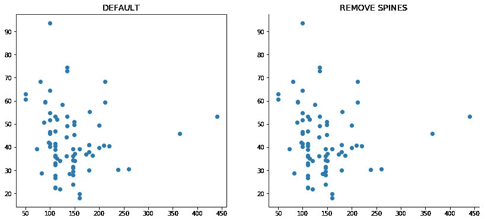
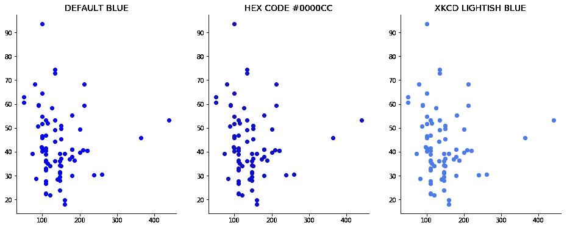
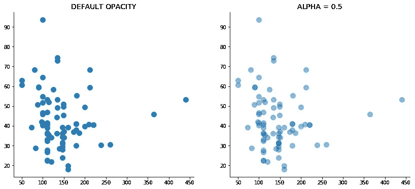
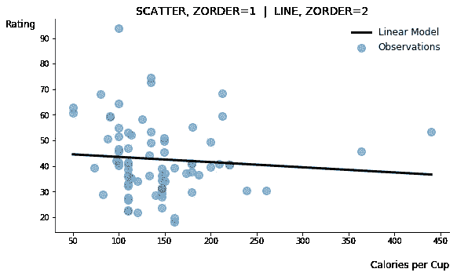
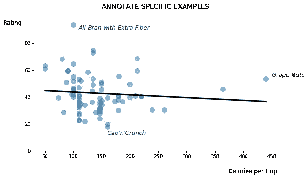
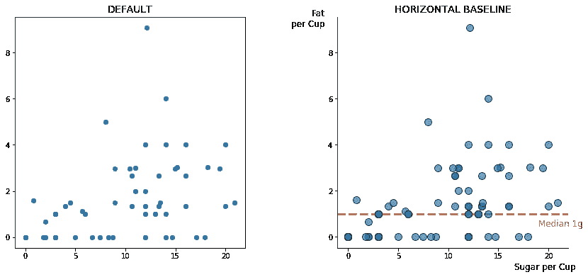
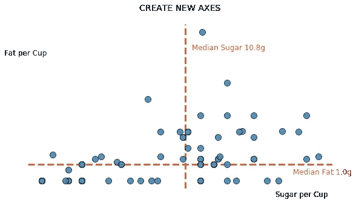
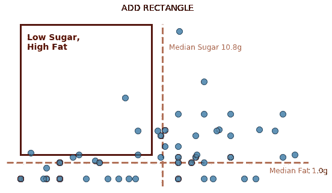
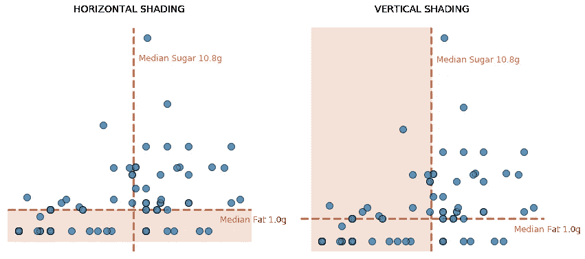
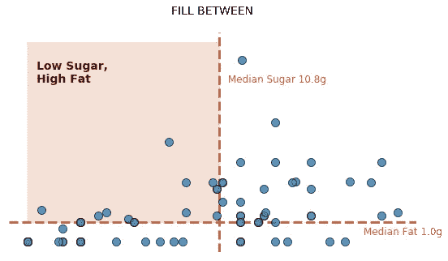

# 改进 Matplotlib 的简单方法

> 原文：<https://towardsdatascience.com/simple-ways-to-improve-your-matplotlib-b64eebccfd5?source=collection_archive---------4----------------------->

## Matplotlib 的默认属性经常产生不吸引人的图。这里有几个简单的方法来美化你的形象。


[Photo by Alice Bartlett.](http://bit.ly/31rt1Zq) Cropped and resized by author.

[Matplotlib](https://matplotlib.org/) 通常是 Python 程序员学习的第一个数据可视化包。虽然它的用户可以用几行代码创建基本的图形，但这些默认的图形在设计美学和交流能力方面往往是不够的。然而，简单的调整可以带来巨大的改进，在这篇文章中，我将分享一些关于如何升级 Matplotlib 图形的技巧。

在接下来的例子中，我将使用在[这个关于谷物](https://www.kaggle.com/crawford/80-cereals)的 Kaggle 数据集中找到的信息。我通过食用量标准化了三个特征(卡路里、脂肪和糖),以便更好地比较谷物营养和评级。关于这些数据转换的细节和用于生成每个示例图的代码可以在我的 [GitHub](https://github.com/kimfetti/Blog/blob/master/matplotlib_improvements.ipynb) 上找到。

# 移除脊椎

默认要更新的第一个 Matplotlib 是每个图周围的黑框，由四个所谓的“脊骨”组成为了调整它们，我们首先[通过 pyplot 获得我们的图形的轴](https://matplotlib.org/3.1.1/api/_as_gen/matplotlib.pyplot.gca.html)，然后根据需要改变每个单独脊椎的可见性。

比方说，我们想要删除顶部和右侧的脊椎。如果我们导入了 Matplotlib 的 pyplot 子模块:

```
from matplotlib import pyplot as plt
```

我们只需要在代码中添加以下内容:

```
plt**.**gca()**.**spines['top']**.**set_visible(False)
plt**.**gca()**.**spines['right']**.**set_visible(False)
```

顶部和右侧的脊柱将不再出现。移除这些分散注意力的线条可以将更多的注意力放在你的数据上。



Removing distracting spines can help people focus on your data.

# 探索颜色选项

Matplotlib 的[默认颜色刚刚得到升级](https://matplotlib.org/3.1.1/users/dflt_style_changes.html#colors-color-cycles-and-color-maps)，但是你仍然可以很容易地改变它们，使你的图更有吸引力，甚至反映你公司的品牌颜色。

## 十六进制代码

我最喜欢的更新 Matplotlib 颜色的方法之一是直接将十六进制代码[传递给颜色参数，因为它允许我非常具体地选择颜色。](https://htmlcolorcodes.com/)

```
plt**.**scatter(**...**, color**=**'#0000CC')
```

[这个方便的工具](https://www.w3schools.com/colors/colors_picker.asp)可以帮助你选择一个合适的十六进制颜色，通过测试它与白色和黑色文本，以及比较几个较亮和较暗的阴影。或者，在选择调色板时，你可以采取更科学的方法，看看布朗可视化研究实验室的康纳·格拉马齐奥的[色彩学](http://vrl.cs.brown.edu/color)。Colorgorical 工具允许您通过平衡各种偏好(如人类感知差异和审美愉悦)来构建调色板。

## xkcd 颜色

xkcd 颜色库提供了另一种更新 Matplotlib 默认颜色的好方法。这 954 种颜色是由 xkcd 颜色名称调查[的几十万参与者特别策划和命名的。您可以在 Matplotlib 中使用它们，方法是在它们的名称前加上“xkcd:”前缀。](https://blog.xkcd.com/2010/05/03/color-survey-results/)

```
plt**.**scatter(**...**, color**=**'xkcd:lightish blue')
```



*Matplotlib’s default colors can easily be updated by passing hex codes or referencing the xkcd library.*

# 图层图形对象

Matplotlib 允许用户将多个图形层层叠加，这在比较结果或设置基线时非常方便。在分层的时候应该利用两个有用的属性:1) `alpha`用于控制每个组件的不透明度，2) `zorder`用于将对象移动到前景或背景。

## 不透明

Matplotlib 中的 alpha 属性调整对象的不透明度。该值的范围从 0 到 1，其中 0 表示完全透明(不可见👀)和一个完全不透明的。减少 alpha 将使您的绘图对象透明，允许同时看到多个层，并允许区分重叠点，比如在散点图中。

```
plt**.**scatter(**...**, alpha**=**0.5)
```



*Decreasing alpha reduces opacity and can help you visualize overlapping points.*

## 命令

Matplotlib 的 zorder 属性决定了对象与前景的距离。具有较小 zorder 值的对象看起来更靠近背景，而具有较大 z order 值的对象更靠近前面。例如，如果我正在制作一个散点图和一个伴随的线图，我可以通过增加它的 zorder 来使线前移。

```
plt**.**scatter(**...**, zorder**=**1)  *#background*
plt**.**plot(**...**, zorder**=**2)     *#foreground*
```



*Plot objects can be brought to the foreground or pushed to the background by adjusting zorder.*

For more tips just like these, check out my full ***Matplotlib Tips*** playlist on YouTube.

# 注释要点或例子

许多视觉效果可以从主要观点的注释或具体的、说明性的例子中受益，因为这些直接传达了想法并提高了结果的有效性。要向 Matplotlib 图形添加文本，只需包含指定所需文本及其位置的注释代码。

```
plt**.**annotate(TEXT, (X_POSITION, Y_POSITION), **...**)
```

用来制作这个博客视觉效果的谷物数据集包含了几种品牌谷物的营养信息，以及一个标记为“评级”的特征人们可能首先认为“评级”是一个表明消费者偏好的谷物的分数。然而，在上面的 zorder 图中，我建立了一个快速线性回归模型，表明每杯卡路里和评级之间的相关性实际上不存在。卡路里似乎不可能不成为消费者偏好的因素，所以我们可能已经对我们最初关于“评级”的假设产生了怀疑。

当检查极端情况时，这种误解变得更加明显:Cap'n Crunch 是评级最低的谷物，而全麸额外纤维评级最高。用这些有代表性的例子来注释这个图，立刻消除了关于“评级”的错误假设这种评级信息更有可能表明谷物的营养价值。(我也标注过每杯热量最多的麦片；葡萄坚果不太可能被大量食用！😆)



*Annotating your visuals with a few examples can improve communication and add legitimacy.*

# 基线和突出显示

给你的视觉效果添加基线有助于设定期望值。一条简单的水平线或垂直线为其他人提供了适当的背景，通常会加速他们对你的结果的理解。同时，突出感兴趣的特定区域可以进一步强调你的结论，也有助于与你的听众交流。Matplotlib 为基线和突出显示提供了几个选项，包括水平线和垂直线、矩形等形状、水平和垂直跨度阴影以及两条线之间的填充。

## 水平线和垂直线

现在让我们考虑一下谷物数据集中脂肪和糖之间的相互作用。起初，这种关系的基本散点图似乎并不有趣，但在进一步探索后，我们发现每杯谷物的脂肪中位数仅为 1 克，因为许多谷物根本不含脂肪。添加这条基线有助于人们更快地得出这一发现。



*A horizontal or vertical baseline can help set the stage for your data.*

在其他情况下，您可能希望完全删除 Matplotlib 提供的默认 x 轴和 y 轴，并基于一些数据集合创建自己的轴。这个过程需要三个关键步骤:1)删除所有默认的脊线，2)删除刻度线，3)添加新的轴作为水平线和垂直线。

```
*#1\. Remove spines*
for spine in plt.gca().spines.values():
    spine.set_visible(False)*#2\. Remove ticks*
plt.xticks([])
plt.yticks([])*#3\. Add horizontal and vertical lines*
plt.axhline(Y_POSITION, ...)  *#horizontal line*
plt.axvline(X_POSITION, ...)  *#vertical line*
```



*You can also create new axes for your data by removing spines and ticks and adding custom lines.*

## 矩形

既然我们已经把谷物的脂肪和糖含量标绘在新的坐标轴上，看来很少有谷物是低糖高脂肪的。也就是说，左上象限几乎是空的。这似乎是合理的，因为谷物通常不好吃。为了使这一点非常清楚，我们可以通过在它周围画一个矩形并加以注释，将注意力引向这个低糖、高脂肪的区域。Matplotlib 通过其[补丁模块](https://matplotlib.org/3.1.1/api/patches_api.html#module-matplotlib.patches)提供了对几种形状的访问，包括一个矩形甚至一个[海豚](https://matplotlib.org/3.1.1/gallery/shapes_and_collections/dolphin.html#sphx-glr-gallery-shapes-and-collections-dolphin-py)。首先导入矩形的代码:

```
from matplotlib.patches import Rectangle
```

然后，要在图形上创建一个矩形，请抓取当前轴，并添加一个矩形补片及其位置、宽度和高度:

```
plt**.**gca()**.**add_patch(Rectangle((X_POSITION, Y_POSITION), 
                              WIDTH, HEIGHT, **...**)
```

这里，x 和 y 位置指的是矩形左下角的位置。



*To direct people toward a particular part of your visual, consider adding a rectangle.*

## 明暗法

阴影提供了另一种选择，用于将注意力吸引到图形的特定区域，有几种方法可以使用 Matplotlib 添加阴影。

如果您打算突出显示整个水平或垂直区域，只需在视觉效果中添加一个跨度:

```
plt**.**axhspan(Y_START, Y_END, **...**)  *#horizontal shading*
plt**.**axvspan(X_START, X_END, **...**)  *#vertical shading*
```

之前讨论过的属性像`alpha`和`zorder`在这里很关键，因为你可能想要让你的阴影透明和/或把它移到背景。



*Shading also provides an effective way to highlight a particular region of your plot.*

但是，如果您想要着色的区域遵循更复杂的逻辑，您可以在两条用户定义的线之间使用[着色。这种方法需要一组 x 值，第一行和第二行的两组 y 值，以及一个可选的`where`参数，该参数允许您使用逻辑过滤到您感兴趣的区域。](https://matplotlib.org/api/_as_gen/matplotlib.pyplot.fill_between.html)

```
plt**.**gca()**.**fill_between(X_VALUES, Y_LINE1, Y_LINE2, 
                       WHERE**=**FILTER LOGIC, **...**)
```

要使之前用矩形突出显示的相同区域变暗，只需为 x 轴定义一个等距糖值数组，在 y 轴上填充中间值和最大脂肪值(高脂肪)，并向下过滤小于中间值的糖值(低糖)。

```
sugars **=** np**.**linspace(df**.**sugars_per_cup**.**min(),       
                     df**.**sugars_per_cup**.**max(), 
                     1000)plt**.**gca()**.**fill_between(sugars, 
                       df**.**fat_per_cup**.**median(), 
                       df**.**fat_per_cup**.**max(), 
                       WHERE**=**sugars **<** df**.**sugars_per_cup**.**median(), 
                       **...**)
```



*More complex shading logic is accomplished by filling between two lines and applying a filter.*

# 结论

Matplotlib 的名声很差，因为它的缺省值很差，而且需要大量代码来产生看起来不错的视觉效果。希望这篇博客中提供的技巧能帮助你解决第一个问题，尽管我承认最后几个示例图需要很多更新和大量代码。如果所需的大量代码困扰着你，那么 [Seaborn](https://seaborn.pydata.org/) 可视化库是 Matplotlib 的一个很好的替代品。它提供了更好的默认设置，需要更少的代码行，并且如果需要的话，支持通过传统的 Matplotlib 语法进行定制。

当您可视化数据时，无论您选择哪个包，都要记住的主要事情是您的受众。我在这里提供的建议旨在通过以下方式平滑数据交流过程:1)删除多余的部分，如不必要的线条或刻度线；2)通过设置分层和基线来更快地讲述数据故事；3)通过阴影和注释突出主要结论。由此带来的美感也有所改善，但主要目标是更强大、更无缝的数据通信。

*我最近在* [*ODSC 纽约*](https://odsc.com/training/portfolio/custom-data-visualizations-with-python/) *的一次数据可视化演讲中分享了类似的内容。你可以在这里访问我的会议资料*[](http://bit.ly/odscNyc19_dataviz)***以及我的 GitHub**[](https://github.com/kimfetti/Blog/blob/master/matplotlib_improvements.ipynb)**上的各个幂例图。*****

**[1] J.D. Hunter，[Matplotlib:2D 图形环境](https://matplotlib.org/) (2007)，科学计算&工程。**

**[2] C .克劳福德， [80 谷物](https://www.kaggle.com/crawford/80-cereals) (2017)，卡格尔。**

**[3] C.C. Gramazio，D.H .莱德劳和 K.B. Schloss， [Colorgorical:为信息可视化创建可区分和优选的调色板](http://vrl.cs.brown.edu/color) (2017)，IEEE 可视化和计算机图形学汇刊。**