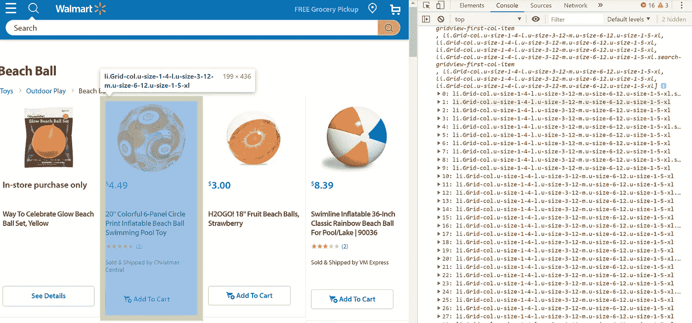
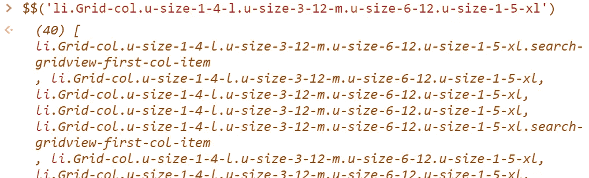
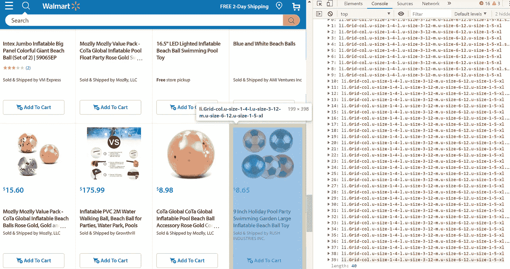
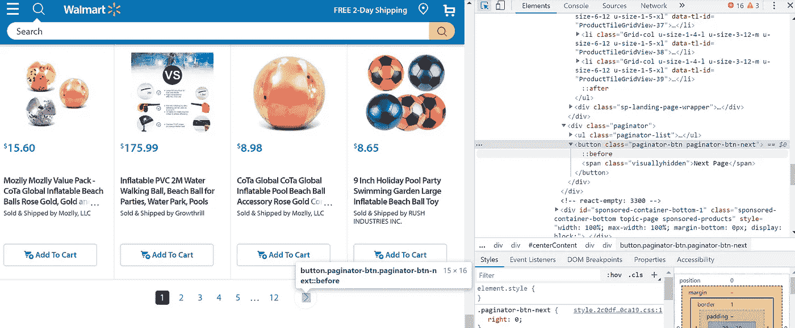
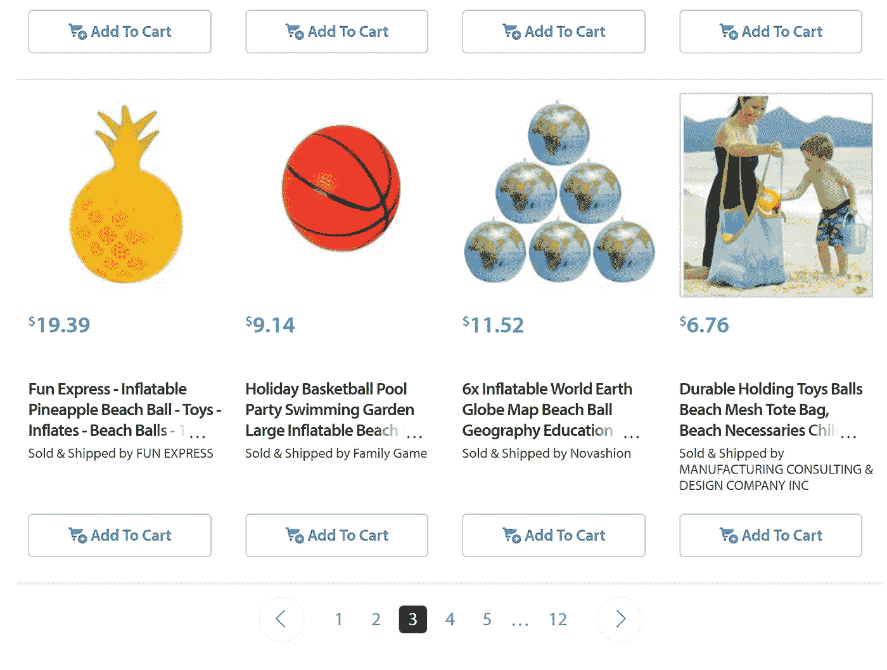
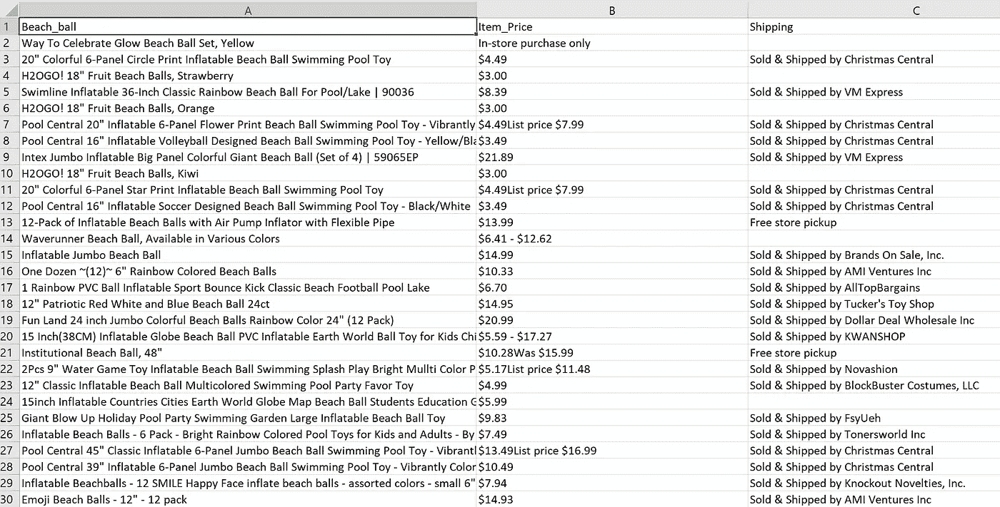

# 使用 Python 的 Selenium 进行简单的 Web 抓取

> 原文：<https://towardsdatascience.com/simple-web-scraping-with-pythons-selenium-4cedc52798cd?source=collection_archive---------2----------------------->

## 沙滩球搜索，从网页到 CSV！


Image Courtesy of [Shahadat Rahman](https://unsplash.com/@hishahadat) via Unsplash

# 使用 Selenium 模块

夏天对我来说意味着两件事，在沙滩上消磨时间和踢足球。随着天气的好转和 2019 年 FIFA 女足世界杯的进行，我现在需要买一个沙滩足球。这似乎是一个很好的机会来展示我们的网络抓取能力，并编写一个简单的网络抓取器来收集来自沃尔玛的沙滩球数据。

这篇文章旨在介绍如何使用 Selenium 模块进行网页抓取。此外，增加一个额外的挑战，让我们收集数据，不只是从一个网页，而是许多！为了便于数据解释，我将把输出写到一个 CSV 文件中。

# 我们开始吧！

首先，我们需要安装一个 Webdriver，我们将使用 Selenium 模块通过 Python 来控制它。我们将在本教程中使用的 web 驱动程序是 Chromedriver，可以通过导航到此[链接](http://chromedriver.chromium.org/getting-started)下载。

接下来，我们需要安装 Selenium。在我的 Windows 命令提示符下，我写 pip install selenium。当 Chrome webdriver 和 selenium 模块都安装好后，我就可以导入 webdriver 了。

现在我们可以让 Python 代码使用 Chrome webdriver 来控制浏览器。在 webdriver.chrome()中，需要传递 chromedriver 可执行文件的路径。在这里，chromedriver.exe 在我的本地工作目录中。我把它赋给变量 browser。我们现在可以通过 Python 代码来控制浏览器。

我们可以使用 browser.get()导航到一个网站，方法是将该网站的路径用引号括起来。在这里，我想导航到沃尔玛的网页，其中包括所有关于沙滩球的信息。

我们可以在浏览器上使用许多不同的方法。我们可以使用 CSS select 查询来查找感兴趣的特定元素。CSS 选择器对于网页抓取非常有用。例如，CSS 类定义了*多个*标签的样式，这是一个可以在网页抓取过程中有效利用的特性！由于我们搜索的元素可能有一个规则的样式，它们很可能有相同的 CSS 类。

在第一个 web 页面上，我希望找到一个包含某个商品所有相关信息的包装器。当我导航到该网页时，右键单击并选择 inspect，我可以看到我感兴趣的包装器有一个 **li** 标签和一系列类，如下所示:

**<李 class = " Grid-col u-size-1–4-l u-size-3–12 米 u-size-6–12 u-size-1–5-XL "**



当我在浏览器中时，为了帮助找到所有这些列表项，我可以切换到 Chrome 的开发者工具中的控制台标签。当我在这里时，我可以编写一个测试查询。为此，我写了两个美元符号$$并在括号内输入我的查询，如下所示:

**$ $(‘李。grid-col . u-size-1–4-l . u-size-3–12-m . u-size-6–12 . u-size-1–5-XL ')**



这将显示一个长度为 40 的列表，如上面的括号所示。我通过滚动列表项并查看浏览器中相应的突出显示，快速验证了每个列表项都对应于 web 页面上相应的沙滩球。我鼓励的一个工作实践是检查列表中的最后一项，并检查它是否是页面上您感兴趣的最后一项。

对我们来说是这样的！

如果不是这样，您可以在控制台开发工具中再次尝试不同的 CSS 查询。这是一个很好的实践，因为我们可以在浏览器中执行初始验证，而不是在 Python 脚本中。它也非常容易看到，因为我们可以同时查看 CSS 查询和浏览器页面！



我们现在可以将这个查询直接传递给**。find _ elements _ by _ CSS _ selector**方法。我创建了一个名为 beach_balls 的变量，它指向找到的所有沙滩球的列表。我们现在可以迭代这个 beach_balls 列表。

```
print(type(beach_balls))
<class 'list'>
```

使用同样的方法，我可以编写一个简单的 for 循环来提取我感兴趣的信息。

这里，我使用**find _ element _ by _ CSS _ selector**(*我使用了 element，而不是 elements* )来查找与原始包装器中包含的其他信息相关的标签和类。当我为 desc ect 找到合适的元素时，我使用。text 方法提取文本，lstrip 方法对字符串进行简单清理。

这段代码运行良好，但是 web 抓取真正有用的方面是它提供的自动化。为了演示，我将用沃尔玛的沙滩球抓取 2 页(尽管我们可以很容易地抓取更多页面的数据)。我写了一个 while 循环，它将根据提供的条件迭代两次。

*需要注意的是*并非每个项目都有所有信息。例如，在一些情况下，运输信息丢失。通常，当您在编写 scraper 时遇到这种情况时，您应该在 for 循环中编写一个条件，这样所有信息都会匹配。然而，沃尔玛的这个页面是这样组织的，当信息丢失时，空白填充空间。这意味着在这种情况下，在 for 循环中不需要条件检查，但是要小心，情况并不总是这样！

# 多页刮擦

在每次迭代中，我将相关的项目添加到适当的列表中。在 for 循环的第一次迭代结束时，我点击进入下一页。我找到对应于下一页的标签和类，并使用**。单击()**方法导航到它上面。



如果一切正常，脚本应该在第三页结束。根据我的 while 条件，应该有两次迭代。

该脚本已按预期工作。下面，第三个页面已经加载，如网页底部的绿色图标所示。



最后，我将把输出写到一个 CSV 文件中，通过使用 pandas Dataframe 方法把我的列表压缩在一起并给它们起一个合理的名字。



本教程重点介绍了如何使用 selenium 从一个网站抓取多个页面。如果我们想要，我们可以从不同的网站搜集信息，并开始为我们的沙滩球或任何其他我们可能感兴趣的物品构建一个价格比较模型。

*但作为总结*，去给自己买个沙滩球，去海滩吧！