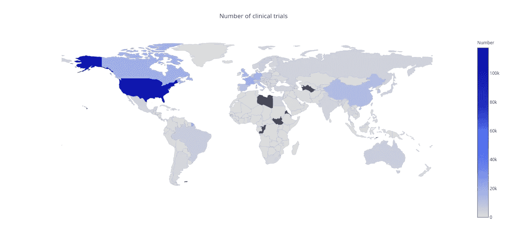
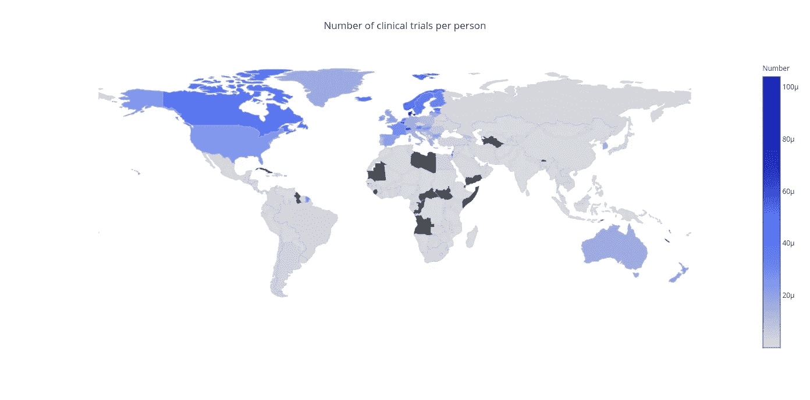
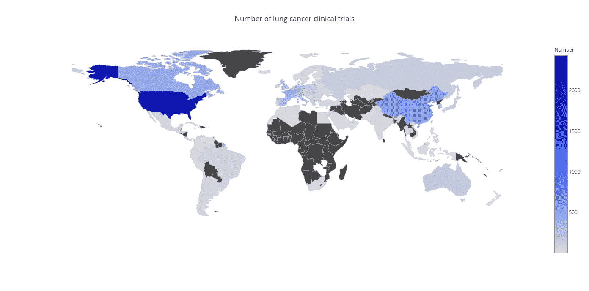
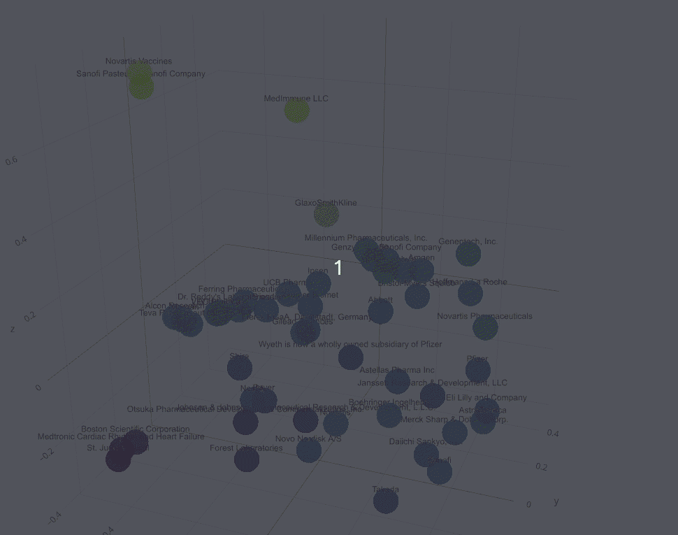

# 对 ClinicalTrials.gov 简单而实用的分析

> 原文：<https://towardsdatascience.com/simple-yet-practical-analysis-of-clinicaltrials-gov-f84b367e1e68?source=collection_archive---------16----------------------->

## 通过少量的机器学习

临床研究工作教会了我一些重要的事情，所有这些都可以用一句话来表达:

> "用心做好事情，让自己免于恐惧."

对于临床试验来说尤其如此，在临床试验中，研究人员要对患者的健康和幸福负责。

开发一种药物的整个过程极其复杂，可能需要几十年时间。一种新药首先在实验室里进行研究，如果这种药看起来有希望，在临床试验过程中就会对其进行仔细的人体研究。

进行临床试验是为了找到预防、诊断和治疗疾病的更好方法。所以从本质上来说，临床试验的目标是确定一种药物是否既安全又有效。

今天，大多数临床试验都要经过彻底的注册程序。FDA ( *美国食品药品监督管理局)*要求所有正在进行人体临床试验的药物和设备必须在[ClinicalTrials.gov](https://clinicaltrials.gov/)上注册，这是一个基于网络的资源，为公众提供了一个方便获取公共和私人支持的临床研究信息的途径。虽然它无疑是帮助患者找到他们可能参与的研究的一个很好的工具，但它也为研究人员和卫生保健专业人员提供了关于新药开发的最新信息。

这就是我在数据科学之旅中学到的另一件事:**没有什么比处理易于访问和结构化的数据更令人满意的了。**

一个包含所有 XML 格式研究记录的 zip 文件可供下载。让我们看看我们能从这些数据中获得什么样的见解。

首先，最好能显示这些年来在世界各地进行的临床研究的数量。[点击此处查看用 plotly 创建的交互式地图。](https://plot.ly/~glib_radchenko/18/clinical-trials-worldwide/)

由于 ClinicalTrials.gov 提供有关美国临床试验的信息，难怪大多数研究来自美国。除此之外，美国医药市场是世界上最大的国家市场。

现在让我们看看哪个国家倾向于更积极地参与临床试验。为了弄清楚这一点，我将每个国家 2016 年开始的研究数量除以该国人口。你可以在这里查看地图。

出乎意料的是，美国在这里失去了领导地位。丹麦的人均审判次数似乎比其他任何国家都多。很可能，如此大量的研究是丹麦政府将该国确立为临床试验首选国家的多项举措的结果。

[另一个例子是许多肺癌试验的地图。](https://plot.ly/~glib_radchenko/24/clinical-trials-worldwide/)

尽管美国是领导者，我们可以看到中国是癌症研究的主要地区之一。主要原因可能是中国是世界上最大的烟草消费国和生产国。

# **T3 机器学习来了**

在从事临床研究时，我对制药公司如何决定研究方向特别感兴趣。大多数公司试图专注于特定的利基市场，开发针对特定疾病群体的产品。使用主成分分析(PCA)有可能将排名前 50 位的公司的研究成果可视化。

每个公司由一个向量表示，其中每个值是该公司对特定疾病进行研究的次数。我还将这些值标准化，并使用主成分分析来可视化数据。我鼓励你点击[这个链接](https://plot.ly/~glib_radchenko/32/)来查看可视化效果(警告:可能需要一些时间才能打开)。

This way we can see which companies share the same interests in clinical research

这里你可以看到一些公司形成了独立的集群。例如，黄点(赛诺菲巴斯德、MedImmune LLC 和诺华疫苗)是主要从事疫苗研究的公司。底部的紫色公司(波士顿科学公司、圣犹达医疗公司和美敦力心律和心力衰竭公司)因开发心脏病学产品而闻名。不出所料，基因泰克和霍夫曼-罗氏公司也走得很近。

我相信这种分析是一种很好的方式，可以让你对临床试验有一个更全面的了解。毫无疑问，机器学习在临床研究中的潜力很难被高估。

请在下面的评论中分享你对机器学习如何应用于临床研究的想法。