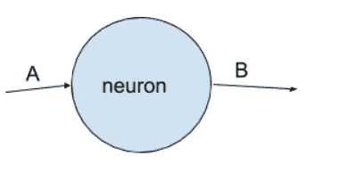
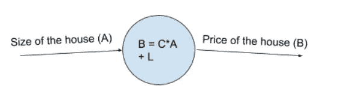
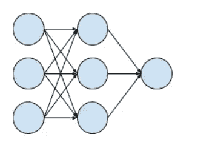

# 复杂中的简单

> 原文：<https://towardsdatascience.com/simplicity-in-the-complexity-2e0e0adaad4f?source=collection_archive---------27----------------------->

## 向非技术人员解释神经网络

作为一名数据科学家，我听说过对人工智能的两种极端解释。一方面，人工智能就是使用命令。适合“plus”。用提供的工具“预测”,因此我们可以通过简单地导入库来实现人工智能。另一方面，人工智能是一项神奇的任务，其他领域的人很难理解。

虽然对于数据科学家来说，戴上一个看似花哨的头衔，暗示着神奇的工作，这可能很方便，但事实上，这并没有那么花哨。

如果我们能够解释人工智能背后的基本思想，以一种任何人都可以直观理解的方式去神秘化它，那么我们就可以帮助提高组织采用人工智能的速度，就像采用上个世纪改变了我们商业运作方式的任何其他技术一样。

这让我思考，我该如何向非技术观众解释人工智能？经常被问到的一个问题是最热门的算法之一——**神经网络**，这是一种近年来重新流行的方法，并形成了深度学习的基础。

那么简单来说什么是神经网络呢？让我们把这个术语分解成“**神经元**和“**网络**”。

要解读“神经元”，我们可以把它想象成一个把 A 映射到 b 的黑盒，或者更具体地说，它是一个数学函数，取输入 A，给出输出 b。

比方说，我们想预测房价 b。在最简单的情况下，我们假设房价线性依赖于房子的大小 A 乘以常数 C，加上购买该房子所涉及的一些固定法律费用 L。把它放入公式中，我们有一个假设 B = C * A + L，它代表了房价“成分”的基本事实。

这里最本质的任务是确定常数 C 和常数 l，一旦我们在黑盒里有了这样一个公式，给定任何房子的大小，我们就可以预测它的价格。

几乎在所有情况下，我们没有足够的知识来揭示投入和产出之间的真实关系，在这种情况下，房子的大小和房价。那我们怎么去找 C 和 L 呢？

然而，我们确实有一堆数据，每个数据点代表一个特定的房子大小和各自的价格。正是通过这些数据，我们希望了解一个模型，它足够代表我们假设的现实。

换句话说，对于每个问题，都有一个“正确的神经元”可以解决问题。

这是一个最简单的“神经元”的例子，其中输入和输出之间的关系是线性的。事实上，在大多数实践中，这种神经元还包括一个额外的非线性转换，有助于捕捉更复杂的关系。

> 在许多科学领域，寻找“正确的神经元”的想法确实是解决问题的长期方法。

给定一个问题，我们想要对输入和输出之间的关系进行建模，以试图完全描述一个系统的特征。我们写下一些公式，把这个问题抽象成可解的形式。

许多实际问题往往太复杂，无法用这种方式解决。以房价为例。事实上，价格不仅取决于房子的大小，还取决于许多其他因素，如位置、设施和经济状况。因此，即使是知识最渊博的专家也不可能提供一个公平的公式来考虑所有相关因素，并根据这些因素计算相应的房价。

> 如果单个神经元不能处理这种复杂性，那么多个神经元能完成这项工作吗？

这就是“网络”概念的由来。

神经网络由多个神经元组成，每个神经元接受一些输入并给出一些输出。一个神经元的输出可以成为其他一些神经元的输入。通过多个神经元，神经元网络可以执行更复杂的计算，同时保持每个神经元相对“简单”。

现在，复杂性正在部分地从神经元内部结构转移到网络结构。有了这样的网络，模型就能够表现更复杂的现象。

本质上，神经网络在复杂中描绘了一幅简单的美丽画面——嵌入在复杂网络中的“简单”神经元。