# 理解辍学背后的简化数学

> 原文：<https://towardsdatascience.com/simplified-math-behind-dropout-in-deep-learning-6d50f3f47275?source=collection_archive---------2----------------------->

## 在这里，我们将理解驱动辍学的数学。如何导致**正规化**？为什么**0.5**的辍学率导致最正规化？什么是**高斯辍学**？

<<download the="" free="" book="" class="ae lb" href="https://www.understandingdeeplearning.com/" rel="noopener ugc nofollow" target="_blank">了解深度学习，了解更多> ></download>

尽管报告了突破性的结果，但从理论的角度来看，人们对辍学知之甚少。同样，辍学率为 0.5 的重要性以及它应该如何随着层的变化而变化并不明显。此外，我们能把辍学推广到其他方法吗？下面将提供一些解释。

深度学习架构现在变得越来越深入和广泛。有了这些更大的网络，我们能够实现良好的精确度。然而，大约十年前并非如此。事实上，深度学习因过度适应问题而声名狼藉。

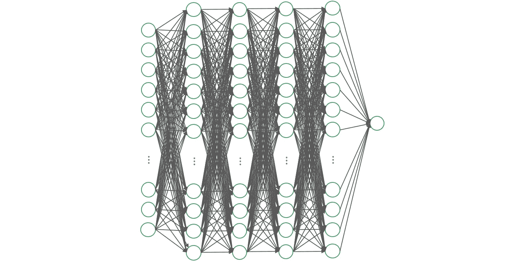

Figure 1\. A dense neural network.

然后在 2012 年左右，萌生了退学的想法。这个概念彻底改变了深度学习。我们在深度学习方面的成功很大程度上归功于辍学。

## 快速回顾:什么是辍学？

*   Dropout 将学习所有权重的概念改变为在每次训练迭代中学习网络中的一小部分权重。

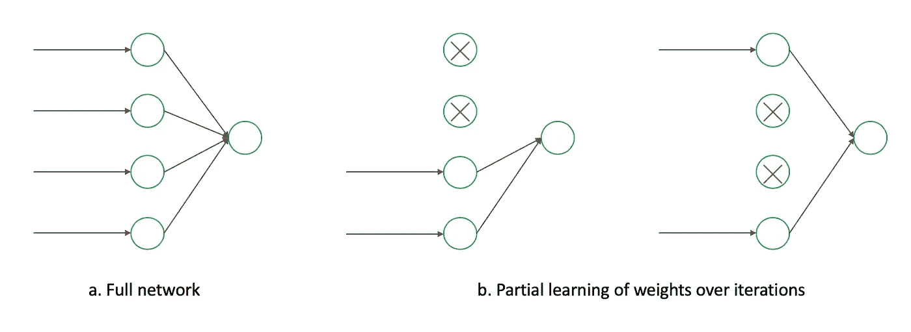

Figure 2\. Illustration of learning a part of the network in each iteration.

*   这个问题解决了大型网络中的过拟合问题。突然之间，更大、更精确的深度学习架构成为可能。

在这篇文章中，我们的目标是理解辍学背后的数学原理。然而，在我们进入数学之前，让我们后退一步，了解辍学改变了什么。这将是接触数学的动力。

退学前一个主要的研究领域是**正规化**。在神经网络中引入正则化方法，如 L1 和 L2 权重罚值，始于 21 世纪初[1]。然而，这些调整并没有完全解决过拟合问题。

原因是共同适应。

## 神经网络中的协同适应

Figure 3\. Co-adaption of node connections in a Neural Network.

学习大型网络的一个主要问题是共同适应。在这样的网络中，如果所有的权重一起学习，通常一些连接将比其他连接具有更强的预测能力。

在这种情况下，随着网络被反复训练，这些强大的连接被学习得更多，而较弱的连接被忽略。经过多次迭代，只有一小部分节点连接被训练。其余的停止参与。

这种现象被称为共适应。像 L1 和 L2 那样的传统正规化无法避免这一点。原因是它们也基于连接的预测能力进行调整。因此，它们在选择和拒绝权重时变得接近确定性。因此，强者愈强，弱者愈弱。

这样做的一个主要后果是:**扩大神经网络的规模无助于**。因此，神经网络的规模和准确性变得有限。

然后就辍学了。一种新的正则化方法。它解决了共同适应。现在，我们可以建立更深更广的网络。并利用它的预测能力。

在这样的背景下，让我们深入研究辍学的数学。你可以直接跳到*辍学相当于正规化网络*部分的推论*。*

# 辍学背后的数学

考虑网络中的单层线性单元，如下图 4 所示。详情请参考[ [2](https://papers.nips.cc/paper/4878-understanding-dropout.pdf) 。

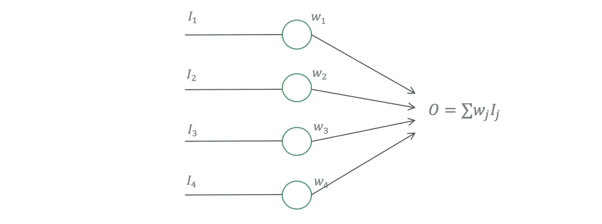

Figure 4\. A single layer linear unit out of network.

这称为线性激活，因为 f(x) = x 是线性的，如图 4 所示，该层的输出是输入的线性加权和。我们正在考虑这种简化的情况，以获得数学上的解释。这些结果(根据经验)适用于通常的非线性网络。

对于模型估计，我们最小化损失函数。对于这个线性层，我们将考虑普通的最小二乘损耗，

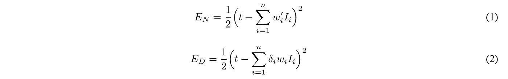

情商。1 显示常规网络和 Eq 的损耗。2 用于辍学网络。在 Eq 中。2、辍学率是𝛿，其中𝛿 ~伯努利( *p* )。这意味着𝛿等于 1，概率为 p，否则为 0。

网络训练的反向传播使用梯度下降法。因此，我们首先来看看等式(1)中压差网络的梯度。2，然后再来情商里的正规网络。1.

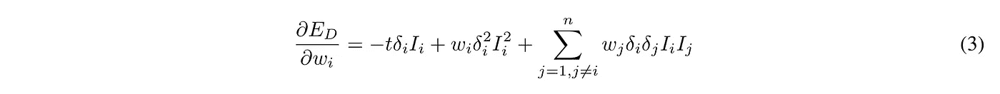

现在，我们将试图找到这个梯度和规则网络的梯度之间的关系。为此，假设我们使等式中的*w*' =*p***w*。1.因此，

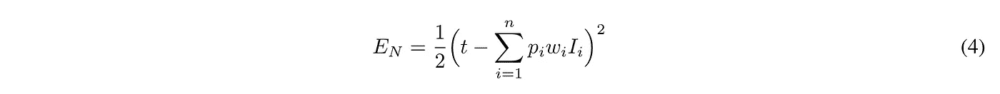

对等式求导。4、我们发现，

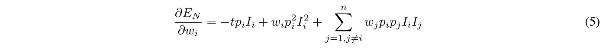

现在，我们有了有趣的部分。如果我们找到压差网络梯度的期望值，我们得到，

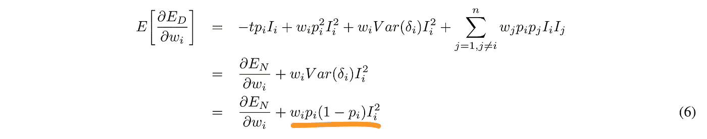

如果我们看情商。6、有漏失的梯度的期望，等于正则化正则网络 Eɴ的梯度如果*w*' =*p***w .*

# 等效于正则化网络的丢失

这意味着**最小化压差损失(在等式中)。2)等效于最小化正则化网络**，如等式所示。7 以下。

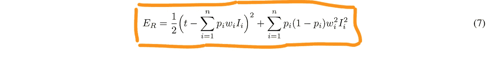

也就是说，如果你在方程中对正则化网络进行微分。7，你将得到一个压差网络的(预期)梯度，如等式。6.

这是一种深刻的关系。从这里，我们可以回答:

## **为什么辍学率， *p* = 0.5，产生最大正则化？**

这是因为等式中的正则化参数 *p* (1- *p* )。7，在 *p* = 0.5 时最大。

## **不同的层应该选择什么样的 *p* 值？**

在 Keras 中，辍学率参数为(1- *p* )。对于中间层，对于大型网络，选择(1- *p* ) = 0.5 是理想的。对于输入层，(1- *p* )应该保持在大约 0.2 或更低。这是因为丢弃输入数据会对训练产生不利影响。不建议使用 A (1- *p* ) > 0.5，因为它会剔除更多的连接，而不会促进正则化。

## **为什么我们在测试或推理过程中用 *p* 来衡量权重 w？**

因为一个失落网络的期望值相当于一个常规网络，其权重与失落率 *p* 成比例。这种缩放使得从一个断开的网络中得到的推论可以与完整的网络相比较。还有计算上的好处，这在[ [1](http://www.jmlr.org/papers/volume15/srivastava14a/srivastava14a.pdf?utm_content=buffer79b43&utm_medium=social&utm_source=twitter.com&utm_campaign=buffer) ]中用集合建模的观点进行了解释。

在我们走之前，我想谈谈高斯辍学。

# 什么是高斯辍学？

正如我们之前看到的，在 Dropout 中，我们放弃了与概率(1- *p* )的联系。用数学方法，用等式。2 我们将连接权重乘以随机变量𝛿，其中𝛿 ~伯努利( *p* )。

这个退出过程可以看作是在每个连接上放置一个伯努利门。

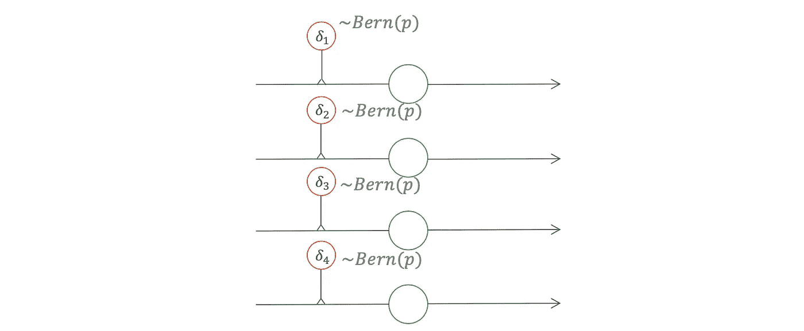

Figure 5\. Dropout seen as a Bernoulli gate on connections.

我们可以用另一个门代替伯努利门。例如高斯门。这给了我们一个高斯漏失。

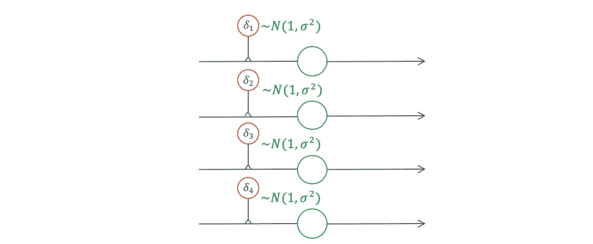

Figure 6\. Dropout generalized to a Gaussian gate (instead of Bernoulli).

高斯辍学生被发现和普通辍学生一样好，有时甚至更好。

在高斯下降的情况下，激活的期望值保持不变(见等式。8).因此，与常规放弃不同，推理过程中不需要权重缩放。

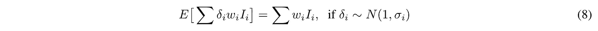

这一特性也为高斯压降提供了计算优势。我们将在接下来的帖子中探讨高斯辍学的表现。在那之前，我要提醒你一句。

> 虽然漏失门的概念可以推广到除伯努利分布以外的其他分布，但建议理解新的分布将如何影响激活的预期。基于此，应该对激活进行适当的缩放。

# 结论

在这篇文章中，我们讨论了辍学背后的数学原理。我们在一些简化的条件下做了这道数学题。然而，该结果扩展到深度学习中的一般情况。总之，我们知道，

*   辍学和正常化之间的关系，
*   0.5 的辍学率将导致最大的正规化，以及
*   将辍学推广到高斯-安德洛普。

# 参考

1.  [n . Srivastava，g . hint on，a . krijevsky，Sutskever，I .，& Salakhutdinov，R. (2014 年)。辍学:防止神经网络过度拟合的简单方法。*《机器学习研究杂志》*， *15* (1)，1929–1958。](http://www.jmlr.org/papers/volume15/srivastava14a/srivastava14a.pdf?utm_content=buffer79b43&utm_medium=social&utm_source=twitter.com&utm_campaign=buffer)
2.  [巴尔迪，p .，&萨多夫斯基，P. J. (2013)。理解辍学。在*神经信息处理系统的进展*(第 2814-2822 页)。](https://papers.nips.cc/paper/4878-understanding-dropout.pdf)